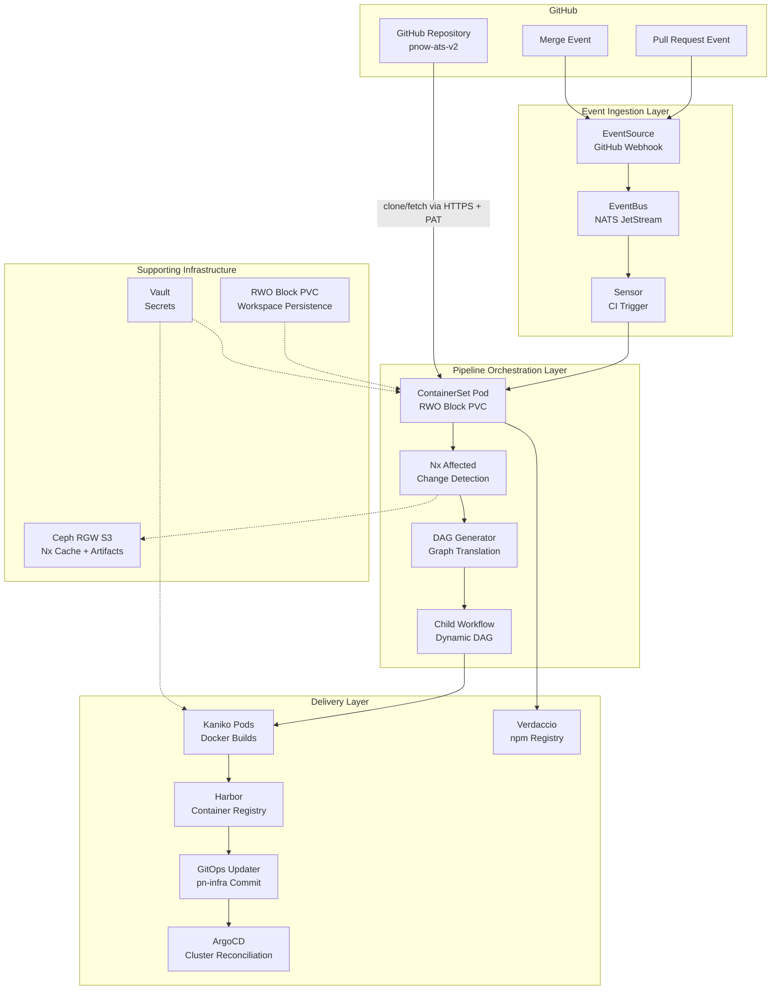
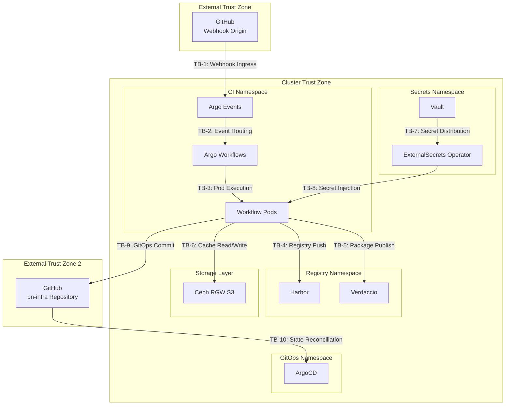
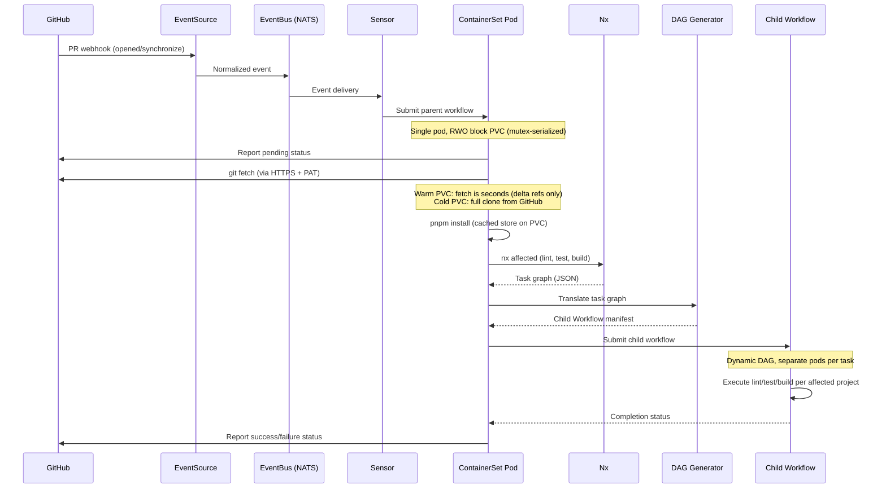
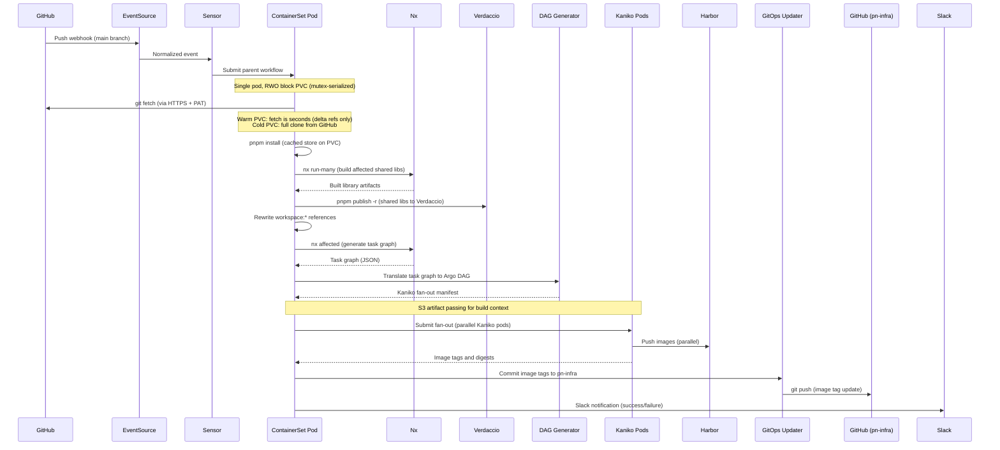

```
RFC-CICD-0001                                                   Section 3
Category: Standards Track                                   Architecture
```

# 3. Architecture

[<-- Requirements](./02-requirements.md) | [Index](./00-index.md#table-of-contents) | [Next: Components -->](./04-components.md)

---

## 3.1 System Overview

The CI/CD system comprises three layers: an event ingestion layer, a pipeline orchestration layer, and a delivery layer. GitHub webhooks enter the cluster through Argo Events, which normalizes events and triggers Argo Workflows. The workflows clone/fetch directly from GitHub (via PAT over HTTPS), delegate change detection and task ordering to Nx, translate the Nx task graph into a dynamic Argo DAG, and execute builds accordingly. The delivery layer publishes Docker images to Harbor and commits image tags to the infrastructure repository for ArgoCD reconciliation. A RWO block PVC persists the git working tree between runs, so warm-start fetches from GitHub complete in seconds (only delta refs).



---

## 3.2 Authority Domains

The architecture defines clear authority boundaries between systems. Each authority domain owns specific decisions and data.

| Authority | Owns | Does Not Own |
|-----------|------|--------------|
| Nx | Project dependency graph, affected-project detection, task ordering, cache invalidation | Workflow scheduling, container orchestration |
| Argo Workflows | Workflow execution, pod scheduling, retry policies, artifact management | Build logic, dependency analysis |
| Argo Events | Event ingestion, filtering, sensor-to-workflow triggering | Event payload validation beyond schema matching |
| Harbor | Image storage, replication, vulnerability scanning | Image building, tag policy |
| Verdaccio | npm package storage, scoped package resolution | Package building, version selection |
| Vault | Secret storage, access control, audit logging | Secret consumption patterns |
| ArgoCD | Cluster state reconciliation, rollback | Image building, CI pipeline execution |
| Git (pn-infra) | Desired deployment state, image tag history | Runtime cluster state |

---

## 3.3 Trust Boundaries

Trust boundaries exist where data crosses between authority domains or where credentials change scope.



| Boundary | From | To | Credential Type |
|----------|------|----|-----------------|
| TB-1 | GitHub | Argo Events EventSource | Webhook secret (HMAC) |
| TB-2 | Argo Events | Argo Workflows | NATS JetStream internal auth |
| TB-3 | Argo Controller | Workflow Pods | Kubernetes ServiceAccount |
| TB-4 | Workflow Pods | Harbor | Registry credentials from Vault |
| TB-5 | Workflow Pods | Verdaccio | npm auth token from Vault |
| TB-6 | Workflow Pods | Ceph RGW S3 | S3 access key from Vault |
| TB-7 | Vault | ExternalSecrets | Vault AppRole or Kubernetes auth |
| TB-8 | ExternalSecrets | Workflow Pods | Kubernetes Secret objects |
| TB-9 | Workflow Pods | GitHub (pn-infra) | SSH deploy key from Vault |
| TB-10 | GitHub (pn-infra) | ArgoCD | ArgoCD repository credentials |

All credentials at trust boundaries MUST originate from Vault (Invariant 4). No credential is embedded in workflow definitions or container images.

---

## 3.4 PR Validation Flow

When a pull request is opened or updated, the system validates affected projects without producing deployable artifacts.



The PR validation flow has these properties:

| Property | Behavior |
|----------|----------|
| Artifact production | No Docker images are built or pushed |
| Cache mode | Nx S3 cache operates in read-only mode (Invariant 1 protection) |
| Failure reporting | Individual task failures are reported; independent tasks continue (Invariant 5) |
| Status reporting | GitHub commit status is updated at start and completion |

Read-only cache mode for PR branches prevents cache poisoning. A malicious or buggy PR branch MUST NOT write cache entries that subsequent main-branch builds would consume. Only post-merge builds on the main branch write to the shared cache.

---

## 3.5 Post-Merge Build Flow

When code is merged to the main branch, the system builds, publishes, and delivers all affected artifacts.



The post-merge build flow has these properties:

| Property | Behavior |
|----------|----------|
| Library publishing | Shared libraries are built and published to Verdaccio before Docker builds |
| Reference rewriting | `workspace:*` specifiers are rewritten to published versions before Docker context creation |
| Cache mode | Nx S3 cache operates in read-write mode (main branch populates cache) |
| Artifact transfer | Docker build context is transferred to Kaniko pods via S3 artifacts |
| Image tagging | Images are tagged with the Git commit SHA for traceability |
| GitOps commit | All image tags from a single pipeline run are committed atomically |
| Failure handling | Independent Kaniko builds continue despite sibling failures (Invariant 5) |

---

## 3.6 Data Flow Model

Data moves through the system in three distinct phases, each with different storage and transfer characteristics.

### 3.6.1 Phase 1: Workspace Preparation

| Data | Source | Destination | Transfer Mechanism |
|------|--------|-------------|-------------------|
| Source code | GitHub (via HTTPS + PAT) | ContainerSet pod (RWO block PVC) | git clone/fetch directly from GitHub |
| Node modules | npm/Verdaccio registries | ContainerSet pod (RWO block PVC) | pnpm install (cached pnpm store persists on PVC) |
| Nx cache entries | Ceph RGW S3 | ContainerSet pod | @nx/s3-cache plugin |
| Nx local cache | RWO block PVC | ContainerSet pod | Persisted between runs on the same PVC |
| Secrets | Vault | Kubernetes Secrets | ExternalSecrets Operator |

The RWO block storage PVC retains the git working tree, pnpm store, and Nx local cache between workflow runs. On a warm start (PVC already populated from a previous run), git fetch from GitHub completes in seconds (only delta refs are transferred) and pnpm install reuses the cached store with hard links on the same block filesystem. A mutex ensures only one workflow uses the PVC at a time. On a cold start (fresh PVC), a full clone from GitHub is required, but this is a one-time cost that is amortized over all subsequent warm-start fetches.

### 3.6.2 Phase 2: Build and Publish

| Data | Source | Destination | Transfer Mechanism |
|------|--------|-------------|-------------------|
| Compiled shared libraries | ContainerSet pod | Verdaccio | pnpm publish |
| Docker build context | ContainerSet pod | Kaniko pods | S3 artifact passing (tar uploaded to S3, downloaded into emptyDir) |
| Nx cache entries (write) | ContainerSet pod | Ceph RGW S3 | @nx/s3-cache plugin |

### 3.6.3 Phase 3: Delivery

| Data | Source | Destination | Transfer Mechanism |
|------|--------|-------------|-------------------|
| Container images | Kaniko pods | Harbor | Direct registry push |
| Image tag manifests | Kaniko pods | ContainerSet pod | Workflow output parameters |
| Image tag commits | ContainerSet pod | GitHub (pn-infra) | git push over SSH |
| Deployment state | GitHub (pn-infra) | ArgoCD | Git polling or webhook |

---

## Document Navigation

| Previous | Index | Next |
|----------|-------|------|
| [<-- 2. Requirements](./02-requirements.md) | [Table of Contents](./00-index.md#table-of-contents) | [4. Components -->](./04-components.md) |

---

*End of Section 3 -- RFC-CICD-0001*
