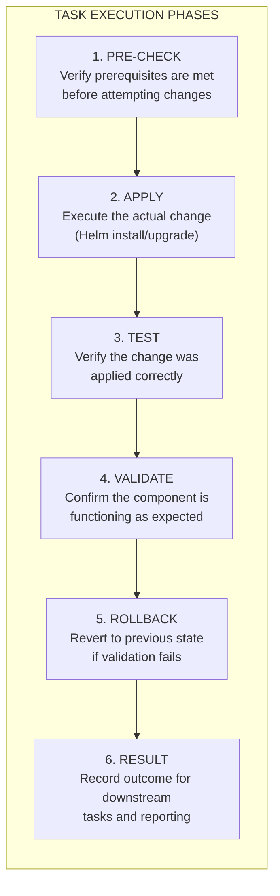

```
RFC-DEPLOY-0001                                              Section 6
Category: Standards Track                       Lifecycle Management
```

# 6. Lifecycle Management

[← Previous: Orchestration Mechanics](./05-orchestration-mechanics.md) | [Index](./00-index.md#table-of-contents) | [Next: Executor Specification →](./07-executor-specification.md)

---

This section defines the **lifecycle phases** of the deployment system: what
happens in each phase, what transitions between phases, and how the system
behaves during steady-state and teardown.

---

## 6.1 Phase 0: Pre-Bootstrap

### Purpose

Verify that the target cluster is ready to receive the platform and validate
all prerequisites before beginning deployment.

---

### Pre-Conditions

The following conditions MUST be satisfied before proceeding:

| Condition | Verification |
|-----------|--------------|
| Kubernetes API accessible | API server responds to requests |
| Authentication valid | kubeconfig credentials accepted |
| Required permissions | ServiceAccount or user has cluster-admin or equivalent |
| Container runtime operational | Pods can be scheduled and run |
| Network connectivity | Cluster can reach container registries |
| Storage available | Nodes have sufficient disk space |

---

### Actions

1. **Connectivity verification**: Test Kubernetes API accessibility
2. **Permission verification**: Validate required RBAC permissions
3. **Resource verification**: Check available cluster resources
4. **Registry verification**: Test container image pull capability
5. **Prerequisite CRD check**: Identify any pre-existing CRDs

---

### Outputs

- Validation report indicating readiness
- List of any blocking issues
- Cluster state snapshot for comparison

---

### Transition Criteria

Proceed to Phase 1 when:
- All pre-conditions are satisfied
- No blocking issues identified
- Executor receives positive validation result

---

### Failure Handling

If pre-conditions are not met:
- Report specific failures
- Do not proceed to Phase 1
- Exit with diagnostic information

---

## 6.2 Phase 1: Bootstrap (Day 0-1)

### Purpose

Establish the orchestration primitives that enable GitOps-managed deployment.
This phase transforms a bare Kubernetes cluster into one capable of
self-managing platform applications.

---

### Pre-Conditions

- Phase 0 completed successfully
- Bootstrap configuration available
- Container images accessible

---

### 6.2.1 Ansible Bootstrap Standards

The bootstrap system MUST be implemented using Ansible playbooks following
strict standardization requirements.

---

#### Installation Method Constraint

**Helm is the ONLY permitted installation method.**

All Kubernetes resources installed during bootstrap MUST be deployed via
Helm charts. This ensures:

- Consistent templating across all components
- Upgrade and rollback capability
- Release tracking and history
- Value-based configuration

Direct manifest application (kubectl apply -f) is PROHIBITED except for:
- Helm repository configuration
- Initial namespace creation (if not handled by Helm)

---

#### Playbook Structure

The bootstrap system MUST be organized as Ansible playbooks with multiple
roles. The directory structure MUST follow:

```
bootstrap/
├── ansible.cfg                    # Ansible configuration
├── requirements.yml               # Collection dependencies
├── site.yml                       # Master orchestration playbook
├── inventories/
│   └── production/
│       ├── hosts.yml
│       └── group_vars/
│           └── all.yml
├── playbooks/
│   ├── argocd.yml                # ArgoCD bootstrap
│   ├── argo-workflows.yml        # Argo Workflows bootstrap
│   ├── argo-events.yml           # Argo Events bootstrap
│   ├── sealed-secrets.yml        # Sealed Secrets bootstrap
│   └── gitops-handoff.yml        # Root Application creation
└── roles/
    ├── argocd/
    ├── argo-workflows/
    ├── argo-events/
    ├── sealed-secrets/
    └── gitops-handoff/
```

---

#### Role Requirements

Each role MUST be:

| Property | Requirement |
|----------|-------------|
| **Single-purpose** | One logical unit of work |
| **Validatable** | Success/failure can be programmatically verified |
| **Reproducible** | Same inputs produce same outputs |
| **Deterministic** | No random or time-dependent behavior |
| **Revertable** | Can be rolled back to previous state |

---

#### Task Phase Structure

Every task within a role MUST implement the following six phases:



---

#### Phase 1: Pre-Check

**Purpose**: Verify all prerequisites before attempting changes.

**Requirements**:
- Check that required Helm repositories are configured
- Verify namespace exists or can be created
- Confirm previous release state (if upgrade)
- Validate required secrets/configmaps exist
- Check cluster resource availability

**Behavior**:
- MUST fail the task if prerequisites are not met
- MUST NOT modify any state
- MUST produce diagnostic output on failure

---

#### Phase 2: Apply

**Purpose**: Execute the actual change using Helm.

**Requirements**:
- Use `kubernetes.core.helm` module exclusively
- Specify explicit chart version (no `latest`)
- Pass all values through a values file or inline values
- Set appropriate timeouts
- Enable atomic operations where supported

**Behavior**:
- MUST use `--atomic` flag for new installations
- MUST capture Helm release status
- MUST NOT proceed if Helm command fails

---

#### Phase 3: Test

**Purpose**: Verify the change was applied correctly.

**Requirements**:
- Query Helm release status
- Verify expected resources exist
- Check resource counts match expectations
- Validate CRDs were installed (if applicable)

**Behavior**:
- MUST run after apply phase
- MUST NOT modify any state
- MUST fail if expected state not achieved

---

#### Phase 4: Validate

**Purpose**: Confirm the component is functioning as expected.

**Requirements**:
- Wait for pods to reach Ready state
- Verify service endpoints are reachable
- Execute component-specific health checks
- Confirm API responsiveness (if applicable)

**Behavior**:
- MUST use configurable timeout
- MUST use configurable retry count
- MUST fail if health is not achieved within timeout

---

#### Phase 5: Rollback

**Purpose**: Revert to previous state if validation fails.

**Requirements**:
- Execute `helm rollback` to previous revision
- Wait for rollback to complete
- Re-validate after rollback

**Behavior**:
- MUST only execute if validation failed
- MUST restore previous working state
- MUST report rollback status

---

#### Phase 6: Result

**Purpose**: Record outcome for downstream tasks and reporting.

**Requirements**:
- Set Ansible facts for task status
- Record timing information
- Capture relevant metadata (versions, revisions)
- Enable conditional execution of downstream tasks

**Behavior**:
- MUST always execute (even on failure)
- MUST set `<role>_status` fact (success, failed, rolled_back)
- MUST capture error details on failure

---

#### Role Dependency Chain

Roles MUST declare explicit dependencies:

| Role | Depends On | Status Fact Required |
|------|------------|---------------------|
| argocd | (none) | - |
| argo-workflows | argocd | `argocd_status == "success"` |
| argo-events | argo-workflows | `argo_workflows_status == "success"` |
| sealed-secrets | (none) | - |
| gitops-handoff | argocd, sealed-secrets | Both status == "success" |

---

#### Example Role Task Structure

```
roles/argocd/tasks/main.yml:

# Phase 1: Pre-Check
- name: Pre-check | Verify Helm repository
  ...

- name: Pre-check | Verify cluster connectivity
  ...

- name: Pre-check | Check for existing release
  ...

# Phase 2: Apply
- name: Apply | Install ArgoCD via Helm
  kubernetes.core.helm:
    name: argocd
    chart_ref: argo/argo-cd
    release_namespace: argocd
    create_namespace: true
    atomic: true
    wait: true
    wait_timeout: 600s
    values: "{{ argocd_values }}"
  register: argocd_helm_result

# Phase 3: Test
- name: Test | Verify Helm release status
  ...

- name: Test | Verify expected resources exist
  ...

# Phase 4: Validate
- name: Validate | Wait for ArgoCD pods ready
  ...

- name: Validate | Verify API server responding
  ...

# Phase 5: Rollback (conditional)
- name: Rollback | Revert ArgoCD to previous version
  when: argocd_validation_failed | default(false)
  ...

# Phase 6: Result
- name: Result | Set ArgoCD status fact
  ansible.builtin.set_fact:
    argocd_status: "{{ 'success' if not argocd_validation_failed else 'failed' }}"
    argocd_version: "{{ argocd_helm_result.status.app_version }}"
    argocd_revision: "{{ argocd_helm_result.status.revision }}"
```

---

#### Prohibited Practices

The following practices are PROHIBITED in bootstrap playbooks:

| Prohibited | Reason |
|------------|--------|
| Shell commands for Helm | Use kubernetes.core.helm module |
| kubectl apply -f | Use Helm for all installations |
| Hardcoded secrets | Use Ansible Vault or external secrets |
| Sleep for timing | Use proper wait conditions |
| Ignoring errors | All errors MUST be handled explicitly |
| Unversioned charts | All charts MUST specify version |
| Direct API calls | Use Ansible modules |

---

### 6.2.2 Bootstrap Actions

**Step 1: Namespace Preparation**

Create namespaces for orchestration components:
- ArgoCD namespace
- Argo Workflows namespace
- Argo Events namespace

**Step 2: ArgoCD Installation**

Install ArgoCD with required configuration:
- High-availability configuration (if specified)
- Custom health checks for Application resources
- CRD-specific health check definitions
- Resource customizations

**Step 3: ArgoCD Readiness Verification**

Wait for ArgoCD components to become operational:
- API server responding
- Application controller running
- Repo server running

**Step 4: Argo Workflows Installation**

Install Argo Workflows controller:
- Controller deployment
- Required CRDs
- RBAC configuration

**Step 5: ClusterWorkflowTemplate Installation**

Apply reusable workflow templates:
- sync-and-wait template for ArgoCD operations
- validation templates for health checks
- teardown templates for cleanup

**Step 6: Argo Events Installation**

Install Argo Events components:
- EventBus (Jetstream or NATS)
- Event controller
- Sensor controller

**Step 7: Automation Credential Creation**

Create credentials for cross-system integration:
- ArgoCD API token for Argo Workflows
- ServiceAccount for workflow execution

**Step 8: Root Application Creation**

Create the Root Application that defines the GitOps handoff:
- Points to platform manifests in Git
- Configured for auto-sync (or manual, based on policy)
- Defines the entry point for declarative management

**Step 9: Orchestration Workflow Trigger**

Submit the platform-bootstrap workflow:
- Passes configuration parameters
- Initiates Phase 2 (Orchestration)

---

### 6.2.3 Outputs

- Operational ArgoCD instance
- Operational Argo Workflows controller
- Operational Argo Events system
- Running platform-bootstrap workflow

---

### Transition Criteria

Proceed to Phase 2 when:
- All bootstrap components report Ready
- Root Application created
- Platform-bootstrap workflow submitted

---

### Failure Handling

If bootstrap fails:
- Report failure point and diagnostics
- Do not proceed to Phase 2
- Support re-execution (idempotent)

---

## 6.3 Phase 2: Orchestration (DAG Execution)

### Purpose

Execute the platform deployment DAG, deploying all applications in correct
dependency order with health verification between nodes.

---

### Pre-Conditions

- Phase 1 completed successfully
- Argo Workflows operational
- ArgoCD operational
- DAG specification available

---

### Execution Model

The orchestration workflow:

1. **Receives** the platform DAG specification
2. **Computes** topological order of nodes
3. **Groups** nodes into execution waves
4. **Iterates** through waves sequentially:
   - Executes all nodes in current wave (parallel where possible)
   - Waits for all nodes to complete
   - Verifies health status
   - Proceeds only if all nodes Healthy
5. **Reports** final status

---

### Per-Node Execution

For each node in the DAG:

1. **Sync Application**: Invoke ArgoCD sync for the Application
2. **Wait for Sync**: Wait for sync operation to complete
3. **Verify Health**: Query Application health status
4. **Output Status**: Record health for downstream dependencies

---

### Health Verification

Health verification occurs after each wave:

| Status | Behavior |
|--------|----------|
| Healthy | Proceed to next wave |
| Progressing | Wait with timeout |
| Degraded | Halt and report |
| Failed | Halt and report |
| Unknown | Treat as failure |

---

### Timeout Handling

Each node has configurable timeouts:

| Timeout Type | Purpose |
|--------------|---------|
| Sync timeout | Maximum time for ArgoCD sync operation |
| Health timeout | Maximum time waiting for Healthy status |
| Overall timeout | Maximum time for entire workflow |

When timeout is exceeded:
- Node is marked as failed
- Dependent nodes are skipped
- Workflow reports partial completion

---

### Outputs

- Workflow status (Succeeded, Failed, Partial)
- Per-node execution results
- Health status at completion
- Execution logs

---

### Transition Criteria

Proceed to Phase 3 when:
- All DAG nodes completed successfully
- All Applications report Healthy
- Workflow reports Succeeded

---

### Failure Handling

If orchestration fails:
- Report failed node and diagnostics
- Preserve workflow state for resume
- Support resumption from failure point

---

## 6.4 Phase 3: Steady-State (Day 2+)

### Purpose

Maintain the deployed platform through continuous reconciliation, enabling
GitOps-driven changes and environment promotions.

---

### Characteristics

Phase 3 is the **normal operating mode**. The platform remains in this phase
indefinitely unless teardown is initiated.

---

### ArgoCD Behavior

In steady-state, ArgoCD:

- Continuously reconciles Application state
- Detects drift between Git and cluster
- Corrects drift through auto-sync (if enabled)
- Reports health and sync status
- Triggers alerts on degradation

---

### Argo Events Behavior

Event-driven automation handles:

- Git webhook triggers for deployment updates
- Scheduled triggers for maintenance tasks
- Manual triggers for on-demand operations

---

### Kargo Behavior

Environment promotion:

- Monitors Warehouses for new artifacts
- Creates Freight for promotable changes
- Promotes through Stages (dev → staging → prod)
- Executes verification at each Stage
- Enforces soak times between environments

---

### Argo Rollouts Behavior

Progressive delivery for workloads:

- Canary deployments with traffic shifting
- Blue-green deployments with instant cutover
- Analysis runs for automated rollback decisions

---

### Health Monitoring

Continuous health verification:

- Prometheus metrics for Application health
- Alerts for Degraded or Failed status
- Dashboard visibility into platform state

---

### Human Intervention Points

In steady-state, human intervention MAY be required for:

- Policy changes (RBAC, network policies)
- Significant upgrades (Kubernetes version)
- Disaster recovery scenarios
- Manual promotion approvals (if configured)

---

## 6.5 Phase 4: Teardown

### Purpose

Gracefully remove the platform from the cluster, ensuring no orphaned
resources remain.

---

### Pre-Conditions

- Platform in steady-state (Phase 3)
- Teardown explicitly requested
- Confirmation of data handling policy

---

### Execution Model

Teardown executes in **reverse dependency order**:

1. **Reverse DAG**: Compute reverse topological order
2. **Stop promotions**: Disable Kargo promotions
3. **Delete Applications**: Remove in reverse order
4. **Verify deletion**: Confirm resources removed
5. **Remove orchestration**: Delete Argo components
6. **Clean namespaces**: Remove platform namespaces

---

### Dependency Reversal

If deployment order was: A → B → C

Teardown order is: C → B → A

A resource MUST NOT be removed while dependents exist.

---

### Deletion Verification

For each deleted Application:

1. **Delete Application resource**: Remove from ArgoCD
2. **Wait for cascade**: Allow cascading delete to complete
3. **Verify absence**: Confirm managed resources removed
4. **Report orphans**: Identify any remaining resources

---

### PersistentVolume Handling

Storage cleanup requires explicit policy:

| Policy | Behavior |
|--------|----------|
| Delete | Remove PVCs and allow PV reclaim |
| Retain | Leave PVCs for data preservation |
| Snapshot | Create snapshots before deletion |

Default policy SHOULD be Retain to prevent accidental data loss.

---

### Orchestration Primitive Removal

After all Applications are removed:

1. Remove Argo Events components
2. Remove Argo Workflows controller
3. Remove ClusterWorkflowTemplates
4. Remove ArgoCD
5. Remove CRDs (optional, may affect other clusters)

---

### Outputs

- Teardown status (Complete, Partial, Failed)
- List of removed resources
- List of retained resources (if any)
- Orphan report

---

### Failure Handling

If teardown fails:
- Report blocking resources
- Provide manual cleanup guidance
- Support retry from failure point

---

## 6.6 Recovery Procedures

### Partial Deployment Recovery

When orchestration fails partway:

1. **Identify failure point**: Review workflow status
2. **Diagnose root cause**: Check failed Application
3. **Fix underlying issue**: Correct configuration or resources
4. **Resume workflow**: Restart from failed node

Argo Workflows supports workflow resume, preserving completed node state.

---

### Application Recovery

When individual Application is degraded:

1. **Check ArgoCD status**: Review sync and health
2. **Review events**: Check Application events
3. **Manual sync**: Trigger sync if auto-sync disabled
4. **Rollback if needed**: Revert to previous revision

---

### Cluster Recovery

After cluster loss:

1. **Provision new cluster**: Create replacement cluster
2. **Run executor deploy**: Execute from Phase 0
3. **Verify restoration**: Compare to expected state
4. **Restore data**: Apply backup restoration (if applicable)

The platform is fully reconstructable from:
- Git repositories (configuration)
- Container registries (images)
- External backup systems (data)

---

### Emergency Procedures

For critical failures:

**Force sync all Applications**:
Trigger immediate sync of all Applications, bypassing normal reconciliation
intervals.

**Restart operators**:
Delete operator pods to trigger restart and re-reconciliation.

**Manual resource cleanup**:
Directly delete stuck resources blocking deployment.

---

## Document Navigation

| Previous | Index | Next |
|----------|-------|------|
| [← 5. Orchestration Mechanics](./05-orchestration-mechanics.md) | [Table of Contents](./00-index.md#table-of-contents) | [7. Executor Specification →](./07-executor-specification.md) |

---

*End of Section 6 — RFC-DEPLOY-0001*
