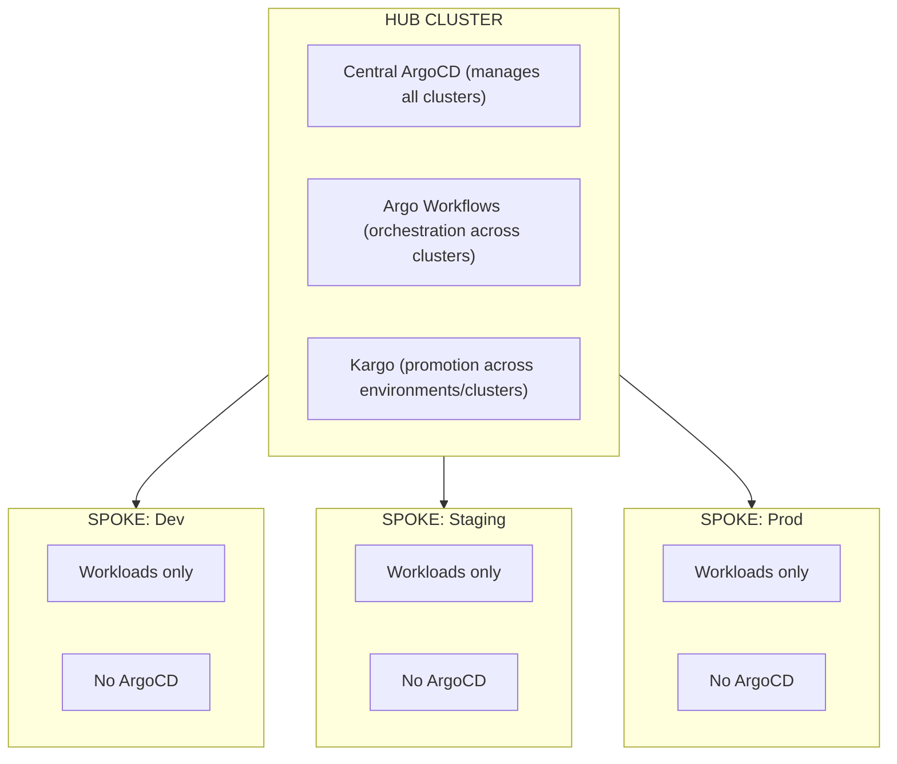

```
RFC-DEPLOY-0001                                              Section 9
Category: Standards Track                      Future Considerations
```

# 9. Future Considerations

[← Previous: Design Rationale](./08-rationale.md) | [Index](./00-index.md#table-of-contents) | [Next: Appendix A →](./appendix-a-glossary.md)

---

This section documents **anticipated evolution paths** for the deployment
orchestration system. These are not commitments but design considerations
to ensure current architecture does not preclude future capabilities.

---

## 9.1 Design for Change

The architecture is designed with explicit extension points:

- **Layer boundaries** allow replacement of individual layers
- **Component interfaces** enable alternative implementations
- **DAG specification** supports additional node types
- **Executor actions** can be extended for new operations

Changes to core architecture SHOULD NOT be required for:

- adding new stacks or applications,
- supporting additional environments,
- scaling to more applications,
- or integrating new observability systems.

---

## 9.2 Multi-Cluster Federation

### Scope

Multi-cluster deployment orchestration is **explicitly deferred** from the
initial architecture. This section documents how it MAY be added without
fundamental changes.

---

### Hub-Spoke Model



**Hub responsibilities**:
- Host ArgoCD managing all spoke clusters
- Host Argo Workflows executing deployment DAGs
- Host Kargo managing promotions

**Spoke responsibilities**:
- Run workloads only
- No GitOps infrastructure
- Managed entirely by hub

---

### ApplicationSet for Multi-Cluster

ArgoCD ApplicationSets can generate Applications across clusters:

- **List generator**: Explicit cluster list
- **Cluster generator**: All registered clusters
- **Matrix generator**: Combine applications × clusters

ApplicationSets enable managing the same Application across multiple clusters
from a single source definition.

---

### Cross-Cluster Dependencies

For dependencies spanning clusters:

1. **Deploy hub platform first** (single-cluster pattern)
2. **Register spoke clusters** to hub ArgoCD
3. **Execute cross-cluster DAG** with cluster-aware nodes
4. **Verify health across clusters** before proceeding

The DAG node specification would extend to include cluster target:

```
Node: temporal-production
  Cluster: prod-cluster
  Application: temporal
  Dependencies: [postgres-production@prod-cluster]
```

---

### Cluster Independence Consideration

An alternative to hub-spoke is **cluster independence**:

- Each cluster has its own ArgoCD and Argo Workflows
- No central control plane
- Promotion through Git (Kargo in each cluster)

This model:
- Limits blast radius (hub failure doesn't affect all clusters)
- Increases operational complexity (N clusters to manage)
- Requires consistent configuration across clusters

---

## 9.3 Scale Considerations

### ArgoCD at Scale

ArgoCD has been benchmarked at significant scale:

- CNOE benchmarks: 50,000+ Applications across 500 clusters
- GitOps Days reports: 10,000+ Applications single cluster

Key scaling configurations:

- **Controller sharding**: Multiple Application controllers
- **Repo server scaling**: Horizontal pod scaling
- **Redis HA**: High-availability Redis for caching
- **Resource quotas**: Limit reconciliation parallelism

---

### Argo Workflows at Scale

Workflow controller scaling considerations:

- **Parallelism limits**: Control concurrent workflow execution
- **Archive configuration**: Historical workflow storage
- **Garbage collection**: Completed workflow cleanup
- **Controller replicas**: High availability

---

### Platform Application Growth

As applications grow beyond 50-60:

- **Stack consolidation**: Group related applications
- **DAG optimization**: Reduce unnecessary dependencies
- **Parallel execution**: Maximize concurrent deployment
- **Timeout tuning**: Application-specific timeouts

The architecture supports linear scaling. 100 applications should behave
similarly to 40 applications with proportionally longer deployment times.

---

## 9.4 Extensibility Points

### New Stack Addition

Adding a new stack requires:

1. Create stack directory with target-chart
2. Define applications within stack
3. Add stack to platform DAG with dependencies
4. Update ArgoCD Application definitions

No changes to orchestration infrastructure required.

---

### Custom Health Check Registration

Adding health checks for new CRDs:

1. Define Lua health check script
2. Add to ArgoCD ConfigMap under resource.customizations.health
3. Restart ArgoCD Application controller

No changes to orchestration infrastructure required.

---

### Executor Action Extension

Adding new executor actions:

1. Implement action handler in executor
2. Define action interface (inputs, outputs, exit codes)
3. Update executor documentation
4. Publish new executor image version

Existing actions remain unchanged.

---

### DAG Node Types

Adding new DAG node types:

1. Define node type semantics
2. Implement node handler in workflow templates
3. Update DAG validation logic
4. Document new node type

Existing node types remain unchanged.

---

## 9.5 Integration Roadmap

### Crossplane for Infrastructure

Crossplane enables managing cloud infrastructure through Kubernetes:

- **Use case**: Provision cloud resources alongside platform
- **Integration**: Add Crossplane to bootstrap, include in DAG
- **Consideration**: Cloud provider dependencies

---

### External Secrets Operator Maturity

ESO integration deepens with:

- **PushSecret**: Push secrets from Kubernetes to Vault
- **ClusterGenerator**: Generate secrets from templates
- **Webhook provider**: Custom secret sources

---

### Kyverno Policy Integration

Policy enforcement through Kyverno:

- **Deployment validation**: Ensure compliance before sync
- **Mutation policies**: Automatic configuration injection
- **Generation policies**: Create supporting resources

---

### Service Mesh Integration

If service mesh is adopted:

- **Add to DAG**: Mesh control plane as dependency layer
- **Health checks**: Custom health for mesh resources
- **Dependency updates**: Applications depend on mesh

---

## 9.6 What Does Not Need to Change

The following aspects of the architecture are designed to remain stable:

### Core Principles

- Layer separation (bootstrap, orchestration, deployment, promotion)
- Authority boundaries
- Idempotency requirements
- Health-gated progression

### Interfaces

- Executor action contract (deploy, validate, teardown)
- DAG specification format
- Health status semantics

### Technologies

- Argo Workflows for orchestration
- ArgoCD for deployment
- Kargo for promotion

These may be replaced if better alternatives emerge, but the architecture
does not assume such replacement.

---

## 9.7 Anticipated Trade-offs and Limits

### Trade-off: Complexity vs Reliability

The architecture is more complex than simple scripts. This complexity is
justified by the reliability guarantees it provides. Organizations with
simpler platforms may not need this level of sophistication.

---

### Trade-off: Speed vs Safety

Health-gated progression is slower than fire-and-forget deployment. This
is intentional. Safety is prioritized over speed for platform infrastructure.

---

### Limit: Dependency Cycle Prohibition

The architecture cannot deploy circular dependencies. This is fundamental
to DAG-based orchestration. Circular dependencies in platform design must
be resolved architecturally.

---

### Limit: Single-Cluster Initial Scope

Multi-cluster support is deferred. Organizations requiring immediate
multi-cluster capabilities must either:

- Deploy independently per cluster
- Implement hub-spoke outside this architecture

---

### Limit: ArgoCD as Deployment Layer

The architecture assumes ArgoCD for deployment. Alternative GitOps tools
(Flux, etc.) would require significant adaptation.

---

## Document Navigation

| Previous | Index | Next |
|----------|-------|------|
| [← 8. Design Rationale](./08-rationale.md) | [Table of Contents](./00-index.md#table-of-contents) | [Appendix A: Glossary →](./appendix-a-glossary.md) |

---

*End of Section 9 — RFC-DEPLOY-0001*
