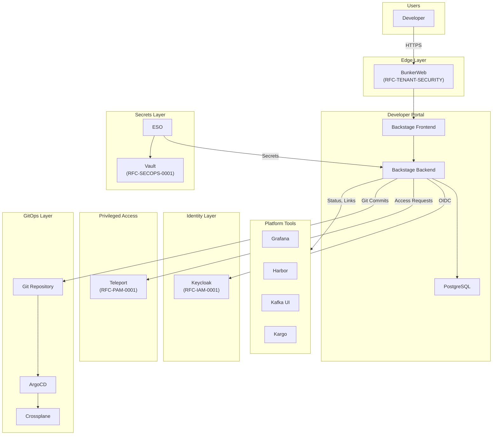
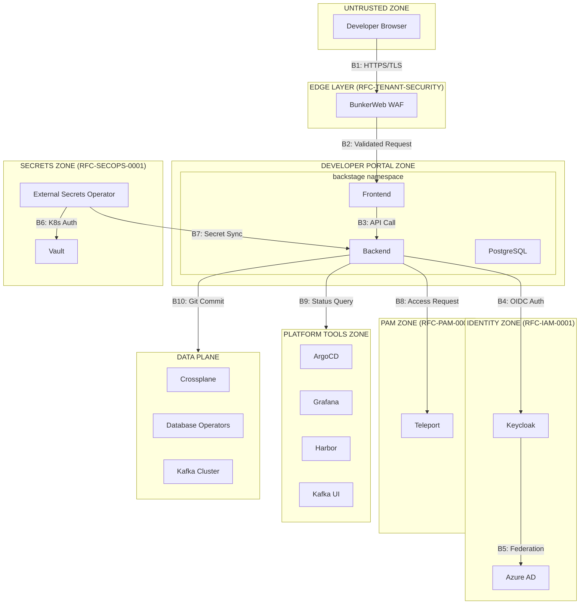
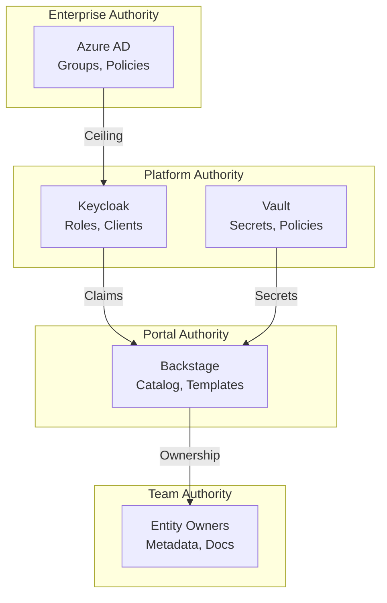
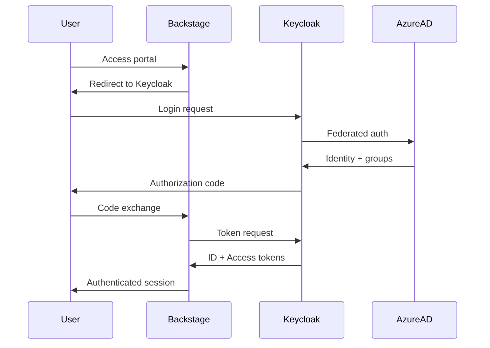
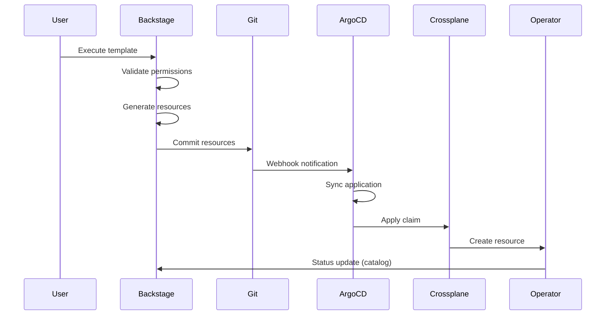
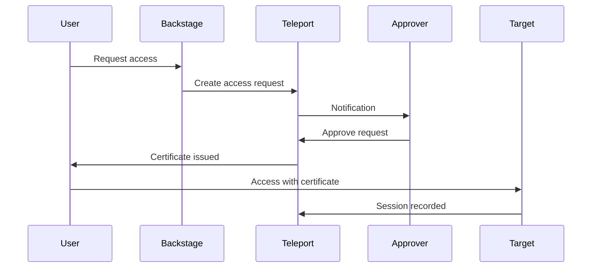

```
RFC-DEVELOPER-PLATFORM-0001                                       Section 3
Category: Standards Track                                     Architecture
```

# 3. Architecture

[← Requirements](./02-requirements.md) | [Index](./00-index.md#table-of-contents) | [Next: Components →](./04-components.md)

---

## 3.1 System Overview

### 3.1.1 High-Level Architecture

The developer platform provides a unified interface through which developers interact with platform capabilities. The architecture positions Backstage as the central portal, integrating with identity, secrets, privileged access, and platform tools.



### 3.1.2 Architectural Principles

| Principle | Implementation |
|-----------|----------------|
| Unified interface | Single portal for all developer interactions |
| Capability-based | Users see only what they can do |
| GitOps-first | All changes through Git |
| Integration over reimplementation | Portal links to specialized tools |
| Convention over configuration | Golden path templates |

### 3.1.3 Layered Architecture

| Layer | Components | Responsibility |
|-------|------------|----------------|
| Presentation | Backstage Frontend | User interface, navigation |
| API | Backstage Backend | Business logic, integrations |
| Identity | Keycloak | Authentication, authorization claims |
| Secrets | Vault, ESO | Credential management |
| GitOps | ArgoCD, Crossplane | Infrastructure reconciliation |
| Platform | Various tools | Specialized capabilities |

---

## 3.2 Trust Boundaries

### 3.2.1 Trust Boundary Diagram



### 3.2.2 Trust Boundary Definitions

| Boundary | From | To | Verification | Supporting Invariant |
|----------|------|----|--------------|--------------------|
| B1 | Internet | WAF | TLS termination, WAF inspection | — |
| B2 | WAF | Backstage | Request validated, sanitized | INV-15 |
| B3 | Frontend | Backend | Session token validation | INV-1 |
| B4 | Backstage | Keycloak | OIDC protocol validation | INV-1, INV-3 |
| B5 | Keycloak | Azure AD | OIDC federation | RFC-IAM-0001 INV-1 |
| B6 | ESO | Vault | Kubernetes ServiceAccount auth | RFC-SECOPS-0001 |
| B7 | Vault | Backstage | Kubernetes Secret delivery | INV-9 |
| B8 | Backstage | Teleport | API token, user context | INV-13 |
| B9 | Backstage | Platform Tools | ServiceAccount, user token | INV-10 |
| B10 | Backstage | Data Plane | Git commit (GitOps) | INV-4 |

### 3.2.3 Security Zones

| Zone | Trust Level | Access Pattern |
|------|-------------|----------------|
| Internet | Untrusted | WAF-filtered entry |
| Edge Layer | Perimeter | Request validation, rate limiting |
| Portal Zone | Platform | Authenticated users only |
| Identity Zone | Critical | Keycloak, Azure AD |
| Secrets Zone | Critical | Vault, ESO |
| PAM Zone | Critical | Teleport for privileged access |
| Platform Zone | Platform | Tool-specific authorization |
| Data Zone | Platform | Operator-managed resources |

---

## 3.3 Authority Domains

### 3.3.1 Authority Hierarchy



### 3.3.2 Authority Responsibilities

| Authority | Governs | Examples |
|-----------|---------|----------|
| Enterprise (Azure AD) | User identity, group membership, enterprise policy | Who exists, org structure |
| Platform Identity (Keycloak) | Role mapping, token claims, client configuration | What roles exist, claim structure |
| Platform Secrets (Vault) | Secret storage, rotation, access policy | Credential lifecycle |
| Portal Configuration | Catalog structure, templates, plugins | What appears in portal |
| Entity Owners | Entity metadata, documentation | Service descriptions, runbooks |

### 3.3.3 Authority Boundaries

| Decision | Authority | This RFC's Role |
|----------|-----------|-----------------|
| User can authenticate | Keycloak + Azure AD | Consume authentication |
| User can access feature | Keycloak claims | Interpret claims |
| Template can be used | Portal configuration | Define template permissions |
| Entity can be modified | Entity ownership | Enforce ownership check |
| Secret can be accessed | Vault policy | Request secret delivery |

---

## 3.4 Data Flow Model

### 3.4.1 Authentication Flow



### 3.4.2 Self-Service Provisioning Flow



### 3.4.3 JIT Access Request Flow



---

## 3.5 Integration Architecture

### 3.5.1 RFC Integration Points

| RFC | Integration Method | Data Exchanged |
|-----|-------------------|----------------|
| RFC-IAM-0001 | OIDC client | Authentication, token claims |
| RFC-SECOPS-0001 | ESO/ExternalSecret | Portal secrets, plugin credentials |
| RFC-PAM-0001 | Teleport API | Access requests, session links |
| RFC-TENANT-SECURITY | Network policy | Namespace isolation |

### 3.5.2 Platform Tool Integration

| Tool | Integration Pattern | Data Flow |
|------|---------------------|-----------|
| ArgoCD | REST API | Application status, sync actions |
| Grafana | HTTP API, iframes | Dashboard links, embedded views |
| Harbor | REST API | Image status, vulnerability data |
| Kafka UI | URL templates | Topic links |
| Crossplane | Kubernetes API | Resource status |

### 3.5.3 Integration Patterns

| Pattern | Usage | Example |
|---------|-------|---------|
| API polling | Status retrieval | ArgoCD sync status |
| Kubernetes watch | Resource status | Crossplane claim status |
| URL templates | Deep linking | Grafana dashboard links |
| Event webhooks | Notifications | GitHub events |
| Git commits | GitOps output | Template scaffolding |

---

## Document Navigation

| Previous | Index | Next |
|----------|-------|------|
| [← 2. Requirements](./02-requirements.md) | [Table of Contents](./00-index.md#table-of-contents) | [4. Components →](./04-components.md) |

---

*End of Section 3 — RFC-DEVELOPER-PLATFORM-0001*
