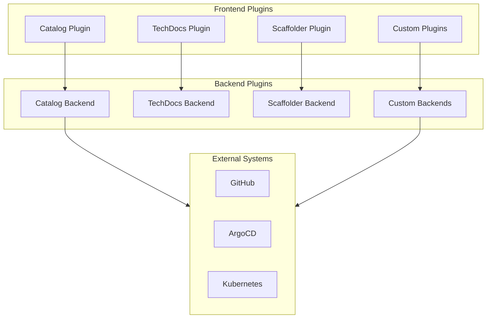
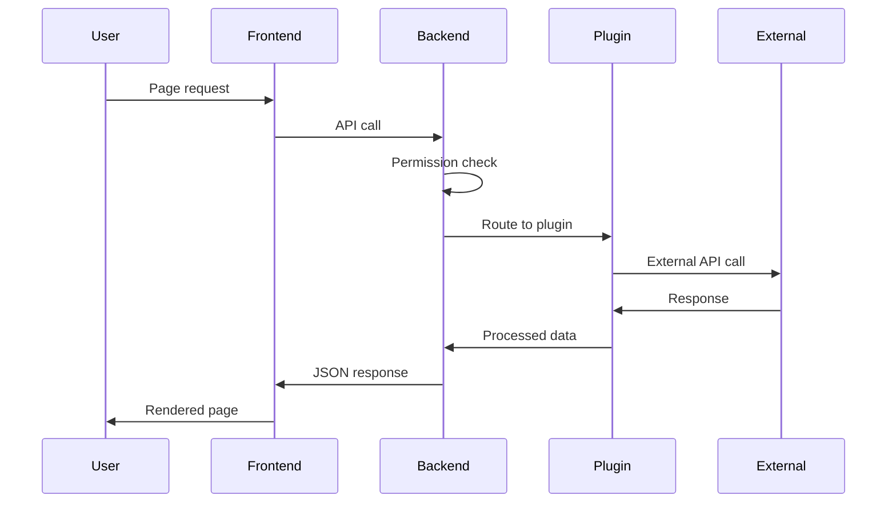

```
RFC-DEVELOPER-PLATFORM-0001                                       Section 4
Category: Standards Track                                      Components
```

# 4. Components

[← Architecture](./03-architecture.md) | [Index](./00-index.md#table-of-contents) | [Next: Software Catalog →](./05-software-catalog.md)

---

## 4.1 Backstage Framework

### 4.1.1 Overview

Backstage is a CNCF Incubating project that provides an open platform for building developer portals. Originally created by Spotify, it has become the de facto standard for internal developer platforms, adopted by over 3,400 organizations.

| Aspect | Description |
|--------|-------------|
| Origin | Spotify (open-sourced 2020) |
| Governance | CNCF Incubating |
| Architecture | React frontend, Node.js backend |
| Extensibility | Plugin-based architecture |
| Deployment | Self-hosted Kubernetes |

### 4.1.2 Core Features

| Feature | Description |
|---------|-------------|
| Software Catalog | Entity registry for services, APIs, resources |
| Software Templates | Scaffolder for project creation |
| TechDocs | Documentation-as-code rendering |
| Search | Cross-catalog search functionality |
| Permission Framework | Capability-based authorization |

### 4.1.3 Component Responsibilities

| Component | Responsibility |
|-----------|----------------|
| Frontend | User interface, React-based SPA |
| Backend | API server, plugin host |
| Database | Entity storage, search index |
| Plugins | Feature extensions |

### 4.1.4 Failure Modes

| Failure | Impact | Recovery |
|---------|--------|----------|
| Frontend unavailable | Users cannot access portal | Pod restart, load balancer health check |
| Backend unavailable | API calls fail | Pod restart, replica failover |
| Database unavailable | Catalog queries fail | PostgreSQL HA failover |
| Plugin failure | Feature-specific degradation | Isolate plugin, graceful degradation |

---

## 4.2 PostgreSQL Database

### 4.2.1 Purpose

PostgreSQL stores Backstage operational data including:

| Data Type | Description |
|-----------|-------------|
| Catalog entities | Processed entity metadata |
| Search index | Full-text search data |
| User sessions | Session state |
| Plugin data | Plugin-specific storage |

### 4.2.2 Deployment Model

| Aspect | Configuration |
|--------|---------------|
| Operator | CloudNativePG or Zalando PostgreSQL Operator |
| Replicas | Primary + standby for HA |
| Storage | Persistent volumes from Ceph |
| Backup | Automated via operator |

### 4.2.3 Data Classification

| Data | Classification | Retention |
|------|----------------|-----------|
| Catalog metadata | Platform operational | Indefinite |
| Search index | Derived | Rebuildable |
| Session data | Transient | Session lifetime |
| Audit logs | Compliance | Per policy |

### 4.2.4 Failure Modes

| Failure | Impact | Recovery |
|---------|--------|----------|
| Primary failure | Write unavailable | Automatic failover to standby |
| Both replicas fail | Full outage | Restore from backup |
| Storage exhaustion | Writes fail | Expand PVC, cleanup |
| Connection exhaustion | New connections rejected | Connection pooling, pod restart |

---

## 4.3 Plugin System

### 4.3.1 Plugin Architecture

Backstage implements a plugin-based architecture where functionality is organized into discrete plugins:



### 4.3.2 Plugin Categories

| Category | Purpose | Examples |
|----------|---------|----------|
| Core | Essential functionality | Catalog, Scaffolder, TechDocs, Search |
| Integration | External system connectivity | ArgoCD, Kubernetes, GitHub |
| Visualization | Data presentation | Grafana, Cost insights |
| Custom | Organization-specific | Tool library, access requests |

### 4.3.3 Plugin Requirements

Plugins MUST adhere to the following requirements per Invariant 14 and Invariant 15:

| Requirement | Description |
|-------------|-------------|
| Permission integration | Use Backstage permission framework |
| Authentication chain | No independent auth mechanisms |
| Error handling | Graceful degradation on failure |
| Configuration | Externalized via environment or secrets |

### 4.3.4 Plugin Lifecycle

| Phase | Description |
|-------|-------------|
| Registration | Plugin registered with backend/frontend |
| Initialization | Plugin initializes connections, state |
| Runtime | Plugin serves requests |
| Shutdown | Graceful connection closure |

---

## 4.4 Integration Agents

### 4.4.1 Catalog Providers

Catalog providers automatically discover and sync entities from external sources:

| Provider | Source | Entities |
|----------|--------|----------|
| GitHub Discovery | GitHub repositories | Components from catalog-info.yaml |
| Kubernetes | Kubernetes API | Resources, pods, deployments |
| Crossplane | Crossplane resources | Infrastructure entities |

### 4.4.2 Scaffolder Actions

Custom scaffolder actions extend template capabilities:

| Action Type | Purpose |
|-------------|---------|
| Git operations | Repository creation, commits |
| Crossplane | Claim generation |
| Notification | Slack, email notifications |
| Catalog | Entity registration |

### 4.4.3 Entity Processors

Entity processors transform and validate catalog data:

| Processor | Function |
|-----------|----------|
| Validator | Ensures entity schema compliance |
| Annotator | Adds computed annotations |
| Relationship resolver | Resolves entity references |

---

## 4.5 Component Interactions

### 4.5.1 Request Processing



### 4.5.2 Plugin Communication

| Pattern | Usage |
|---------|-------|
| Frontend-to-backend | REST API calls via proxy |
| Backend-to-external | Direct API calls, K8s client |
| Inter-plugin | Event bus, shared state |

### 4.5.3 Error Handling

| Error Type | Handling |
|------------|----------|
| Authentication failure | Redirect to login |
| Authorization failure | Hide feature, show message |
| External system failure | Graceful degradation, cached data |
| Network timeout | Retry with backoff |

---

## 4.6 Deployment Configuration

### 4.6.1 Kubernetes Resources

| Resource | Purpose |
|----------|---------|
| Deployment | Backstage backend pods |
| Service | Internal service exposure |
| Ingress | External access via BunkerWeb |
| ConfigMap | Non-sensitive configuration |
| ExternalSecret | Sensitive configuration from Vault |

### 4.6.2 Resource Requirements

| Component | CPU Request | Memory Request |
|-----------|-------------|----------------|
| Backend | Workload-dependent | Workload-dependent |
| PostgreSQL | Operator-managed | Operator-managed |

### 4.6.3 High Availability

| Aspect | Configuration |
|--------|---------------|
| Backend replicas | Multiple replicas behind service |
| Database HA | PostgreSQL operator manages replicas |
| Session affinity | Stateless backend, no affinity required |

---

## Document Navigation

| Previous | Index | Next |
|----------|-------|------|
| [← 3. Architecture](./03-architecture.md) | [Table of Contents](./00-index.md#table-of-contents) | [5. Software Catalog →](./05-software-catalog.md) |

---

*End of Section 4 — RFC-DEVELOPER-PLATFORM-0001*
