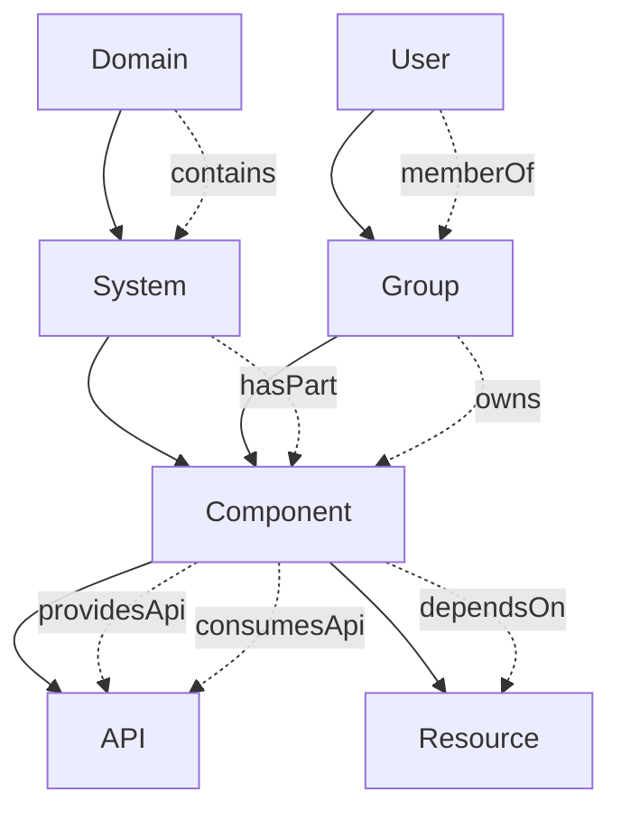
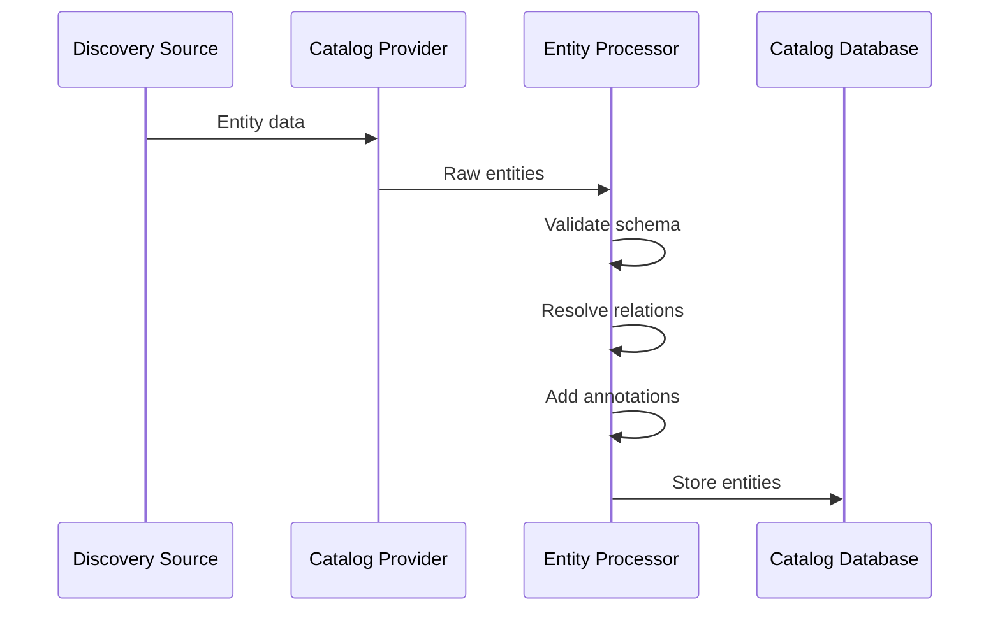
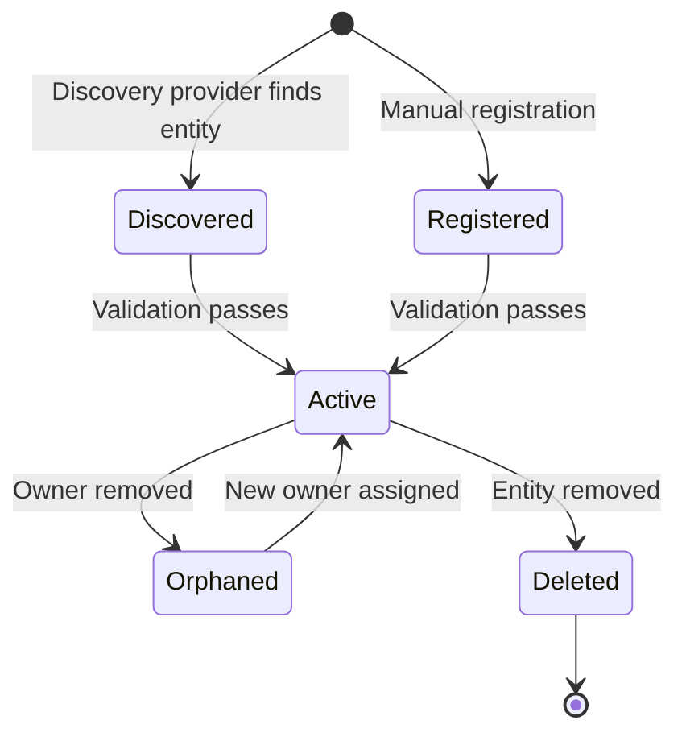

```
RFC-DEVELOPER-PLATFORM-0001                                       Section 5
Category: Standards Track                               Software Catalog
```

# 5. Software Catalog

[← Components](./04-components.md) | [Index](./00-index.md#table-of-contents) | [Next: Software Templates →](./06-software-templates.md)

---

## 5.1 Entity Model

### 5.1.1 Overview

The Software Catalog is the central registry of all software in the organization. It models software as entities with defined types, relationships, and ownership.

### 5.1.2 Core Entity Types

| Entity Type | Description | Examples |
|-------------|-------------|----------|
| Component | A piece of software | Service, website, library, ML model |
| API | An interface exposed by a component | REST API, gRPC, GraphQL, AsyncAPI |
| Resource | Infrastructure required by a component | Database, cache, queue, storage |
| System | A collection of related components | E-commerce system, payment system |
| Domain | A business domain grouping | Payments, Shipping, Customer |
| Group | A team or organizational unit | Backend team, SRE team |
| User | An individual user | Synced from Keycloak |

### 5.1.3 Entity Relationships



### 5.1.4 Entity Hierarchy

| Level | Entity | Purpose |
|-------|--------|---------|
| Business | Domain | Business capability grouping |
| System | System | Technical system boundary |
| Component | Component, API, Resource | Individual software units |
| Organizational | Group, User | Ownership and team structure |

---

## 5.2 Entity Discovery

### 5.2.1 Discovery Sources

Entities are discovered from multiple sources:

| Source | Mechanism | Entities Discovered |
|--------|-----------|---------------------|
| Git repositories | catalog-info.yaml scanning | Components, APIs, Systems |
| Kubernetes | API server watch | Resources, deployments |
| Crossplane | Resource status | Infrastructure entities |
| Keycloak | OIDC claims sync | Users, Groups |

### 5.2.2 Discovery Flow



### 5.2.3 Entity Registration

| Method | Usage |
|--------|-------|
| Automatic discovery | GitHub/GitLab scanning |
| Manual registration | Register via UI or API |
| Template creation | Templates register created entities |

---

## 5.3 Ownership Model

### 5.3.1 Ownership Requirements

Per Invariant 7, all catalog entities MUST have defined ownership:

| Requirement | Description |
|-------------|-------------|
| Mandatory owner | Every entity MUST specify an owner |
| Valid reference | Owner MUST be a valid Group or User entity |
| Ownership transfer | Ownership changes tracked in entity history |

### 5.3.2 Ownership Hierarchy

| Entity Type | Typical Owner |
|-------------|---------------|
| Domain | Business unit |
| System | Product team |
| Component | Engineering team |
| API | Providing component's team |
| Resource | Consuming component's team |

### 5.3.3 Ownership Permissions

Ownership grants specific permissions:

| Permission | Owner Can |
|------------|-----------|
| Edit metadata | Modify entity description, links, annotations |
| Edit documentation | Update TechDocs content |
| Delete entity | Remove entity from catalog |
| Transfer ownership | Change entity owner |

---

## 5.4 Dependency Mapping

### 5.4.1 Dependency Types

| Relationship | Description |
|--------------|-------------|
| dependsOn | Component requires another component or resource |
| providesApi | Component exposes an API |
| consumesApi | Component uses an API |
| partOf | Entity belongs to a system |

### 5.4.2 Dependency Visualization

The catalog provides dependency visualization:

| View | Description |
|------|-------------|
| Dependency graph | Visual representation of dependencies |
| Impact analysis | What depends on this component |
| API consumers | Who uses this API |

### 5.4.3 Dependency Discovery

Dependencies are discovered through:

| Source | Dependencies Found |
|--------|-------------------|
| Entity definitions | Explicit dependsOn declarations |
| API specifications | API consumer/provider relationships |
| Kubernetes labels | Service-to-service relationships |

---

## 5.5 Resource Entities

### 5.5.1 Resource Types

Resources represent infrastructure provisioned for components:

| Resource Type | Description | Examples |
|---------------|-------------|----------|
| Database | Relational or document database | PostgreSQL, MongoDB |
| Cache | In-memory data store | Redis, KeyDB |
| Queue | Message queue | Kafka topic, RabbitMQ queue |
| Storage | Object or block storage | S3 bucket, Ceph pool |
| Schema | Data schema definition | Avro schema, JSON schema |

### 5.5.2 Resource Lifecycle

Resources have lifecycle states reflected in the catalog:

| State | Description |
|-------|-------------|
| Provisioning | Resource being created |
| Ready | Resource available for use |
| Degraded | Resource operational but impaired |
| Failed | Resource creation failed |
| Deleting | Resource being removed |

### 5.5.3 Resource Metadata

| Metadata | Purpose |
|----------|---------|
| Environment | dev, staging, production |
| Size tier | Resource sizing classification |
| Connection info | How to connect (via Vault) |
| Backup status | Last backup, schedule |

---

## 5.6 Catalog Operations

### 5.6.1 Search

The catalog provides full-text search across entities:

| Search Capability | Description |
|-------------------|-------------|
| Entity search | Find by name, description, type |
| Filter by type | Narrow to specific entity types |
| Filter by owner | Find entities owned by team |
| Filter by tag | Find entities with specific tags |

### 5.6.2 Entity Views

| View | Content |
|------|---------|
| Overview | Entity metadata, owner, links |
| Dependencies | Dependency graph |
| Documentation | TechDocs rendering |
| API | API specification (OpenAPI, AsyncAPI) |
| CI/CD | Build and deployment status |

### 5.6.3 Entity Lifecycle



---

## Document Navigation

| Previous | Index | Next |
|----------|-------|------|
| [← 4. Components](./04-components.md) | [Table of Contents](./00-index.md#table-of-contents) | [6. Software Templates →](./06-software-templates.md) |

---

*End of Section 5 — RFC-DEVELOPER-PLATFORM-0001*
