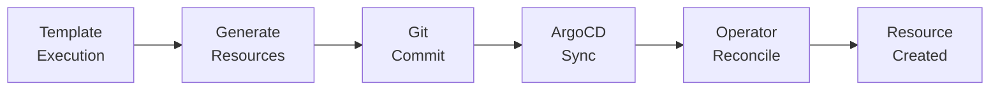

```
RFC-DEVELOPER-PLATFORM-0001                                       Section 6
Category: Standards Track                             Software Templates
```

# 6. Software Templates

[← Software Catalog](./05-software-catalog.md) | [Index](./00-index.md#table-of-contents) | [Next: TechDocs →](./07-techdocs.md)

---

## 6.1 Golden Path Philosophy

### 6.1.1 Concept

Golden paths are opinionated templates that encode organizational best practices. Rather than providing maximum flexibility, golden paths guide developers toward proven patterns.

| Principle | Description |
|-----------|-------------|
| Opinionated | Templates make decisions for developers |
| Consistent | All projects from a template share structure |
| Compliant | Templates include required security and operational controls |
| Maintained | Templates evolve as standards change |

### 6.1.2 Benefits

| Benefit | Description |
|---------|-------------|
| Faster onboarding | New projects start with working defaults |
| Reduced cognitive load | Developers don't make every decision |
| Consistency | Uniform project structures across teams |
| Compliance by default | Security and operational requirements built-in |

### 6.1.3 Invariant Alignment

Per Invariant 5, Software Templates MUST follow organizational golden paths:

| Enforcement | Description |
|-------------|-------------|
| Required elements | Templates include mandatory components |
| Structure validation | Output conforms to standards |
| No arbitrary structures | Templates are prescriptive, not permissive |

---

## 6.2 Template Structure

### 6.2.1 Template Components

| Component | Purpose |
|-----------|---------|
| Metadata | Template name, description, owner, tags |
| Parameters | User inputs with validation |
| Steps | Actions to execute |
| Output | Resulting artifacts and catalog registration |

### 6.2.2 Parameter Types

| Type | Description | Example |
|------|-------------|---------|
| String | Text input | Project name |
| Number | Numeric input | Replica count |
| Boolean | True/false | Enable feature flag |
| Select | Dropdown options | Environment tier |
| Array | Multiple values | Tags |
| Owner Picker | Team selection | Owning team |
| Entity Picker | Catalog entity | Parent system |

### 6.2.3 Template Categories

| Category | Purpose | Examples |
|----------|---------|----------|
| Application | Create new application | Node.js service, Python API |
| Infrastructure | Provision resources | PostgreSQL database, Kafka topic |
| Documentation | Create documentation | ADR template, runbook |
| Configuration | Modify existing | Add monitoring, add CI pipeline |

---

## 6.3 Scaffolder Actions

### 6.3.1 Built-in Actions

| Action | Purpose |
|--------|---------|
| fetch:template | Render template files |
| publish:github | Create GitHub repository |
| catalog:register | Register entity in catalog |
| debug:log | Log debug information |

### 6.3.2 Custom Actions

Custom actions extend template capabilities for platform-specific operations:

| Action | Purpose |
|--------|---------|
| crossplane:create-claim | Generate Crossplane claim YAML |
| kafka:create-topic | Generate KafkaTopic resource |
| argocd:create-application | Generate ArgoCD Application |
| notification:slack | Send Slack notification |

### 6.3.3 Action Security

Per Invariant 15, scaffolder actions MUST NOT bypass the authentication chain:

| Requirement | Description |
|-------------|-------------|
| Service account usage | Actions use dedicated service accounts |
| Audit trail | Action execution logged |
| Secret access | Credentials from Vault, not hardcoded |

---

## 6.4 GitOps Output Pattern

### 6.4.1 Output Flow

Per Invariant 4, all self-service actions MUST produce Git commits:



### 6.4.2 Output Types

| Output Type | Destination | Reconciler |
|-------------|-------------|------------|
| Application manifests | Application repo | ArgoCD |
| Crossplane claims | Infrastructure repo | Crossplane |
| Kubernetes resources | GitOps repo | ArgoCD |
| Catalog entities | catalog-info.yaml | Backstage discovery |

### 6.4.3 Repository Strategy

| Strategy | Description |
|----------|-------------|
| Single repo | All artifacts in application repository |
| Mono repo | Shared infrastructure repository |
| Multi-repo | Separate repos for app and infrastructure |

---

## 6.5 Template Catalog

### 6.5.1 Application Templates

| Template | Description | Output |
|----------|-------------|--------|
| Node.js Service | Express/Fastify microservice | Git repo, Dockerfile, Helm chart, ArgoCD app |
| Python Service | FastAPI/Flask microservice | Git repo, Dockerfile, Helm chart, ArgoCD app |
| Go Service | Go microservice | Git repo, Dockerfile, Helm chart, ArgoCD app |
| Java Service | Spring Boot microservice | Git repo, Dockerfile, Helm chart, ArgoCD app |
| Static Website | SPA or static site | Git repo, Dockerfile, Helm chart, ArgoCD app |

### 6.5.2 Infrastructure Templates

| Template | Description | Output |
|----------|-------------|--------|
| PostgreSQL Database | PostgreSQL via CloudNativePG/Zalando | Crossplane Claim, ExternalSecret, Catalog entity |
| MongoDB Database | MongoDB via Percona Everest | Crossplane Claim, ExternalSecret, Catalog entity |
| ClickHouse Database | ClickHouse for analytics | Crossplane Claim, ExternalSecret, Catalog entity |
| Redis Cache | Redis cache cluster | Crossplane Claim, ExternalSecret, Catalog entity |
| Kafka Topic | Kafka topic creation | KafkaTopic resource, Catalog entity |
| S3 Bucket | Object storage bucket | Ceph RGW bucket, Catalog entity |

### 6.5.3 Schema Templates

| Template | Description | Output |
|----------|-------------|--------|
| Avro Schema | Register Avro schema | Apicurio schema, Catalog entity |
| JSON Schema | Register JSON schema | Apicurio schema, Catalog entity |
| CloudEvents Schema | CloudEvents event schema | Apicurio schema, Catalog entity |

---

## 6.6 Template Governance

### 6.6.1 Template Ownership

| Role | Responsibility |
|------|----------------|
| Platform team | Core templates, infrastructure templates |
| Security team | Security-focused templates, review |
| Domain teams | Domain-specific templates |

### 6.6.2 Template Lifecycle

| Phase | Description |
|-------|-------------|
| Development | Template created, tested in isolation |
| Review | Security and architecture review |
| Beta | Limited rollout for feedback |
| GA | Available to all users |
| Deprecated | Marked for removal, migration path provided |
| Retired | Removed from catalog |

### 6.6.3 Template Versioning

| Approach | Description |
|----------|-------------|
| Semantic versioning | Major, minor, patch versions |
| Breaking changes | Major version increment |
| Backward compatible | Minor version increment |
| Fixes | Patch version increment |

---

## 6.7 Template Permissions

### 6.7.1 Permission Model

Templates MAY have restricted execution based on:

| Restriction | Description |
|-------------|-------------|
| Template-level | Only certain groups can use template |
| Parameter-level | Certain parameters restricted by role |
| Environment-level | Production provisioning requires approval |

### 6.7.2 Approval Workflows

Certain templates MAY require approval before execution:

| Trigger | Approval Required |
|---------|-------------------|
| Production database | DBA approval |
| Public ingress | Security approval |
| Cross-namespace access | Platform approval |

---

## Document Navigation

| Previous | Index | Next |
|----------|-------|------|
| [← 5. Software Catalog](./05-software-catalog.md) | [Table of Contents](./00-index.md#table-of-contents) | [7. TechDocs →](./07-techdocs.md) |

---

*End of Section 6 — RFC-DEVELOPER-PLATFORM-0001*
