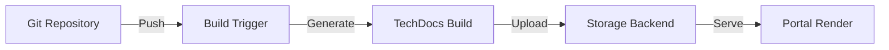

```
RFC-DEVELOPER-PLATFORM-0001                                       Section 7
Category: Standards Track                                        TechDocs
```

# 7. TechDocs

[← Software Templates](./06-software-templates.md) | [Index](./00-index.md#table-of-contents) | [Next: Permission Model →](./08-permission-model.md)

---

## 7.1 Documentation-as-Code Model

### 7.1.1 Philosophy

Per Invariant 8, documentation MUST be co-located with code. TechDocs implements this philosophy by:

| Principle | Implementation |
|-----------|----------------|
| Docs live with code | Documentation in same repository as source |
| Version together | Docs and code share git history |
| Review together | Documentation changes in code PRs |
| Build together | Docs rendered as part of CI |

### 7.1.2 Benefits

| Benefit | Description |
|---------|-------------|
| Currency | Documentation updated with code changes |
| Accountability | Same team owns code and docs |
| Discoverability | Docs visible in developer workflow |
| Review | Documentation changes receive peer review |

### 7.1.3 Invariant Alignment

| Requirement | Enforcement |
|-------------|-------------|
| Co-location | TechDocs requires docs in repo |
| Single source | No external wiki duplication |
| Ownership | Docs inherit component ownership |

---

## 7.2 MkDocs Integration

### 7.2.1 MkDocs Overview

TechDocs renders documentation using MkDocs, a static site generator:

| Aspect | Description |
|--------|-------------|
| Source format | Markdown files |
| Configuration | mkdocs.yml in repository root |
| Theme | Material for MkDocs |
| Output | Static HTML |

### 7.2.2 Documentation Structure

| File | Purpose |
|------|---------|
| mkdocs.yml | MkDocs configuration |
| docs/index.md | Documentation home page |
| docs/**/*.md | Documentation content |
| docs/assets/ | Images, diagrams |

### 7.2.3 Build Process



### 7.2.4 Build Strategies

| Strategy | Description | Use Case |
|----------|-------------|----------|
| Local build | Build in CI, upload artifacts | Most common |
| Recommended build | Build on-demand in Backstage | Development |
| External build | Pre-built in external system | Complex builds |

---

## 7.3 Search Integration

### 7.3.1 Search Capabilities

TechDocs content is indexed for search:

| Capability | Description |
|------------|-------------|
| Full-text search | Search across all documentation |
| Faceted search | Filter by component, owner, type |
| Relevance ranking | Results ordered by relevance |
| Snippet preview | Show matching text context |

### 7.3.2 Index Updates

| Trigger | Description |
|---------|-------------|
| Build completion | Index updated after doc build |
| Scheduled | Periodic full re-index |
| Manual | Force re-index via admin |

---

## 7.4 Catalog Integration

### 7.4.1 Entity Documentation

Each catalog entity MAY have associated documentation:

| Entity Type | Documentation Purpose |
|-------------|----------------------|
| Component | API docs, runbooks, architecture |
| System | System overview, integration guides |
| Domain | Domain model, business context |

### 7.4.2 Documentation Discovery

Documentation is discovered through entity annotations:

| Annotation | Purpose |
|------------|---------|
| backstage.io/techdocs-ref | Location of docs source |
| backstage.io/techdocs-entity | Override entity reference |

### 7.4.3 Documentation View

The catalog provides integrated documentation viewing:

| Feature | Description |
|---------|-------------|
| Inline rendering | Docs displayed within entity page |
| Navigation | Doc navigation alongside catalog nav |
| Links | Cross-links to related entities |

---

## 7.5 Documentation Standards

### 7.5.1 Required Sections

Component documentation SHOULD include:

| Section | Content |
|---------|---------|
| Overview | What the component does |
| Getting Started | How to use the component |
| API Reference | API documentation (if applicable) |
| Operations | Runbooks, monitoring, alerts |
| Architecture | Design decisions, diagrams |

### 7.5.2 Documentation Quality

| Aspect | Guideline |
|--------|-----------|
| Currency | Updated within release cycle |
| Completeness | All required sections present |
| Accuracy | Reflects current behavior |
| Accessibility | Clear, well-organized content |

### 7.5.3 Automation Support

| Automation | Description |
|------------|-------------|
| API spec inclusion | Auto-generate from OpenAPI |
| Diagram generation | Mermaid diagrams rendered |
| Link validation | Broken link detection |

---

## 7.6 External Documentation

### 7.6.1 Permitted External Docs

While Invariant 8 requires co-location, certain documentation MAY be external:

| External Doc Type | Rationale |
|-------------------|-----------|
| Vendor documentation | Maintained by vendor |
| Standards references | Industry standards |
| Legal documents | Compliance requirements |

### 7.6.2 External Link Management

| Approach | Description |
|----------|-------------|
| Linkerd | Track external doc links |
| Validation | Periodic link checking |
| Archive | Archive critical external docs |

---

## Document Navigation

| Previous | Index | Next |
|----------|-------|------|
| [← 6. Software Templates](./06-software-templates.md) | [Table of Contents](./00-index.md#table-of-contents) | [8. Permission Model →](./08-permission-model.md) |

---

*End of Section 7 — RFC-DEVELOPER-PLATFORM-0001*
