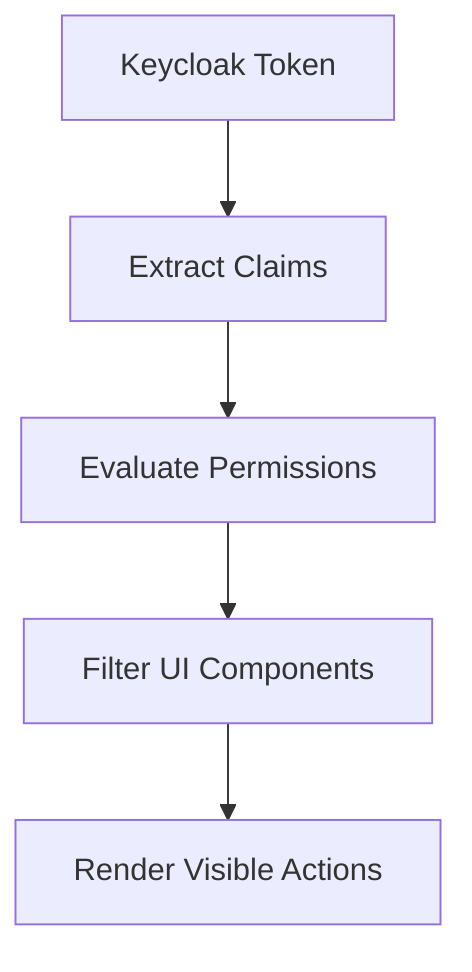
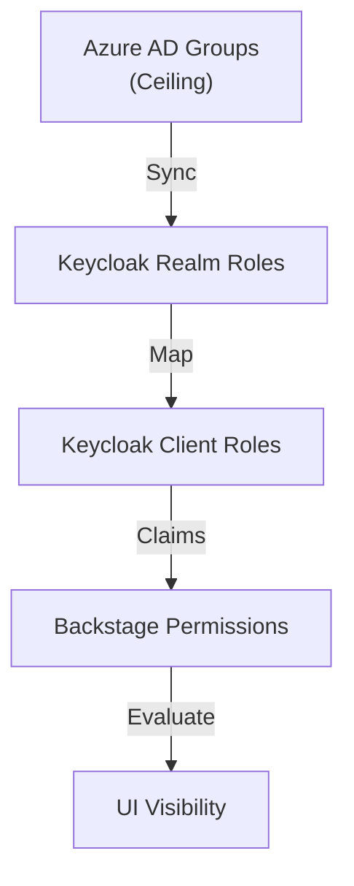
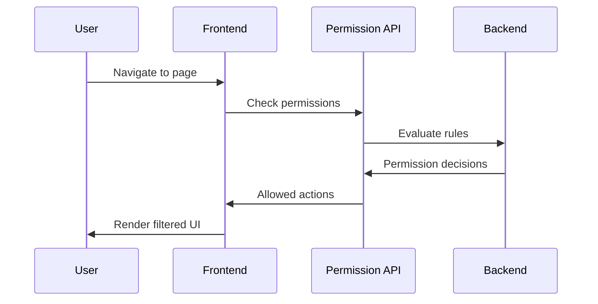

```
RFC-DEVELOPER-PLATFORM-0001                                       Section 8
Category: Standards Track                               Permission Model
```

# 8. Permission Model

[← TechDocs](./07-techdocs.md) | [Index](./00-index.md#table-of-contents) | [Next: Database Provisioning →](./09-database-provisioning.md)

---

## 8.1 Capability-Based Authorization

### 8.1.1 Core Principle

Per Invariant 2, the portal MUST use capability-based UI rendering. Users see only actions they are permitted to perform:

| Traditional Model | Capability-Based Model |
|-------------------|------------------------|
| Show all options | Show permitted options only |
| Block on attempt | Never show unauthorized |
| "Access Denied" errors | No error scenarios |
| Runtime authorization | Compile-time visibility |

### 8.1.2 Design Rationale

| Benefit | Description |
|---------|-------------|
| Simplified UX | Users not confused by unavailable options |
| Reduced errors | No permission-denied scenarios |
| Security enforcement | Authorization through visibility |
| Clear capabilities | Users understand what they can do |

### 8.1.3 Implementation Approach



---

## 8.2 Keycloak Token Integration

### 8.2.1 Token Claims

Per Invariant 3, permission decisions MUST derive from Keycloak token claims:

| Claim | Purpose | Source |
|-------|---------|--------|
| groups | Azure AD group memberships | Azure AD sync |
| realm_access.roles | Keycloak realm roles | Keycloak assignment |
| resource_access.{client}.roles | Client-specific roles | Keycloak assignment |
| teams | Custom team attribute | Custom mapper |

### 8.2.2 Claim Hierarchy



### 8.2.3 Keycloak Client Configuration

The developer portal Keycloak client requires specific configuration:

| Setting | Value |
|---------|-------|
| Client ID | developer-portal |
| Access Type | Confidential |
| Protocol | openid-connect |
| Required Claims | groups, email, preferred_username |

---

## 8.3 Permission Rules

### 8.3.1 Permission Types

| Permission Type | Description | Example |
|-----------------|-------------|---------|
| Resource permission | Action on catalog entity | catalog.entity.read |
| Action permission | Execute scaffolder action | scaffolder.template.execute |
| Feature permission | Access to feature | jit-access.request |

### 8.3.2 Permission Conditions

Permissions MAY include conditions:

| Condition Type | Description |
|----------------|-------------|
| Ownership | User's team owns the entity |
| Team membership | User belongs to required team |
| Environment | Limited to specific environments |
| Role | User has specific role |

### 8.3.3 Permission Rules

| Permission | Condition | Effect |
|------------|-----------|--------|
| catalog.entity.read | Authenticated | All users can read catalog |
| catalog.entity.write | Ownership | Only owners can modify |
| scaffolder.template.execute | Template ACL | Per-template permissions |
| jit-access.request | Authenticated | All users can request |
| jit-access.approve | Approver role | Only approvers can approve |

---

## 8.4 UI Filtering Pattern

### 8.4.1 Component Filtering

UI components filter based on permissions:

| Component Type | Filtering |
|----------------|-----------|
| Navigation items | Hide inaccessible routes |
| Action buttons | Hide unauthorized actions |
| Menu items | Show permitted options only |
| Entity views | Filter by read permission |

### 8.4.2 Filter Flow



### 8.4.3 Caching

Permission decisions MAY be cached:

| Aspect | Configuration |
|--------|---------------|
| Cache duration | Token lifetime |
| Cache invalidation | On token refresh |
| Cache scope | Per-user, per-resource |

---

## 8.5 Permission Framework Integration

### 8.5.1 Backstage Permission Framework

Backstage provides a permission framework for:

| Capability | Description |
|------------|-------------|
| Permission definition | Declare required permissions |
| Policy evaluation | Evaluate permission rules |
| Condition handling | Apply contextual conditions |
| Integration hooks | Plugin permission integration |

### 8.5.2 Plugin Requirements

Per Invariant 14, plugins MUST integrate with the permission framework:

| Requirement | Description |
|-------------|-------------|
| Declare permissions | Plugins list required permissions |
| Respect decisions | Plugins honor permission denials |
| No bypass | Plugins cannot circumvent framework |

### 8.5.3 Custom Permission Rules

Organizations MAY define custom permission rules:

| Rule Type | Purpose |
|-----------|---------|
| Team-based | Permissions based on team membership |
| Environment-based | Permissions vary by environment |
| Time-based | Time-limited permissions |

---

## 8.6 Authorization Ceiling

### 8.6.1 RFC-IAM-0001 Integration

Per RFC-IAM-0001 Invariant 1, Azure AD and Keycloak operate as a conjunctive gate:

| Azure AD | Keycloak | Result |
|----------|----------|--------|
| Allow | Allow | Allow |
| Allow | Deny | Deny |
| Deny | Allow | Deny |
| Deny | Deny | Deny |

### 8.6.2 Ceiling Enforcement

The portal MUST NOT grant permissions exceeding the Azure AD ceiling:

| Scenario | Outcome |
|----------|---------|
| User removed from Azure AD group | Permissions revoked in portal |
| Keycloak role assigned without Azure AD group | Permission denied |
| Azure AD group added | Keycloak role enables access |

### 8.6.3 Synchronization

| Aspect | Mechanism |
|--------|-----------|
| Group sync | Keycloak syncs Azure AD groups |
| Sync interval | Configurable, per RFC-IAM-0001 |
| Revocation | Access removed within sync interval |

---

## Document Navigation

| Previous | Index | Next |
|----------|-------|------|
| [← 7. TechDocs](./07-techdocs.md) | [Table of Contents](./00-index.md#table-of-contents) | [9. Database Provisioning →](./09-database-provisioning.md) |

---

*End of Section 8 — RFC-DEVELOPER-PLATFORM-0001*
