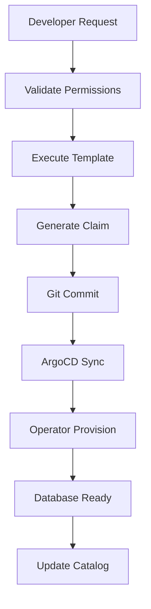
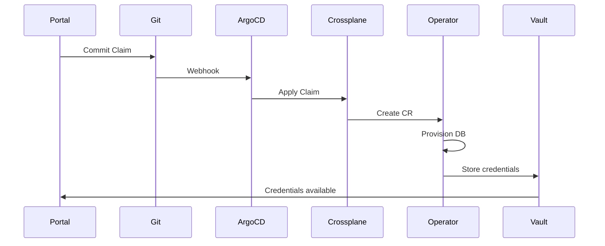

```
RFC-DEVELOPER-PLATFORM-0001                                       Section 9
Category: Standards Track                          Database Provisioning
```

# 9. Database Provisioning

[← Permission Model](./08-permission-model.md) | [Index](./00-index.md#table-of-contents) | [Next: Access Management →](./10-access-management.md)

---

## 9.1 Supported Databases

### 9.1.1 Database Types

The platform supports self-service provisioning of the following databases:

| Database | Use Cases | Operator |
|----------|-----------|----------|
| PostgreSQL | Relational data, ACID transactions | CloudNativePG, Zalando, StackGres |
| MongoDB | Document storage, flexible schemas | Percona Everest |
| ClickHouse | Analytics, time-series, OLAP | ClickHouse Operator |
| Redis | Caching, session storage | Redis Operator |

### 9.1.2 Feature Matrix

| Feature | PostgreSQL | MongoDB | ClickHouse | Redis |
|---------|------------|---------|------------|-------|
| HA configuration | Yes | Yes | Yes | Yes |
| Automated backup | Yes | Yes | Yes | Yes |
| Point-in-time recovery | Yes | Yes | Limited | No |
| Connection pooling | Yes | Yes | No | No |
| Read replicas | Yes | Yes | Yes | Yes |

### 9.1.3 Resource Types

Each database type creates catalog Resource entities:

| Catalog Type | Description |
|--------------|-------------|
| database | Database instance |
| database-cluster | Multi-node cluster |
| database-replica | Read replica |

---

## 9.2 Environment Tiers

### 9.2.1 Tier Definitions

| Tier | Purpose | Characteristics |
|------|---------|-----------------|
| Development | Feature development, testing | Single replica, minimal resources |
| Staging | Pre-production validation | Production-like, reduced resources |
| Production | Live workloads | Full HA, production resources |

### 9.2.2 Tier Configurations

| Configuration | Development | Staging | Production |
|---------------|-------------|---------|------------|
| Replicas | 1 | 2 | 3+ |
| Backup frequency | Daily | Daily | Continuous |
| Resource limits | Low | Medium | As required |
| Self-service | Full | Full | Approval required |

### 9.2.3 Tier Selection

| Selection Criteria | Tier |
|--------------------|------|
| Feature branch testing | Development |
| Integration testing | Staging |
| Production workload | Production |

---

## 9.3 Provisioning Workflow

### 9.3.1 Workflow Overview



### 9.3.2 Workflow Steps

| Step | Action | Actor |
|------|--------|-------|
| Request | Developer selects database template | Developer |
| Validate | Check permissions, quotas | Portal |
| Template | Execute scaffolder template | Portal |
| Generate | Create Crossplane claim YAML | Scaffolder |
| Commit | Commit to GitOps repository | Scaffolder |
| Sync | ArgoCD syncs resources | ArgoCD |
| Provision | Database operator provisions | Operator |
| Ready | Database available | Operator |
| Catalog | Update resource entity | Discovery |

### 9.3.3 Approval Workflow

Per Invariant 6, production databases require approval:

| Environment | Approval Required |
|-------------|-------------------|
| Development | No |
| Staging | No |
| Production | Yes |

---

## 9.4 Crossplane Integration

### 9.4.1 Claim Pattern

Database provisioning uses Crossplane claims:

| Component | Purpose |
|-----------|---------|
| XRD | Composite resource definition |
| Composition | Resource composition logic |
| Claim | Developer request interface |
| XR | Composed resources |

### 9.4.2 Claim Structure

Claims include the following parameters:

| Parameter | Description | Required |
|-----------|-------------|----------|
| name | Database name | Yes |
| environment | dev, staging, prod | Yes |
| size | Resource tier | Yes |
| storage | Storage allocation | Yes |
| replicas | Number of replicas | Environment-dependent |
| backup | Backup configuration | Environment-dependent |

### 9.4.3 Provisioning Flow



---

## 9.5 Credential Management

### 9.5.1 Credential Flow

Per Invariant 9, database credentials MUST be short-lived:

| Credential Type | Source | Lifetime |
|-----------------|--------|----------|
| Admin credentials | Vault dynamic secrets | Short-lived |
| Application credentials | Vault dynamic secrets | Application rotation policy |
| Developer access | Teleport + Vault | Session-based |

### 9.5.2 Vault Integration

| Integration | Purpose |
|-------------|---------|
| Dynamic secrets | Generate credentials on demand |
| Rotation | Automated credential rotation |
| Audit | Credential access logging |

### 9.5.3 Connection Information

Connection details are available through:

| Method | Use Case |
|--------|----------|
| Portal display | Developer access (via Teleport) |
| ExternalSecret | Application access |
| Vault path | Programmatic access |

---

## 9.6 Database Operations

### 9.6.1 Available Operations

| Operation | Self-Service | Description |
|-----------|--------------|-------------|
| View status | Full | Database health, metrics |
| View backups | Full | Backup history, schedule |
| Restore (dev) | Full | Restore from backup |
| Restore (prod) | Approval | Per Invariant 11 |
| Scale | Approval (prod) | Modify resources |
| Delete (dev) | Full | Remove database |
| Delete (prod) | Approval | Remove database |

### 9.6.2 Backup Management

| Capability | Description |
|------------|-------------|
| View schedule | See backup frequency |
| View history | List available backups |
| View status | Last backup success/failure |

### 9.6.3 Monitoring Integration

| Metric Type | Source |
|-------------|--------|
| Connection count | Operator metrics |
| Query performance | Database metrics |
| Storage usage | PVC metrics |
| Replication lag | Operator metrics |

---

## 9.7 Database Access

### 9.7.1 Access Methods

| Method | Description |
|--------|-------------|
| Teleport | JIT access with session recording |
| Direct connection | Short-lived credentials |
| Web console | PgAdmin, Mongo Express |

### 9.7.2 Access Workflow

Access to databases follows the JIT model defined in Section 10:

| Step | Action |
|------|--------|
| Request | Developer requests access |
| Approval | If required, approval workflow |
| Credential | Teleport/Vault issues credential |
| Access | Developer connects |
| Recording | Session recorded |
| Expiry | Credential expires |

---

## Document Navigation

| Previous | Index | Next |
|----------|-------|------|
| [← 8. Permission Model](./08-permission-model.md) | [Table of Contents](./00-index.md#table-of-contents) | [10. Access Management →](./10-access-management.md) |

---

*End of Section 9 — RFC-DEVELOPER-PLATFORM-0001*
