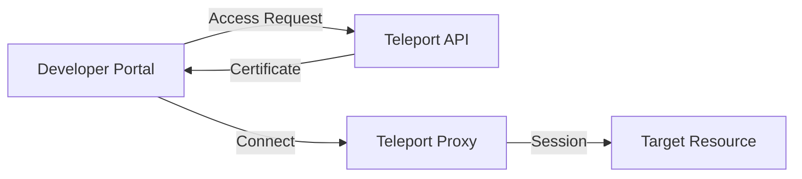
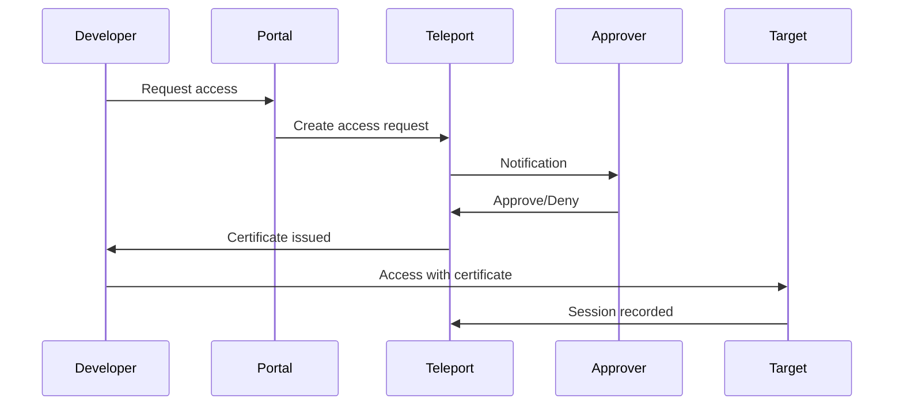
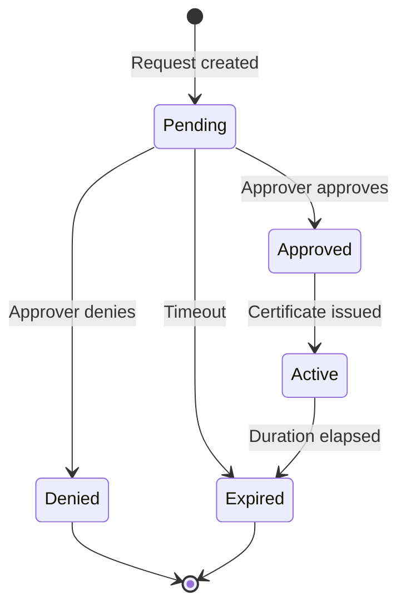

```
RFC-DEVELOPER-PLATFORM-0001                                      Section 10
Category: Standards Track                             Access Management
```

# 10. Access Management

[← Database Provisioning](./09-database-provisioning.md) | [Index](./00-index.md#table-of-contents) | [Next: Tool Library →](./11-tool-library.md)

---

## 10.1 JIT Access Model

### 10.1.1 Overview

Just-In-Time (JIT) access provides time-limited, audited access to sensitive resources. The portal integrates with RFC-PAM-0001 (Teleport) to provide self-service access requests.

| Principle | Description |
|-----------|-------------|
| Time-bounded | Access expires after defined period |
| Audited | All access session-recorded |
| Approval-based | Sensitive access requires approval |
| Least privilege | Minimum necessary access granted |

### 10.1.2 Access Types

| Access Type | Target | Credential |
|-------------|--------|------------|
| Database access | PostgreSQL, MongoDB, ClickHouse | Short-lived credentials |
| SSH access | Servers, nodes | Teleport certificates |
| Kubernetes exec | Pod shells | Teleport proxy |
| Port forwarding | Service ports | Teleport tunnel |

### 10.1.3 Invariant Alignment

Per Invariant 13, all privileged access MUST be session-recorded.

| Requirement | Enforcement |
|-------------|-------------|
| Session recording | Teleport records all sessions |
| Audit trail | All access requests logged |
| Time limits | Credentials expire automatically |

---

## 10.2 Teleport Integration

### 10.2.1 Integration Architecture



### 10.2.2 Teleport Capabilities

| Capability | Description |
|------------|-------------|
| Access requests | Self-service access request workflow |
| Certificate issuance | Short-lived certificates |
| Session recording | Full session capture |
| RBAC | Role-based access control |

### 10.2.3 Integration Points

| Integration | Mechanism |
|-------------|-----------|
| Authentication | Keycloak OIDC (per RFC-IAM-0001) |
| Access requests | Teleport Access Request API |
| Session links | Deep links to recordings |
| Status display | Request status in portal |

---

## 10.3 Access Request Workflow

### 10.3.1 Workflow Overview



### 10.3.2 Request Parameters

| Parameter | Description |
|-----------|-------------|
| Resource | Target system (database, server, pod) |
| Access type | Read-only, read-write, admin |
| Duration | Requested access duration |
| Justification | Reason for access |

### 10.3.3 Approval Flow

| Access Type | Approval Required |
|-------------|-------------------|
| Development databases | No |
| Staging databases | No |
| Production databases | Yes |
| Server SSH | Yes |
| Kubernetes exec | Yes |

### 10.3.4 Request States



---

## 10.4 Session Recording

### 10.4.1 Recording Scope

Per RFC-PAM-0001, all privileged sessions MUST be recorded:

| Session Type | Recording |
|--------------|-----------|
| Database queries | Query log |
| SSH sessions | Terminal recording |
| Kubernetes exec | Command log |

### 10.4.2 Recording Access

| Role | Access |
|------|--------|
| Session owner | View own recordings |
| Security team | View all recordings |
| Compliance | Export for audit |

### 10.4.3 Portal Integration

The portal provides:

| Feature | Description |
|---------|-------------|
| Session history | List of past sessions |
| Recording links | Deep links to playback |
| Audit view | Access request history |

---

## 10.5 Access Request UI

### 10.5.1 Request Form

The portal provides a streamlined access request interface:

| Field | Input Type |
|-------|------------|
| Resource | Entity picker from catalog |
| Access type | Select (read, write, admin) |
| Duration | Time selector |
| Justification | Text area |

### 10.5.2 Request Status

Users can view their request status:

| Status | Description |
|--------|-------------|
| Pending | Awaiting approval |
| Approved | Certificate available |
| Denied | Request rejected |
| Active | Currently in session |
| Expired | Access period ended |

### 10.5.3 Context-Aware Access

When viewing a catalog entity, the portal shows:

| Context | Feature |
|---------|---------|
| Database entity | "Request Access" button |
| Access history | Past access to this resource |
| Active sessions | Current sessions for resource |

---

## 10.6 Credential Delivery

### 10.6.1 Delivery Methods

| Method | Use Case |
|--------|----------|
| Certificate | SSH, Kubernetes access |
| Dynamic credentials | Database access |
| Connection string | Direct display (short-lived) |

### 10.6.2 Credential Lifetime

| Access Type | Default Duration | Maximum |
|-------------|------------------|---------|
| Database (dev) | 1 hour | 8 hours |
| Database (prod) | 30 minutes | 2 hours |
| SSH | 8 hours | 24 hours |
| Kubernetes exec | 1 hour | 4 hours |

### 10.6.3 Credential Revocation

| Trigger | Action |
|---------|--------|
| Duration expiry | Automatic revocation |
| Manual revocation | Admin-initiated |
| Security incident | Emergency revocation |

---

## Document Navigation

| Previous | Index | Next |
|----------|-------|------|
| [← 9. Database Provisioning](./09-database-provisioning.md) | [Table of Contents](./00-index.md#table-of-contents) | [11. Tool Library →](./11-tool-library.md) |

---

*End of Section 10 — RFC-DEVELOPER-PLATFORM-0001*
