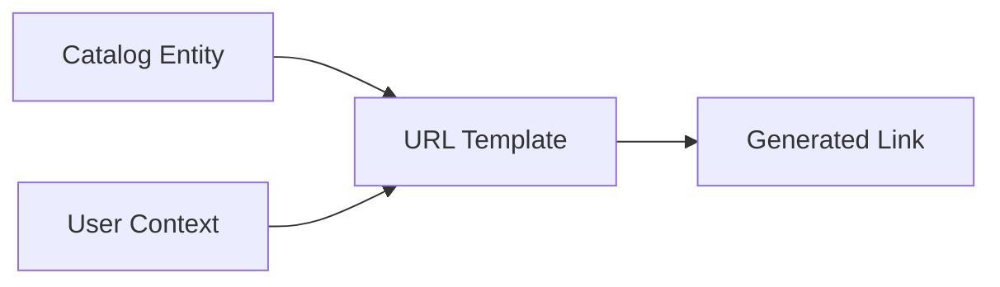
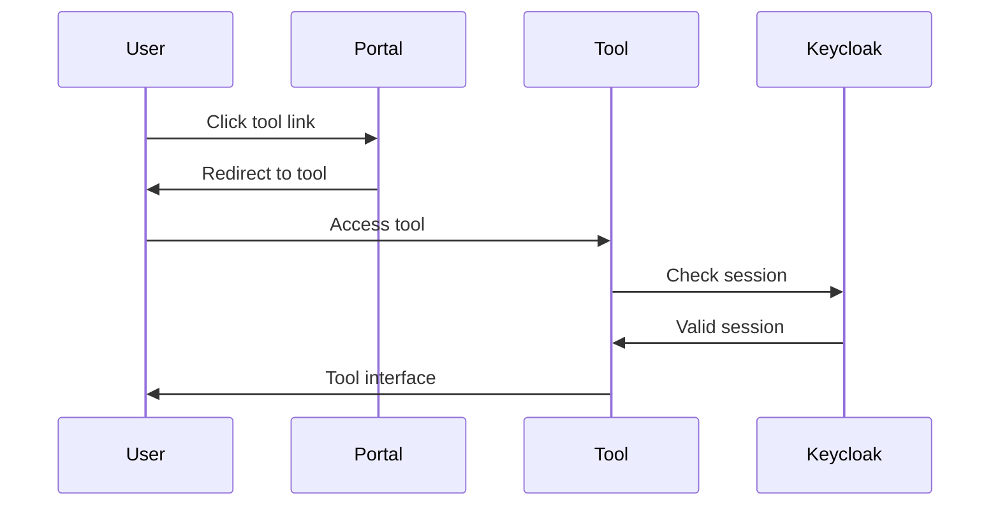

```
RFC-DEVELOPER-PLATFORM-0001                                      Section 11
Category: Standards Track                                   Tool Library
```

# 11. Tool Library

[← Access Management](./10-access-management.md) | [Index](./00-index.md#table-of-contents) | [Next: Event Streaming →](./12-event-streaming.md)

---

## 11.1 Permission-Aware Directory

### 11.1.1 Overview

The Tool Library provides a centralized directory of platform tools. Per Invariant 10, tool links MUST respect user authorization boundaries—users see only tools and resources they can access.

| Principle | Implementation |
|-----------|----------------|
| Filtered visibility | Tools filtered by permission |
| Context-aware | Links scoped to current entity |
| SSO-enabled | Single sign-on to all tools |
| Deep linking | Direct navigation to resources |

### 11.1.2 Tool Categories

| Category | Tools |
|----------|-------|
| GitOps | ArgoCD, Kargo |
| CI/CD | Tekton Dashboard |
| Monitoring | Grafana, Prometheus, Alertmanager |
| Logging | Grafana (Loki) |
| Tracing | Grafana (Tempo), SigNoz |
| Databases | PgAdmin, Percona Everest |
| Event Streaming | Kafka UI, Apicurio Registry |
| Registry | Harbor, Verdaccio |
| Security | Vault, Teleport |
| Storage | Ceph Dashboard |
| Cost | Kubecost |
| Uptime | Uptime Kuma, OneUptime |
| Workflows | Temporal |

### 11.1.3 Visibility Rules

| Tool | Visibility Condition |
|------|---------------------|
| ArgoCD | User has namespace access |
| Grafana | User owns service or has monitoring role |
| PgAdmin | User has database access |
| Kafka UI | User has namespace/topic access |
| Harbor | User has project membership |
| Vault | User has secrets management role |
| Teleport | User has role-based access |
| Kargo | User has project membership |
| Ceph | User has storage admin role |

---

## 11.2 Deep Linking Pattern

### 11.2.1 URL Templates

Tools support deep linking to specific resources:

| Tool | URL Pattern | Parameters |
|------|-------------|------------|
| ArgoCD | `/applications/{namespace}/{app}` | namespace, app name |
| Grafana | `/d/{uid}?var-namespace={ns}` | dashboard uid, namespace |
| PgAdmin | `/browser/#/server/{id}/database/{db}` | server id, database |
| Kafka UI | `/ui/clusters/{cluster}/topics/{topic}` | cluster, topic |
| Harbor | `/harbor/projects/{project}/repositories/{repo}` | project, repository |
| Vault | `/ui/vault/secrets/{path}` | secret path |
| Teleport | `/web/cluster/{cluster}/nodes` | cluster name |
| Kargo | `/project/{project}/stage/{stage}` | project, stage |
| Temporal | `/namespaces/{ns}/workflows` | namespace |
| Kubecost | `/allocation?namespace={ns}` | namespace |

### 11.2.2 Parameter Resolution

Deep link parameters are resolved from:

| Source | Parameters |
|--------|------------|
| Current catalog entity | Namespace, name, owner |
| Entity annotations | Custom annotations |
| User context | User identity, groups |

### 11.2.3 Link Generation



---

## 11.3 SSO Integration

### 11.3.1 Authentication Flow

All platform tools authenticate through Keycloak per RFC-IAM-0001:



### 11.3.2 Session Sharing

| Aspect | Behavior |
|--------|----------|
| SSO session | Shared across all tools |
| Session lifetime | Per Keycloak configuration |
| Re-authentication | Not required within session |

### 11.3.3 Tool Authorization

Each tool enforces its own authorization based on Keycloak claims:

| Tool | Authorization Source |
|------|---------------------|
| ArgoCD | RBAC from Keycloak groups |
| Grafana | Org roles from Keycloak |
| Harbor | Project roles from Keycloak |
| Vault | Policies from Keycloak identity |

---

## 11.4 Context-Aware Navigation

### 11.4.1 Entity Context

When viewing a catalog entity, the Tool Library shows relevant tools:

| Entity Type | Relevant Tools |
|-------------|----------------|
| Component | ArgoCD, Grafana, logs, traces |
| Database | PgAdmin, metrics, backups |
| Kafka topic | Kafka UI, schema registry |
| System | All component tools |

### 11.4.2 Tool Card Display

Each tool displays contextual information:

| Information | Description |
|-------------|-------------|
| Tool name | Display name |
| Description | Brief tool description |
| Status | Online/offline indicator |
| Deep link | Context-aware URL |

### 11.4.3 Contextual Actions

| Context | Available Actions |
|---------|-------------------|
| Service entity | View deployment, metrics, logs |
| Database entity | Connect, view backups, metrics |
| Kafka topic | View messages, schema, lag |

---

## 11.5 Tool Library Management

### 11.5.1 Tool Registration

Tools are registered in the Tool Library configuration:

| Registration Data | Description |
|-------------------|-------------|
| Tool ID | Unique identifier |
| Display name | User-visible name |
| Category | Tool category |
| URL template | Deep link pattern |
| Icon | Tool icon |
| Permission check | Visibility condition |

### 11.5.2 Tool Health

The Tool Library monitors tool availability:

| Status | Description |
|--------|-------------|
| Online | Tool accessible |
| Degraded | Tool partially available |
| Offline | Tool unavailable |

### 11.5.3 Extensibility

New tools can be added to the library:

| Step | Action |
|------|--------|
| Register | Add tool to configuration |
| Configure | Set URL template, permissions |
| Integrate | SSO integration with Keycloak |
| Test | Verify deep linking |

---

## 11.6 Tool Library Views

### 11.6.1 All Tools View

Overview of all available tools:

| Feature | Description |
|---------|-------------|
| Category grouping | Tools grouped by category |
| Search | Search by name |
| Filter | Filter by category |
| Quick access | Frequently used tools |

### 11.6.2 Entity Tools View

Tools relevant to current entity:

| Feature | Description |
|---------|-------------|
| Contextual | Only relevant tools shown |
| Deep linked | Links include entity context |
| Actions | Quick actions for common tasks |

### 11.6.3 Favorites

Users can mark frequently used tools:

| Feature | Description |
|---------|-------------|
| Personal favorites | Per-user favorites list |
| Quick access | Favorites in navigation |

---

## Document Navigation

| Previous | Index | Next |
|----------|-------|------|
| [← 10. Access Management](./10-access-management.md) | [Table of Contents](./00-index.md#table-of-contents) | [12. Event Streaming →](./12-event-streaming.md) |

---

*End of Section 11 — RFC-DEVELOPER-PLATFORM-0001*
