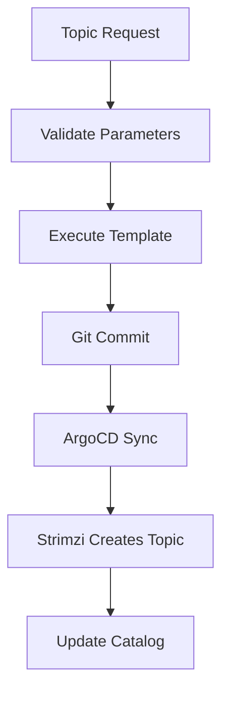
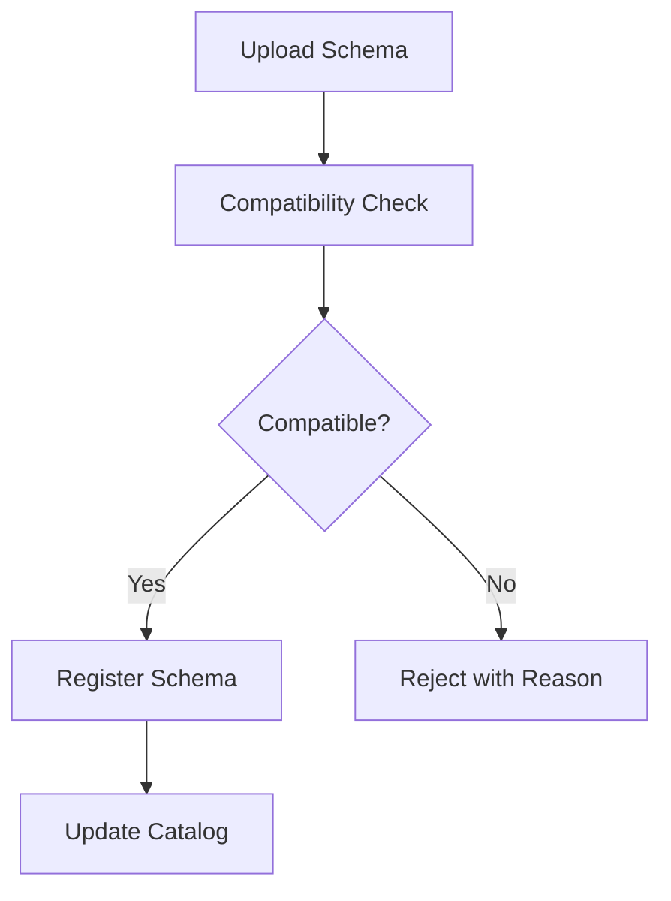
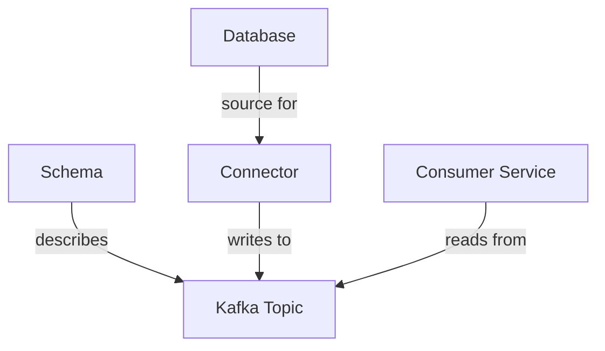

```
RFC-DEVELOPER-PLATFORM-0001                                      Section 12
Category: Standards Track                               Event Streaming
```

# 12. Event Streaming

[← Tool Library](./11-tool-library.md) | [Index](./00-index.md#table-of-contents) | [Next: Platform Integrations →](./13-platform-integrations.md)

---

## 12.1 Kafka Topic Management

### 12.1.1 Overview

The portal provides self-service management of Kafka topics, enabling developers to create and manage event streaming infrastructure.

| Capability | Description |
|------------|-------------|
| Create topics | Self-service topic creation |
| View topics | List team-owned topics |
| Modify topics | Update retention, partitions |
| View metrics | Consumer lag, throughput |

### 12.1.2 Topic Creation Workflow



### 12.1.3 Topic Parameters

| Parameter | Description | Default |
|-----------|-------------|---------|
| Name | Topic name (with prefix) | Required |
| Partitions | Number of partitions | 3 |
| Replication factor | Replica count | 3 |
| Retention | Message retention | 7 days |
| Cleanup policy | delete or compact | delete |

### 12.1.4 Topic Operations

| Operation | Self-Service | Notes |
|-----------|--------------|-------|
| Create | Full | Within namespace |
| View | Full | Owned topics |
| Add partitions | Full | Append only |
| Modify retention | Full | Within limits |
| Delete | Approval | Confirmation required |

---

## 12.2 Schema Registry Integration

### 12.2.1 Overview

The portal integrates with Apicurio Registry for schema management. Per Invariant 12, schema changes MUST pass compatibility validation.

| Capability | Description |
|------------|-------------|
| Register schemas | Upload new schema versions |
| View schemas | Browse schema artifacts |
| Validate compatibility | Check against existing schemas |
| View history | Schema version history |

### 12.2.2 Supported Formats

| Format | Description |
|--------|-------------|
| Avro | Apache Avro schemas |
| JSON Schema | JSON Schema definitions |
| Protobuf | Protocol Buffers |
| CloudEvents | CloudEvents JSON schema |

### 12.2.3 Compatibility Modes

| Mode | Description |
|------|-------------|
| BACKWARD | New schema can read old data |
| FORWARD | Old schema can read new data |
| FULL | Both backward and forward |
| NONE | No compatibility check |

### 12.2.4 Schema Workflow



### 12.2.5 Compatibility Enforcement

Per Invariant 12:

| Scenario | Outcome |
|----------|---------|
| Compatible change | Registered automatically |
| Incompatible change | Rejected by default |
| Override request | Requires approval |

---

## 12.3 Connector Management

### 12.3.1 Overview

Kafka Connect connectors enable integration with external systems. The portal provides visibility and limited management of connectors.

| Capability | Self-Service Level |
|------------|--------------------|
| View connectors | Full |
| View status | Full |
| Pause/Resume | Full (owned) |
| Create connector | Approval |
| Delete connector | Approval |

### 12.3.2 Connector Types

| Type | Direction | Examples |
|------|-----------|----------|
| Source | External → Kafka | Debezium, JDBC Source |
| Sink | Kafka → External | Elasticsearch, S3 |

### 12.3.3 Connector Status

| Status | Description |
|--------|-------------|
| Running | Connector operational |
| Paused | Connector paused |
| Failed | Connector in error state |
| Unassigned | Connector not scheduled |

### 12.3.4 Connector Operations

| Operation | Self-Service | Notes |
|-----------|--------------|-------|
| View status | Full | All visible connectors |
| View tasks | Full | Task-level status |
| Pause | Full | Owned connectors |
| Resume | Full | Owned connectors |
| Restart task | Full | Owned connectors |
| Update config | Approval | Configuration changes |
| Delete | Approval | Requires approval |

---

## 12.4 CDC Pipeline Workflows

### 12.4.1 Overview

Change Data Capture (CDC) pipelines capture database changes and stream them to Kafka. The portal provides workflows for common CDC scenarios.

| Capability | Description |
|------------|-------------|
| CDC setup | Configure Debezium source |
| View pipelines | List CDC pipelines |
| Monitor lag | Replication lag visibility |

### 12.4.2 CDC Setup Workflow

| Step | Action |
|------|--------|
| Select database | Choose source database from catalog |
| Configure capture | Tables, columns to capture |
| Generate connector | Create Debezium connector config |
| Approval | Security review for data access |
| Deploy | GitOps deployment |
| Monitor | Lag and throughput monitoring |

### 12.4.3 CDC Components

| Component | Purpose |
|-----------|---------|
| Debezium connector | Captures database changes |
| Kafka topic | Stores change events |
| Schema | Avro schema for changes |
| Consumer | Downstream processor |

---

## 12.5 Event Streaming Catalog

### 12.5.1 Resource Entities

Event streaming resources appear in the catalog:

| Entity Type | Description |
|-------------|-------------|
| Kafka topic | Topic resource |
| Schema | Schema artifact |
| Connector | Kafka Connect connector |
| CDC pipeline | Debezium pipeline |

### 12.5.2 Entity Relationships



### 12.5.3 Entity Metadata

| Metadata | Purpose |
|----------|---------|
| Owner | Responsible team |
| Cluster | Kafka cluster |
| Environment | dev, staging, prod |
| Schema | Associated schema |

---

## 12.6 Event Streaming Monitoring

### 12.6.1 Metrics

| Metric | Description |
|--------|-------------|
| Consumer lag | Messages behind |
| Throughput | Messages per second |
| Partition distribution | Message distribution |
| Connector tasks | Task status |

### 12.6.2 Monitoring Integration

| Integration | Purpose |
|-------------|---------|
| Grafana dashboards | Topic metrics visualization |
| Kafka UI link | Detailed topic inspection |
| Alerting | Consumer lag alerts |

---

## Document Navigation

| Previous | Index | Next |
|----------|-------|------|
| [← 11. Tool Library](./11-tool-library.md) | [Table of Contents](./00-index.md#table-of-contents) | [13. Platform Integrations →](./13-platform-integrations.md) |

---

*End of Section 12 — RFC-DEVELOPER-PLATFORM-0001*
