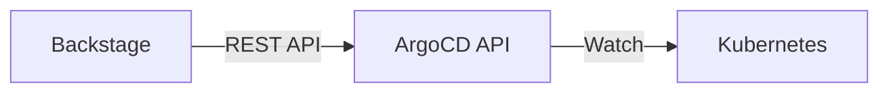
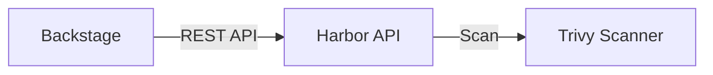

```
RFC-DEVELOPER-PLATFORM-0001                                      Section 13
Category: Standards Track                          Platform Integrations
```

# 13. Platform Integrations

[← Event Streaming](./12-event-streaming.md) | [Index](./00-index.md#table-of-contents) | [Next: Rationale →](./14-rationale.md)

---

## 13.1 Plugin Architecture

### 13.1.1 Overview

Backstage uses a plugin architecture where functionality is organized into discrete, composable plugins. The platform extends Backstage with integrations for platform-specific tools.

### 13.1.2 Plugin Types

| Type | Purpose | Examples |
|------|---------|----------|
| Frontend | UI components, pages | Catalog cards, custom pages |
| Backend | API services | Integration APIs |
| Scaffolder actions | Template extensions | Custom provisioning |
| Catalog providers | Entity discovery | Auto-discovery |

### 13.1.3 Plugin Sources

| Source | Description |
|--------|-------------|
| Core | Backstage core plugins |
| Community | Open source plugins |
| Custom | Platform-specific plugins |

### 13.1.4 Integration Requirements

Per Invariant 14 and Invariant 15, all plugins MUST:

| Requirement | Description |
|-------------|-------------|
| Permission integration | Use permission framework |
| Authentication chain | No independent auth |
| Error handling | Graceful degradation |

---

## 13.2 ArgoCD Integration

### 13.2.1 Integration Scope

| Capability | Description |
|------------|-------------|
| Application status | Sync status, health |
| Deployment history | Recent deployments |
| Quick actions | Sync, refresh |
| Deep links | Direct to ArgoCD |

### 13.2.2 Data Flow



### 13.2.3 Displayed Information

| Information | Source |
|-------------|--------|
| Sync status | ArgoCD API |
| Health status | ArgoCD API |
| Last sync time | ArgoCD API |
| Target revision | ArgoCD API |
| Live manifests | ArgoCD API |

### 13.2.4 Available Actions

| Action | Permission |
|--------|------------|
| View application | Read access |
| Sync application | Write access to namespace |
| Refresh | Write access to namespace |
| View history | Read access |

---

## 13.3 Grafana Integration

### 13.3.1 Integration Scope

| Capability | Description |
|------------|-------------|
| Dashboard links | Deep links to dashboards |
| Embedded panels | Inline metric display |
| Alert status | Alert state visibility |

### 13.3.2 Dashboard Linking

| Link Type | Pattern |
|-----------|---------|
| Service dashboard | `/d/{uid}?var-namespace={ns}&var-service={svc}` |
| Database dashboard | `/d/{uid}?var-instance={instance}` |
| Custom dashboard | Entity annotation-defined |

### 13.3.3 Embedding

| Embed Type | Use Case |
|------------|----------|
| Panel embed | Key metrics on entity page |
| Dashboard link | Full dashboard access |

### 13.3.4 Alert Integration

| Feature | Description |
|---------|-------------|
| Alert status | Show firing alerts |
| Alert links | Link to alert rules |
| Silence links | Link to silence creation |

---

## 13.4 Harbor Integration

### 13.4.1 Integration Scope

| Capability | Description |
|------------|-------------|
| Image status | Latest tags, push times |
| Vulnerability scan | Scan results summary |
| Deep links | Direct to Harbor project |

### 13.4.2 Data Flow



### 13.4.3 Displayed Information

| Information | Source |
|-------------|--------|
| Latest tags | Harbor API |
| Push time | Harbor API |
| Vulnerability summary | Harbor API |
| Image size | Harbor API |

### 13.4.4 Vulnerability Display

| Severity | Display |
|----------|---------|
| Critical | Red indicator |
| High | Orange indicator |
| Medium | Yellow indicator |
| Low | Gray indicator |

---

## 13.5 Crossplane Integration

### 13.5.1 Integration Scope

| Capability | Description |
|------------|-------------|
| Resource status | Claim and XR status |
| Provisioning state | Ready, synced conditions |
| Deep links | Kubernetes resource view |

### 13.5.2 Status Display

| Status | Description |
|--------|-------------|
| Ready | Resource provisioned |
| Syncing | Reconciliation in progress |
| Error | Provisioning failed |

### 13.5.3 Resource Types

| Type | Displayed |
|------|-----------|
| Claim | User-facing resource |
| XR | Composite resource |
| Managed | Provider resources |

---

## 13.6 Kubernetes Integration

### 13.6.1 Integration Scope

| Capability | Description |
|------------|-------------|
| Pod status | Running, pending, failed |
| Deployment status | Replicas, availability |
| Resource usage | CPU, memory |
| Logs | Pod log access |

### 13.6.2 Displayed Information

| Information | Source |
|-------------|--------|
| Pod count | Kubernetes API |
| Pod status | Kubernetes API |
| Resource requests | Kubernetes API |
| Events | Kubernetes API |

### 13.6.3 Available Actions

| Action | Permission |
|--------|------------|
| View pods | Namespace read |
| View logs | Namespace read |
| View events | Namespace read |

---

## 13.7 Kargo Integration

### 13.7.1 Integration Scope

| Capability | Description |
|------------|-------------|
| Stage status | Promotion pipeline status |
| Freight status | Artifact versions |
| Promotion actions | Promote between stages |

### 13.7.2 Displayed Information

| Information | Source |
|-------------|--------|
| Current stage | Kargo API |
| Available promotions | Kargo API |
| Freight history | Kargo API |

---

## 13.8 Temporal Integration

### 13.8.1 Integration Scope

| Capability | Description |
|------------|-------------|
| Namespace status | Workflow namespace health |
| Workflow visibility | Running workflows |
| Deep links | Temporal UI |

### 13.8.2 Displayed Information

| Information | Source |
|-------------|--------|
| Running workflows | Temporal API |
| Failed workflows | Temporal API |
| Namespace health | Temporal API |

---

## 13.9 Additional Integrations

### 13.9.1 Kubecost

| Capability | Description |
|------------|-------------|
| Cost visibility | Namespace cost allocation |
| Deep links | Kubecost dashboard |

### 13.9.2 Tekton

| Capability | Description |
|------------|-------------|
| Pipeline status | Recent pipeline runs |
| Deep links | Tekton Dashboard |

### 13.9.3 Vault

| Capability | Description |
|------------|-------------|
| Secret paths | Available secret paths |
| Deep links | Vault UI |

---

## Document Navigation

| Previous | Index | Next |
|----------|-------|------|
| [← 12. Event Streaming](./12-event-streaming.md) | [Table of Contents](./00-index.md#table-of-contents) | [14. Rationale →](./14-rationale.md) |

---

*End of Section 13 — RFC-DEVELOPER-PLATFORM-0001*
