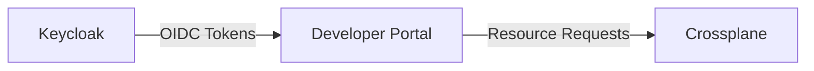

```
RFC-IAM-0001                                                  Section 4
Category: Standards Track                               Components
```

# 4. Components

[← Previous: Architecture](./03-architecture.md) | [Index](./00-index.md#table-of-contents) | [Next: Authorization Model →](./05-authorization-model.md)

---

## 4.1 Azure Active Directory

### 4.1.1 Role in Architecture

Azure Active Directory serves as the enterprise identity provider and the ultimate authority for user identity and organizational group membership. Within this architecture, Azure AD:

- Authenticates users through enterprise-grade mechanisms (password, MFA, conditional access)
- Maintains the authoritative record of organizational group memberships
- Provides identity assertions to Keycloak through OIDC federation
- Enforces enterprise security policies (conditional access, sign-in risk evaluation)

### 4.1.2 Responsibilities

| Responsibility | Description |
|----------------|-------------|
| Identity Authentication | Validate user credentials and enforce MFA policies |
| Group Management | Maintain group memberships that define organizational roles |
| Identity Lifecycle | Handle user provisioning, updates, and deprovisioning |
| Security Policy | Enforce conditional access and sign-in risk policies |
| OIDC Provider | Issue identity tokens to federated applications (Keycloak) |

### 4.1.3 Interfaces

**Outbound Interface: OIDC Identity Tokens**

Azure AD issues OIDC identity tokens to Keycloak containing:
- Subject identifier (unique user ID)
- Email and name claims
- Group membership claims (when configured)
- Token expiration and issuance timestamps

**Configuration Interface: App Registration**

Keycloak is registered as an application in Azure AD, enabling:
- Client ID and secret for authentication
- Redirect URI configuration
- Permission grants for user profile and group access
- Token configuration for included claims

### 4.1.4 Failure Modes

| Failure Mode | Impact | Mitigation |
|--------------|--------|------------|
| Azure AD unavailable | No new authentications possible | Keycloak session tokens remain valid until expiry |
| Group sync delay | Stale group memberships in Keycloak | Define acceptable sync interval; monitor sync health |
| Token validation failure | Authentication rejected | Verify JWKS endpoint accessibility; check clock sync |

## 4.2 Keycloak Identity Provider

### 4.2.1 Role in Architecture

Keycloak serves as the platform identity provider, positioned between Azure AD and platform applications. Keycloak:

- Federates with Azure AD to receive identity assertions
- Maps Azure AD groups to platform-specific roles
- Issues tokens to platform applications
- Provides OIDC/OAuth 2.0 endpoints for application integration
- Maintains client registrations for all platform applications

### 4.2.2 Responsibilities

| Responsibility | Description |
|----------------|-------------|
| Identity Brokering | Federate with Azure AD; relay identity to applications |
| Role Management | Define and manage platform roles |
| Group-to-Role Mapping | Map Azure AD groups to Keycloak roles (within ceiling constraints) |
| Token Issuance | Issue access tokens and refresh tokens to applications |
| Client Management | Maintain client registrations for platform applications |
| Session Management | Manage user sessions; enforce session policies |

### 4.2.3 Interfaces

**Inbound Interface: Azure AD Federation**

Keycloak consumes Azure AD identity through:
- OIDC authorization code flow for user authentication
- Group claims included in Azure AD tokens
- User info endpoint for additional profile data

**Outbound Interface: Application Tokens**

Keycloak provides tokens to applications containing:
- Subject identifier (linked to Azure AD identity)
- Realm roles (platform-wide permissions)
- Client roles (application-specific permissions)
- Group memberships (as claims)
- Custom claims (as configured per client)

**Administrative Interface: Keycloak Admin Console**

Administrators access Keycloak to:
- Assign users to roles
- Configure group-to-role mappings
- Manage client configurations
- Review session and event logs

### 4.2.4 Configuration Domains

Keycloak configuration divides into two domains with different management approaches:

**GitOps-Managed Configuration**:
- Realm settings and policies
- Client registrations
- Role definitions
- Protocol mappers
- Authentication flows

**Admin-Managed Configuration**:
- User-to-role assignments
- Group-to-role mappings
- Session policies adjustments
- Incident response actions (session termination, user disabling)

### 4.2.5 Failure Modes

| Failure Mode | Impact | Mitigation |
|--------------|--------|------------|
| Keycloak unavailable | No new authentications; existing sessions may work | Deploy highly available; applications cache JWKS |
| Azure AD sync failure | New group memberships not reflected | Alert on sync failures; manual sync capability |
| Token signing key compromise | Attackers could forge tokens | Key rotation procedures; revocation mechanisms |
| Database corruption | Loss of session and configuration data | Regular backups; declarative config enables rebuild |

## 4.3 HashiCorp Vault

### 4.3.1 Role in Architecture

HashiCorp Vault serves as the central secrets management system. All secrets required by platform applications originate from Vault and are distributed through controlled mechanisms. Vault:

- Stores all platform secrets (credentials, API keys, certificates)
- Manages secret lifecycle (creation, rotation, revocation)
- Enforces access policies for secret retrieval
- Maintains audit logs of all secret access
- Provides authentication mechanisms for secret consumers

### 4.3.2 Responsibilities

| Responsibility | Description |
|----------------|-------------|
| Secret Storage | Securely store secrets with encryption at rest |
| Access Control | Enforce policies determining who can access which secrets |
| Secret Lifecycle | Support creation, rotation, and revocation of secrets |
| Audit Logging | Record all secret access for compliance and forensics |
| Authentication | Authenticate secret consumers (ESO, applications) |
| Dynamic Secrets | Generate short-lived credentials for supported backends |

### 4.3.3 Interfaces

**Outbound Interface: Secret Retrieval**

External Secrets Operator retrieves secrets through:
- Kubernetes authentication (service account tokens)
- KV v2 secrets engine API
- Policy-controlled access paths

**Administrative Interface: Vault CLI/UI**

Administrators manage Vault through:
- Secret path creation and organization
- Policy definition and assignment
- Auth method configuration
- Audit log review

### 4.3.4 Secret Organization

Secrets are organized in a hierarchical path structure:

```
secret/
├── platform/
│   ├── keycloak/
│   │   ├── admin-credentials
│   │   └── database-credentials
│   ├── <application-name>/           # Per-application secrets
│   │   ├── admin-credentials
│   │   ├── database-credentials
│   │   └── oidc-client-secret
│   └── ...
└── shared/
    └── certificates/
        └── wildcard-tls
```

### 4.3.5 Failure Modes

| Failure Mode | Impact | Mitigation |
|--------------|--------|------------|
| Vault unavailable | No new secret retrieval; existing secrets remain | Deploy highly available; ESO caches secrets |
| Seal event | Vault inaccessible until unsealed | Auto-unseal configuration; documented unseal procedures |
| Policy misconfiguration | Secrets inaccessible or over-exposed | Policy review process; GitOps for policy definitions |
| Audit log failure | Compliance violation | Alert on audit failures; block operations if audit unavailable |

## 4.4 External Secrets Operator

### 4.4.1 Role in Architecture

External Secrets Operator (ESO) bridges Vault and Kubernetes, synchronizing secrets from Vault to Kubernetes Secrets in application namespaces. ESO:

- Authenticates to Vault using Kubernetes service accounts
- Retrieves secrets based on ExternalSecret resource definitions
- Creates and updates Kubernetes Secrets in target namespaces
- Refreshes secrets based on configured intervals

### 4.4.2 Responsibilities

| Responsibility | Description |
|----------------|-------------|
| Secret Synchronization | Copy secrets from Vault to Kubernetes Secrets |
| Refresh Management | Periodically refresh secrets to detect rotations |
| Namespace Isolation | Only create secrets in namespaces where authorized |
| Status Reporting | Report sync status through Kubernetes conditions |

### 4.4.3 Interfaces

**Inbound Interface: ExternalSecret Resources**

Applications define secret requirements through ExternalSecret custom resources specifying:
- Vault secret path
- Target Kubernetes Secret name
- Refresh interval
- Secret data mapping

**Outbound Interface: Kubernetes Secrets**

ESO creates standard Kubernetes Secrets that applications consume through:
- Volume mounts
- Environment variable references
- Kubernetes Secret API

### 4.4.4 Failure Modes

| Failure Mode | Impact | Mitigation |
|--------------|--------|------------|
| ESO unavailable | No secret sync; existing secrets remain | Deploy with redundancy; secrets persist in K8s |
| Vault auth failure | Cannot retrieve secrets | Monitor auth health; service account rotation procedures |
| Invalid ExternalSecret | Secret not created | Validation webhook; status condition monitoring |

## 4.5 Crossplane

### 4.5.1 Role in Architecture

Crossplane extends Kubernetes to manage external resources through declarative definitions. In this architecture, Crossplane:

- Provisions application-specific resources (registry projects, package scopes, etc.)
- Reconciles declared resource state with actual state
- Integrates with Helm charts for resource definition templating
- Enables GitOps management of application resources

### 4.5.2 Responsibilities

| Responsibility | Description |
|----------------|-------------|
| Resource Provisioning | Create resources in external systems |
| State Reconciliation | Ensure actual state matches declared state |
| Credential Management | Authenticate to external systems using Vault-provided credentials |
| Status Reporting | Report resource status through Kubernetes conditions |

### 4.5.3 Interfaces

**Inbound Interface: Managed Resources**

Resource definitions specify:
- Resource type (registry project, package scope, database schema, etc.)
- Resource configuration
- Provider reference (authentication)

**Outbound Interface: Provider APIs**

Crossplane providers interact with target system APIs:
- Container registry APIs for image storage resources
- Package registry APIs for package scope resources
- Database APIs for schema and user resources
- Cloud provider APIs for infrastructure resources

### 4.5.4 Provider Configuration

Each Crossplane provider requires:
- API endpoint for the target system
- Credentials retrieved from Vault through ESO
- Provider-specific configuration

Credentials flow: Vault → ESO → Kubernetes Secret → Crossplane ProviderConfig

### 4.5.5 Failure Modes

| Failure Mode | Impact | Mitigation |
|--------------|--------|------------|
| Provider unavailable | Resources not reconciled | Provider redundancy; status monitoring |
| Credential expiration | API authentication fails | Credential rotation through Vault; ESO refresh |
| API rate limiting | Reconciliation delayed | Backoff configuration; rate limit awareness |
| Drift detection failure | Actual state diverges from declared | Reconciliation intervals; drift alerts |

## 4.6 Developer Portal (Reference: RFC-DEVELOPER-PLATFORM)

The developer portal (Backstage) architecture is defined in [RFC-DEVELOPER-PLATFORM-0001](../developer-platform/00-index.md).

### 4.6.1 Identity Integration Point

This RFC establishes only the identity integration requirements:

| Requirement | Description |
|-------------|-------------|
| Authentication | Developer portal MUST authenticate users through Keycloak OIDC |
| Token Claims | Keycloak tokens provide permission claims for capability-based UI |
| Authorization Model | See RFC-DEVELOPER-PLATFORM for capability-based authorization |

### 4.6.2 Interface to This Architecture

The developer portal consumes identity services from this architecture:



- **Inbound**: Keycloak tokens with permission claims
- **Outbound**: Resource creation requests through GitOps

RFC-DEVELOPER-PLATFORM defines the portal's internal architecture, capability-based UI, template execution, and catalog management.

## 4.7 Target Applications

### 4.7.1 Container Registry Integration

**Role**: Stores container images for platform workloads

**Integration Points**:
- OIDC authentication through Keycloak
- Project creation through Crossplane provider
- Secrets (database credentials, OIDC client secret) from Vault via ESO

**Authorization Model**:
- Project-level access controlled by registry roles
- Registry roles mapped from Keycloak group/role claims
- Robot accounts for CI/CD access (credentials in Vault)

### 4.7.2 Package Registry Integration

**Role**: Hosts private packages and proxies public registries

**Integration Points**:
- OIDC authentication through Keycloak
- Organization/scope management through Crossplane provider
- Secrets (OIDC client secret, storage credentials) from Vault via ESO

**Authorization Model**:
- Package scope access controlled by registry groups
- Groups derived from Keycloak claims
- Publish tokens for CI/CD (credentials in Vault)

### 4.7.3 Common Integration Properties

All target applications share these integration properties:

| Property | Implementation |
|----------|----------------|
| Authentication | OIDC through Keycloak |
| Authorization Source | Keycloak token claims |
| Secret Source | Vault via ESO |
| Resource Management | Crossplane providers |
| Configuration Source | Helm values in Git |

---

## Document Navigation

| Previous | Index | Next |
|----------|-------|------|
| [← 3. Architecture](./03-architecture.md) | [Table of Contents](./00-index.md#table-of-contents) | [5. Authorization Model →](./05-authorization-model.md) |

---

*End of Section 4 — RFC-IAM-0001*
