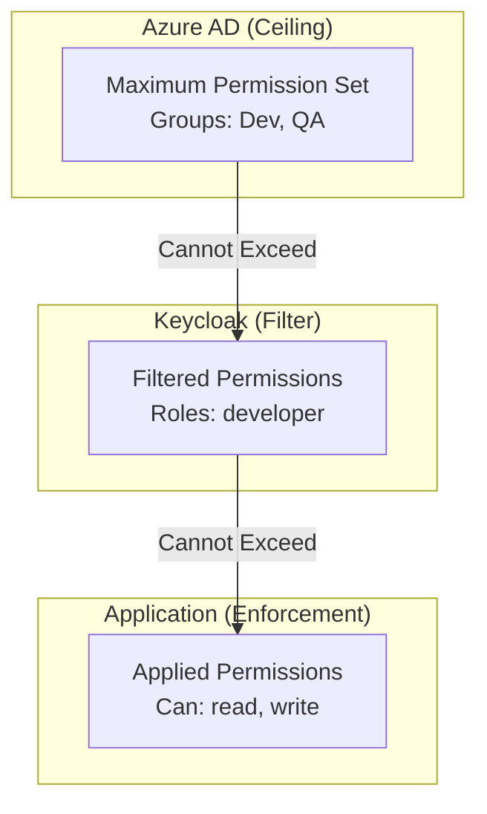
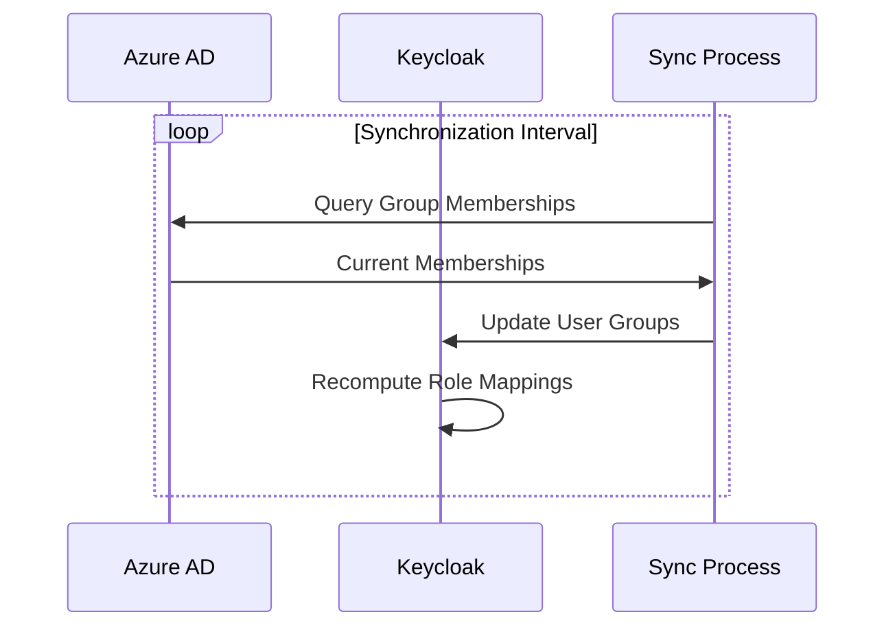
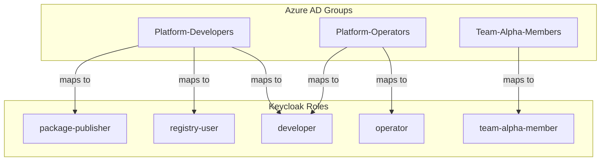
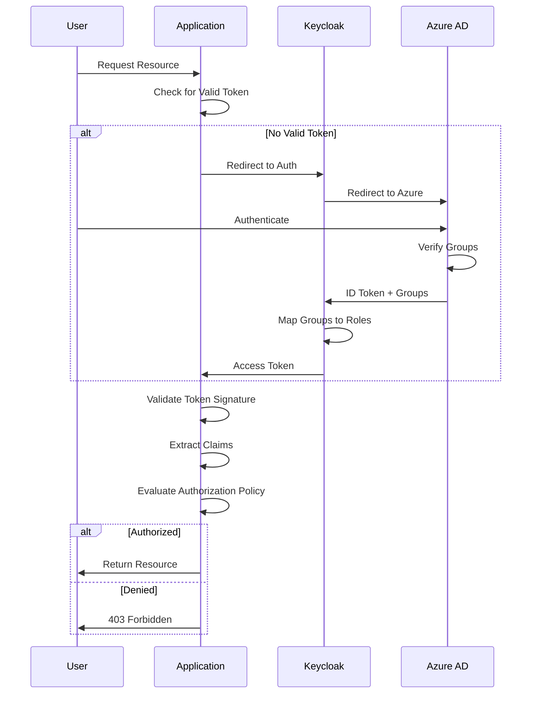

```
RFC-IAM-0001                                                  Section 5
Category: Standards Track                       Authorization Model
```

# 5. Authorization Model

[← Previous: Components](./04-components.md) | [Index](./00-index.md#table-of-contents) | [Next: Secrets Management →](./06-secrets-management.md)

---

## 5.1 Permission Inheritance Principle

### 5.1.1 The Ceiling Principle

The authorization model is built on a fundamental principle: **permissions can only be restricted as they flow downstream, never expanded**.

This principle manifests as a permission ceiling established by Azure AD. When a user authenticates, Azure AD asserts their group memberships. These group memberships define the maximum set of permissions the user can ever receive within the platform. Every downstream system (Keycloak, applications) can grant subsets of these permissions but cannot exceed them.



### 5.1.2 Mathematical Model

Define:
- `P_azure(u)` = Set of permissions implied by user u's Azure AD group memberships
- `P_keycloak(u)` = Set of permissions Keycloak grants to user u
- `P_effective(u)` = Set of permissions actually available to user u

The authorization model operates as a **conjunctive (AND) gate**:

```
P_effective(u) = P_azure(u) ∩ P_keycloak(u)
```

Access to resource R is granted if and only if:

```
access(u, R) = azure_allows(u, R) AND keycloak_allows(u, R)
```

Where `azure_allows` evaluates to TRUE when:
- Azure AD explicitly permits access through group membership, OR
- Azure AD has no policy regarding resource R (undefined/platform-specific resources)

This intersection model means:
- Both systems must allow access for access to be granted
- Either system denying access results in denial
- Azure AD group membership alone is insufficient—Keycloak must also grant the role
- Keycloak role assignment alone is insufficient—Azure AD must also permit through group membership

The subset relationship also holds:

```
P_effective(u) ⊆ P_keycloak(u) ⊆ P_azure(u)
```

For all users u and all permission grants, effective permissions cannot exceed what either system grants independently.

### 5.1.3 Enforcement Mechanism

The conjunctive authorization model is enforced through the authentication chain:

1. **Azure AD Authentication**: User authenticates and receives token with group claims (first gate)
2. **Keycloak Processing**: Keycloak receives Azure AD groups and evaluates role mappings
3. **Token Issuance**: Keycloak issues tokens containing only roles that satisfy BOTH conditions:
   - The user has the required Azure AD group membership (Azure AD allows)
   - The Keycloak administrator has mapped that group to the role (Keycloak allows)
4. **Application Enforcement**: Applications grant permissions based only on token claims

The AND logic is enforced architecturally:
- Keycloak cannot issue roles for groups the user doesn't have in Azure AD (Azure AD gate)
- Keycloak will not issue roles unless explicitly mapped by administrators (Keycloak gate)
- If Azure AD removes group membership, Keycloak cannot compensate by granting the role directly
- If Keycloak removes a role mapping, Azure AD group membership alone provides no access

This dual-gate system ensures that neither system can unilaterally grant access—both must agree.

## 5.2 Azure AD as Authorization Ceiling

### 5.2.1 Group-Based Permission Boundaries

Azure AD groups define permission boundaries for the platform:

| Azure AD Group | Permission Boundary |
|----------------|---------------------|
| Platform-Developers | Can access development resources across platform tools |
| Platform-Operators | Can access operational resources and perform admin actions |
| Team-{Name}-Members | Can access resources belonging to team {Name} |
| Project-{Name}-Contributors | Can contribute to project {Name} resources |

These groups represent **necessary but not sufficient conditions**—membership in a group means the user CAN be granted related permissions through Keycloak, not that they automatically receive them. Both Azure AD group membership AND Keycloak role assignment are required for access.

### 5.2.2 Negative Permission Spaces and Denial Semantics

Denial can originate from either system, and denial from either results in access denial:

**Azure AD Denials** (group non-membership):

| Not Member Of | Cannot Access |
|---------------|---------------|
| Platform-Developers | Any platform development resources |
| Team-X-Members | Any Team-X resources |
| Production-Access | Any production environment resources |

**Keycloak Denials** (role not mapped or not assigned):

| Missing Role | Cannot Access |
|--------------|---------------|
| developer | Development actions even if in Platform-Developers group |
| project-admin | Project administration even if in Project-Contributors group |
| registry-push | Image/package push even if in appropriate Azure AD group |

The AND logic means:
- Absence of Azure AD group membership creates an impenetrable boundary—no Keycloak configuration can grant access
- Absence of Keycloak role mapping also creates a boundary—Azure AD group membership alone provides no access
- Both gates must be open; either gate being closed results in denial

### 5.2.3 Group Synchronization

Azure AD groups must synchronize to Keycloak to enforce the ceiling:



Synchronization ensures:
- New group memberships enable new permission grants
- Removed group memberships revoke permission possibilities
- Changes propagate within the defined synchronization interval

### 5.2.4 Ceiling Violation Detection

The system SHOULD detect and alert on potential ceiling violations:

| Detection | Meaning |
|-----------|---------|
| Role without group mapping | A Keycloak role exists that isn't mapped to any Azure AD group |
| Manual role assignment | A user has a role assigned directly rather than through group mapping |
| Orphaned permission | An application permission references a role that doesn't exist |

These conditions don't necessarily indicate violations but warrant investigation.

## 5.3 Keycloak Role Mapping

### 5.3.1 Role Hierarchy

Keycloak maintains a role hierarchy that maps Azure AD groups to platform-specific roles:



### 5.3.2 Mapping Types

Keycloak supports several mapping patterns:

**Direct Mapping**: One Azure AD group maps to one Keycloak role
```
Platform-Developers → developer
```

**Composite Mapping**: One Azure AD group maps to multiple Keycloak roles
```
Platform-Operators → [operator, developer, registry-admin]
```

**Conditional Mapping**: Mapping applies only when additional conditions are met
```
Team-X-Members + Project-Y-Contributors → team-x-project-y-contributor
```

### 5.3.3 Role Scopes

Keycloak roles exist at two scopes:

**Realm Roles**: Apply across all clients (applications)
- `developer` — General development access
- `operator` — Operational access across tools

**Client Roles**: Apply only to specific clients
- `<app>:project-admin` — Admin access within an application
- `<app>:publisher` — Publish access within a registry

### 5.3.4 Mapping Constraints

Role mappings MUST satisfy these constraints:

1. **Derivability**: Every role mapping MUST derive from an Azure AD group membership
2. **Restrictiveness**: Mappings MAY restrict (not all group members get all roles) but MUST NOT expand
3. **Auditability**: All mappings MUST be documented and reviewable
4. **Consistency**: The same Azure AD group MUST produce the same roles across environments

## 5.4 Application-Level Authorization

### 5.4.1 Claim-Based Decisions

Applications make authorization decisions based on claims in Keycloak tokens:

| Claim Type | Use |
|------------|-----|
| `realm_access.roles` | Realm roles for cross-application permissions |
| `resource_access.{client}.roles` | Client-specific roles for application permissions |
| `groups` | Group memberships (if included in token) |
| Custom claims | Application-specific authorization data |

### 5.4.2 Authorization Patterns

Applications implement authorization through standard patterns:

**Role-Based Access Control (RBAC)**:
- Actions require specific roles
- Roles present in token satisfy requirements
- Missing roles result in authorization denial

**Scope-Based Access Control**:
- OAuth scopes define permitted operations
- Token scopes limit API access
- Applications verify scope presence before operations

**Attribute-Based Access Control (ABAC)**:
- Decisions consider multiple token attributes
- Policies combine claims for complex decisions
- Useful for resource-level authorization

### 5.4.3 Application Permission Tables

Each application defines its permission requirements. The following tables show generic patterns applicable to any platform application:

**Container Registry Permissions** (e.g., Harbor):

| Action | Required Claim |
|--------|----------------|
| View public projects | (authenticated) |
| View private projects | `resource_access.<registry>.roles` contains `project-{name}-member` |
| Push images | `resource_access.<registry>.roles` contains `project-{name}-developer` |
| Manage project | `resource_access.<registry>.roles` contains `project-{name}-admin` |
| System administration | `resource_access.<registry>.roles` contains `admin` |

**Package Registry Permissions** (e.g., Verdaccio):

| Action | Required Claim |
|--------|----------------|
| Read public packages | (authenticated) |
| Read scoped packages | `groups` contains scope-specific group |
| Publish packages | `resource_access.<registry>.roles` contains `publisher` |
| Manage organization | `resource_access.<registry>.roles` contains `org-{name}-admin` |

**Generic Application Permission Pattern**:

| Action | Required Claim |
|--------|----------------|
| Basic access | (authenticated) |
| Resource read | `resource_access.<app>.roles` contains `reader` |
| Resource write | `resource_access.<app>.roles` contains `contributor` |
| Resource admin | `resource_access.<app>.roles` contains `admin` |

### 5.4.4 Denial Handling

When authorization is denied, applications MUST:

1. Return appropriate HTTP status (401 for authentication, 403 for authorization)
2. NOT reveal whether the resource exists (prevent enumeration)
3. Log the denial with sufficient context for audit
4. NOT provide detailed denial reasons that could aid attackers

## 5.5 Authorization Decision Flow

### 5.5.1 Complete Decision Flow



### 5.5.2 Decision Points

The authorization flow contains multiple decision points:

| Decision Point | Authority | Outcome of Denial |
|----------------|-----------|-------------------|
| Azure AD Authentication | Azure AD | Cannot obtain tokens |
| Azure AD Group Membership | Azure AD | Groups not in token |
| Keycloak Role Mapping | Keycloak | Roles not in token |
| Application Policy | Application | 403 Forbidden |

Each decision point can only restrict access. If Azure AD denies group membership, no downstream decision can restore it.

### 5.5.3 Cache Considerations

Token-based authorization involves caching at multiple levels:

| Cache | Contents | Invalidation |
|-------|----------|--------------|
| Browser session | Keycloak tokens | Token expiry or logout |
| Keycloak session | User identity | Session timeout or termination |
| Azure AD cache | Group memberships | Sync interval |
| Application cache | Authorization decisions | Token expiry |

Cache invalidation propagates through the system:
1. Azure AD group change occurs
2. Next sync updates Keycloak groups
3. Next token refresh includes updated roles
4. Application sees new claims

### 5.5.4 Emergency Access Revocation

For immediate access revocation (terminated employee, security incident):

1. **Azure AD**: Disable user account (prevents new authentication)
2. **Keycloak**: Terminate all user sessions (invalidates existing tokens)
3. **Applications**: Revoke application-specific tokens if supported

This multi-layer revocation ensures access is terminated regardless of cached tokens.

## 5.6 Authorization Model Guarantees

### 5.6.1 Positive Guarantees

The authorization model guarantees:

1. **Ceiling Enforcement**: No user can receive permissions exceeding their Azure AD group memberships
2. **Audit Trail**: All authentication and authorization events are logged
3. **Consistent Decisions**: Same credentials produce same authorization outcomes
4. **Cryptographic Verification**: All tokens are cryptographically verified

### 5.6.2 Operational Guarantees

The model provides these operational guarantees:

1. **Revocation Propagation**: Access revocation propagates within defined intervals
2. **Configuration Consistency**: GitOps ensures consistent authorization configuration
3. **Failure Isolation**: Single component failure doesn't grant unauthorized access

### 5.6.3 Non-Guarantees

The model explicitly does NOT guarantee:

1. **Real-Time Revocation**: Cached tokens may be valid until expiry
2. **Detailed Denial Reasons**: Applications may not explain why access was denied
3. **Permission Discovery**: Users cannot enumerate their permissions
4. **Offline Access**: Disconnected clients cannot obtain new authorizations

---

## Document Navigation

| Previous | Index | Next |
|----------|-------|------|
| [← 4. Components](./04-components.md) | [Table of Contents](./00-index.md#table-of-contents) | [6. Secrets Management →](./06-secrets-management.md) |

---

*End of Section 5 — RFC-IAM-0001*
