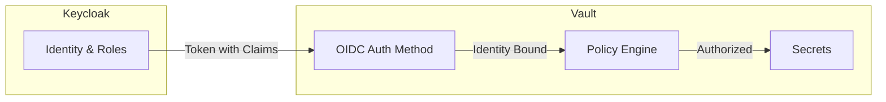
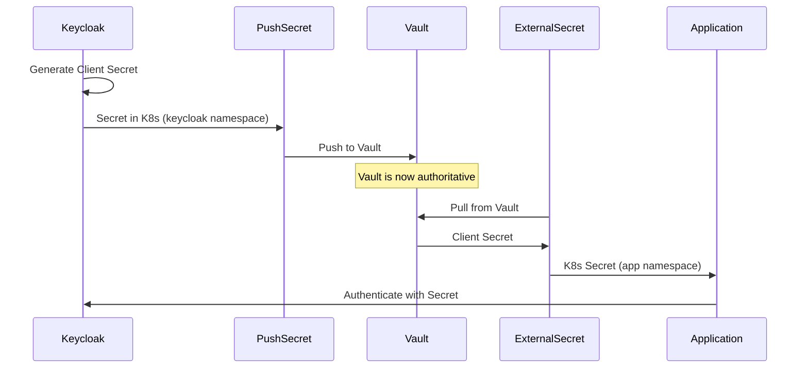

```
RFC-IAM-0001                                                  Section 6
Category: Standards Track                        Secrets Management
```

# 6. Secrets Management

[← Previous: Authorization Model](./05-authorization-model.md) | [Index](./00-index.md#table-of-contents) | [Next: GitOps Integration →](./07-gitops-integration.md)

---

## 6.1 Normative Reference: RFC-SECOPS-0001

**This section does not define secrets management architecture.** The comprehensive architecture for secret management is defined in [RFC-SECOPS-0001: A GitOps-Native, Vault-First Secret Management Architecture](../secret-ops/00-index.md).

RFC-SECOPS-0001 is the authoritative specification for:

| Concern | RFC-SECOPS-0001 Section |
|---------|------------------------|
| Vault as runtime authority | Section 2.2.3, Section 3.3 |
| Secret lifecycle phases | Section 3.2 (Phase Model) |
| Bootstrap and authority transitions | Section 5 (Operational Mechanics) |
| Cross-namespace distribution | Section 5a (Internal Distribution) |
| Rotation framework | Section 6 (Rotation Framework) |
| Security and threat model | Section 7 (Security Considerations) |

This RFC (RFC-IAM-0001) defers to RFC-SECOPS-0001 for all secret storage, lifecycle, distribution, and rotation concerns. **RFC-SECOPS-0001 supersedes any conflicting statements in this document regarding secrets.**

---

## 6.2 Scope of This Section

This section addresses only the **intersection of identity and secrets**—how the identity architecture defined in this RFC relates to and integrates with the secrets architecture defined in RFC-SECOPS-0001.

Specifically, this section covers:

1. **Identity-Bound Secrets**: Secrets that have inherent relationships to Keycloak identities
2. **Vault Policy Integration**: How Keycloak identity maps to Vault access policies
3. **OIDC Client Secret Coordination**: The specific challenge of managing Keycloak client secrets

This section does NOT cover:
- General secret storage (see RFC-SECOPS-0001 §2.2.3)
- Secret rotation mechanics (see RFC-SECOPS-0001 §6)
- Bootstrap secrets (see RFC-SECOPS-0001 §5.2)
- Cross-namespace distribution (see RFC-SECOPS-0001 §5a)

---

## 6.3 Identity-Bound Secrets

### 6.3.1 Definition

An **identity-bound secret** is a secret whose existence, validity, or access authorization is tied to an identity managed by the IAM system (Keycloak/Azure AD).

| Secret Type | Bound Identity | Lifecycle Coupling |
|-------------|----------------|-------------------|
| Keycloak client secret | Keycloak client (application) | Secret invalid if client deleted |
| OIDC client credentials | Application registration | Must rotate with client rotation |
| Service-to-service tokens | Service account in Keycloak | Revoked when service account removed |
| User-specific API tokens | Individual user identity | Revoked on user termination |

### 6.3.2 Lifecycle Coupling

Identity changes MUST trigger corresponding secret actions:

| Identity Event | Required Secret Action |
|----------------|----------------------|
| Keycloak client created | Generate and store client secret in Vault |
| Keycloak client deleted | Revoke client secret in Vault |
| Application decommissioned | Revoke all application-bound secrets |
| User terminated (Azure AD) | Revoke user-specific tokens |
| Service account rotated | Rotate dependent credentials |

This coupling is managed through:
- Keycloak event listeners that trigger Vault operations
- GitOps-defined relationships between client definitions and secret paths
- Automated revocation workflows on identity deletion

---

## 6.4 Vault Policy Integration with Keycloak

### 6.4.1 Identity-Based Vault Access

Vault policies can derive authorization from Keycloak identity through OIDC authentication:



### 6.4.2 Policy Derivation Model

Vault policies can be bound to Keycloak attributes:

| Keycloak Attribute | Vault Policy Binding |
|-------------------|---------------------|
| Realm role | Role-based policy assignment |
| Client role | Client-specific secret access |
| Group membership | Group-scoped secret paths |
| Token claim | Dynamic policy via templating |

This enables the authorization ceiling (Invariant 1) to extend to secrets:
- Users can only access secrets in Vault that their Keycloak roles permit
- Azure AD group removal → Keycloak role removal → Vault access revocation

### 6.4.3 Workload vs Human Access

| Access Type | Auth Method | Policy Source |
|-------------|-------------|---------------|
| Workload (ESO, applications) | Kubernetes auth | Service account binding |
| Human (operators, developers) | OIDC auth | Keycloak identity |
| Automation (CI/CD) | AppRole | Pre-provisioned credentials |

Human access to Vault SHOULD flow through Keycloak OIDC, ensuring the authorization ceiling applies to secret access.

---

## 6.5 Keycloak Client Secret Coordination

### 6.5.1 The Coordination Challenge

Keycloak client secrets present a unique coordination challenge:

1. Keycloak is the **generator** of the client secret
2. Vault is the **authority** for secret storage (per RFC-SECOPS-0001)
3. The application is the **consumer** of the secret
4. All three must agree on the current secret value

### 6.5.2 Recommended Flow

Per RFC-SECOPS-0001's internal distribution framework (Section 5a):



This flow ensures:
- Keycloak generates the secret (it must, as the OIDC provider)
- Vault becomes authoritative immediately via PushSecret
- Applications receive secrets through the standard ESO pattern
- No direct namespace-to-namespace copying (per RFC-SECOPS-0001 Invariant 7)

### 6.5.3 Rotation Coordination

Client secret rotation requires coordination:

1. Keycloak generates new client secret
2. PushSecret updates Vault with new value
3. Grace period: both old and new secrets valid in Keycloak
4. ESO propagates new secret to consuming applications
5. Applications pick up new secret (reload or restart)
6. Old secret revoked in Keycloak after grace period

The rotation framework in RFC-SECOPS-0001 Section 6 provides the mechanics; this section defines the Keycloak-specific coordination requirements.

---

## 6.6 Summary

| Concern | Authority |
|---------|-----------|
| Secret storage and lifecycle | RFC-SECOPS-0001 |
| Secret distribution mechanics | RFC-SECOPS-0001 |
| Secret rotation framework | RFC-SECOPS-0001 |
| Identity-to-secret binding | This section |
| Vault-Keycloak integration | This section |
| Client secret coordination | This section |

For all secrets-related implementation, consult [RFC-SECOPS-0001](../secret-ops/00-index.md) as the authoritative specification. This section provides supplementary guidance for identity-specific concerns only.

---

## Document Navigation

| Previous | Index | Next |
|----------|-------|------|
| [← 5. Authorization Model](./05-authorization-model.md) | [Table of Contents](./00-index.md#table-of-contents) | [7. GitOps Integration →](./07-gitops-integration.md) |

---

*End of Section 6 — RFC-IAM-0001*
