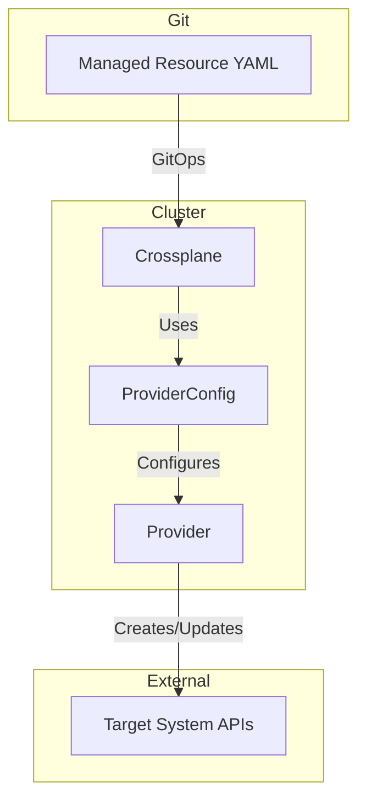
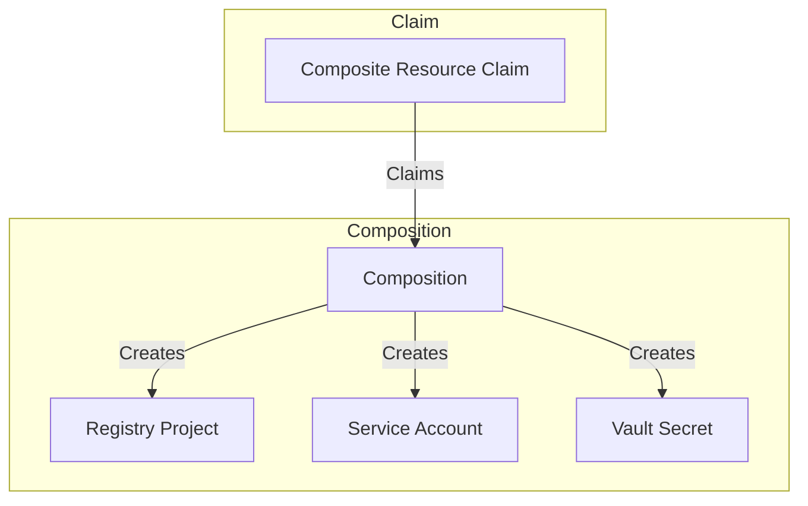
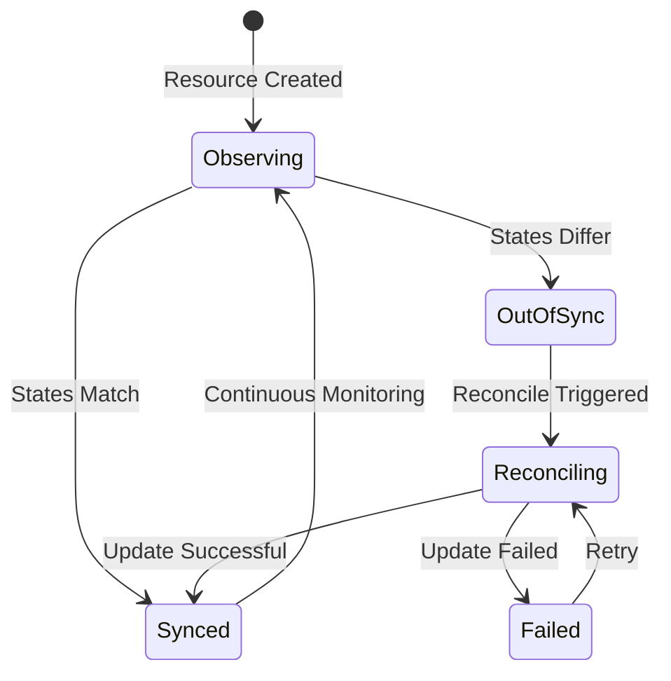
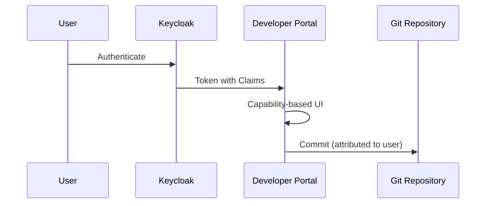

```
RFC-IAM-0001                                                  Section 7
Category: Standards Track                         GitOps Integration
```

# 7. GitOps Integration

[← Previous: Secrets Management](./06-secrets-management.md) | [Index](./00-index.md#table-of-contents) | [Next: Application Integration →](./08-application-integration.md)

---

## 7.1 Declarative Configuration Model

### 7.1.1 Git as Source of Truth

All infrastructure and application configuration resides in Git repositories. This model provides:

- **Version Control**: Complete history of configuration changes
- **Peer Review**: Pull request workflow for configuration changes
- **Auditability**: Git history shows who changed what and when
- **Reproducibility**: Any environment can be recreated from Git state

### 7.1.2 Configuration Categories

Configuration divides into categories with different management approaches:

| Category | GitOps Managed | Examples |
|----------|----------------|----------|
| Infrastructure | Yes | Crossplane managed resources, Helm releases |
| Application Config | Yes | Deployment manifests, ConfigMaps |
| Identity Structure | Yes | Keycloak clients, roles, protocol mappers |
| Access Assignments | No | User-role mappings, group memberships |
| Secrets | Partially | ExternalSecret definitions (not secret values) |

The distinction between "what exists" (GitOps) and "who has what" (administrative) is deliberate—access assignments require human judgment that cannot be codified in Git.

### 7.1.3 Repository Structure

Identity-related configuration follows the platform stack-based layout:

```
platform/
├── stacks/
│   ├── security/                           # Identity & Security Stack
│   │   ├── charts/
│   │   │   ├── keycloak/                   # Identity Provider
│   │   │   │   ├── Chart.yaml
│   │   │   │   ├── values.yaml
│   │   │   │   └── templates/
│   │   │   │       ├── external-secret.yaml
│   │   │   │       └── ingress.yaml
│   │   │   ├── vault/                      # Secrets Management
│   │   │   │   ├── Chart.yaml
│   │   │   │   ├── values.yaml
│   │   │   │   └── templates/
│   │   │   ├── external-secrets/           # Secret Distribution
│   │   │   ├── crossplane/                 # Infrastructure Automation
│   │   │   ├── kyverno/                    # Policy Enforcement
│   │   │   └── falco/                      # Runtime Security
│   │   ├── target-chart/                   # Stack Orchestrator
│   │   └── docs/
│   │       └── DEPLOYMENT_ORDER.md
│   │
│   ├── developer-platform/                 # Developer Tools Stack
│   │   ├── charts/
│   │   │   ├── harbor/                     # Container Registry
│   │   │   │   ├── Chart.yaml
│   │   │   │   ├── values.yaml
│   │   │   │   └── templates/
│   │   │   │       ├── external-secret.yaml
│   │   │   │       └── crossplane-resources.yaml
│   │   │   ├── verdaccio/                  # NPM Registry
│   │   │   ├── backstage/                  # Developer Portal
│   │   │   └── tekton-dashboard/           # CI/CD Dashboard
│   │   └── target-chart/
│   │
│   ├── infrastructure/                     # Core Infrastructure Stack
│   │   ├── charts/
│   │   │   ├── argocd/                     # GitOps Engine
│   │   │   ├── cert-manager/               # TLS Certificates
│   │   │   ├── ingress-nginx/              # Ingress Controller
│   │   │   ├── metallb/                    # Load Balancer
│   │   │   └── external-dns/               # DNS Management
│   │   └── target-chart/
│   │
│   ├── monitoring/                         # Observability Stack
│   │   └── charts/
│   │       ├── prometheus/
│   │       ├── grafana/
│   │       └── loki/
│   │
│   └── platform-data/                      # Data Services Stack
│       └── charts/
│           ├── pg-clusters/
│           ├── mongodb-clusters/
│           └── kafka-clusters/
│
├── bootstrap/                              # Initial Setup
│   ├── secrets/
│   │   ├── specs/                          # Secret Specifications
│   │   └── chart/                          # Secret Deployment Chart
│   └── scripts/
│
├── environments/                           # Environment Configs
│   └── development.yaml
│
└── stack-orchestrator/                     # Application Factory
    ├── Chart.yaml
    ├── values.yaml
    └── values-development.yaml
```

**Key Patterns**:

| Pattern | Description |
|---------|-------------|
| Stack Organization | Related charts grouped into stacks (security, developer-platform, etc.) |
| Target Chart | Each stack has a `target-chart/` that orchestrates deployment order |
| Environment Values | `values-<env>.yaml` files provide environment-specific configuration |
| Template Coupling | Crossplane resources templated within application charts |

### 7.1.4 Change Flow

Configuration changes flow through a defined process:


1. Developer creates pull request with configuration change
2. Peer review validates change
3. Merge to main branch triggers GitOps sync
4. ArgoCD detects change and applies to cluster
5. Crossplane reconciles managed resources
6. Target systems receive provisioned resources

## 7.2 Crossplane Provider Integration

### 7.2.1 Provider Architecture

Crossplane providers enable declarative management of external resources:



### 7.2.2 Provider Configuration

Each provider requires configuration connecting it to target systems:

**ProviderConfig Components**:
- API endpoint URL
- Authentication credentials (from Vault via ESO)
- TLS configuration
- Rate limiting parameters

Credentials flow: Vault → ESO → Kubernetes Secret → ProviderConfig reference

### 7.2.3 Managed Resource Patterns

Crossplane managed resources follow consistent patterns:

**Container Registry Project Resource**:
- Defines project name and metadata
- Specifies storage quota and limits
- References ProviderConfig for authentication
- Outputs project ID for dependent resources

**Package Registry Scope Resource**:
- Defines organization/scope
- Specifies access policies
- References ProviderConfig for authentication
- Outputs scope configuration

### 7.2.4 Composition Strategy

Complex resources use Crossplane Compositions:



Compositions bundle related resources:
- A "project" composition creates registry project + service account + Vault secret
- Single claim triggers creation of all required resources
- Consistent resource creation across requests

## 7.3 Helm Chart Templating Strategy

### 7.3.1 Unified Values Approach

Application Helm charts consolidate all configuration in values files:

```yaml
# values.yaml structure concept (not actual values)

application:
  # Application-specific settings

identity:
  # Keycloak client configuration
  clientId: "my-application"
  realm: "platform"

secrets:
  # External Secrets configuration
  vaultPath: "secret/platform/my-application"
  refreshInterval: "1h"

crossplane:
  # Crossplane managed resources
  enabled: true
  resources: []  # List of resources to create
```

This approach ensures:
- Single source for all application configuration
- Crossplane resources defined alongside application
- Consistent templating across resource types

### 7.3.2 Template Coupling

Crossplane resources are templated within application charts:

**Key Principle**: Crossplane managed resources MUST be templates within the application chart, not separate resources.

This coupling ensures:
- Resource lifecycle tied to application lifecycle
- Single values file controls both application and resources
- Deletion of application removes associated resources
- No orphaned resources in target systems

### 7.3.3 Conditional Resource Creation

Templates support conditional resource creation:

Resources are only created when explicitly enabled and configured. This allows:
- Base application deployment without Crossplane resources
- Progressive enablement of managed resources
- Environment-specific resource configurations

### 7.3.4 Value Inheritance

Chart values support inheritance and overrides:

```
base-values.yaml          # Shared defaults
├── dev-values.yaml       # Development overrides
├── staging-values.yaml   # Staging overrides
└── prod-values.yaml      # Production overrides
```

Environment-specific values override base values while maintaining consistency.

## 7.4 Resource Reconciliation

### 7.4.1 Reconciliation Model

Crossplane continuously reconciles declared state with actual state:



### 7.4.2 Drift Detection

Crossplane detects drift between declared and actual state:

| Drift Type | Detection | Response |
|------------|-----------|----------|
| Missing resource | Target resource doesn't exist | Create resource |
| Configuration drift | Target differs from declared | Update resource |
| Extra resource | Target has resources not in Git | (Depends on policy) |
| Deleted declaration | Resource removed from Git | Delete target resource |

### 7.4.3 Reconciliation Timing

Reconciliation occurs at defined intervals and triggers:

| Trigger | Timing |
|---------|--------|
| Resource creation | Immediate |
| Resource update | Immediate |
| Periodic sync | Configurable interval |
| Manual sync | On demand |
| Failure retry | Exponential backoff |

### 7.4.4 Conflict Resolution

When conflicts occur between declared and actual state:

1. **Declared state wins**: Crossplane updates target to match declaration
2. **Annotation override**: Specific resources can opt out of reconciliation
3. **Deletion protection**: Resources can be marked to prevent deletion

The default behavior—declared state wins—ensures GitOps integrity.

## 7.5 Configuration Boundaries

### 7.5.1 GitOps Boundary Definition

The architecture defines clear boundaries for GitOps management:

**Within GitOps Scope**:
- Keycloak client registrations
- Keycloak role definitions
- Protocol mapper configurations
- Authentication flow definitions
- Crossplane managed resources
- ExternalSecret definitions
- Application deployments

**Outside GitOps Scope**:
- User-to-role assignments
- Group-to-role mappings
- Session management decisions
- Incident response actions
- Secret values (only references in Git)

### 7.5.2 Boundary Rationale

The boundary exists because:

**GitOps-appropriate configuration**:
- Structural and repeatable
- Benefits from version control
- Suitable for peer review
- Environment-agnostic or explicitly parameterized

**Non-GitOps configuration**:
- Requires human judgment
- Changes frequently based on operational needs
- Contains sensitive data
- User-specific rather than system-specific

### 7.5.3 Boundary Enforcement

Boundaries are enforced through:

| Mechanism | Purpose |
|-----------|---------|
| RBAC | Only GitOps service accounts can modify GitOps resources |
| Admission control | Reject manual creation of GitOps-managed resources |
| Audit logging | Track all configuration changes regardless of source |
| Monitoring | Alert on configuration drift |

### 7.5.4 Administrative Override

For operational emergencies, administrators can override GitOps:

1. **Break-glass procedure**: Documented process for emergency changes
2. **Temporary state**: Changes are temporary until GitOps reconciles
3. **Follow-up requirement**: Emergency changes must be codified in Git
4. **Audit trail**: All overrides are logged and reviewed

The goal is not to prevent all manual changes but to ensure they are exceptional, documented, and eventually reconciled.

## 7.6 Developer Portal GitOps Integration (Reference: RFC-DEVELOPER-PLATFORM)

The developer portal's GitOps integration is defined in [RFC-DEVELOPER-PLATFORM-0001](../developer-platform/00-index.md).

### 7.6.1 Identity Integration Point

This RFC establishes only the identity requirement for developer portal GitOps actions:



- Developer portal MUST authenticate users through Keycloak before any GitOps action
- Git commits MUST be attributed to the authenticated user
- Keycloak token claims determine what templates and actions are available

RFC-DEVELOPER-PLATFORM defines template execution, output formats, and the capability-based authorization model.

---

## Document Navigation

| Previous | Index | Next |
|----------|-------|------|
| [← 6. Secrets Management](./06-secrets-management.md) | [Table of Contents](./00-index.md#table-of-contents) | [8. Application Integration →](./08-application-integration.md) |

---

*End of Section 7 — RFC-IAM-0001*
