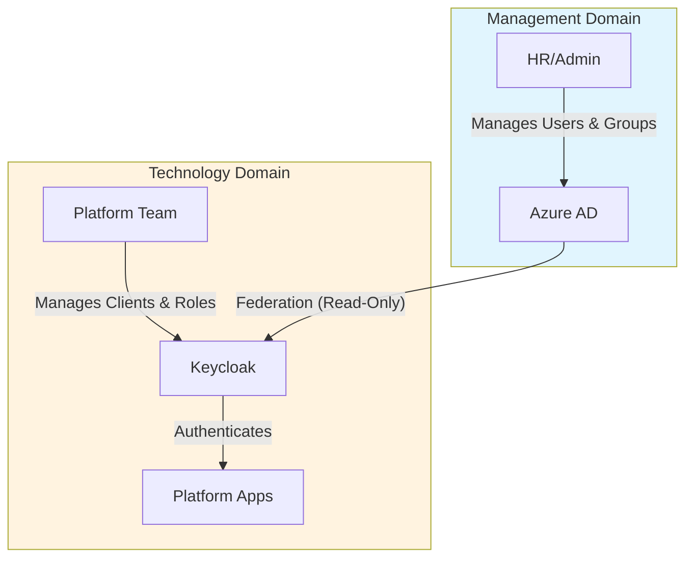

```
RFC-IAM-0001                                                  Section 9
Category: Standards Track                                  Rationale
```

# 9. Rationale

[← Previous: Application Integration](./08-application-integration.md) | [Index](./00-index.md#table-of-contents) | [Next: Evolution →](./10-evolution.md)

---

## 9.1 Organizational Authority Boundaries

This section explains the **primary rationale** for the Azure AD federation architecture: the separation of organizational authority between management/HR and technology teams.

### 9.1.1 The Fundamental Problem

Organizations have distinct functional domains with different responsibilities, risks, and authority:

| Domain | Function | Responsibility | Risk Profile |
|--------|----------|----------------|--------------|
| **Management/HR** | People operations | Hiring, termination, team assignment | Employment, legal, compliance |
| **Technology Teams** | Platform & application delivery | Technical implementation, access control | Operational, security, availability |

These domains require different systems and workflows. Forcing technology decisions on management creates friction; forcing HR processes on engineers creates inefficiency.

### 9.1.2 Identity Lifecycle Ownership

**Who should add a developer to the technology team?**

When a new developer joins the organization:
- **HR** adds them to Azure AD and assigns them to the "Developers" group
- This is HR's responsibility—they manage the employment relationship
- HR already does this in Azure AD for email, Office 365, and other Microsoft services

**Who should remove access when someone leaves?**

When an employee departs:
- **HR** removes them from Azure AD as part of the termination process
- This happens automatically through existing HR workflows
- The engineering manager or platform admin should NOT be responsible for this

**Why this matters:**

If Keycloak maintained its own user database:
- HR would need to learn a new system
- Termination checklists would require additional steps
- Risk of orphaned accounts if HR forgets to remove users from Keycloak
- Duplication of identity management effort

### 9.1.3 Leveraging Existing Trust

Management already uses Azure AD:
- It's the organization's identity provider for Microsoft 365
- HR knows how to add/remove users and manage groups
- Security policies (MFA, conditional access) are already configured
- Audit logging is centralized in Azure AD

**Build around existing trust rather than replace it:**

Instead of asking management to learn Keycloak and trust it for identity, this architecture:
1. Keeps Azure AD as the identity authority (what management trusts)
2. Uses Keycloak as a protocol broker (what technology needs)
3. Preserves existing HR workflows (no retraining required)
4. Maintains single termination process (Azure AD removal = platform access revocation)

### 9.1.4 Separation of Concerns



| Responsibility | Managed By | System |
|----------------|------------|--------|
| User lifecycle (create, disable, terminate) | HR | Azure AD |
| Group membership (team assignment) | HR/Management | Azure AD |
| Application clients | Platform Team | Keycloak |
| Application roles | Platform Team | Keycloak |
| Role-to-group mapping | Platform Team | Keycloak |
| Application permissions | Application Team | Application |

### 9.1.5 Risk Mitigation

This architecture mitigates organizational risks:

| Risk | Without Federation | With Federation |
|------|-------------------|-----------------|
| **Orphaned accounts** | HR must remember to update Keycloak | Azure AD termination revokes all access |
| **Inconsistent access** | Multiple places to check | Single source of truth (Azure AD) |
| **Audit gaps** | Auditors must check multiple systems | Azure AD audit log covers identity |
| **Training overhead** | HR must learn new system | HR uses familiar tools |
| **Process compliance** | New procedures needed | Existing procedures work |

### 9.1.6 Authority Ceiling Principle

The architecture enforces an **authority ceiling**:

- **Azure AD** defines what permissions are possible (group memberships)
- **Keycloak** can only refine permissions within that ceiling
- **Applications** can only grant what Keycloak tokens permit

This means:
- Platform team cannot grant access to someone HR hasn't authorized
- Application teams cannot bypass platform controls
- No privilege escalation path exists outside organizational approval

---

## 9.2 Alternative Identity Architectures

### 9.2.1 Direct Azure AD Integration

**Description**: Each application integrates directly with Azure AD for authentication, eliminating Keycloak as an intermediary.

**Why It Was Attractive**:
- Simplifies architecture by removing a component
- Reduces operational burden of managing Keycloak
- Direct integration with enterprise identity
- Native Azure AD features available to all applications

**Why It Was Rejected**:
- Azure AD lacks specialized protocol support required by some applications
- No centralized platform-specific role management
- Application-by-application configuration increases operational burden
- Limited ability to implement platform-specific authorization logic
- Token customization capabilities are constrained compared to Keycloak

**Invariants Violated**:
- Would complicate enforcement of Invariant 1 (authorization ceiling) across disparate integrations
- Would make Invariant 5 (GitOps authority) harder to achieve with Azure AD's configuration model

**Conclusion**: Direct Azure AD integration sacrifices platform-layer flexibility for apparent simplicity. The operational cost of managing inconsistent integrations exceeds the cost of operating Keycloak.

### 9.2.2 Keycloak as Primary Identity (No Azure AD Federation)

**Description**: Keycloak serves as the primary identity provider with its own user database, independent of Azure AD.

**Why It Was Attractive**:
- Full control over identity management
- No dependency on external identity provider
- Simplified architecture within platform boundary
- Complete flexibility in user attribute management

**Why It Was Rejected**:
- Duplicates enterprise identity management
- Creates synchronization challenges with organizational systems
- Users maintain separate credentials
- Cannot leverage Azure AD security features (conditional access, sign-in risk)
- Violates enterprise security policy requiring centralized identity

**Invariants Violated**:
- Violates Invariant 1 (authorization ceiling)—Keycloak could grant any permission without enterprise constraint
- Violates Invariant 2 (authentication chain)—no Azure AD validation

**Conclusion**: Independent Keycloak identity would create a permission escalation pathway and duplicate identity management. Enterprise identity integration is a requirement, not an option.

### 9.2.3 Azure AD B2C for Platform Identity

**Description**: Use Azure AD B2C as the platform identity provider instead of Keycloak.

**Why It Was Attractive**:
- Azure-native solution
- Integrated with Azure ecosystem
- Managed service reduces operational burden
- Built-in federation capabilities

**Why It Was Rejected**:
- B2C is designed for customer identity, not workforce identity
- Limited customization compared to Keycloak
- Higher cost at platform scale
- Vendor lock-in concerns
- Less suitable for internal developer tooling integration

**Invariants Violated**: None directly, but implementation complexity would challenge multiple invariants.

**Conclusion**: Azure AD B2C serves a different use case (external customer identity). Keycloak is purpose-built for the platform identity broker role this architecture requires.

## 9.3 Alternative Authorization Models

### 9.3.1 Application-Native Authorization

**Description**: Each application manages its own authorization using its native capabilities, without deriving permissions from Keycloak.

**Why It Was Attractive**:
- Leverages application-specific authorization features
- No need to map between systems
- Simpler initial setup for each application
- Application teams have full control

**Why It Was Rejected**:
- Creates inconsistent authorization across applications
- Enables permission escalation—applications can grant any permission
- No single view of user permissions
- Audit complexity increases with each application
- Violates the authorization ceiling principle

**Invariants Violated**:
- Violates Invariant 1 (authorization ceiling)—applications could bypass Azure AD restrictions
- Violates Invariant 9 (developer portal integration)—see RFC-DEVELOPER-PLATFORM for capability-based authorization

**Conclusion**: Application-native authorization creates the exact permission escalation problem this architecture addresses. Centralized authorization through Keycloak is essential.

### 9.3.2 Flat Permission Model

**Description**: All authenticated users receive the same permissions; no role differentiation.

**Why It Was Attractive**:
- Extremely simple to implement
- No role mapping complexity
- No authorization configuration required
- Fast onboarding—authentication grants full access

**Why It Was Rejected**:
- Violates principle of least privilege
- No separation between development and production access
- Cannot implement team-based resource isolation
- Security posture unacceptable for enterprise environments

**Invariants Violated**:
- Violates Invariant 1—no enforcement of Azure AD permission boundaries
- Violates requirement for controlled developer self-service

**Conclusion**: Flat permissions are incompatible with enterprise security requirements and the multi-team platform model.

### 9.3.3 Permission Synchronization (Keycloak → Azure AD)

**Description**: Instead of Azure AD constraining Keycloak, synchronize Keycloak permissions back to Azure AD, making Keycloak the authority.

**Why It Was Attractive**:
- Platform team controls all permissions
- Single source of truth (Keycloak)
- No ceiling limitation on platform capabilities
- Faster permission changes without enterprise approval

**Why It Was Rejected**:
- Inverts the enterprise security model
- Platform team shouldn't override enterprise governance
- Creates compliance issues with enterprise audit requirements
- Azure AD is not designed for external synchronization

**Invariants Violated**:
- Fundamentally violates Invariant 1—removes the authorization ceiling entirely
- Violates enterprise security policies

**Conclusion**: This approach inverts the trust hierarchy. Enterprise identity must constrain platform identity, not the reverse.

## 9.4 Alternative Secrets Management Approaches

### 9.4.1 Kubernetes Secrets Only

**Description**: Use native Kubernetes Secrets without Vault, relying on Kubernetes RBAC for access control.

**Why It Was Attractive**:
- No additional infrastructure
- Native Kubernetes integration
- Simple deployment model
- Lower operational complexity

**Why It Was Rejected**:
- Limited audit capabilities
- Secrets stored in etcd (encryption at rest requires additional configuration)
- No centralized secret lifecycle management
- No dynamic secret generation
- Cross-namespace secret sharing is awkward
- Rotation requires manual intervention

**Invariants Violated**:
- Violates Invariant 3—no single authoritative source
- Violates Invariant 4—no controlled distribution mechanism

**Conclusion**: Kubernetes Secrets lack the lifecycle management, audit capabilities, and centralized control required for enterprise secrets management.

### 9.4.2 Cloud Provider Secret Managers (Azure Key Vault)

**Description**: Use Azure Key Vault instead of HashiCorp Vault for secrets management.

**Why It Was Attractive**:
- Native Azure integration
- Managed service reduces operational burden
- Integrated with Azure identity
- HSM backing available

**Why It Was Rejected**:
- Vendor lock-in to Azure
- Less flexible policy model than HashiCorp Vault
- Integration with Kubernetes workloads requires additional components
- Limited dynamic secret capabilities
- Organization has existing Vault expertise and infrastructure

**Invariants Violated**: None directly—Azure Key Vault could satisfy invariants with appropriate configuration.

**Conclusion**: Azure Key Vault is a viable alternative but would introduce vendor lock-in and require abandoning existing Vault investment. For organizations without existing Vault infrastructure, this alternative merits consideration.

### 9.4.3 GitOps for Secrets (Sealed Secrets, SOPS)

**Description**: Store encrypted secrets in Git using Sealed Secrets or SOPS, decrypted at deployment time.

**Why It Was Attractive**:
- Secrets version-controlled alongside configuration
- GitOps consistency—everything in Git
- No additional secret store infrastructure
- Simple mental model

**Why It Was Rejected**:
- Secret rotation requires Git commits
- Audit trail in Git, not centralized security system
- Decryption keys require their own management
- No dynamic secret generation
- Secrets visible (encrypted) in repository history

**Invariants Violated**:
- Violates Invariant 3—secrets distributed across Git repositories
- Violates Invariant 4—secrets not distributed through ESO

**Conclusion**: Git-based secret management is appropriate for bootstrapping secrets and non-sensitive configuration, but not for production secret management at scale.

### 9.4.4 Per-Application Secret Stores

**Description**: Each application manages its own secrets using its native capabilities (application built-in secret stores, etc.).

**Why It Was Attractive**:
- Application teams have full control
- No centralized bottleneck
- Simpler per-application setup
- Native integration

**Why It Was Rejected**:
- No centralized audit
- Inconsistent secret management practices
- No unified rotation policies
- Cross-application secrets require duplication
- Increases attack surface

**Invariants Violated**:
- Violates Invariant 3—no single authoritative source
- Violates Invariant 4—no controlled distribution

**Conclusion**: Distributed secret management creates the secret sprawl problem this architecture addresses.

## 9.5 Alternative GitOps Strategies

### 9.5.1 Full GitOps for Access Control

**Description**: Manage all access control, including user-role assignments, through GitOps.

**Why It Was Attractive**:
- Complete version control of access configuration
- Peer review for all access changes
- Reproducible access state
- Consistent with infrastructure-as-code principles

**Why It Was Rejected**:
- Access changes require Git workflow overhead
- Emergency access grants delayed by merge process
- User identity information would be in Git
- Bulk access changes create large commits
- Some decisions require human judgment not codifiable as configuration

**Invariants Violated**:
- Violates Invariant 6—removes administrative boundary for access assignments

**Conclusion**: GitOps is appropriate for structural configuration (what clients exist) but not for access assignments (who has which role). The boundary preserves operational flexibility for access management.

### 9.5.2 Manual Configuration Only

**Description**: All configuration managed through administrative interfaces, no GitOps.

**Why It Was Attractive**:
- Immediate changes without Git workflow
- Full flexibility for administrators
- Simpler tooling requirements
- Traditional operational model

**Why It Was Rejected**:
- No version control for configuration
- No peer review for changes
- Difficult to reproduce environments
- Configuration drift between environments
- Limited audit trail for changes

**Invariants Violated**:
- Violates Invariant 5—resources not defined in Git

**Conclusion**: Manual configuration creates operational risk and compliance issues. GitOps provides essential version control and audit capabilities.

### 9.5.3 Terraform Instead of Crossplane

**Description**: Use Terraform for resource provisioning instead of Crossplane.

**Why It Was Attractive**:
- Mature ecosystem with many providers
- Well-understood operational model
- Extensive community support
- Proven at scale

**Why It Was Rejected**:
- Terraform lacks continuous reconciliation (point-in-time, not declarative)
- State management complexity in Kubernetes environments
- Not Kubernetes-native
- Requires separate workflow from application deployments
- Drift detection requires explicit runs

**Invariants Violated**: None directly, but would complicate Invariant 8 (template coupling) since Terraform modules don't naturally integrate with Helm charts.

**Conclusion**: Crossplane's Kubernetes-native model and continuous reconciliation better suit the GitOps architecture. Organizations with existing Terraform investment could use Crossplane's Terraform provider as a bridge.

### 9.5.4 ArgoCD ApplicationSets for Resource Generation

**Description**: Use ArgoCD ApplicationSets to generate Crossplane resources instead of Helm templating.

**Why It Was Attractive**:
- Dynamic resource generation based on Git state
- Centralized resource definition
- Powerful templating capabilities
- Native ArgoCD integration

**Why It Was Rejected**:
- Separates resource definition from application deployment
- Resources not coupled to application lifecycle
- More complex operational model
- Harder to understand resource provenance

**Invariants Violated**:
- Violates Invariant 8—resources would not be templated through application Helm charts

**Conclusion**: Helm templating within application charts provides clearer coupling between applications and their resources. ApplicationSets serve a different use case (multi-cluster deployments, dynamic environment creation).

---

## Document Navigation

| Previous | Index | Next |
|----------|-------|------|
| [← 8. Application Integration](./08-application-integration.md) | [Table of Contents](./00-index.md#table-of-contents) | [10. Evolution →](./10-evolution.md) |

---

*End of Section 9 — RFC-IAM-0001*
