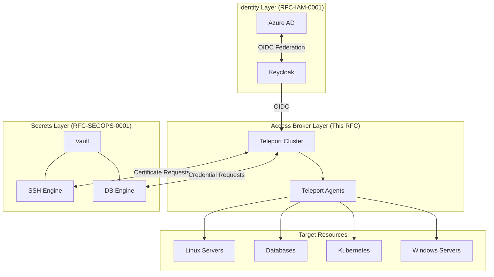
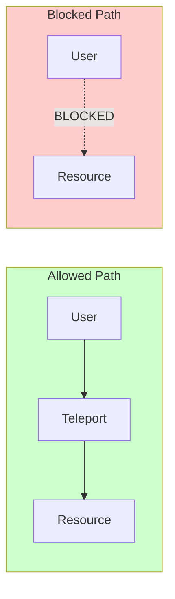
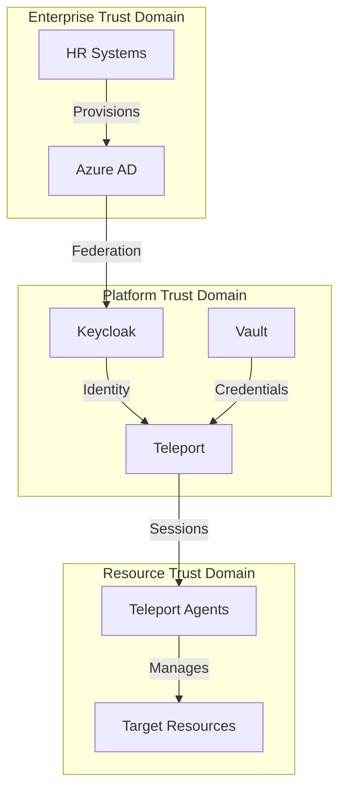
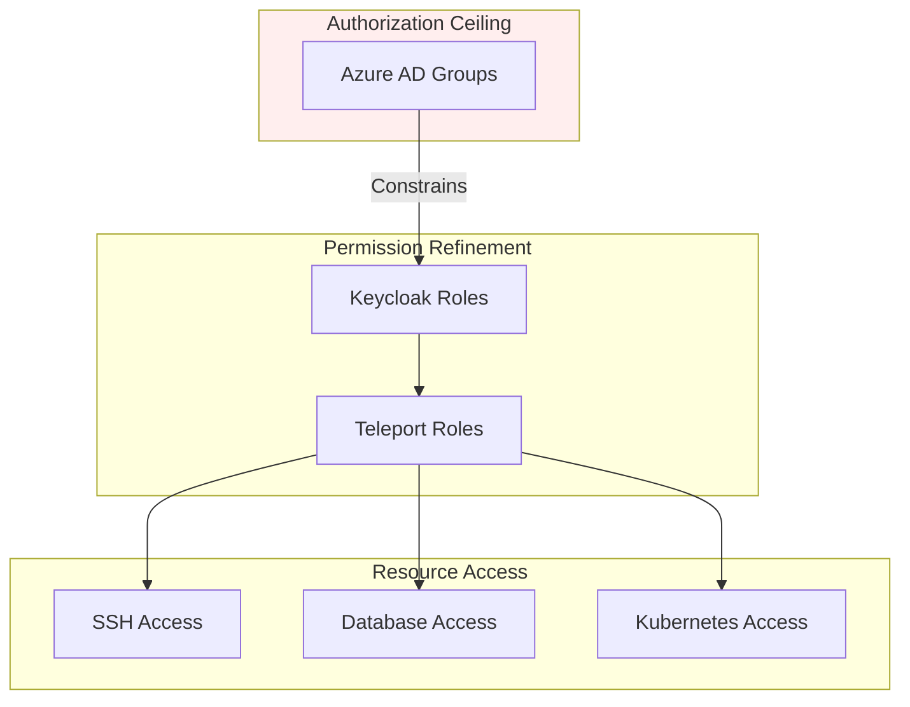
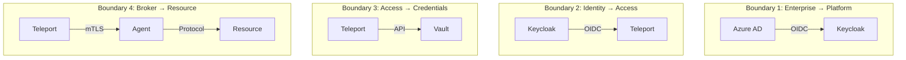
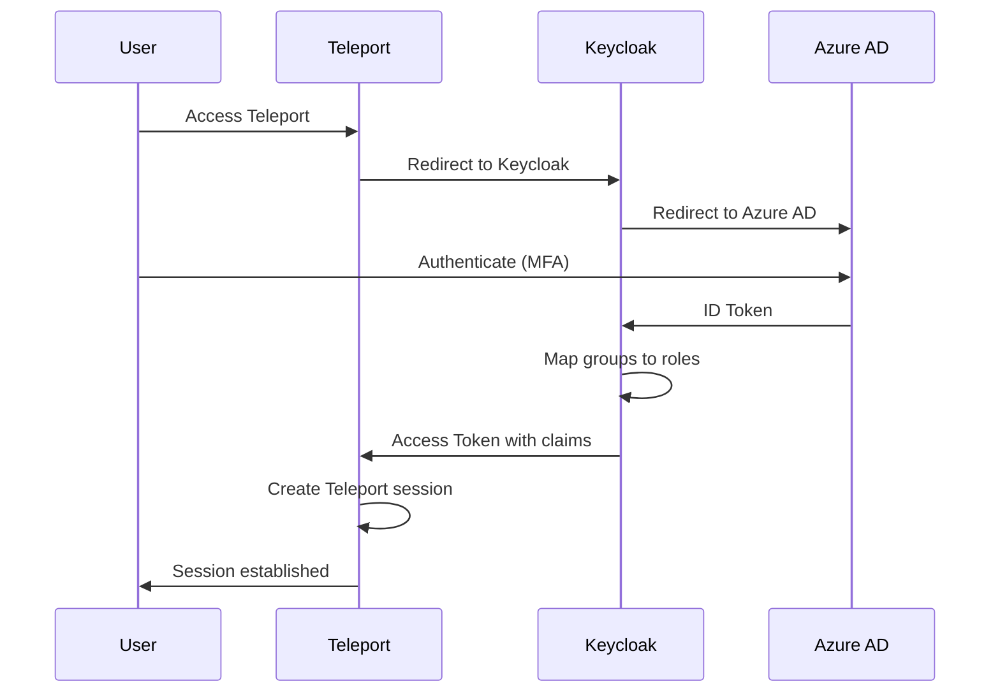
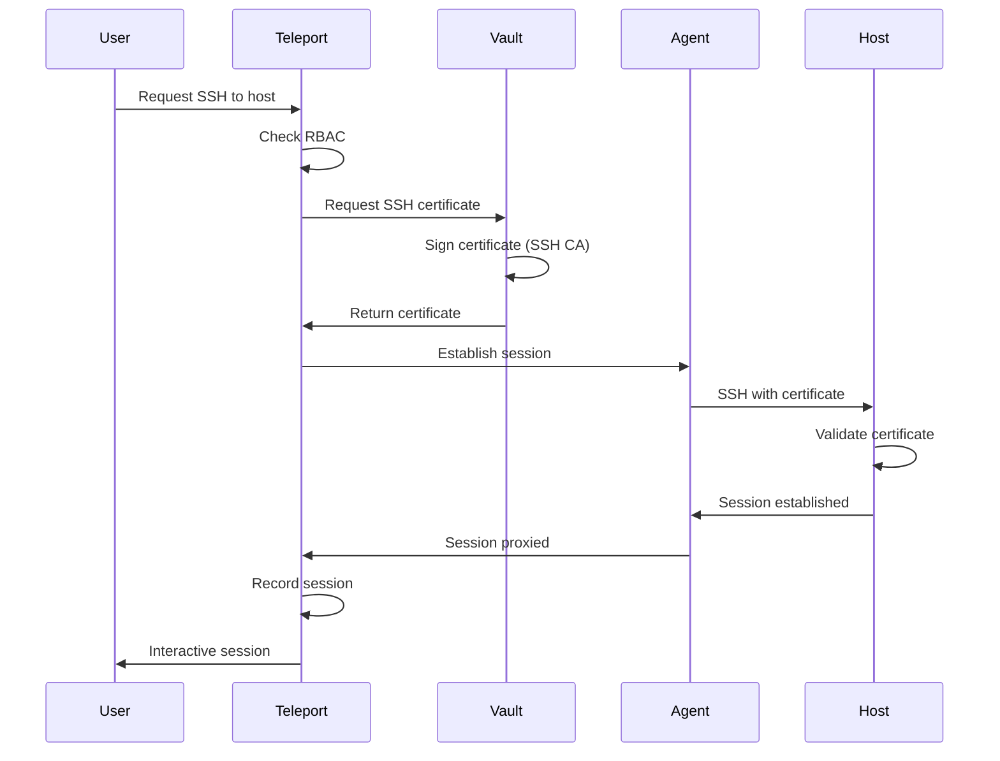
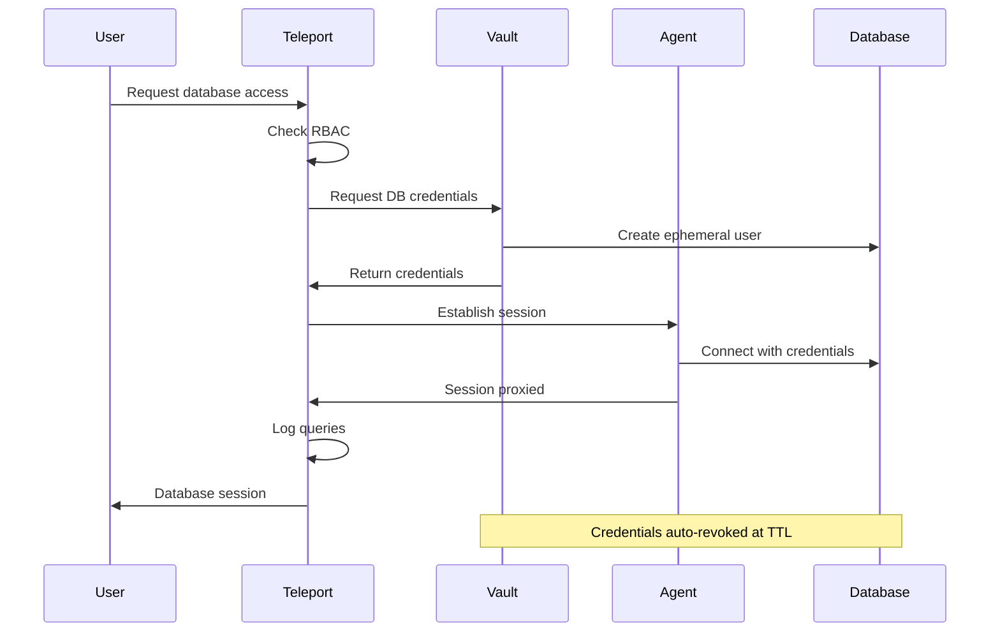
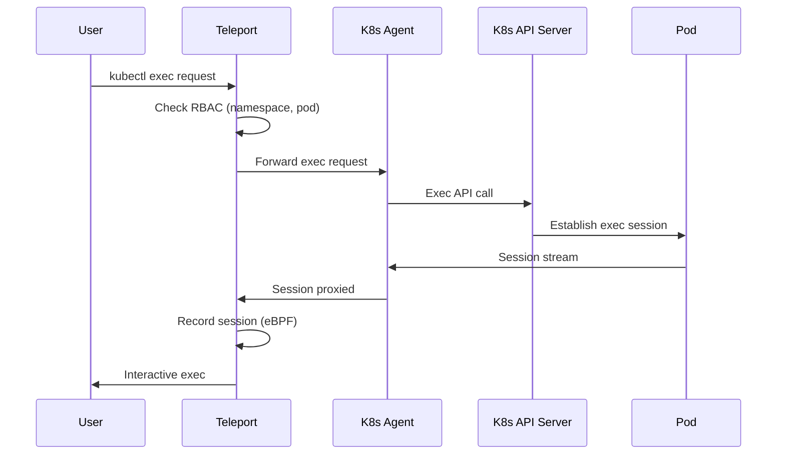

```
RFC-PAM-0001                                                    Section 3
Category: Standards Track                                    Architecture
```

# 3. Architecture

[← Previous: Requirements](./02-requirements.md) | [Index](./00-index.md#table-of-contents) | [Next: Components →](./04-components.md)

---

## 3.1 System Overview

The Privileged Access Management architecture positions Teleport as the centralized access broker for all human-to-infrastructure access. Teleport integrates with:

- **Keycloak** for user identity (per RFC-IAM-0001)
- **Vault** for credential authority (per RFC-SECOPS-0001)
- **Target resources** through Teleport agents



## 3.2 Zero Direct Access Model

### 3.2.1 Model Definition

The **zero direct access** model enforces that all privileged access transits through Teleport. No direct connections are permitted from user workstations to target resources.



### 3.2.2 Enforcement Mechanisms

| Resource Type | Enforcement Method |
|---------------|-------------------|
| SSH | Network policies block port 22; sshd accepts only Teleport CA certificates |
| Database | Database credentials only issued through Teleport; network policies block direct ports |
| Kubernetes | API server accessible only through Teleport proxy for exec/attach |
| RDP | Network policies block port 3389; RDP gateway through Teleport |

### 3.2.3 Benefits

| Benefit | Description |
|---------|-------------|
| **Single audit point** | All access logged in one system |
| **Consistent policy** | Same RBAC applies to all resources |
| **Simplified revocation** | Disable Teleport access = disable all access |
| **Session recording** | All sessions captured automatically |

## 3.3 Trust Hierarchy

### 3.3.1 Trust Model

Trust flows from enterprise identity through platform identity to resource access:



### 3.3.2 Trust Assertions

| Assertion | Meaning |
|-----------|---------|
| Azure AD asserts user identity | User is who they claim to be |
| Azure AD asserts group membership | User belongs to these organizational groups |
| Keycloak asserts platform roles | User has these platform permissions |
| Teleport asserts access rights | User can access these resources |
| Vault asserts credential validity | These credentials are authentic and current |

### 3.3.3 Trust Verification

At each layer, trust is verified before proceeding:

| Layer | Verification |
|-------|--------------|
| Keycloak → Azure AD | OIDC token signature, issuer, audience |
| Teleport → Keycloak | OIDC token signature, group claims |
| Agent → Teleport | Teleport CA certificate chain |
| Resource → Agent | Agent certificate, Teleport session token |

## 3.4 Authority Domains

### 3.4.1 Domain Responsibilities

| Domain | Authority | Controller |
|--------|-----------|------------|
| **User Identity** | Who is this person? | Azure AD (via HR) |
| **Group Membership** | What teams do they belong to? | Azure AD (via HR) |
| **Platform Roles** | What platform permissions do they have? | Keycloak (via Platform Team) |
| **Access Policies** | What resources can they access? | Teleport (via Platform Team) |
| **Credentials** | What are their authentication credentials? | Vault (via Platform Team) |
| **Resource Enrollment** | What resources are managed? | Teleport Agents (via Resource Owners) |

### 3.4.2 Authority Ceiling

The authorization ceiling principle from RFC-IAM-0001 extends to PAM:



**Example**: A user in Azure AD group `Developers` can be granted Teleport role `developer` which permits SSH to development servers. They cannot be granted Teleport role `sre-production` (which requires Azure AD group `SRE-Team`) even if an administrator attempts to assign it.

### 3.4.3 Separation of Concerns

| Concern | Managed By | System |
|---------|------------|--------|
| User lifecycle | HR/Management | Azure AD |
| Team assignment | HR/Management | Azure AD Groups |
| Platform role definitions | Platform Team | Keycloak + Teleport |
| Role-to-group mapping | Platform Team | Keycloak + Teleport |
| Resource enrollment | Resource Owners | Teleport Agents |
| Access policies | Platform Team | Teleport Roles |

## 3.5 Trust Boundaries

### 3.5.1 Boundary Definitions



### 3.5.2 Boundary 1: Enterprise to Platform

| Aspect | Specification |
|--------|---------------|
| Protocol | OIDC |
| Direction | Azure AD → Keycloak |
| Trust basis | OIDC token validation |
| Crossing | User authenticates, groups synchronized |

### 3.5.3 Boundary 2: Identity to Access Broker

| Aspect | Specification |
|--------|---------------|
| Protocol | OIDC |
| Direction | Keycloak → Teleport |
| Trust basis | OIDC token with group claims |
| Crossing | User identity established, roles assigned |

### 3.5.4 Boundary 3: Access Broker to Credential Authority

| Aspect | Specification |
|--------|---------------|
| Protocol | Vault API (HTTPS) |
| Direction | Teleport → Vault |
| Trust basis | Vault token (Kubernetes auth) |
| Crossing | Credentials requested and issued |

### 3.5.5 Boundary 4: Access Broker to Target Resource

| Aspect | Specification |
|--------|---------------|
| Protocol | mTLS (Teleport protocol) |
| Direction | Teleport ↔ Agent |
| Trust basis | Teleport CA certificates |
| Crossing | Session established, commands proxied |

## 3.6 Data Flow Model

### 3.6.1 Authentication Flow



### 3.6.2 SSH Access Flow



### 3.6.3 Database Access Flow



### 3.6.4 Kubernetes Exec Flow



---

## Document Navigation

| Previous | Index | Next |
|----------|-------|------|
| [← 2. Requirements](./02-requirements.md) | [Table of Contents](./00-index.md#table-of-contents) | [4. Components →](./04-components.md) |

---

*End of Section 3 — RFC-PAM-0001*
