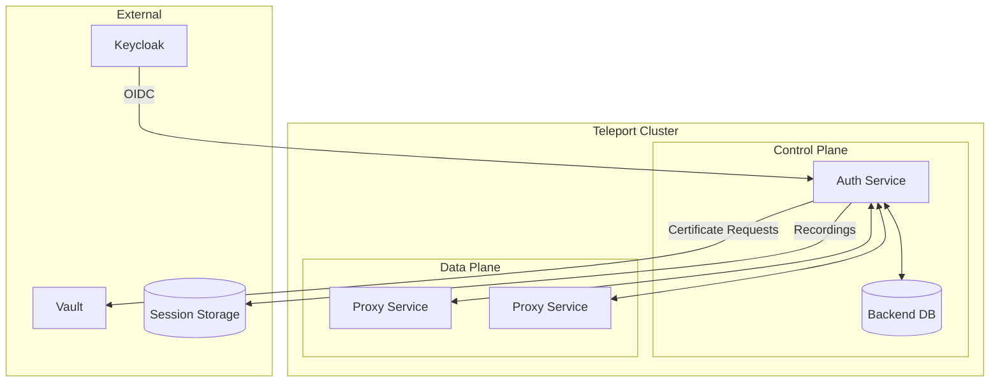
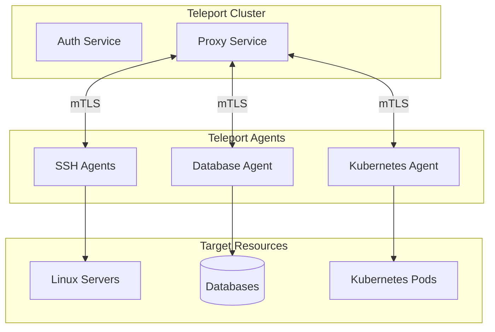
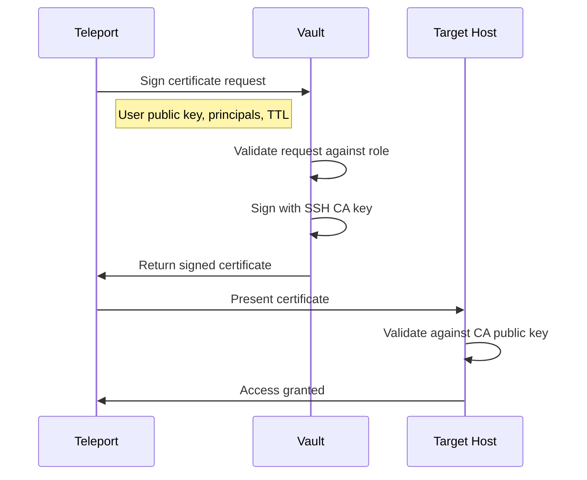
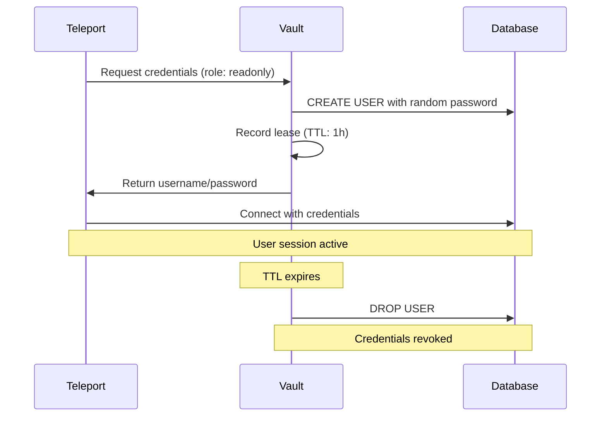
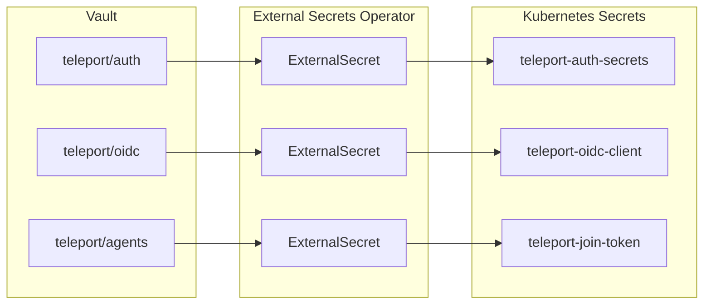
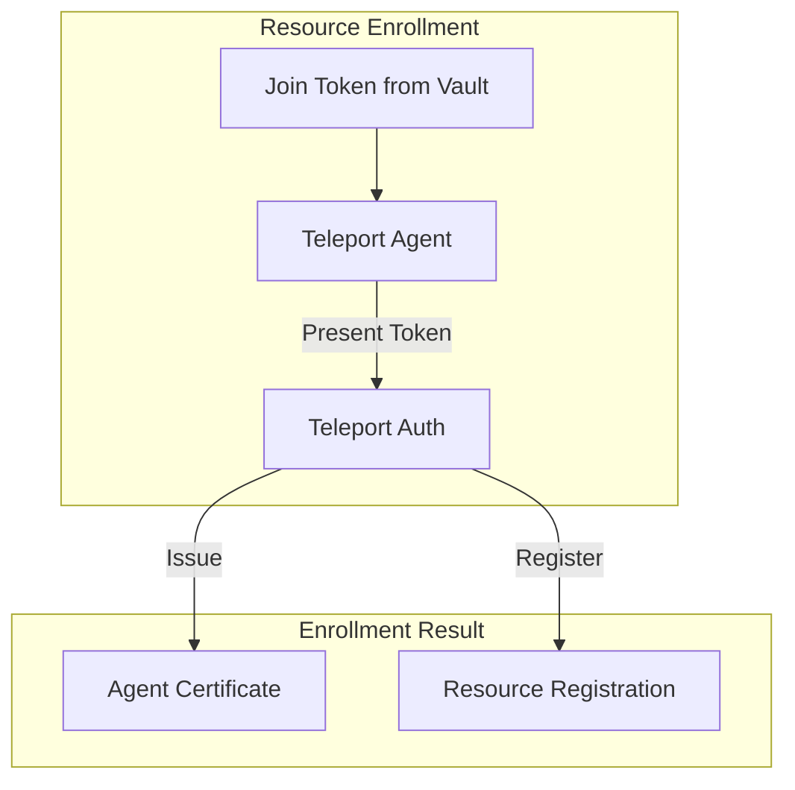

```
RFC-PAM-0001                                                    Section 4
Category: Standards Track                                     Components
```

# 4. Components

[← Previous: Architecture](./03-architecture.md) | [Index](./00-index.md#table-of-contents) | [Next: Identity Integration →](./05-identity-integration.md)

---

## 4.1 Teleport Cluster

### 4.1.1 Overview

Teleport is the centralized access broker for all privileged infrastructure access. It provides:

- **Unified access gateway** for SSH, databases, Kubernetes, and applications
- **Certificate-based authentication** eliminating long-lived credentials
- **Session recording** for compliance and audit
- **Role-based access control** integrated with identity providers
- **Just-in-time access** with approval workflows

### 4.1.2 Core Services

| Service | Responsibility | Deployment |
|---------|----------------|------------|
| **Auth Service** | User authentication, certificate issuance, RBAC | StatefulSet (HA) |
| **Proxy Service** | Connection routing, TLS termination, web UI | Deployment (scaled) |
| **Session Recording** | Capture and store session data | Integrated with Auth |

### 4.1.3 Auth Service

The Auth Service is the control plane for Teleport:

| Function | Description |
|----------|-------------|
| **SSO Integration** | OIDC connector to Keycloak |
| **Certificate Authority** | Issues short-lived certificates for users and hosts |
| **RBAC Engine** | Evaluates access requests against role definitions |
| **Audit Backend** | Stores audit events and session metadata |
| **Cluster State** | Maintains registered resources and active sessions |

**High Availability**: Auth Service runs as a StatefulSet with multiple replicas. State is stored in a backend (etcd or PostgreSQL) for consistency.

### 4.1.4 Proxy Service

The Proxy Service is the data plane for Teleport:

| Function | Description |
|----------|-------------|
| **Protocol Routing** | Routes SSH, database, and Kubernetes traffic |
| **TLS Termination** | Handles client TLS connections |
| **Web UI** | Serves the Teleport web interface |
| **Load Distribution** | Balances connections across agents |

**Scaling**: Proxy Service runs as a Deployment and can be horizontally scaled based on connection load.

### 4.1.5 Teleport Cluster Diagram



## 4.2 Teleport Agents

### 4.2.1 Overview

Teleport Agents run on or near target resources and enable Teleport to manage access:

| Agent Type | Target Resource | Deployment |
|------------|-----------------|------------|
| **SSH Agent** | Linux/Unix servers | DaemonSet or per-host |
| **Database Agent** | PostgreSQL, MySQL, MongoDB | Deployment |
| **Kubernetes Agent** | Kubernetes clusters | Deployment |
| **Application Agent** | Internal web apps | Deployment |
| **Windows Agent** | Windows servers | Per-host service |

### 4.2.2 SSH Agent

The SSH Agent enables certificate-based SSH access:

| Function | Description |
|----------|-------------|
| **Host Registration** | Registers host with Teleport cluster |
| **Certificate Validation** | Validates user certificates against Teleport CA |
| **Session Proxy** | Proxies SSH sessions through Teleport |
| **Session Recording** | Captures terminal I/O for recording |

**Deployment Options**:
- **DaemonSet**: One agent per node in Kubernetes
- **Standalone**: Installed directly on target hosts
- **Agentless**: Using OpenSSH with Teleport CA (limited features)

### 4.2.3 Database Agent

The Database Agent proxies database connections:

| Function | Description |
|----------|-------------|
| **Protocol Support** | PostgreSQL, MySQL, MongoDB, and more |
| **Credential Injection** | Injects Vault-issued credentials |
| **Query Logging** | Captures queries for audit |
| **Connection Pooling** | Manages database connections |

**Supported Protocols**:

| Protocol | Port | Query Logging |
|----------|------|---------------|
| PostgreSQL | 5432 | Full SQL capture |
| MySQL | 3306 | Full SQL capture |
| MongoDB | 27017 | Command capture |
| Redis | 6379 | Command capture |
| SQL Server | 1433 | Full SQL capture |

### 4.2.4 Kubernetes Agent

The Kubernetes Agent enables governed Kubernetes access:

| Function | Description |
|----------|-------------|
| **API Proxy** | Proxies kubectl commands through Teleport |
| **Exec/Attach Control** | Enforces policies on pod exec/attach |
| **Port-Forward Control** | Governs port-forward requests |
| **Session Recording** | Captures exec sessions via eBPF |

**Integration with Kubernetes RBAC**:
- Teleport roles define which namespaces/pods users can access
- Kubernetes RBAC remains authoritative for API permissions
- Teleport adds audit layer and session recording

### 4.2.5 Agent Architecture



## 4.3 Vault SSH Secrets Engine

### 4.3.1 Overview

The Vault SSH Secrets Engine provides certificate authority functionality for SSH authentication. Per RFC-SECOPS-0001, Vault is the authoritative source for all credentials.

### 4.3.2 SSH CA Configuration

Vault maintains an SSH Certificate Authority:

| Component | Purpose |
|-----------|---------|
| **CA Private Key** | Signs SSH certificates (never leaves Vault) |
| **CA Public Key** | Distributed to all managed hosts |
| **Signing Roles** | Define certificate parameters per use case |

### 4.3.3 Signing Roles

| Role | TTL | Principals | Use Case |
|------|-----|------------|----------|
| `developer` | 1h | ubuntu, ec2-user | Standard development access |
| `operator` | 4h | ubuntu, ec2-user, root | Operations support |
| `emergency` | 30m | root | Break-glass emergency access |

### 4.3.4 Certificate Flow



### 4.3.5 Host Configuration

Managed hosts are configured to trust only the Vault SSH CA:

| Configuration | Setting |
|---------------|---------|
| TrustedUserCAKeys | `/etc/ssh/trusted-user-ca-keys.pem` (Vault CA public key) |
| AuthorizedPrincipalsFile | `/etc/ssh/auth_principals/%u` |
| PubkeyAuthentication | `yes` (for certificates) |
| PasswordAuthentication | `no` |

Direct SSH key authentication is disabled—only certificates signed by Vault are accepted.

## 4.4 Vault Database Secrets Engine

### 4.4.1 Overview

The Vault Database Secrets Engine generates ephemeral database credentials on-demand. This eliminates standing database passwords for human access.

### 4.4.2 Database Connections

Vault maintains connections to managed databases:

| Connection | Database | Purpose |
|------------|----------|---------|
| `postgres-prod` | Production PostgreSQL | Production database access |
| `postgres-staging` | Staging PostgreSQL | Staging database access |
| `mysql-analytics` | Analytics MySQL | Analytics database access |

### 4.4.3 Dynamic Credential Roles

| Role | Permissions | TTL | Use Case |
|------|-------------|-----|----------|
| `readonly` | SELECT | 1h | Debugging, investigation |
| `readwrite` | SELECT, INSERT, UPDATE, DELETE | 2h | Development tasks |
| `admin` | ALL PRIVILEGES | 30m | Emergency maintenance |

### 4.4.4 Credential Lifecycle



### 4.4.5 Credential Properties

| Property | Value | Rationale |
|----------|-------|-----------|
| **Uniqueness** | Unique per user per session | Individual accountability |
| **TTL** | 1-4 hours depending on role | Limit exposure window |
| **Auto-revocation** | Yes, at TTL expiry | No stale credentials |
| **Renewability** | Yes, within max TTL | Support long sessions |

## 4.5 External Secrets Operator

### 4.5.1 Overview

External Secrets Operator (ESO) distributes secrets from Vault to Kubernetes per RFC-SECOPS-0001 patterns. For PAM, ESO distributes:

- Teleport agent enrollment tokens
- OIDC client secrets for Keycloak integration
- TLS certificates for Teleport services

### 4.5.2 PAM-Related ExternalSecrets

| ExternalSecret | Vault Path | Target Secret | Purpose |
|----------------|------------|---------------|---------|
| `teleport-auth-secrets` | `secret/platform/teleport/auth` | `teleport-auth-secrets` | Auth service configuration |
| `teleport-oidc-secret` | `secret/platform/teleport/oidc` | `teleport-oidc-client` | Keycloak OIDC client secret |
| `teleport-agent-token` | `secret/platform/teleport/agents` | `teleport-join-token` | Agent enrollment token |

### 4.5.3 Secret Distribution Pattern



## 4.6 Target Resources

### 4.6.1 Linux/Unix Servers

Managed servers require:

| Requirement | Implementation |
|-------------|----------------|
| Teleport SSH Agent | Installed and enrolled |
| SSH CA Trust | Vault CA public key in TrustedUserCAKeys |
| Principal Mapping | AuthorizedPrincipals configured |
| Direct Key Auth Disabled | PubkeyAuthentication for certs only |

### 4.6.2 Databases

Managed databases require:

| Requirement | Implementation |
|-------------|----------------|
| Network Access | Teleport Database Agent can connect |
| Vault Connection | Vault can create/drop users |
| Protocol Support | Database protocol supported by Teleport |

### 4.6.3 Kubernetes Clusters

Managed clusters require:

| Requirement | Implementation |
|-------------|----------------|
| Teleport Kubernetes Agent | Deployed in cluster |
| API Server Access | Agent can reach API server |
| RBAC Configuration | Agent has permissions to proxy exec/attach |

### 4.6.4 Resource Enrollment

Resources are enrolled in Teleport through agent deployment:



---

## Document Navigation

| Previous | Index | Next |
|----------|-------|------|
| [← 3. Architecture](./03-architecture.md) | [Table of Contents](./00-index.md#table-of-contents) | [5. Identity Integration →](./05-identity-integration.md) |

---

*End of Section 4 — RFC-PAM-0001*
