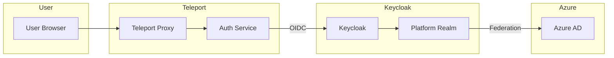
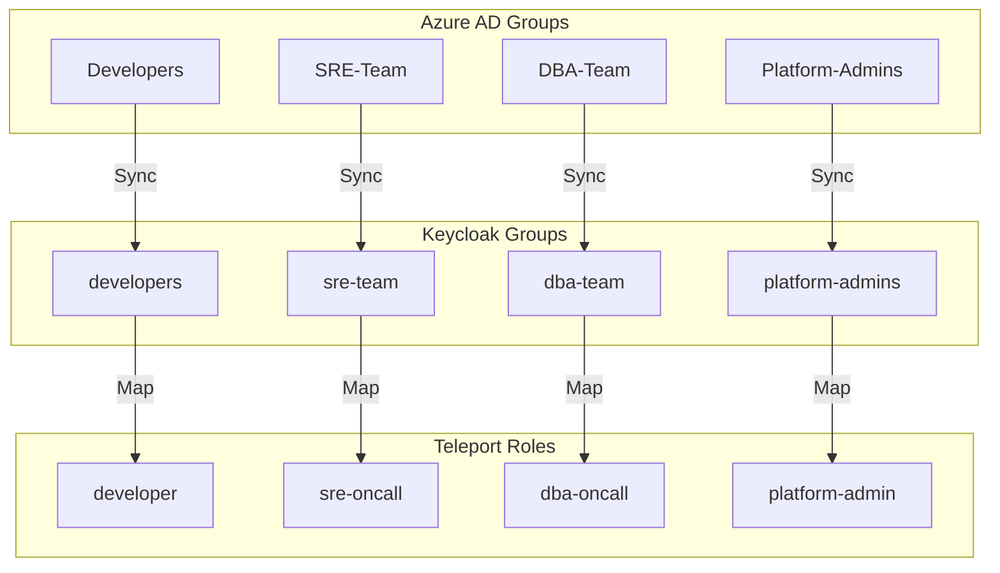
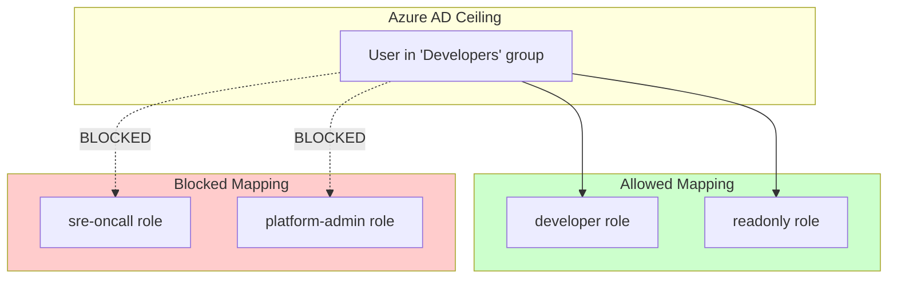
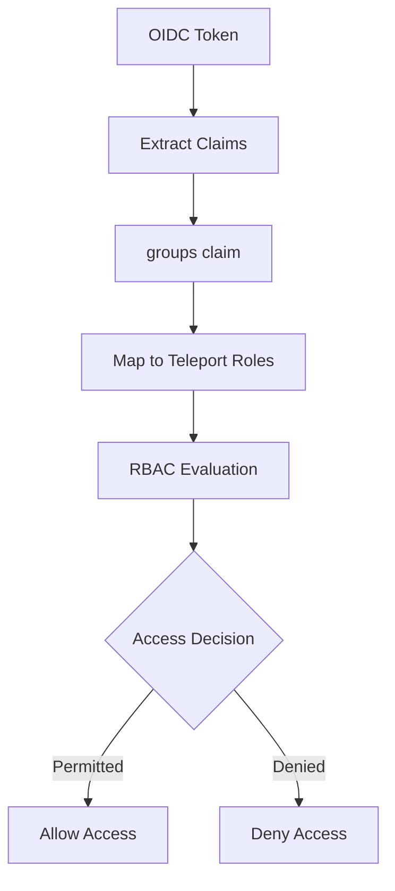
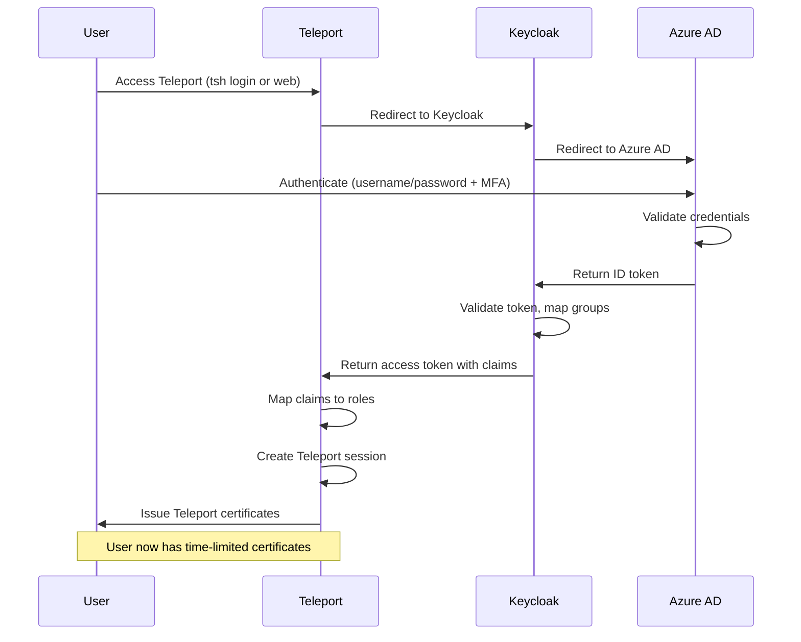
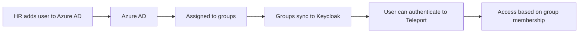
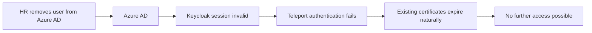

```
RFC-PAM-0001                                                    Section 5
Category: Standards Track                           Identity Integration
```

# 5. Identity Integration

[← Previous: Components](./04-components.md) | [Index](./00-index.md#table-of-contents) | [Next: SSH Access →](./06-ssh-access.md)

---

## 5.1 Keycloak SSO Configuration

### 5.1.1 Integration Overview

Teleport authenticates users through Keycloak using OIDC, per RFC-IAM-0001. This establishes a single identity source for all platform access.



### 5.1.2 Keycloak Client Configuration

Teleport requires a Keycloak client:

| Setting | Value | Description |
|---------|-------|-------------|
| Client ID | `teleport` | Unique identifier |
| Client Protocol | `openid-connect` | OIDC authentication |
| Access Type | `confidential` | Client has a secret |
| Valid Redirect URIs | `https://teleport.example.com/v1/webapi/oidc/callback` | Callback URL |
| Client Authentication | `Client ID and Secret` | Authentication method |

### 5.1.3 Required Scopes and Claims

| Scope | Claims Included | Purpose |
|-------|-----------------|---------|
| `openid` | `sub` | User identifier |
| `profile` | `name`, `preferred_username` | Display name |
| `email` | `email` | User email |
| `groups` | `groups` | Group memberships for role mapping |

### 5.1.4 OIDC Connector Configuration

Teleport's OIDC connector references Keycloak:

| Parameter | Description |
|-----------|-------------|
| `issuer_url` | Keycloak realm URL |
| `client_id` | `teleport` |
| `client_secret` | From Vault via ESO |
| `redirect_url` | Teleport callback URL |
| `claims_to_roles` | Maps Keycloak groups to Teleport roles |

## 5.2 Group-to-Role Mapping

### 5.2.1 Mapping Strategy

Keycloak groups (derived from Azure AD) map to Teleport roles:



### 5.2.2 Role Mapping Table

| Azure AD Group | Keycloak Group | Teleport Role | Access Level |
|----------------|----------------|---------------|--------------|
| `Developers` | `developers` | `developer` | Non-prod SSH, K8s |
| `SRE-Team` | `sre-team` | `sre-oncall` | All SSH, K8s, prod access |
| `DBA-Team` | `dba-team` | `dba-oncall` | Database access |
| `Data-Team` | `data-team` | `data-analyst` | Read-only database |
| `Security-Team` | `security-team` | `security-analyst` | Audit log access |
| `Platform-Admins` | `platform-admins` | `platform-admin` | Full access |

### 5.2.3 Claims-to-Roles Configuration

The OIDC connector maps claims to roles:

| Claim | Value | Assigned Role |
|-------|-------|---------------|
| `groups` | contains `developers` | `developer` |
| `groups` | contains `sre-team` | `sre-oncall` |
| `groups` | contains `dba-team` | `dba-oncall` |
| `groups` | contains `platform-admins` | `platform-admin` |

Users may receive multiple roles if they belong to multiple groups.

## 5.3 Authorization Ceiling Enforcement

### 5.3.1 Ceiling Principle

Per RFC-IAM-0001 §5.1, Azure AD group membership defines the **authorization ceiling**. Teleport roles MUST NOT grant permissions exceeding this ceiling.



### 5.3.2 Enforcement Mechanism

The ceiling is enforced through:

1. **Keycloak group synchronization**: Only Azure AD groups are synchronized
2. **Claims-to-roles mapping**: Roles assigned based only on group claims
3. **No local role assignment**: Teleport does not maintain local user-role mappings

### 5.3.3 Ceiling Verification

To verify ceiling compliance:

| Check | Method |
|-------|--------|
| User's Azure AD groups | Query Azure AD or Keycloak |
| User's Teleport roles | Query Teleport for user's roles |
| Role permissions | Compare against ceiling expectation |

A user's Teleport roles MUST be a subset of what their Azure AD groups permit.

## 5.4 Token Claims for Access Decisions

### 5.4.1 Relevant Claims

Teleport uses these token claims for access decisions:

| Claim | Source | Usage |
|-------|--------|-------|
| `sub` | Keycloak | Unique user identifier |
| `preferred_username` | Keycloak | Display name in sessions |
| `email` | Azure AD (via Keycloak) | User contact, audit attribution |
| `groups` | Azure AD (via Keycloak) | Role assignment |

### 5.4.2 Session Attribution

Session recordings and audit logs include:

| Field | Source | Example |
|-------|--------|---------|
| User | `preferred_username` claim | `jane.doe` |
| Email | `email` claim | `jane.doe@example.com` |
| Roles | Derived from `groups` | `developer`, `readonly` |
| Session ID | Teleport-generated | `abc123...` |

### 5.4.3 Access Decision Flow



## 5.5 Session Establishment

### 5.5.1 Authentication Flow



### 5.5.2 Certificate Issuance

Upon successful authentication, Teleport issues:

| Certificate | Purpose | TTL |
|-------------|---------|-----|
| User certificate | SSH authentication | Session TTL (e.g., 12h) |
| TLS certificate | Database/App authentication | Session TTL |

### 5.5.3 Session Properties

| Property | Value | Source |
|----------|-------|--------|
| Session TTL | Configurable (default: 12h) | Teleport configuration |
| Max session TTL | Configurable (default: 30h) | Teleport configuration |
| Idle timeout | Configurable (default: 30m) | Teleport configuration |
| MFA requirement | Per-session or per-resource | Role configuration |

## 5.6 Identity Lifecycle

### 5.6.1 User Onboarding

When a new user is added to Azure AD:



No action required from Platform Team—access is automatic based on group membership.

### 5.6.2 User Offboarding

When a user is removed from Azure AD:



| Timeline | Effect |
|----------|--------|
| Immediate | Cannot authenticate to Keycloak |
| Within TTL | Existing certificates may still work |
| After TTL | All access revoked |

For immediate revocation, administrators can:
- Lock the Teleport user
- Revoke active certificates
- Terminate active sessions

### 5.6.3 Role Changes

When a user's Azure AD groups change:

| Action | Effect | Timeline |
|--------|--------|----------|
| Added to group | New role available | Next authentication |
| Removed from group | Role revoked | Next authentication |

Active sessions continue with original roles until re-authentication.

---

## Document Navigation

| Previous | Index | Next |
|----------|-------|------|
| [← 4. Components](./04-components.md) | [Table of Contents](./00-index.md#table-of-contents) | [6. SSH Access →](./06-ssh-access.md) |

---

*End of Section 5 — RFC-PAM-0001*
