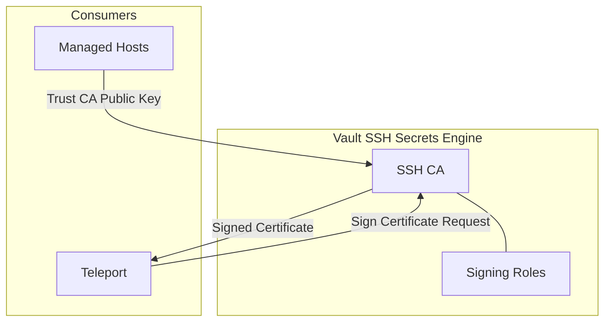
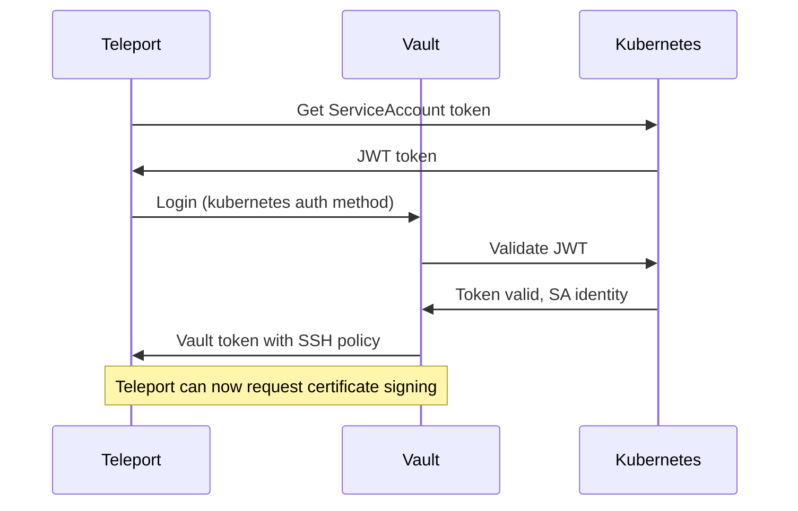
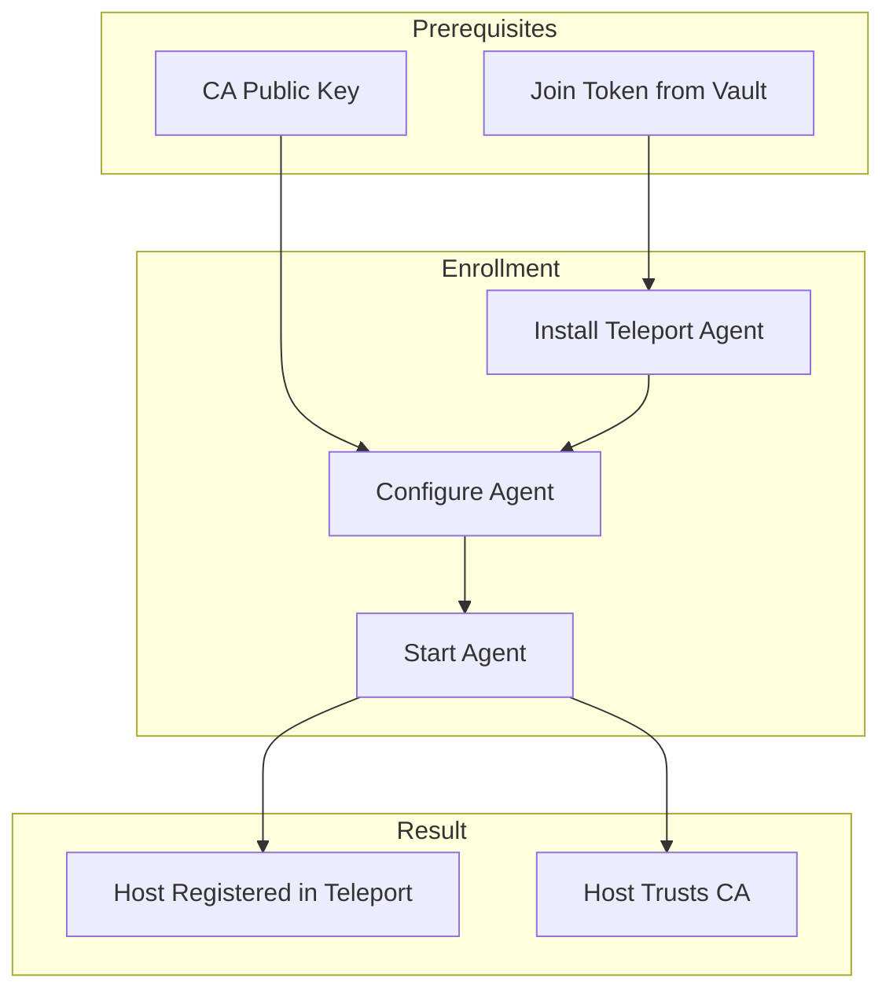
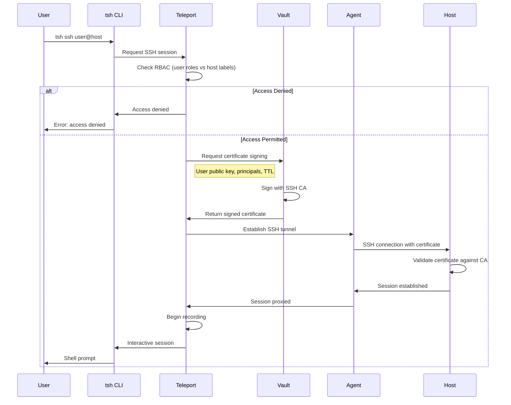

```
RFC-PAM-0001                                                    Section 6
Category: Standards Track                                     SSH Access
```

# 6. SSH Access

[← Previous: Identity Integration](./05-identity-integration.md) | [Index](./00-index.md#table-of-contents) | [Next: Database Access →](./07-database-access.md)

---

## 6.1 Certificate-Based Authentication

### 6.1.1 Overview

SSH access uses **certificate-based authentication** instead of traditional SSH keys. Users receive short-lived certificates signed by the Vault SSH CA, eliminating:

- Long-lived SSH keys that persist indefinitely
- Manual key distribution and revocation
- Authorized_keys file management across hosts

### 6.1.2 Certificate vs Key Authentication

| Aspect | SSH Keys | SSH Certificates |
|--------|----------|------------------|
| **Lifetime** | Indefinite until revoked | Time-limited (TTL) |
| **Revocation** | Remove from each host | Automatic at expiry |
| **Distribution** | Copy to authorized_keys | Present at connection time |
| **Audit** | Key fingerprint in logs | Certificate with identity claims |
| **Authority** | Decentralized per host | Centralized CA (Vault) |

### 6.1.3 Certificate Properties

SSH certificates issued through this architecture contain:

| Property | Description | Example |
|----------|-------------|---------|
| **Type** | User certificate | `user` |
| **Key ID** | Unique certificate identifier | `user-jane.doe-abc123` |
| **Valid Principals** | Unix usernames permitted | `ubuntu`, `ec2-user` |
| **Valid After** | Certificate start time | `2026-02-10T10:00:00Z` |
| **Valid Before** | Certificate expiry time | `2026-02-10T14:00:00Z` |
| **Extensions** | SSH features permitted | `permit-pty`, `permit-agent-forwarding` |

## 6.2 Vault SSH CA Integration

### 6.2.1 SSH Secrets Engine

Vault's SSH secrets engine acts as the Certificate Authority:



### 6.2.2 CA Key Management

| Component | Location | Access |
|-----------|----------|--------|
| CA Private Key | Vault (never exported) | Signing operations only |
| CA Public Key | Distributed to hosts | Public (TrustedUserCAKeys) |

The CA private key MUST NOT be exported from Vault. All signing operations occur within Vault.

### 6.2.3 Signing Roles

Vault defines signing roles with specific parameters:

| Role | TTL | Max TTL | Allowed Principals | Extensions |
|------|-----|---------|-------------------|------------|
| `developer` | 1h | 4h | `ubuntu`, `ec2-user` | `permit-pty` |
| `operator` | 4h | 8h | `ubuntu`, `ec2-user`, `root` | `permit-pty`, `permit-port-forwarding` |
| `emergency` | 30m | 1h | `root` | `permit-pty` |

### 6.2.4 Teleport-Vault Integration

Teleport authenticates to Vault using Kubernetes auth:



## 6.3 Host Enrollment

### 6.3.1 Enrollment Process

Hosts are enrolled in Teleport through agent deployment:



### 6.3.2 Agent Configuration

The SSH agent is configured with:

| Parameter | Description |
|-----------|-------------|
| `auth_server` | Teleport Auth Service address |
| `join_token` | One-time token from Vault (via ESO) |
| `ssh_service.enabled` | `true` |
| `ssh_service.labels` | Host labels for RBAC |

### 6.3.3 Host Labels

Hosts are labeled for RBAC targeting:

| Label | Example Values | Purpose |
|-------|----------------|---------|
| `env` | `production`, `staging`, `development` | Environment-based access |
| `team` | `platform`, `application`, `data` | Team ownership |
| `role` | `web`, `database`, `worker` | Server function |
| `region` | `us-east-1`, `eu-west-1` | Geographic location |

### 6.3.4 SSHD Configuration

Managed hosts configure sshd to trust only the Vault CA:

| Setting | Value | Purpose |
|---------|-------|---------|
| `TrustedUserCAKeys` | `/etc/ssh/trusted-user-ca-keys.pem` | Vault CA public key |
| `AuthorizedPrincipalsFile` | `/etc/ssh/auth_principals/%u` | Principal mapping |
| `PasswordAuthentication` | `no` | Disable password auth |
| `ChallengeResponseAuthentication` | `no` | Disable challenge-response |

Direct key authentication via `authorized_keys` is either disabled or restricted to emergency access only.

## 6.4 User Certificate Flow

### 6.4.1 Complete Flow



### 6.4.2 RBAC Evaluation

Before issuing a certificate, Teleport evaluates:

| Check | Description |
|-------|-------------|
| User roles | What roles does the user have? |
| Role permissions | What hosts can these roles access? |
| Host labels | Does the target host match allowed labels? |
| Principal mapping | What Unix users can this user become? |

### 6.4.3 Example RBAC

A user with role `developer`:

```
Role: developer
  Allow:
    - Node labels: env=development OR env=staging
    - Logins: ubuntu, ec2-user
  Deny:
    - Node labels: env=production
```

This user can SSH to development/staging hosts as `ubuntu` or `ec2-user`, but cannot access production.

## 6.5 Principal Mapping

### 6.5.1 Unix User Mapping

Certificates include **principals**—the Unix usernames the certificate holder can assume:

| Teleport Role | Allowed Principals | Rationale |
|---------------|-------------------|-----------|
| `developer` | `ubuntu`, `ec2-user` | Standard non-root access |
| `operator` | `ubuntu`, `ec2-user`, `root` | Administrative access |
| `emergency` | `root` | Break-glass only |

### 6.5.2 Principal Validation

Hosts validate principals through AuthorizedPrincipalsFile:

```
/etc/ssh/auth_principals/ubuntu:
  ubuntu
  developers

/etc/ssh/auth_principals/root:
  root
  emergency
```

A certificate with principal `ubuntu` can log in as user `ubuntu` if `ubuntu` is listed in that user's principals file.

### 6.5.3 Principal Hierarchy

```mermaid
flowchart TB
    subgraph Certificate["Certificate Principals"]
        CP[ubuntu, ec2-user]
    end

    subgraph Host["Host Configuration"]
        AP1[/etc/ssh/auth_principals/ubuntu]
        AP2[/etc/ssh/auth_principals/ec2-user]
        AP3[/etc/ssh/auth_principals/root]
    end

    subgraph Result["Access Result"]
        R1[Can login as ubuntu]
        R2[Can login as ec2-user]
        R3[Cannot login as root]
    end

    CP --> AP1 --> R1
    CP --> AP2 --> R2
    CP -.->|Principal not in cert| AP3 -.-> R3

    style R3 fill:#ffcccc
```

## 6.6 Session Recording

### 6.6.1 Recording Scope

All SSH sessions are recorded:

| Content | Captured |
|---------|----------|
| Terminal input | All keystrokes |
| Terminal output | All screen output |
| Session metadata | User, host, start/end time |
| Window size changes | Terminal resize events |

### 6.6.2 Recording Storage

Recordings are stored per RFC-SECOPS-0001 patterns:

| Aspect | Configuration |
|--------|---------------|
| Storage backend | S3-compatible or filesystem |
| Encryption | Encrypted at rest |
| Retention | Per compliance policy (default: 1 year) |
| Immutability | Write-once storage |

### 6.6.3 Session Playback

Recordings can be played back through:

- Teleport Web UI
- `tsh play` command
- Audit API for programmatic access

---

## Document Navigation

| Previous | Index | Next |
|----------|-------|------|
| [← 5. Identity Integration](./05-identity-integration.md) | [Table of Contents](./00-index.md#table-of-contents) | [7. Database Access →](./07-database-access.md) |

---

*End of Section 6 — RFC-PAM-0001*
