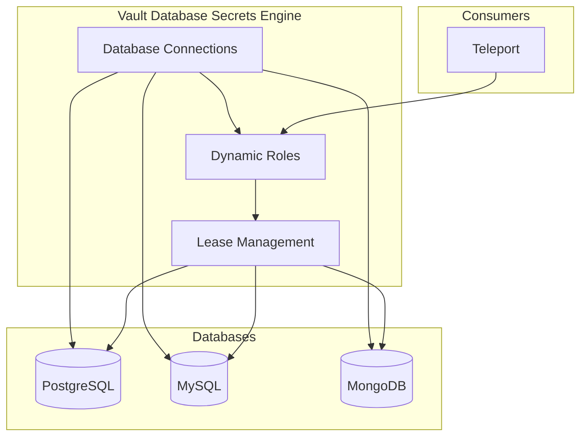
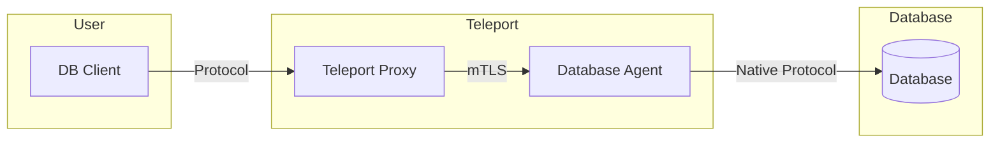
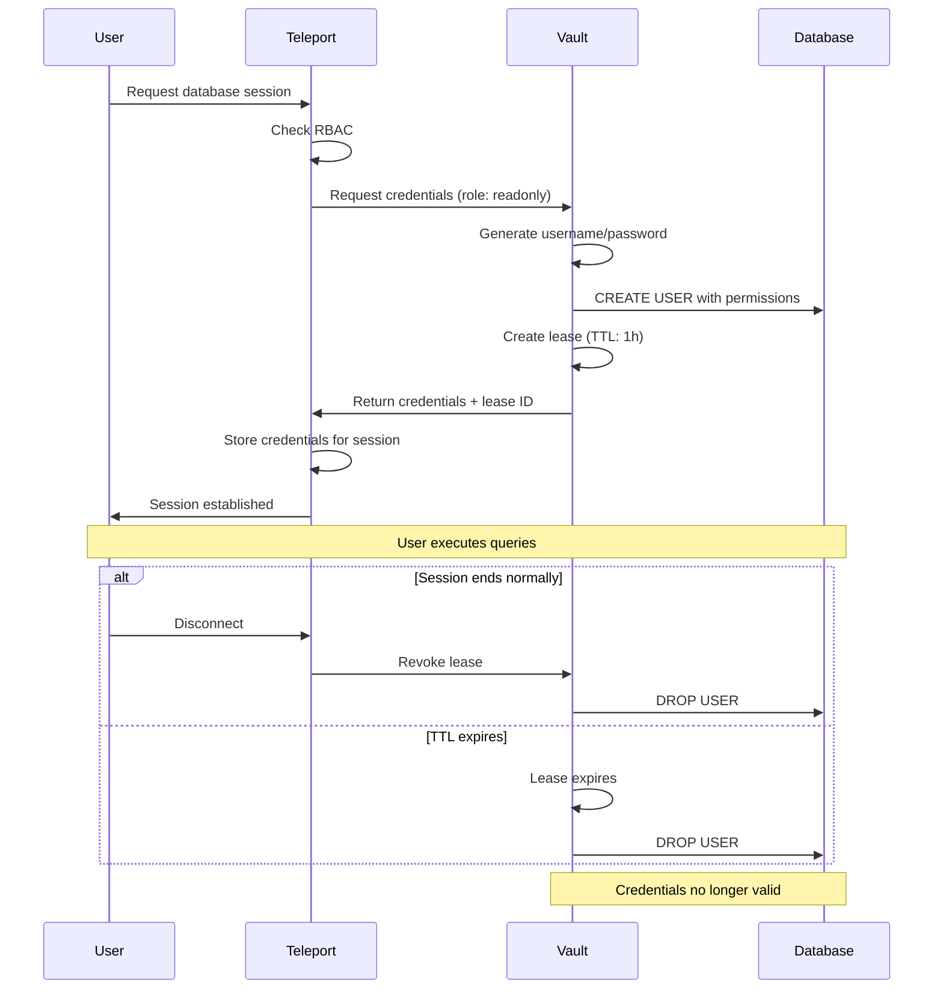

```
RFC-PAM-0001                                                    Section 7
Category: Standards Track                                Database Access
```

# 7. Database Access

[← Previous: SSH Access](./06-ssh-access.md) | [Index](./00-index.md#table-of-contents) | [Next: Kubernetes Governance →](./08-kubernetes-governance.md)

---

## 7.1 Dynamic Credential Model

### 7.1.1 Overview

Database access uses **dynamic credentials** generated on-demand by Vault. Each session receives unique, short-lived credentials that are automatically revoked at expiry.

### 7.1.2 Static vs Dynamic Credentials

| Aspect | Static Credentials | Dynamic Credentials |
|--------|-------------------|---------------------|
| **Lifetime** | Indefinite | Time-limited (TTL) |
| **Uniqueness** | Shared across sessions | Unique per session |
| **Revocation** | Manual password change | Automatic at expiry |
| **Accountability** | Difficult to attribute | Individual session attribution |
| **Rotation** | Disruptive, coordinated | Continuous, automatic |

### 7.1.3 Credential Properties

Dynamic credentials have these properties:

| Property | Value | Rationale |
|----------|-------|-----------|
| **Unique username** | Generated per session | Individual accountability |
| **Random password** | Cryptographically random | No credential reuse |
| **TTL** | 1-4 hours | Limit exposure window |
| **Auto-revocation** | At TTL expiry | No stale credentials |
| **Renewability** | Within max TTL | Support long sessions |

## 7.2 Vault Database Engine Integration

### 7.2.1 Database Secrets Engine

Vault's database secrets engine manages dynamic credentials:



### 7.2.2 Database Connections

Vault maintains administrative connections to managed databases:

| Connection | Database Type | Purpose |
|------------|---------------|---------|
| `postgres-prod` | PostgreSQL | Production database |
| `postgres-staging` | PostgreSQL | Staging database |
| `mysql-analytics` | MySQL | Analytics database |
| `mongo-app` | MongoDB | Application database |

### 7.2.3 Connection Configuration

Each connection specifies:

| Parameter | Description |
|-----------|-------------|
| `plugin_name` | Database plugin (e.g., `postgresql-database-plugin`) |
| `connection_url` | Database connection string |
| `allowed_roles` | Which Vault roles can use this connection |
| `username` | Vault's administrative username |
| `password` | Vault's administrative password (stored in Vault) |

### 7.2.4 Dynamic Roles

Vault defines roles that specify credential properties:

| Role | Database | Permissions | TTL | Max TTL |
|------|----------|-------------|-----|---------|
| `postgres-readonly` | `postgres-prod` | SELECT | 1h | 4h |
| `postgres-readwrite` | `postgres-prod` | SELECT, INSERT, UPDATE, DELETE | 2h | 4h |
| `postgres-admin` | `postgres-prod` | ALL PRIVILEGES | 30m | 1h |
| `mysql-readonly` | `mysql-analytics` | SELECT | 1h | 4h |

## 7.3 Supported Database Protocols

### 7.3.1 Protocol Support Matrix

| Database | Protocol | Port | Query Logging | Connection Pooling |
|----------|----------|------|---------------|-------------------|
| PostgreSQL | PostgreSQL wire protocol | 5432 | Full SQL | Yes |
| MySQL | MySQL wire protocol | 3306 | Full SQL | Yes |
| MariaDB | MySQL wire protocol | 3306 | Full SQL | Yes |
| MongoDB | MongoDB wire protocol | 27017 | Commands | Yes |
| Redis | RESP protocol | 6379 | Commands | Yes |
| SQL Server | TDS protocol | 1433 | Full SQL | Yes |
| Oracle | Oracle Net | 1521 | Limited | Yes |

### 7.3.2 Teleport Database Agent

The Database Agent handles protocol-specific proxying:



### 7.3.3 Client Compatibility

Users connect using standard database clients:

| Database | Supported Clients |
|----------|-------------------|
| PostgreSQL | `psql`, pgAdmin, DBeaver, any JDBC/ODBC client |
| MySQL | `mysql`, MySQL Workbench, DBeaver |
| MongoDB | `mongosh`, MongoDB Compass |
| Redis | `redis-cli`, RedisInsight |

## 7.4 Credential Lifecycle

### 7.4.1 Complete Lifecycle



### 7.4.2 Credential States

| State | Description | Duration |
|-------|-------------|----------|
| **Requested** | User requests database access | Milliseconds |
| **Active** | Credentials valid, session usable | TTL (e.g., 1 hour) |
| **Renewed** | TTL extended | Until max TTL |
| **Expired** | TTL reached, credentials revoked | Permanent |
| **Revoked** | Manually or on disconnect | Permanent |

### 7.4.3 Renewal

Sessions can be renewed within the max TTL:

| Scenario | Renewal Behavior |
|----------|-----------------|
| Active session, TTL approaching | Auto-renew if configured |
| User requests renewal | Extend TTL up to max |
| Max TTL reached | Must disconnect and reconnect |

## 7.5 Query Logging

### 7.5.1 Logging Scope

All database queries are logged:

| Database | Logging Detail |
|----------|----------------|
| PostgreSQL | Full SQL statements |
| MySQL | Full SQL statements |
| MongoDB | Command documents |
| Redis | All commands |

### 7.5.2 Log Content

Each query log entry includes:

| Field | Description | Example |
|-------|-------------|---------|
| Timestamp | When query executed | `2026-02-10T14:30:22Z` |
| User | Teleport user (not DB user) | `jane.doe` |
| Database | Target database | `postgres-prod` |
| Query | SQL/command text | `SELECT * FROM users` |
| Duration | Execution time | `42ms` |
| Rows | Rows affected/returned | `156` |

### 7.5.3 Sensitive Data Handling

Query logging has configurable redaction:

| Option | Behavior |
|--------|----------|
| Full logging | All query text captured |
| Parameter redaction | Bind parameters redacted |
| Query hash only | Only query fingerprint stored |
| Disabled | No query logging (audit metadata only) |

Default: Full logging with parameter redaction for sensitive databases.

## 7.6 Access Control

### 7.6.1 RBAC for Databases

Teleport roles define database access:

| Role | Databases | Vault Role | Permissions |
|------|-----------|------------|-------------|
| `developer` | `postgres-staging` | `postgres-readonly` | SELECT |
| `data-analyst` | `mysql-analytics` | `mysql-readonly` | SELECT |
| `dba-oncall` | All databases | `postgres-admin` | ALL |
| `sre-oncall` | Production databases | `postgres-readwrite` | DML |

### 7.6.2 Label-Based Access

Databases are labeled similar to SSH hosts:

| Label | Values | Purpose |
|-------|--------|---------|
| `env` | `production`, `staging` | Environment access |
| `team` | `platform`, `analytics` | Team ownership |
| `sensitivity` | `public`, `confidential`, `restricted` | Data classification |

### 7.6.3 Example Role Definition

A `data-analyst` role might allow:

```
Role: data-analyst
  Allow:
    - Database labels: team=analytics AND sensitivity!=restricted
    - Database roles: readonly
  Deny:
    - Database labels: env=production AND sensitivity=restricted
```

## 7.7 Separation from Service Access

### 7.7.1 Human vs Service Access

| Aspect | Human Access (RFC-PAM) | Service Access (RFC-WORKLOAD-IDENTITY) |
|--------|------------------------|----------------------------------------|
| Identity | Keycloak user | Kubernetes ServiceAccount |
| Credentials | Teleport + Vault dynamic | Vault dynamic directly |
| Query logging | Required | Optional (application logs) |
| Session recording | Required | Not applicable |
| Access broker | Teleport | Direct to Vault |

### 7.7.2 Why Separate?

Services accessing databases do not require:
- Interactive session recording (no human session)
- Query attribution to human identity (application context suffices)
- JIT approval workflows (pre-authorized via policy)

Services use Vault directly via Kubernetes auth, as defined in RFC-WORKLOAD-IDENTITY.

---

## Document Navigation

| Previous | Index | Next |
|----------|-------|------|
| [← 6. SSH Access](./06-ssh-access.md) | [Table of Contents](./00-index.md#table-of-contents) | [8. Kubernetes Governance →](./08-kubernetes-governance.md) |

---

*End of Section 7 — RFC-PAM-0001*
