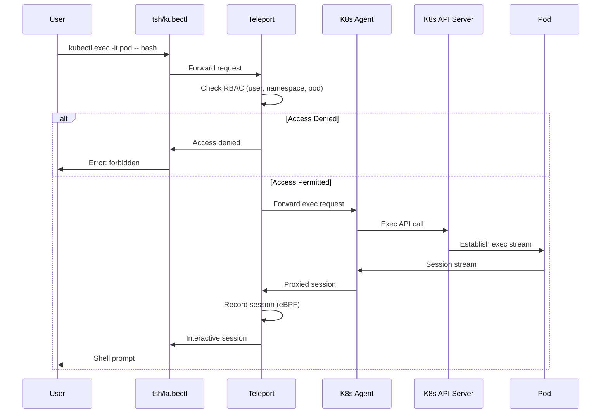
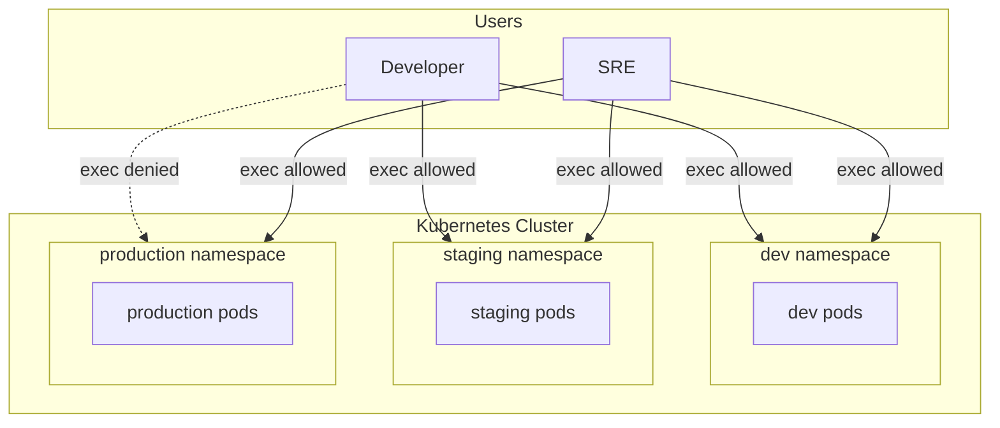
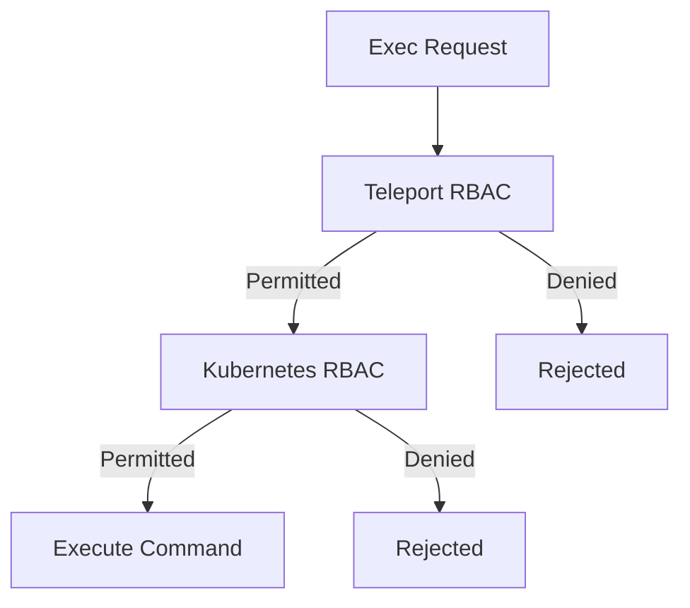
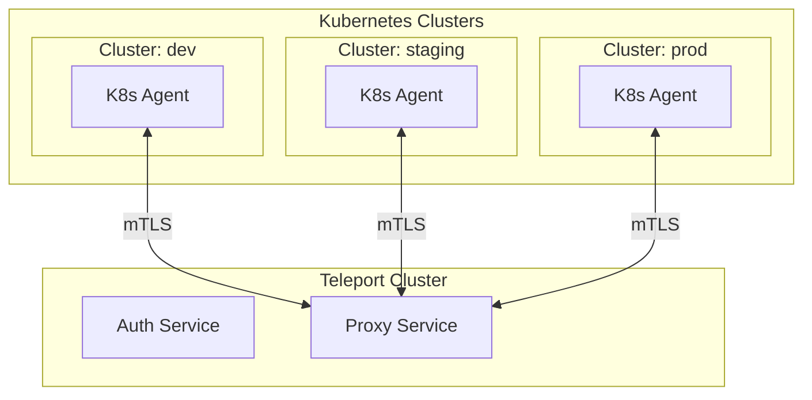

```
RFC-PAM-0001                                                    Section 8
Category: Standards Track                         Kubernetes Governance
```

# 8. Kubernetes Governance

[← Previous: Database Access](./07-database-access.md) | [Index](./00-index.md#table-of-contents) | [Next: Session Management →](./09-session-management.md)

---

## 8.1 exec/attach Access Control

### 8.1.1 Overview

Kubernetes `exec` and `attach` commands provide shell access to running containers. This access requires governance similar to SSH access:

- **Authentication**: User identity must be verified
- **Authorization**: Access must be explicitly permitted
- **Recording**: Sessions must be captured for audit
- **Accountability**: Commands must be attributable to individuals

### 8.1.2 Governed Operations

| Operation | kubectl Command | Risk Level |
|-----------|-----------------|------------|
| **exec** | `kubectl exec -it pod -- /bin/bash` | High - arbitrary command execution |
| **attach** | `kubectl attach -it pod` | High - access to running process |
| **port-forward** | `kubectl port-forward pod 8080:80` | Medium - network access bypass |
| **logs** | `kubectl logs pod` | Low - read-only |
| **cp** | `kubectl cp file pod:/path` | Medium - file transfer |

### 8.1.3 Access Flow



## 8.2 Port-Forward Governance

### 8.2.1 Port-Forward Risks

Port-forwarding creates direct network paths that may bypass security controls:

| Risk | Description |
|------|-------------|
| **Service exposure** | Internal services accessible from developer machine |
| **Security bypass** | Circumvent ingress controls and WAF |
| **Data exfiltration** | Direct access to databases or APIs |
| **Audit gap** | Traffic not logged through normal channels |

### 8.2.2 Governance Controls

| Control | Implementation |
|---------|----------------|
| **Allowlist ports** | Only specific ports can be forwarded |
| **Namespace restrictions** | Port-forward only in permitted namespaces |
| **Duration limits** | Maximum port-forward session time |
| **Logging** | All port-forward requests logged |

### 8.2.3 Port-Forward RBAC

Roles can specify port-forward permissions:

| Role | Namespaces | Allowed Ports | Max Duration |
|------|------------|---------------|--------------|
| `developer` | `dev-*`, `staging-*` | 8080, 3000, 5000 | 4h |
| `sre-oncall` | All | All | 8h |
| `data-analyst` | `analytics-*` | 5432, 3306 | 2h |

## 8.3 Namespace-Based Policies

### 8.3.1 Namespace as Security Boundary

Kubernetes namespaces provide a natural access boundary:



### 8.3.2 Namespace Access Matrix

| Role | Namespace Pattern | exec/attach | port-forward | logs |
|------|-------------------|-------------|--------------|------|
| `developer` | `dev-*` | Yes | Yes | Yes |
| `developer` | `staging-*` | Yes | Yes | Yes |
| `developer` | `prod-*` | No | No | Yes |
| `sre-oncall` | `*` | Yes | Yes | Yes |
| `data-analyst` | `analytics-*` | No | Yes (DB ports) | Yes |

### 8.3.3 Label-Based Refinement

Beyond namespaces, pod labels provide fine-grained control:

| Label | Purpose | Example |
|-------|---------|---------|
| `app` | Application name | `app=frontend` |
| `tier` | Application tier | `tier=database` |
| `sensitivity` | Data sensitivity | `sensitivity=pii` |

A role might allow exec to `app=frontend` but deny exec to `tier=database` within the same namespace.

## 8.4 Integration with Kubernetes RBAC

### 8.4.1 Dual Authorization

Teleport and Kubernetes RBAC work together:



Both must permit the action:
1. **Teleport RBAC**: Can this user exec in this namespace/pod?
2. **Kubernetes RBAC**: Does the agent's ServiceAccount have exec permissions?

### 8.4.2 Teleport Agent Permissions

The Teleport Kubernetes Agent requires RBAC permissions:

| Resource | Verbs | Purpose |
|----------|-------|---------|
| `pods` | `get`, `list` | Enumerate pods for access |
| `pods/exec` | `create` | Execute commands in pods |
| `pods/attach` | `create` | Attach to pod processes |
| `pods/portforward` | `create` | Port-forward to pods |

### 8.4.3 User Identity Propagation

Teleport propagates user identity to Kubernetes:

| Kubernetes Context | Value | Source |
|--------------------|-------|--------|
| User | `teleport:jane.doe` | Teleport user identity |
| Groups | `teleport:developers` | Teleport roles |
| Extra: `teleport-login` | `jane.doe@example.com` | Keycloak email claim |

This enables Kubernetes audit logs to attribute actions to actual users.

## 8.5 eBPF Session Capture

### 8.5.1 Overview

Teleport uses eBPF (extended Berkeley Packet Filter) for low-latency session capture within containers:

| Method | Latency | Capture Scope | Container Support |
|--------|---------|---------------|-------------------|
| **eBPF** | Minimal | All process activity | Full |
| **Script wrapping** | Higher | Shell commands only | Partial |
| **Audit logging** | None | System calls | Kernel-level |

### 8.5.2 eBPF Capabilities

eBPF capture includes:

| Event | Description |
|-------|-------------|
| **Command execution** | All commands run in session |
| **File access** | Files opened/read/written |
| **Network connections** | Outbound connections from session |
| **Process creation** | Child processes spawned |

### 8.5.3 Recording Content

Kubernetes exec sessions record:

| Content | Captured |
|---------|----------|
| Terminal input | All keystrokes |
| Terminal output | All screen output |
| Process events | Commands, file access (via eBPF) |
| Session metadata | User, pod, namespace, start/end |

### 8.5.4 eBPF Requirements

eBPF capture requires:

| Requirement | Description |
|-------------|-------------|
| Kernel version | Linux 5.8+ recommended |
| Capabilities | `CAP_SYS_ADMIN` or `CAP_BPF` |
| Agent deployment | DaemonSet on cluster nodes |
| Node access | Agent must run on same node as pods |

## 8.6 Multi-Cluster Support

### 8.6.1 Cluster Registration

Multiple Kubernetes clusters can be registered with Teleport:



### 8.6.2 Cluster Labels

Clusters are labeled for RBAC:

| Label | Values | Purpose |
|-------|--------|---------|
| `env` | `dev`, `staging`, `prod` | Environment |
| `region` | `us-east`, `eu-west` | Geographic location |
| `tier` | `tier1`, `tier2` | Criticality |

### 8.6.3 Cross-Cluster RBAC

Roles can span clusters:

| Role | Cluster Pattern | Namespaces |
|------|-----------------|------------|
| `developer` | `env=dev OR env=staging` | All |
| `sre-oncall` | All | All |
| `prod-viewer` | `env=prod` | All (logs only) |

---

## Document Navigation

| Previous | Index | Next |
|----------|-------|------|
| [← 7. Database Access](./07-database-access.md) | [Table of Contents](./00-index.md#table-of-contents) | [9. Session Management →](./09-session-management.md) |

---

*End of Section 8 — RFC-PAM-0001*
