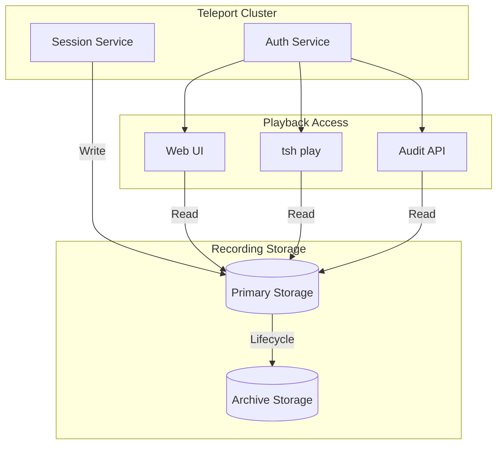
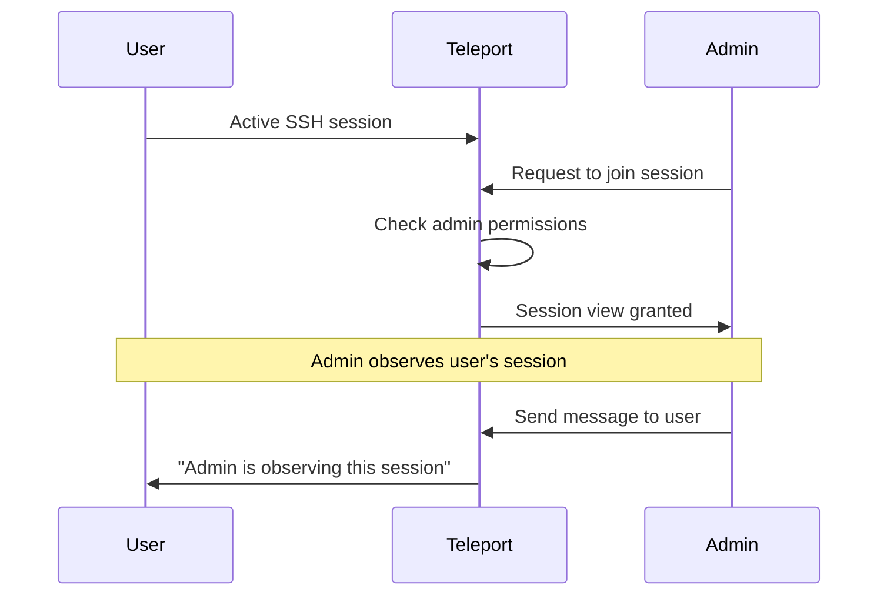
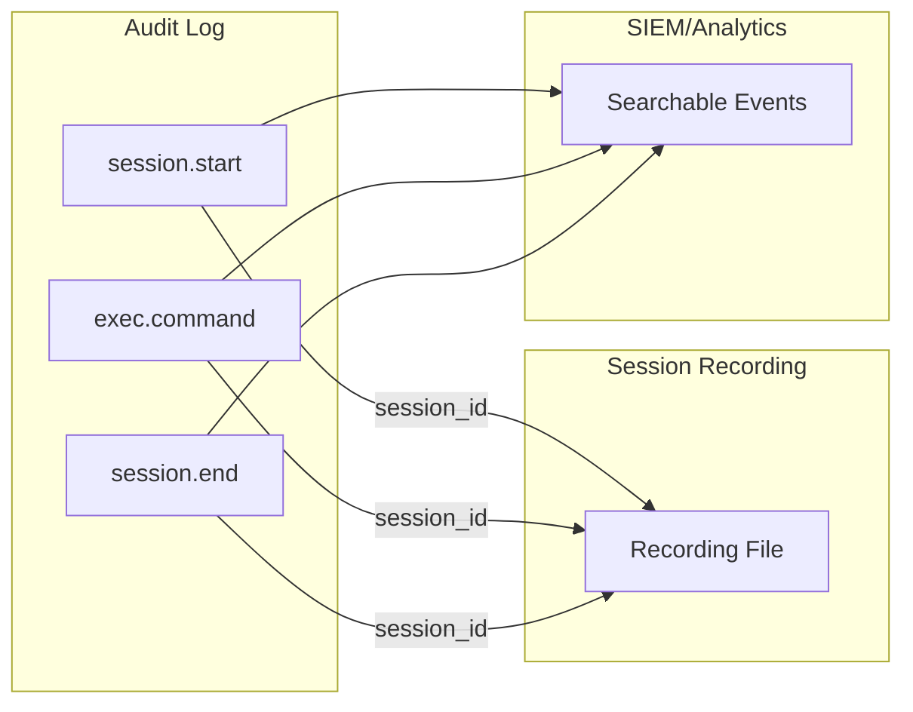

```
RFC-PAM-0001                                                    Section 9
Category: Standards Track                           Session Management
```

# 9. Session Management

[← Previous: Kubernetes Governance](./08-kubernetes-governance.md) | [Index](./00-index.md#table-of-contents) | [Next: Access Requests →](./10-access-requests.md)

---

## 9.1 Session Recording Requirements

### 9.1.1 Mandatory Recording

Per INV-6, all interactive sessions MUST be recorded. This is non-negotiable for compliance and security.

| Session Type | Recording Required | Content Captured |
|--------------|-------------------|------------------|
| SSH | Yes | Terminal I/O, metadata |
| Database | Yes | Queries, metadata |
| Kubernetes exec | Yes | Terminal I/O, eBPF events |
| RDP | Yes | Screen capture, metadata |
| Application | Yes | HTTP requests (where applicable) |

### 9.1.2 Recording Triggers

Recording begins automatically:

| Trigger | Action |
|---------|--------|
| Session established | Recording starts |
| Session terminates | Recording finalized |
| Session timeout | Recording finalized |
| Connection lost | Recording preserved to last event |

### 9.1.3 Recording Failures

If recording cannot be established:

| Scenario | Behavior |
|----------|----------|
| Storage unavailable | Session blocked (fail-closed) |
| Recording agent unavailable | Session blocked |
| Recording corrupted | Alert generated, session continues |

The system is **fail-closed**—sessions are denied if recording cannot be guaranteed.

## 9.2 Recording Storage

### 9.2.1 Storage Backend

Session recordings are stored in durable, immutable storage:

| Backend Type | Use Case | Characteristics |
|--------------|----------|-----------------|
| S3-compatible | Production | Highly durable, scalable |
| GCS | GCP environments | Native GCP integration |
| Azure Blob | Azure environments | Native Azure integration |
| Filesystem | Development/testing | Local storage |

### 9.2.2 Storage Requirements

| Requirement | Specification |
|-------------|---------------|
| **Durability** | 99.999999999% (11 9s) recommended |
| **Availability** | 99.9% for playback access |
| **Encryption** | AES-256 at rest |
| **Immutability** | Write-once, no deletion during retention |
| **Retention** | Configurable (default: 1 year) |

### 9.2.3 Storage Architecture



### 9.2.4 Retention Policies

| Data Type | Retention Period | Rationale |
|-----------|-----------------|-----------|
| Session recordings | 1 year | Compliance requirement |
| Session metadata | 3 years | Audit trail |
| Access logs | 3 years | Security investigation |
| Deleted after retention | Automatic | Storage cost management |

## 9.3 Session Playback

### 9.3.1 Playback Methods

Recordings can be played back through multiple interfaces:

| Method | Interface | Use Case |
|--------|-----------|----------|
| **Web UI** | Browser-based player | Visual review |
| **CLI** | `tsh play <session-id>` | Terminal playback |
| **API** | REST/gRPC | Programmatic access |
| **Export** | Download recording file | Offline analysis |

### 9.3.2 Playback Features

| Feature | Description |
|---------|-------------|
| **Speed control** | 0.5x to 4x playback speed |
| **Seek** | Jump to specific timestamp |
| **Search** | Search for text in session |
| **Events** | Jump between recorded events |
| **Metadata** | View session metadata alongside |

### 9.3.3 Playback Authorization

Not everyone can view recordings:

| Role | Playback Access |
|------|-----------------|
| `auditor` | All recordings |
| `security-analyst` | All recordings |
| `team-lead` | Team member recordings |
| `platform-admin` | All recordings |
| Regular users | Own recordings only |

### 9.3.4 Playback Audit

Playback access is itself audited:

| Event | Logged Information |
|-------|-------------------|
| Recording accessed | Who, when, which session |
| Recording downloaded | Who, when, which session |
| Recording searched | Who, when, search terms |

## 9.4 Live Session Moderation

### 9.4.1 Overview

Administrators can observe and control active sessions:

| Capability | Description |
|------------|-------------|
| **Join** | View active session in real-time |
| **Terminate** | Force-end a session |
| **Pause** | Temporarily suspend session input |

### 9.4.2 Session Join

Authorized users can join active sessions:



### 9.4.3 Session Termination

Administrators can terminate sessions:

| Scenario | Action |
|----------|--------|
| Security incident | Immediate termination |
| Policy violation | Termination with warning |
| Resource cleanup | Termination of idle sessions |

Terminated sessions are logged with termination reason.

### 9.4.4 Moderation Permissions

| Role | Join | Terminate | Pause |
|------|------|-----------|-------|
| `security-analyst` | Yes | Yes | Yes |
| `platform-admin` | Yes | Yes | Yes |
| `team-lead` | Team sessions | Team sessions | No |
| Regular users | No | No | No |

## 9.5 Audit Log Integration

### 9.5.1 Audit Event Types

All PAM events are logged:

| Event Category | Examples |
|----------------|----------|
| **Authentication** | Login success, login failure, logout |
| **Session** | Session start, session end, session join |
| **Access** | Resource access granted, access denied |
| **Administrative** | Role change, resource registered |
| **Security** | Session terminated, certificate revoked |

### 9.5.2 Event Schema

Each audit event contains:

| Field | Description | Example |
|-------|-------------|---------|
| `event` | Event type | `session.start` |
| `time` | ISO 8601 timestamp | `2026-02-10T14:30:00Z` |
| `user` | User identity | `jane.doe@example.com` |
| `addr.remote` | Client IP address | `10.0.1.50` |
| `server_id` | Target resource | `server-abc123` |
| `session_id` | Session identifier | `session-xyz789` |
| `success` | Operation outcome | `true` |

### 9.5.3 Log Destinations

Audit logs can be sent to multiple destinations:

| Destination | Use Case |
|-------------|----------|
| **Teleport backend** | Native storage |
| **Elasticsearch** | Search and analytics |
| **Splunk** | SIEM integration |
| **S3/GCS** | Long-term archive |
| **Syslog** | Legacy integration |

### 9.5.4 Log Correlation

Session recordings link to audit events:



### 9.5.5 Compliance Reporting

Audit logs support compliance reports:

| Report Type | Content |
|-------------|---------|
| Access report | Who accessed what, when |
| Session report | All sessions for a user/resource |
| Approval report | JIT requests and approvals |
| Anomaly report | Unusual access patterns |

---

## Document Navigation

| Previous | Index | Next |
|----------|-------|------|
| [← 8. Kubernetes Governance](./08-kubernetes-governance.md) | [Table of Contents](./00-index.md#table-of-contents) | [10. Access Requests →](./10-access-requests.md) |

---

*End of Section 9 — RFC-PAM-0001*
