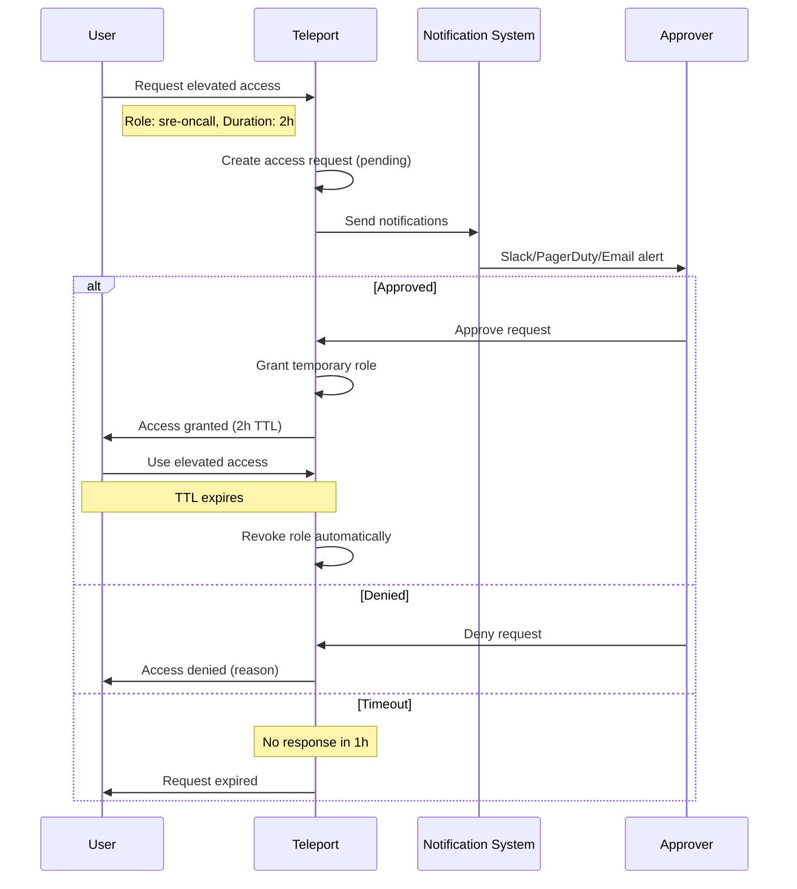
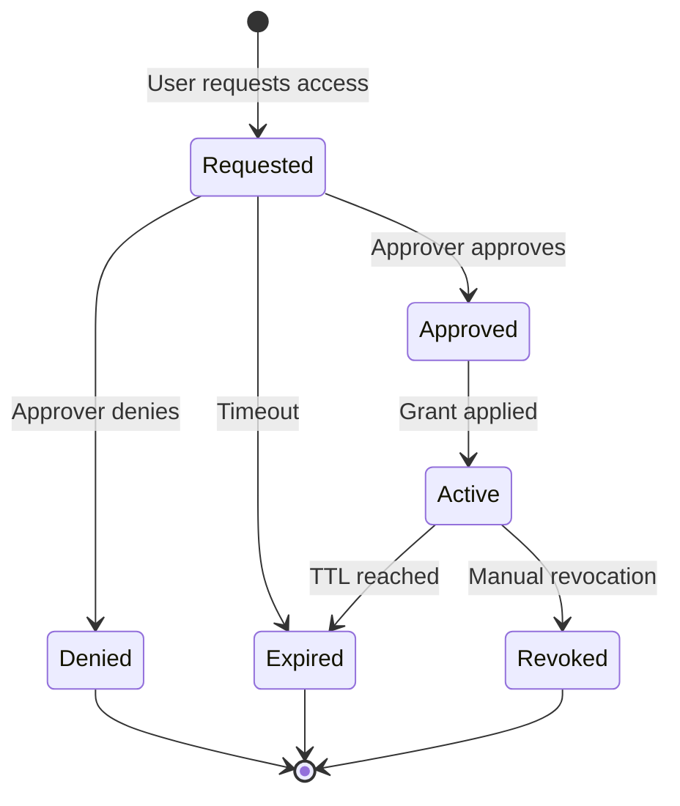
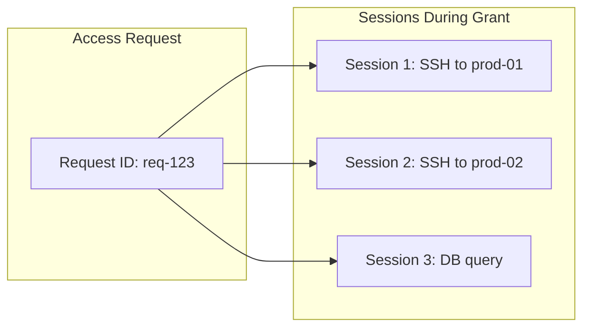

```
RFC-PAM-0001                                                   Section 10
Category: Standards Track                               Access Requests
```

# 10. Access Requests

[← Previous: Session Management](./09-session-management.md) | [Index](./00-index.md#table-of-contents) | [Next: GitOps Integration →](./11-gitops-integration.md)

---

## 10.1 Just-in-Time Access Model

### 10.1.1 Overview

Just-in-time (JIT) access provides elevated permissions only when needed, for a limited duration, with explicit approval. This eliminates standing elevated access.

### 10.1.2 JIT vs Standing Access

| Aspect | Standing Access | Just-in-Time Access |
|--------|-----------------|---------------------|
| **Duration** | Indefinite | Time-bound (e.g., 2 hours) |
| **Availability** | Always available | On-demand with approval |
| **Accountability** | Assumed consent | Explicit request + approval |
| **Audit trail** | Role assignment only | Request, approval, usage |
| **Risk exposure** | Continuous | Only during grant period |

### 10.1.3 When JIT is Required

| Scenario | JIT Required | Rationale |
|----------|--------------|-----------|
| Production SSH | Yes | High-impact environment |
| Production database | Yes | Sensitive data access |
| Root/admin access | Yes | Privileged operations |
| Development access | No (self-approve) | Low risk, high frequency |
| Staging access | Configurable | Medium risk |

## 10.2 Request Workflow

### 10.2.1 Request Flow



### 10.2.2 Request Components

A JIT access request includes:

| Component | Description | Example |
|-----------|-------------|---------|
| **Requester** | Who is requesting | `jane.doe@example.com` |
| **Roles requested** | What elevated access | `sre-oncall` |
| **Resources** | Specific resources (optional) | `prod-db-01` |
| **Duration** | How long needed | `2 hours` |
| **Reason** | Justification | `Incident INC-12345` |
| **Urgency** | Request priority | `high` |

### 10.2.3 Request States

| State | Description | Transitions |
|-------|-------------|-------------|
| **Pending** | Awaiting approval | → Approved, Denied, Expired |
| **Approved** | Access granted | → Active → Expired |
| **Active** | Currently using access | → Expired, Revoked |
| **Expired** | TTL reached | Terminal |
| **Denied** | Request rejected | Terminal |
| **Revoked** | Manually revoked | Terminal |

## 10.3 Approval Chains

### 10.3.1 Approval Requirements

Different access levels require different approvals:

| Access Type | Environment | Required Approvers |
|-------------|-------------|-------------------|
| SSH | Development | Self-approve |
| SSH | Staging | Team lead OR SRE |
| SSH | Production | SRE oncall AND Manager |
| Database | Non-prod (readonly) | Self-approve |
| Database | Production | DBA oncall |
| Root access | Any | Security AND Manager |
| Kubernetes exec | Non-prod | Self-approve |
| Kubernetes exec | Production | SRE oncall |

### 10.3.2 Approval Logic

| Operator | Meaning |
|----------|---------|
| **OR** | Any one approver sufficient |
| **AND** | All listed approvers required |
| **Self-approve** | Automatically approved |

### 10.3.3 Approver Resolution

Approvers are determined by:

| Method | Description |
|--------|-------------|
| **Role-based** | Anyone with `approver` role |
| **Team-based** | Team lead of requester's team |
| **Oncall-based** | Current oncall for relevant service |
| **Named individuals** | Specific users |

### 10.3.4 Escalation

If approval is not received:

| Scenario | Action |
|----------|--------|
| No response in 30 minutes | Escalate to secondary approvers |
| No response in 1 hour | Request expires |
| Urgent request | Notify via PagerDuty |

## 10.4 Time-Bound Access Grants

### 10.4.1 Grant Properties

Approved requests result in time-bound grants:

| Property | Description | Configurable |
|----------|-------------|--------------|
| **Start time** | When access begins | Immediate or scheduled |
| **Duration** | How long access lasts | Per request, capped by policy |
| **Max duration** | Maximum allowed | Per role definition |
| **Extension** | Can duration be extended | Per policy |

### 10.4.2 Duration Guidelines

| Access Type | Typical Duration | Max Duration |
|-------------|------------------|--------------|
| Incident response | 2 hours | 8 hours |
| Debugging | 1 hour | 4 hours |
| Maintenance window | 4 hours | 8 hours |
| Emergency/break-glass | 30 minutes | 1 hour |

### 10.4.3 Access Lifecycle



### 10.4.4 Automatic Revocation

At TTL expiry:

1. Temporary role removed from user
2. Active sessions may continue (configurable)
3. New sessions denied
4. Audit event logged

## 10.5 Notification Integration

### 10.5.1 Notification Channels

| Channel | Use Case | Configuration |
|---------|----------|---------------|
| **Slack** | Team notifications | Webhook + channel |
| **PagerDuty** | Urgent escalation | Integration key |
| **Email** | Formal notification | SMTP server |
| **Microsoft Teams** | Enterprise environments | Webhook |
| **Custom webhook** | Integration flexibility | HTTP endpoint |

### 10.5.2 Notification Events

| Event | Notified Parties | Channel |
|-------|------------------|---------|
| Request created | Approvers | Slack, Email |
| Request approved | Requester | Slack, Email |
| Request denied | Requester | Slack, Email |
| Request expired | Requester | Slack |
| Access expiring soon | User with access | Slack |
| Urgent request | Oncall | PagerDuty |

### 10.5.3 Notification Content

Request notification includes:

| Field | Description |
|-------|-------------|
| Requester | Who is asking |
| Roles | What access is requested |
| Duration | How long |
| Reason | Why (from requester) |
| Approve link | One-click approval |
| Deny link | One-click denial |

### 10.5.4 Example Slack Notification

```
🔐 Access Request

User: jane.doe@example.com
Requesting: sre-oncall role
Duration: 2 hours
Reason: Incident INC-12345 - Production database investigation

[Approve] [Deny] [View Details]
```

## 10.6 Request Audit Trail

### 10.6.1 Audited Events

Every JIT action is logged:

| Event | Logged Data |
|-------|-------------|
| Request created | Requester, roles, reason, timestamp |
| Request approved | Approver, timestamp, comments |
| Request denied | Denier, timestamp, reason |
| Access granted | Start time, end time, scope |
| Access used | Sessions within grant period |
| Access expired | End timestamp, sessions at expiry |
| Access revoked | Revoker, timestamp, reason |

### 10.6.2 Linking Requests to Sessions

Sessions are linked to the access request that enabled them:



This enables answering: "What did this user do with the access they requested?"

### 10.6.3 Compliance Evidence

JIT requests provide compliance evidence:

| Requirement | Evidence |
|-------------|----------|
| Access was authorized | Approval record |
| Access was time-limited | Grant duration |
| Access was justified | Request reason |
| Access was used appropriately | Linked session recordings |

---

## Document Navigation

| Previous | Index | Next |
|----------|-------|------|
| [← 9. Session Management](./09-session-management.md) | [Table of Contents](./00-index.md#table-of-contents) | [11. GitOps Integration →](./11-gitops-integration.md) |

---

*End of Section 10 — RFC-PAM-0001*
