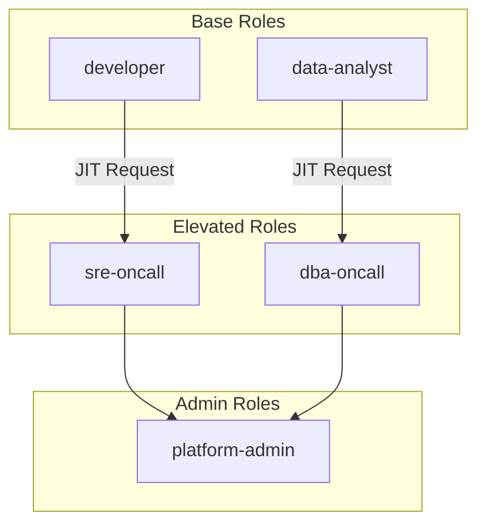
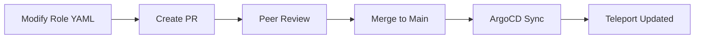
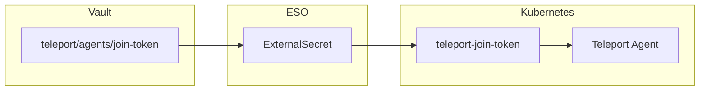

```
RFC-PAM-0001                                                   Section 11
Category: Standards Track                            GitOps Integration
```

# 11. GitOps Integration

[← Previous: Access Requests](./10-access-requests.md) | [Index](./00-index.md#table-of-contents) | [Next: Rationale →](./12-rationale.md)

---

## 11.1 Configuration in Git

### 11.1.1 GitOps Principles

PAM configuration follows GitOps principles established in RFC-IAM-0001 §7:

| Principle | Application to PAM |
|-----------|-------------------|
| **Git as source of truth** | Role definitions stored in Git |
| **Declarative configuration** | Teleport resources as YAML |
| **Version control** | All changes tracked with history |
| **Peer review** | Changes require PR approval |
| **Automated sync** | ArgoCD deploys configuration |

### 11.1.2 Repository Structure

PAM configuration lives within the platform stack structure:

```
platform/
└── stacks/
    └── security/
        └── charts/
            ├── teleport/
            │   ├── Chart.yaml
            │   ├── values.yaml
            │   └── templates/
            │       ├── auth-service.yaml
            │       ├── proxy-service.yaml
            │       ├── oidc-connector.yaml
            │       ├── roles/
            │       │   ├── developer.yaml
            │       │   ├── sre-oncall.yaml
            │       │   ├── dba-oncall.yaml
            │       │   ├── data-analyst.yaml
            │       │   └── platform-admin.yaml
            │       └── external-secret.yaml
            │
            ├── teleport-agents/
            │   ├── Chart.yaml
            │   ├── values.yaml
            │   └── templates/
            │       ├── ssh-agent-daemonset.yaml
            │       ├── db-agent-deployment.yaml
            │       └── kube-agent-deployment.yaml
            │
            └── vault/
                └── templates/
                    ├── ssh-engine-config.yaml
                    └── db-engine-config.yaml
```

### 11.1.3 Configuration Categories

| Category | GitOps Managed | Example |
|----------|----------------|---------|
| Teleport cluster config | Yes | Auth/proxy service settings |
| OIDC connector | Yes | Keycloak integration |
| Role definitions | Yes | What permissions exist |
| Agent deployments | Yes | DaemonSets, Deployments |
| Vault engine config | Yes | SSH CA, database connections |
| User-role assignments | No | Who has what role |
| Active sessions | No | Runtime state |
| Access requests | No | Runtime state |

## 11.2 Role Definitions

### 11.2.1 Role Structure

Teleport roles define access permissions:

| Component | Purpose |
|-----------|---------|
| **Metadata** | Role name, description |
| **Allow rules** | What this role permits |
| **Deny rules** | What this role explicitly blocks |
| **Options** | Session settings, TTLs |

### 11.2.2 Role Definition Example

A `developer` role definition (conceptual structure):

```yaml
kind: role
metadata:
  name: developer
  description: Standard developer access to non-production resources
spec:
  allow:
    # SSH access
    node_labels:
      env: ['development', 'staging']
    logins: ['ubuntu', 'ec2-user']

    # Database access
    db_labels:
      env: ['development', 'staging']
    db_roles: ['readonly']

    # Kubernetes access
    kubernetes_labels:
      env: ['development', 'staging']
    kubernetes_groups: ['developers']
    kubernetes_resources:
      - kind: pod
        verbs: ['get', 'list']
      - kind: pod/exec
        verbs: ['create']

  deny:
    # Explicitly block production
    node_labels:
      env: ['production']
    db_labels:
      env: ['production']

  options:
    max_session_ttl: 8h
    forward_agent: false
    port_forwarding: true
```

### 11.2.3 Role Hierarchy

Roles are designed in a hierarchy:



Users start with base roles and request elevated roles through JIT.

### 11.2.4 Role Change Process

Role definition changes follow the standard GitOps workflow:



## 11.3 Policy Management

### 11.3.1 Access Policies

Access policies define JIT requirements:

| Policy Component | Description |
|------------------|-------------|
| **Requestable roles** | Which roles can be requested |
| **Approval requirements** | Who must approve |
| **Max duration** | How long access can last |
| **Request reasons** | Required justification |

### 11.3.2 Approval Policies

Approval policies are defined in Git:

| Role | Approval Policy | Max Duration |
|------|-----------------|--------------|
| `sre-oncall` | `approvers: [oncall-sre, manager]` | 8h |
| `dba-oncall` | `approvers: [oncall-dba]` | 4h |
| `platform-admin` | `approvers: [security, manager], threshold: 2` | 2h |

### 11.3.3 Session Policies

Session policies control behavior:

| Policy | Setting | Scope |
|--------|---------|-------|
| Recording mode | `strict` (fail if recording unavailable) | All sessions |
| Idle timeout | 30 minutes | All sessions |
| Max concurrent sessions | 5 | Per user |
| Clipboard sharing | Disabled for production | Per environment |

## 11.4 ESO Secret Distribution

### 11.4.1 Teleport Secrets

Teleport requires secrets distributed via ESO:

| Secret | Vault Path | K8s Secret | Usage |
|--------|------------|------------|-------|
| OIDC client secret | `secret/platform/teleport/oidc` | `teleport-oidc-client` | Keycloak auth |
| License key | `secret/platform/teleport/license` | `teleport-license` | Enterprise features |
| CA private key | `ssh/config/ca` | `teleport-ssh-ca` | SSH certificate signing |
| Join tokens | `secret/platform/teleport/agents` | `teleport-join-token` | Agent enrollment |

### 11.4.2 ExternalSecret Definitions

ExternalSecrets are defined in Helm templates:

```yaml
apiVersion: external-secrets.io/v1beta1
kind: ExternalSecret
metadata:
  name: teleport-oidc-client
  namespace: teleport
spec:
  refreshInterval: 1h
  secretStoreRef:
    name: vault-backend
    kind: ClusterSecretStore
  target:
    name: teleport-oidc-client
  data:
    - secretKey: client-secret
      remoteRef:
        key: secret/platform/teleport/oidc
        property: client_secret
```

### 11.4.3 Agent Token Distribution

Agent join tokens follow the same pattern:



## 11.5 GitOps Boundary

### 11.5.1 Boundary Definition

Per INV-11 and INV-12, there is a clear boundary:

| In GitOps | Outside GitOps |
|-----------|----------------|
| Role definitions | User-role assignments |
| Approval policies | Actual approvals |
| Session policies | Active sessions |
| Agent configurations | Runtime enrollment |
| Vault engine setup | Dynamic credentials |

### 11.5.2 Rationale for Boundary

**Why roles in Git:**
- Infrequent changes
- Benefit from peer review
- Need audit trail
- Reproducibility important

**Why assignments not in Git:**
- Frequent changes (JIT)
- Operational flexibility needed
- Real-time response required
- User data in Git is problematic

### 11.5.3 Administrative Interface

User-role assignments are managed through:

| Interface | Use Case |
|-----------|----------|
| Teleport Web UI | Visual role assignment |
| `tctl` CLI | Scripted management |
| Access Request API | JIT workflow integration |
| SCIM (future) | Identity provider sync |

### 11.5.4 Reconciliation

GitOps reconciles role definitions but not assignments:

| Resource | Reconciliation |
|----------|----------------|
| Role YAML | ArgoCD ensures role exists as defined |
| User assignment | Preserved across syncs |
| Active sessions | Not affected by sync |

---

## Document Navigation

| Previous | Index | Next |
|----------|-------|------|
| [← 10. Access Requests](./10-access-requests.md) | [Table of Contents](./00-index.md#table-of-contents) | [12. Rationale →](./12-rationale.md) |

---

*End of Section 11 — RFC-PAM-0001*
