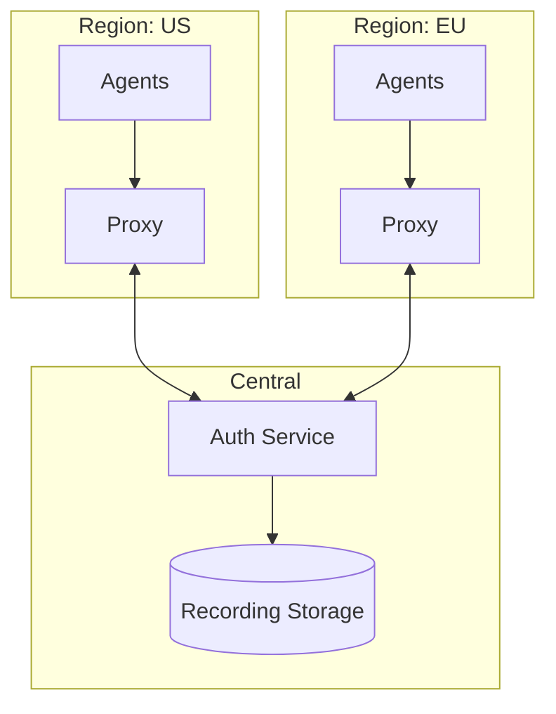

```
RFC-PAM-0001                                                   Section 13
Category: Standards Track                                      Evolution
```

# 13. Evolution

[← Previous: Rationale](./12-rationale.md) | [Index](./00-index.md#table-of-contents) | [Next: Appendix A →](./appendix-a-glossary.md)

---

## 13.1 Anticipated Extensions

### 13.1.1 Additional Resource Types

The architecture is designed to extend to additional resource types:

| Resource Type | Protocol | Anticipated Support |
|---------------|----------|---------------------|
| **Windows RDP** | RDP | Near-term (Teleport native) |
| **Web applications** | HTTPS | Near-term (Teleport App Access) |
| **Cloud consoles** | HTTPS | Medium-term (AWS, Azure, GCP) |
| **CI/CD systems** | Various | Medium-term |
| **Git repositories** | SSH/HTTPS | Future consideration |
| **Message queues** | Various | Future consideration |

### 13.1.2 Windows RDP Access

Windows server access follows similar patterns:

| Component | Implementation |
|-----------|----------------|
| Agent | Teleport Windows Desktop Service |
| Authentication | Teleport certificates → AD integration |
| Recording | Screen capture |
| RBAC | Label-based, similar to SSH |

### 13.1.3 Web Application Access

Internal web applications can be proxied:

| Benefit | Description |
|---------|-------------|
| SSO | Application doesn't need OIDC integration |
| Session recording | HTTP request logging |
| Access control | Teleport RBAC for application access |
| Audit | Centralized access logs |

### 13.1.4 Cloud Console Access

Future capability for cloud provider console access:

| Provider | Method |
|----------|--------|
| AWS | Assume role via Teleport |
| Azure | Azure AD app integration |
| GCP | Workload identity federation |

## 13.2 Scalability Considerations

### 13.2.1 Teleport Cluster Scaling

As usage grows, Teleport components scale:

| Component | Scaling Method | Consideration |
|-----------|----------------|---------------|
| **Proxy Service** | Horizontal scaling | Load balancer required |
| **Auth Service** | Horizontal with shared state | Backend database sizing |
| **Recording storage** | Object storage scaling | S3/GCS auto-scales |
| **Agents** | Per-resource deployment | Management automation |

### 13.2.2 High Availability

Production deployment requires HA:

| Component | HA Strategy |
|-----------|-------------|
| Auth Service | Multiple replicas, shared backend |
| Proxy Service | Multiple replicas, load balanced |
| Backend database | PostgreSQL cluster or etcd cluster |
| Recording storage | Multi-AZ object storage |

### 13.2.3 Multi-Region Deployment

For global organizations:



Regional proxies reduce latency while maintaining centralized control.

### 13.2.4 Performance Considerations

| Metric | Target | Scaling Factor |
|--------|--------|----------------|
| Concurrent sessions | 10,000+ | Proxy replicas |
| Authentication latency | <500ms | Auth replicas, caching |
| Recording write throughput | 100MB/s+ | Storage backend |
| Audit query performance | <1s for recent events | Index optimization |

## 13.3 Migration Pathways

### 13.3.1 Phased Adoption

Organizations can adopt incrementally:

**Phase 1: SSH Access**
- Deploy Teleport for SSH
- Enroll critical servers first
- Maintain bastion as fallback

**Phase 2: Certificate Migration**
- Enable Vault SSH CA
- Migrate from SSH keys to certificates
- Disable direct key authentication

**Phase 3: Database Access**
- Add database agents
- Configure Vault database engines
- Migrate from static credentials

**Phase 4: Kubernetes Access**
- Deploy Kubernetes agents
- Configure exec/attach policies
- Enable eBPF recording

**Phase 5: JIT Access**
- Enable access request workflows
- Configure approval policies
- Remove standing elevated access

### 13.3.2 Legacy System Coexistence

Some systems may not migrate:

| Scenario | Approach |
|----------|----------|
| Legacy SSH system | Maintain separate access (documented exception) |
| Unsupported database | Service account with static credentials (RFC-WORKLOAD-IDENTITY) |
| Third-party SaaS | Native SaaS access controls |

### 13.3.3 Fallback Procedures

During transition, maintain fallback:

| Fallback | Use Case | Sunset Criteria |
|----------|----------|-----------------|
| Bastion host | Teleport unavailable | Teleport HA verified |
| Static DB credentials | Vault unavailable | Vault HA verified |
| Direct kubectl | Teleport unavailable | Teleport HA verified |

Fallbacks should be time-limited and eventually removed.

## 13.4 Feature Roadmap Alignment

### 13.4.1 Teleport Roadmap

Monitor Teleport releases for:

| Feature | Potential Benefit |
|---------|------------------|
| Improved Vault integration | Native SSH CA support |
| Enhanced eBPF capabilities | Broader session capture |
| SCIM support | Automated user provisioning |
| Policy as code | Enhanced GitOps for policies |

### 13.4.2 Vault Roadmap

Monitor Vault releases for:

| Feature | Potential Benefit |
|---------|------------------|
| Database engine enhancements | New database support |
| SSH engine improvements | Better certificate handling |
| Kubernetes auth improvements | Simplified integration |

### 13.4.3 Integration Improvements

Future integration enhancements:

| Integration | Enhancement |
|-------------|-------------|
| Teleport ↔ Vault | Deeper native integration |
| Teleport ↔ Keycloak | SCIM for user sync |
| Backstage ↔ Teleport | Self-service access requests |

## 13.5 Deprecation Considerations

### 13.5.1 Component Deprecation

If components need replacement:

| Component | Deprecation Path |
|-----------|-----------------|
| Teleport | Evaluate alternatives, migration plan, parallel operation |
| Vault SSH engine | Alternative CA, certificate migration |
| Vault DB engine | Alternative credential management |

### 13.5.2 Protocol Evolution

As protocols evolve:

| Change | Impact | Mitigation |
|--------|--------|------------|
| SSH protocol updates | Agent updates | Maintain agent currency |
| Database protocol changes | Agent updates | Monitor database releases |
| Kubernetes API changes | Agent updates | Track Kubernetes releases |

### 13.5.3 Organizational Change

The architecture accommodates organizational evolution:

| Change | Accommodation |
|--------|---------------|
| Team restructuring | Update Keycloak/Teleport role mappings |
| New business units | Add roles, extend RBAC |
| Mergers/acquisitions | Federate identity, extend access |
| Compliance changes | Adjust recording retention, policies |

---

## Document Navigation

| Previous | Index | Next |
|----------|-------|------|
| [← 12. Rationale](./12-rationale.md) | [Table of Contents](./00-index.md#table-of-contents) | [Appendix A: Glossary →](./appendix-a-glossary.md) |

---

*End of Section 13 — RFC-PAM-0001*
