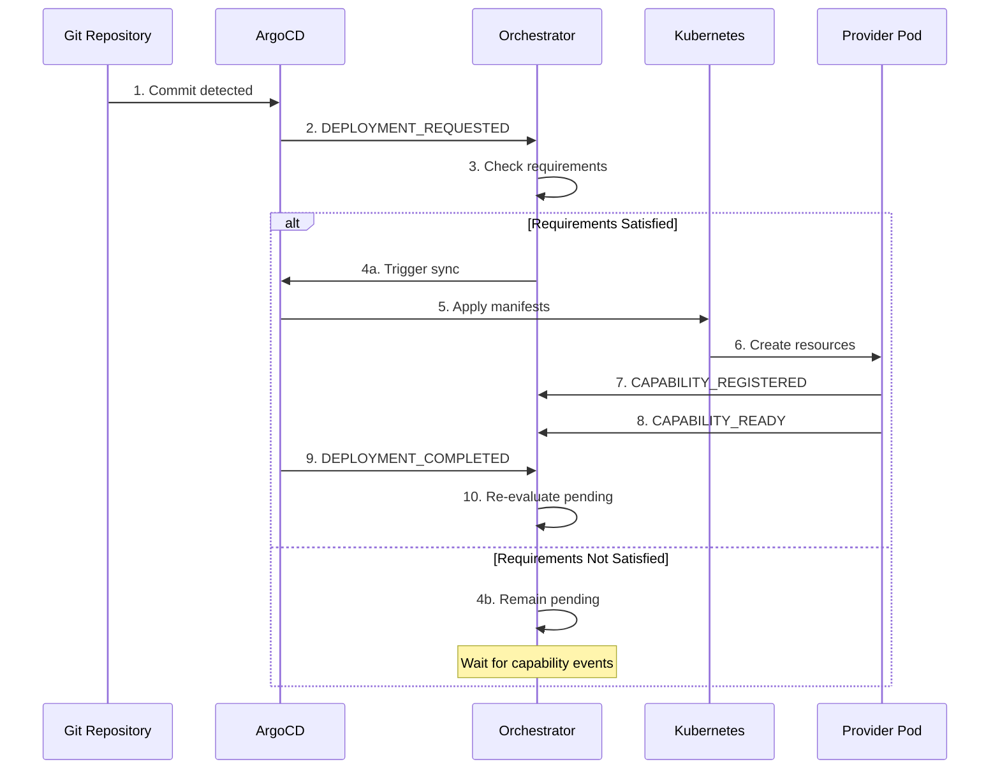
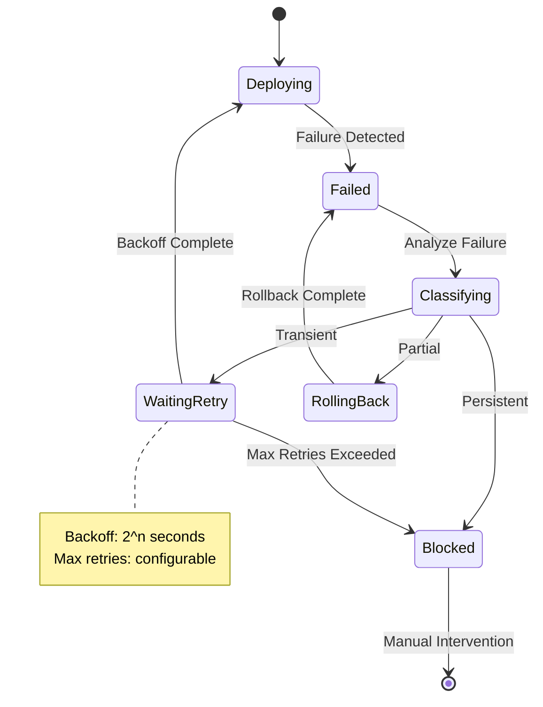
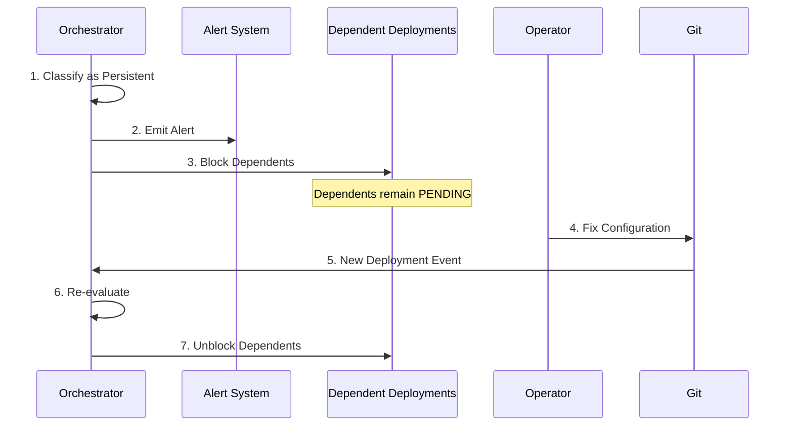
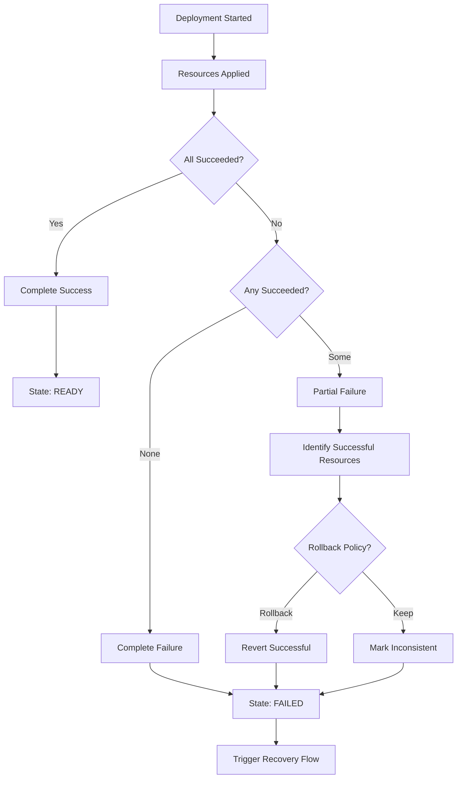
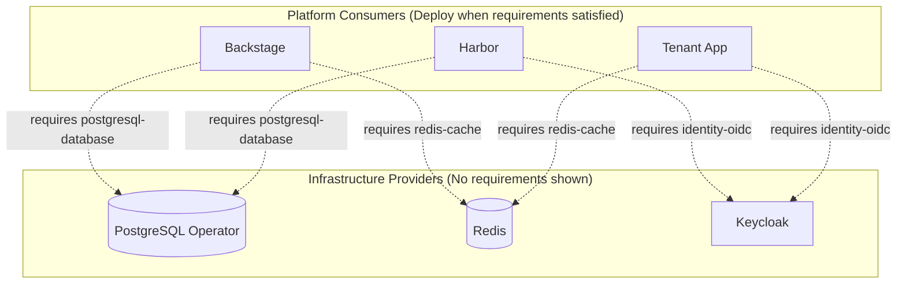
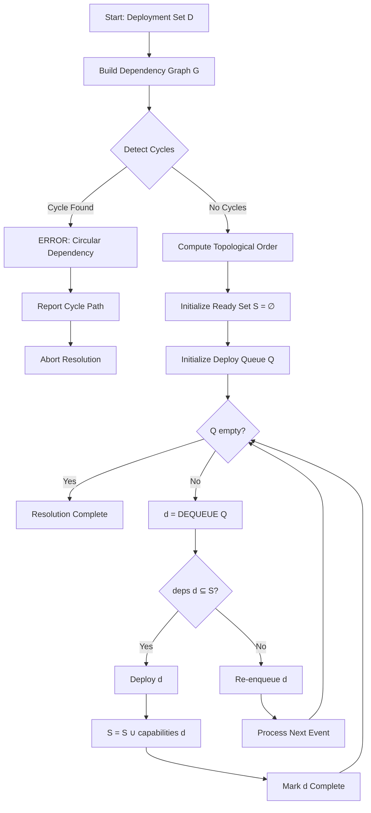
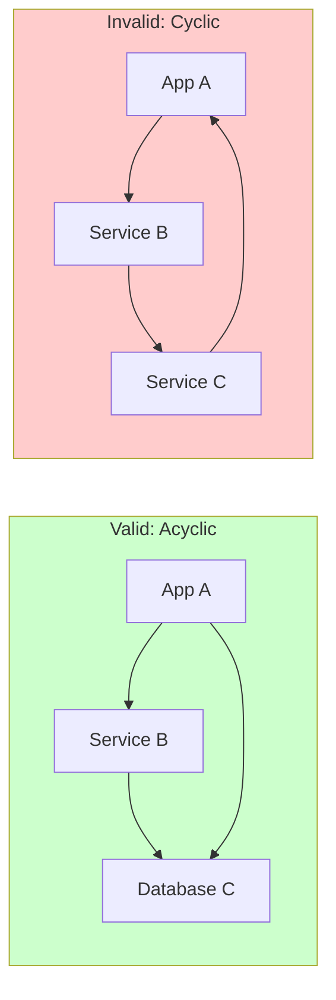

```
RFC-PLATARCH-0001                                              Section 5
Category: Standards Track                       Capability Orchestration
```

# 5. Capability Orchestration

[← Binary Component Categorization](./04-components.md) | [Index](./00-index.md#table-of-contents) | [Next: Shared Infrastructure →](./06-shared-infrastructure.md)

---

> **Scope Note:** This section describes the orchestration model—capabilities, providers, consumers, contracts, and DAG-based resolution. Implementation mechanisms are specified in [RFC-DEPLOY-0001](../deploy-ops/00-index.md). This RFC defines WHAT the model is, not HOW to implement orchestration.

## 5.1 Overview

This section defines how the platform orchestrates deployments based on capability satisfaction. Orchestration uses Directed Acyclic Graph (DAG) resolution: components deploy when ALL required capabilities are satisfied, with no phase or layer hierarchy constraining deployment order.

The model covers:
- **Readiness semantics:** When capabilities are considered satisfied
- **DAG resolution:** How dependencies determine deployment order
- **Event model:** How state changes trigger orchestration decisions
- **Failure handling:** How failures are isolated and recovered

These mechanisms ensure that Infrastructure Providers and Platform Consumers deploy in correct order based solely on declared capability dependencies.

---

## 2. Readiness and Correctness

### 2.1 The Readiness Problem

Kubernetes defines readiness for pods: a pod is ready when it passes its readiness probe. But pod readiness is not capability readiness. A pod may be running, passing health checks, and accepting connections, yet the capability it provides may not be functional.

Capability readiness requires semantic understanding. A database pod is ready in Kubernetes terms when the container is running. The database capability is ready when the database has completed initialization, accepted its schema, and can serve queries. These are different conditions.

### 2.2 Semantic Readiness

Semantic readiness means the capability is functionally available. Semantic readiness conditions vary by capability type:

**Database readiness:** Database accepts connections, schema is applied, replication is synchronized.

**Message queue readiness:** Queue accepts messages, consumers can subscribe, delivery is functioning.

**Identity service readiness:** Authentication endpoints respond, token issuance works, identity federation is active.

Semantic readiness is defined by the capability provider. Providers publish readiness conditions in their capability registrations.

### 2.3 Readiness Verification

Readiness must be verified, not assumed. The orchestrator does not trust that a capability is ready because its pods are running. The orchestrator verifies readiness through defined mechanisms:

**Health endpoints:** Capability-specific health checks that verify functional readiness.

**Readiness probes:** Custom probes that test capability-specific conditions.

**Status fields:** Custom resource status fields that indicate capability state.

Verification is continuous. Readiness can change. A capability that was ready may become unready. The orchestrator monitors readiness continuously.

### 2.4 Correctness Through DAG Resolution

Correct orchestration ensures components deploy only when their requirements are satisfied. DAG resolution produces correctness:

1. Components with no requirements may deploy immediately
2. Components whose requirements are satisfied may deploy concurrently
3. Components whose requirements are unsatisfied wait

This is deterministic. Given the same capability graph and the same starting state, the orchestrator produces the same final state. Deployment order may vary due to concurrency, but the end state is deterministic.

### 2.5 Determinism Guarantees

The orchestrator guarantees deterministic behavior:

**Same inputs, same outputs:** Given identical Git state and identical cluster state, orchestration produces identical results.

**No race conditions:** The order of deployments is determined by capability dependencies, not by timing.

**Reproducible sequences:** The deployment sequence can be predicted from the dependency graph.

Determinism enables testing. If orchestration is deterministic, it can be tested. If orchestration is random, testing is meaningless.

---

## 3. Event Model

### 3.1 Event-Driven Orchestration

The orchestrator operates on events. Events signal state changes. State changes trigger orchestration decisions.

Event-driven operation means the orchestrator is reactive. It responds to changes rather than polling for changes. Reactive operation is efficient and scalable.

### 3.2 Event Types

The orchestrator processes the following event types:

| Event | Category | Source(s) | Description | Orchestrator Action |
|-------|----------|-----------|-------------|---------------------|
| `CAPABILITY_REGISTERED` | Capability | Provider Pods | Provider declares a new capability | Add to registry, re-evaluate pending |
| `CAPABILITY_READY` | Capability | Provider Pods, Health Checks | Capability passes readiness verification | Mark satisfied, trigger waiting deployments |
| `CAPABILITY_UNREADY` | Capability | Provider Pods, Health Checks | Capability fails readiness check | Mark degraded, notify consumers |
| `CAPABILITY_REMOVED` | Capability | Provider Pods | Capability is withdrawn | Remove from registry, block dependents |
| `DEPLOYMENT_REQUESTED` | Deployment | Git Repository | Git change introduces new deployment | Evaluate requirements, queue or trigger |
| `DEPLOYMENT_COMPLETED` | Deployment | ArgoCD | Deployment finishes successfully | Register provided capabilities |
| `DEPLOYMENT_FAILED` | Deployment | ArgoCD | Deployment cannot complete | Classify failure, initiate recovery |

### 3.3 Event Properties

Events have the following properties:

**Immutable:** Events cannot be modified after emission. Events are facts.

**Ordered:** Events have a defined order within their scope. Order enables causality reasoning.

**Idempotent handling:** Processing an event multiple times produces the same result as processing it once.

**Durable:** Events are persisted. Events survive orchestrator restart.

### 3.4 Event Flow

Events flow through the system according to the following sequence:



### 3.5 Event Ordering Guarantees

Events maintain causal ordering:

- Events from a single source are processed in emission order
- Events affecting the same capability are processed in order
- Cross-capability events may be processed concurrently

Causal ordering ensures correctness. Effects follow causes.

#### 3.5.1 Formal Event Ordering

---

**ALGORITHM 7: EventOrdering**

```
ALGORITHM EventOrdering
────────────────────────────────────────────────────────────────────────
INPUT:  Event e₁, Event e₂
OUTPUT: Ordering relationship

 1  ▷ Same-source ordering (total order within source)
 2  if e₁.source = e₂.source then
 3  │  return e₁.timestamp < e₂.timestamp
 4  end if
 5
 6  ▷ Same-capability ordering (causal order)
 7  if e₁.capability = e₂.capability then
 8  │  return e₁.sequence_number < e₂.sequence_number
 9  end if
10
11  ▷ Cross-capability: concurrent (no ordering required)
12  return CONCURRENT
────────────────────────────────────────────────────────────────────────
```

---

---

## 4. Execution Semantics

### 4.1 Deployment Trigger

A deployment is triggered when:

1. A deployment request exists (from Git)
2. All required capabilities are satisfied
3. The deployment has not already completed

When all conditions are met, the orchestrator triggers the deployment through ArgoCD.

### 4.2 Deployment Execution

Deployment execution is delegated to ArgoCD. The orchestrator does not execute deployments directly. The orchestrator's role is to determine when deployments should execute.

Execution flow:
1. Orchestrator signals ArgoCD to sync
2. ArgoCD applies manifests to cluster
3. Kubernetes creates resources
4. Resources reach ready state
5. Capability provider signals readiness
6. Orchestrator observes readiness

### 4.3 Deployment Completion

A deployment is complete when:

**Success:** All resources are created, all readiness conditions are met, capability is registered as ready.

**Failure:** Deployment fails to complete within timeout, resources fail to reach ready state, capability cannot be provided.

Completion is binary. A deployment is either complete-success or complete-failure. There is no partial completion.

### 4.4 Atomicity

Deployments are atomic at the application level. Either all of an application's resources are deployed, or none are. Partial deployment is a failure state.

Atomicity is enforced by ArgoCD sync semantics. The orchestrator does not provide additional atomicity guarantees.

### 4.5 Idempotency

Deployment execution is idempotent. Triggering the same deployment multiple times produces the same result as triggering it once.

Idempotency enables retry. If a trigger fails to reach ArgoCD, it can be retried without risk of duplicate effects.

### 4.6 Ordering Constraints

The orchestrator enforces ordering constraints:

**Requirement constraint:** An application cannot be deployed before its required capabilities are satisfied.

**Provision constraint:** A capability is not provided until its provider deployment completes successfully.

**No cycle constraint:** Circular dependencies cannot be satisfied. Cycles are detected and rejected.

---

## 5. Failure and Recovery

### 5.1 Failure Categories

Failures are categorized by scope and recoverability:

| Category | Characteristics | Examples | Recovery Action | Intervention |
|----------|-----------------|----------|-----------------|--------------|
| **Transient** | Temporary, self-resolving | Network glitch, temporary resource exhaustion, API timeout | Automatic retry with exponential backoff | None required |
| **Persistent** | Requires external fix | Misconfiguration, missing dependency, invalid manifest, quota exceeded | Alert and block dependents | Manual intervention |
| **Partial** | Mixed success/failure state | Some pods failed, partial rollout, subset of resources created | Rollback successful components, alert | Manual review |

### 5.2 Failure Detection

Failures are detected through:

**Deployment timeouts:** Deployments that do not complete within expected time are considered failed.

**Health check failures:** Components that fail health checks indicate failure.

**Error events:** Kubernetes events indicating errors are processed.

**Explicit failure signals:** Components may explicitly signal failure conditions.

### 5.3 Failure Handling Principles

Failure handling follows these principles:

**Fail fast:** Detect failures early. Do not allow failing deployments to continue indefinitely.

**Fail loud:** Make failures visible. Failures must be logged, alerted, and surfaced.

**Fail safe:** Failures must not corrupt state. Failing deployments must not leave partial state.

**Isolate failures:** Failures must not cascade. One application's failure must not cause other applications to fail (unless they depend on the failing capability).

### 5.4 Transient Failure Recovery

Transient failures are handled through exponential backoff retry:



---

**ALGORITHM 8: TransientFailureRecovery**

```
ALGORITHM TransientFailureRecovery
────────────────────────────────────────────────────────────────────────
INPUT:  Deployment d          ▷ Failed deployment
        Config cfg            ▷ Retry configuration
OUTPUT: Deployment state

 1  d.retry_count ← d.retry_count + 1
 2
 3  if d.retry_count > cfg.max_retries then
 4  │  d.state ← BLOCKED
 5  │  EMIT-ALERT(PERSISTENT_FAILURE, d)
 6  │  return d.state
 7  end if
 8
 9  ▷ Exponential backoff with jitter
10  base_delay ← cfg.initial_delay × 2^(d.retry_count - 1)
11  jitter ← RANDOM(0, base_delay × 0.1)
12  delay ← MIN(base_delay + jitter, cfg.max_delay)
13
14  SCHEDULE-RETRY(d, delay)
15  d.state ← WAITING_RETRY
16
17  return d.state
────────────────────────────────────────────────────────────────────────
```

---

Retry is automatic. The orchestrator retries without manual intervention.

### 5.5 Persistent Failure Handling

Persistent failures require intervention:



Persistent failures do not block the entire platform. Only dependent deployments are blocked.

### 5.6 Partial Failure Handling

Partial failures are the most complex case:



Partial failures are handled by ArgoCD sync semantics. The orchestrator treats the deployment as failed.

### 5.7 Recovery Verification

After recovery, state must be verified:

---

**ALGORITHM 9: RecoveryVerification**

```
ALGORITHM RecoveryVerification
────────────────────────────────────────────────────────────────────────
INPUT:  Deployment d          ▷ Recovered deployment
OUTPUT: Boolean indicating recovery completeness

 1  ▷ Phase 1: Resource verification
 2  expected ← d.manifest.resources
 3  actual ← GET-CLUSTER-RESOURCES(d.namespace)
 4
 5  for each resource r ∈ expected do
 6  │  if r ∉ actual then
 7  │  │  return FALSE                         ▷ Missing resource
 8  │  end if
 9  │  if actual[r].state ≠ READY then
10  │  │  return FALSE                         ▷ Resource not ready
11  │  end if
12  end for
13
14  ▷ Phase 2: Capability verification
15  for each capability c ∈ d.provides do
16  │  if ¬CAPABILITY-READY(c) then
17  │  │  return FALSE                         ▷ Capability not ready
18  │  end if
19  end for
20
21  ▷ Phase 3: Consumer verification
22  consumers ← GET-CONSUMERS(d.provides)
23  for each consumer con ∈ consumers do
24  │  if con.state = BLOCKED then
25  │  │  UNBLOCK(con)                         ▷ Re-enable blocked consumers
26  │  end if
27  end for
28
29  return TRUE                                ▷ Recovery complete
────────────────────────────────────────────────────────────────────────
```

---

Verification ensures that recovery is complete. Incomplete recovery is continued failure.

---

## 6. Dependency Resolution

### 6.0 DAG-Based Resolution Model

Capability orchestration uses Directed Acyclic Graph (DAG) based dependency resolution:

**Directed:** Dependencies flow from consumer to provider. A Platform Consumer depends on the Infrastructure Providers whose capabilities it requires.

**Acyclic:** Circular dependencies are prohibited. If component A requires B and B requires A, the configuration is rejected at declaration time—before any deployment begins.

**No Phases or Layers:** There are no deployment phases. There is no hierarchical layer ordering. Components deploy when their requirements are satisfied. Components with no requirements may deploy immediately. Multiple components may deploy concurrently if their requirements are independently satisfied.

**Deterministic Final State:** Given identical inputs, DAG resolution produces identical outputs. The deployment order may vary due to concurrency, but the final state is deterministic.

### 6.1 Resolution Algorithm

Dependency resolution determines deployment order through graph analysis and topological sorting.

#### 6.1.1 Dependency Graph Structure

The dependency graph G = (V, E) is a Directed Acyclic Graph (DAG) where:
- V = set of deployments (Infrastructure Providers and Platform Consumers)
- E = set of directed edges representing capability dependencies
- Edge (u, v) exists if deployment u requires a capability provided by deployment v
- Cycles are prohibited—detected and rejected at declaration time



**Notation:** Dashed arrows (-.->)  indicate capability requirements. Infrastructure Providers must satisfy capabilities before Platform Consumers requiring those capabilities can deploy.

#### 6.1.2 Resolution Flow



#### 6.1.3 Formal Algorithm Specification

---

**ALGORITHM 4: DependencyResolution**

```
ALGORITHM DependencyResolution
────────────────────────────────────────────────────────────────────────
INPUT:  DeploymentSet D      ▷ Set of all deployments with declarations
OUTPUT: Ordered list L of deployments, or ERROR if cycle exists

 1  ▷ Phase 1: Build dependency graph
 2  V ← D                                      ▷ Vertices are deployments
 3  E ← ∅                                      ▷ Initialize edge set
 4
 5  for each deployment d ∈ D do
 6  │  for each requirement r ∈ d.requires do
 7  │  │  p ← FIND-PROVIDER(r.capability, D)
 8  │  │  if p ≠ NIL then
 9  │  │  │  E ← E ∪ {(d, p)}                  ▷ d depends on p
10  │  │  end if
11  │  end for
12  end for
13
14  G ← (V, E)
15
16  ▷ Phase 2: Cycle detection using DFS
17  if HAS-CYCLE(G) then
18  │  cycle ← FIND-CYCLE-PATH(G)
19  │  return ERROR("Circular dependency: " + cycle)
20  end if
21
22  ▷ Phase 3: Topological sort
23  L ← TOPOLOGICAL-SORT(G)
24
25  return REVERSE(L)                          ▷ Providers before consumers
────────────────────────────────────────────────────────────────────────
```

---

**ALGORITHM 5: HasCycle (Cycle Detection)**

```
ALGORITHM HasCycle
────────────────────────────────────────────────────────────────────────
INPUT:  Graph G = (V, E)
OUTPUT: Boolean indicating whether G contains a cycle

 1  color ← new Map()                          ▷ WHITE, GRAY, BLACK
 2  for each vertex v ∈ V do
 3  │  color[v] ← WHITE
 4  end for
 5
 6  for each vertex v ∈ V do
 7  │  if color[v] = WHITE then
 8  │  │  if DFS-VISIT(v, color, E) = TRUE then
 9  │  │  │  return TRUE                       ▷ Cycle found
10  │  │  end if
11  │  end if
12  end for
13
14  return FALSE                               ▷ No cycle
────────────────────────────────────────────────────────────────────────

ALGORITHM DFS-Visit
────────────────────────────────────────────────────────────────────────
INPUT:  Vertex v, ColorMap color, EdgeSet E
OUTPUT: Boolean indicating cycle through v

 1  color[v] ← GRAY                            ▷ Currently visiting
 2
 3  for each edge (v, u) ∈ E do
 4  │  if color[u] = GRAY then
 5  │  │  return TRUE                          ▷ Back edge = cycle
 6  │  end if
 7  │  if color[u] = WHITE then
 8  │  │  if DFS-VISIT(u, color, E) = TRUE then
 9  │  │  │  return TRUE
10  │  │  end if
11  │  end if
12  end for
13
14  color[v] ← BLACK                           ▷ Finished visiting
15  return FALSE
────────────────────────────────────────────────────────────────────────
```

---

**ALGORITHM 6: TopologicalSort (Kahn's Algorithm)**

```
ALGORITHM TopologicalSort
────────────────────────────────────────────────────────────────────────
INPUT:  Graph G = (V, E)           ▷ Acyclic directed graph
OUTPUT: List L in topological order

 1  in_degree ← new Map()
 2  for each vertex v ∈ V do
 3  │  in_degree[v] ← 0
 4  end for
 5
 6  for each edge (u, v) ∈ E do
 7  │  in_degree[v] ← in_degree[v] + 1
 8  end for
 9
10  Q ← new Queue()                            ▷ Vertices with no dependencies
11  for each vertex v ∈ V do
12  │  if in_degree[v] = 0 then
13  │  │  ENQUEUE(Q, v)
14  │  end if
15  end for
16
17  L ← []                                     ▷ Result list
18
19  while Q ≠ ∅ do
20  │  v ← DEQUEUE(Q)
21  │  APPEND(L, v)
22  │
23  │  for each edge (v, u) ∈ E do
24  │  │  in_degree[u] ← in_degree[u] - 1
25  │  │  if in_degree[u] = 0 then
26  │  │  │  ENQUEUE(Q, u)
27  │  │  end if
28  │  end for
29  end while
30
31  return L
────────────────────────────────────────────────────────────────────────
```

---

#### 6.1.4 Complexity Analysis

| Operation | Time Complexity | Space Complexity |
|-----------|-----------------|------------------|
| Graph Construction | O(D × R) | O(D + E) |
| Cycle Detection | O(V + E) | O(V) |
| Topological Sort | O(V + E) | O(V) |
| **Total** | **O(D × R + V + E)** | **O(D + E)** |

Where:
- D = number of deployments
- R = average requirements per deployment
- V = |D| (vertices)
- E = total dependency edges

### 6.2 Cycle Detection

Cycles are detected before deployment begins using depth-first search (DFS) with vertex coloring:



- A requires B, B requires A → cycle
- A requires B, B requires C, C requires A → cycle

Cycles cannot be resolved. Cycles are configuration errors that must be fixed.

### 6.3 Optional Dependencies

Optional dependencies modify resolution:

- Required dependencies must be satisfied before deployment
- Optional dependencies are satisfied if available but do not block deployment

Applications specify whether each requirement is required or optional.

### 6.4 Dependency Updates

Dependencies can change:

**New requirement added:** Application must wait for the new requirement if it is not yet satisfied.

**Requirement removed:** No blocking effect. The formerly required capability may or may not be present.

**Provider changes:** If a provider is replaced, consumers continue to function if the replacement satisfies the same capability.

---

## 7. Observability

### 7.1 Orchestration Metrics

The orchestrator exposes metrics:

- Deployments pending
- Deployments in progress
- Deployments completed (success/failure)
- Capability satisfaction rate
- Dependency resolution time
- Deployment duration

Metrics enable monitoring and capacity planning.

### 7.2 Orchestration Events

The orchestrator emits events:

- Capability registered/ready/unready/removed
- Deployment triggered/completed/failed
- Dependency satisfied/unsatisfied
- Retry initiated/exhausted

Events enable debugging and audit.

### 7.3 Orchestration Logs

The orchestrator logs:

- All state transitions
- All decisions with rationale
- All failures with context
- All external interactions

Logs enable post-hoc analysis.

---

## 8. Summary

### 8.1 Readiness Model

| Concept | Description |
|---------|-------------|
| Semantic readiness | Capability is functionally available, not just running |
| Readiness verification | Continuous verification through defined mechanisms |
| Correctness through ordering | Deployments proceed only when requirements are met |

### 8.2 Event Model

| Event | Trigger |
|-------|---------|
| Capability Registered | Provider registers capability |
| Capability Ready | Capability passes readiness |
| Deployment Requested | Git change introduces deployment |
| Deployment Completed | Deployment finishes successfully |
| Deployment Failed | Deployment cannot complete |

### 8.3 Resolution Model

| Property | Description |
|----------|-------------|
| DAG-based | Directed Acyclic Graph determines deployment order |
| Acyclic | Circular dependencies rejected at declaration time |
| Concurrent | Independent components deploy in parallel |
| Deterministic | Same inputs produce same final state |

### 8.4 Execution Model

| Property | Description |
|----------|-------------|
| Atomic | All-or-nothing at component level |
| Idempotent | Multiple triggers produce same result |
| Ordered | Respects capability dependencies |

### 8.5 Failure Model

| Category | Handling |
|----------|----------|
| Transient | Automatic retry with backoff |
| Persistent | Alert and manual intervention |
| Partial | Treated as failure, ArgoCD handles rollback |

---

## Document Navigation

| Previous | Index | Next |
|----------|-------|------|
| [← 4. Binary Component Categorization](./04-components.md) | [Table of Contents](./00-index.md#table-of-contents) | [6. Shared Infrastructure →](./06-shared-infrastructure.md) |

---

*End of Section 5 — RFC-PLATARCH-0001*
