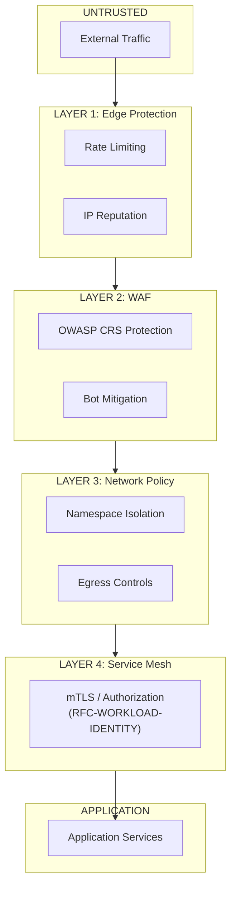

```
RFC-TENANT-SECURITY-0001                                         Section 0
Category: Standards Track                                             Index
```

# RFC-TENANT-SECURITY-0001: Tenant Application Security Architecture

[Index](./00-index.md) | [Next: Introduction →](./01-introduction.md)

---

## Document Metadata

| Field | Value |
|-------|-------|
| **RFC Number** | RFC-TENANT-SECURITY-0001 |
| **Title** | Tenant Application Security Architecture |
| **Status** | Draft |
| **Category** | Standards Track |
| **Kind** | Architecture |
| **Created** | 2026-02-11 |
| **Updated** | 2026-02-11 |
| **Version** | 1.0.0 |
| **Author** | Platform Engineering Team |
| **Requires** | RFC-IAM-0001, RFC-SECOPS-0001 |

---

## Abstract

This RFC defines the architecture for network-level security controls protecting tenant applications from external threats. It establishes patterns for Web Application Firewall (WAF) deployment, Kubernetes network policy enforcement, ingress protection, rate limiting, and tenant isolation at the network layer.

The architecture addresses North-South traffic protection—external traffic entering the cluster—as distinct from East-West traffic (service-to-service) governed by RFC-WORKLOAD-IDENTITY. Together, these RFCs provide defense-in-depth across all traffic patterns.

This RFC specifies BunkerWeb as the unified ingress and WAF solution, providing OWASP Core Rule Set protection, bot mitigation, and rate limiting capabilities. Network isolation is enforced through Kubernetes NetworkPolicy resources managed by the existing Calico CNI.

---

## Scope Boundaries

### In Scope

| Concern | Description |
|---------|-------------|
| Web Application Firewall | OWASP Top 10 protection at the ingress layer |
| Kubernetes Network Policies | Namespace isolation, pod-to-pod traffic restrictions |
| Ingress Protection | TLS termination, request validation, routing |
| Rate Limiting | DDoS mitigation, abuse prevention, traffic quotas |
| Tenant Network Isolation | Multi-tenancy segmentation, namespace boundaries |
| TLS Certificate Lifecycle | Automated certificate provisioning and renewal |
| Egress Controls | Controlled outbound traffic from tenant namespaces |
| Bot Mitigation | Challenge-based verification for automated threats |

### Out of Scope

| Concern | Addressed By | Rationale |
|---------|--------------|-----------|
| Web UI SSO/authentication | RFC-IAM-0001 | Browser-based OIDC flows handled by Keycloak |
| Service-to-service mTLS | RFC-WORKLOAD-IDENTITY | Linkerd handles East-West traffic identity |
| Service mesh authorization | RFC-WORKLOAD-IDENTITY | ServerAuthorization policies via Linkerd |
| Human privileged access | RFC-PAM-0001 | SSH, database, kubectl via Teleport |
| Secret storage/rotation | RFC-SECOPS-0001 | Vault as secret authority |
| Application-level authorization | RFC-IAM-0001 | Business logic access control |

---

## Relationship to Other RFCs

### Normative Dependencies

| RFC | Relationship |
|-----|--------------|
| **RFC-IAM-0001** | Provides Keycloak integration patterns; WAF exceptions for authentication flows |
| **RFC-SECOPS-0001** | Vault for secret storage; ESO for TLS certificate distribution |

### Informative Dependencies

| RFC | Relationship |
|-----|--------------|
| **RFC-WORKLOAD-IDENTITY** | Service mesh handles traffic after ingress; coordinates handoff boundary |
| **RFC-PAM-0001** | Network policies may affect privileged access paths |
| **RFC-DEVELOPER-PLATFORM** | Future self-service for network policy requests |

### Traffic Responsibility Boundaries

| Direction | Governing RFC | Description |
|-----------|---------------|-------------|
| North-South | RFC-TENANT-SECURITY (this RFC) | External traffic entering the cluster |
| East-West | RFC-WORKLOAD-IDENTITY | Service-to-service traffic within the cluster |

---

## Table of Contents

### Core Sections

| Section | File | Description |
|---------|------|-------------|
| 0. Index | [00-index.md](./00-index.md) | This file — metadata, abstract, navigation |
| 1. Introduction | [01-introduction.md](./01-introduction.md) | Background, current state, motivation |
| 2. Requirements | [02-requirements.md](./02-requirements.md) | Design goals, non-goals, invariants |
| 3. Architecture | [03-architecture.md](./03-architecture.md) | Defense layers, trust boundaries, authority domains |
| 4. Components | [04-components.md](./04-components.md) | Component taxonomy, responsibilities, interfaces |

### Domain Sections

| Section | File | Description |
|---------|------|-------------|
| 5. Ingress Security | [05-ingress-security.md](./05-ingress-security.md) | TLS architecture, routing patterns |
| 6. WAF Architecture | [06-waf-architecture.md](./06-waf-architecture.md) | WAF placement, rule lifecycle, exceptions |
| 7. Network Policies | [07-network-policies.md](./07-network-policies.md) | Policy hierarchy, tenant isolation model |
| 8. Rate Limiting | [08-rate-limiting.md](./08-rate-limiting.md) | Traffic shaping, DDoS mitigation |
| 9. Tenant Isolation | [09-tenant-isolation.md](./09-tenant-isolation.md) | Multi-tenancy model, namespace boundaries |

### Supporting Sections

| Section | File | Description |
|---------|------|-------------|
| 10. Rationale | [10-rationale.md](./10-rationale.md) | Technology decisions, alternatives rejected |
| 11. Evolution | [11-evolution.md](./11-evolution.md) | Future considerations, migration paths |

### Appendices

| Appendix | File | Description |
|----------|------|-------------|
| A. Glossary | [appendix-a-glossary.md](./appendix-a-glossary.md) | Terms, diagram index |
| B. References | [appendix-b-references.md](./appendix-b-references.md) | Normative, informative, internal references |

---

## Reading Paths

### Platform Engineers

Recommended reading order for engineers implementing this architecture:

1. [Introduction](./01-introduction.md) — Understand the problem space
2. [Requirements](./02-requirements.md) — Learn the invariants
3. [Architecture](./03-architecture.md) — Grasp the overall design
4. [Components](./04-components.md) — Understand component responsibilities
5. [Ingress Security](./05-ingress-security.md) — TLS and routing patterns
6. [WAF Architecture](./06-waf-architecture.md) — Protection mechanisms

### Security Engineers

Recommended reading order for security review:

1. [Requirements](./02-requirements.md) — Understand invariants and constraints
2. [Architecture](./03-architecture.md) — Trust boundaries and authority domains
3. [WAF Architecture](./06-waf-architecture.md) — OWASP protection model
4. [Network Policies](./07-network-policies.md) — Isolation enforcement
5. [Rationale](./10-rationale.md) — Understand design decisions

### DevOps/SRE Teams

Recommended reading order for operations teams:

1. [Components](./04-components.md) — What runs where
2. [Rate Limiting](./08-rate-limiting.md) — Traffic management
3. [Tenant Isolation](./09-tenant-isolation.md) — Namespace patterns
4. [Evolution](./11-evolution.md) — Future migration considerations

### Application Developers

Recommended reading order for application developers:

1. [Network Policies](./07-network-policies.md) — How traffic is controlled
2. [Tenant Isolation](./09-tenant-isolation.md) — Namespace boundaries
3. [Appendix A: Glossary](./appendix-a-glossary.md) — Terminology reference

---

## Key Concepts

### Defense-in-Depth Model



### Security Responsibility Matrix

| Layer | This RFC | Other RFCs |
|-------|----------|------------|
| Edge Protection | Rate limiting, IP blocking | — |
| WAF | OWASP Top 10 protection | — |
| TLS Termination | Certificate management | — |
| Network Policies | Namespace isolation | — |
| Service Mesh | — | RFC-WORKLOAD-IDENTITY |
| Authentication | WAF exceptions | RFC-IAM-0001 |
| Secrets | — | RFC-SECOPS-0001 |

---

## Document Conventions

### Requirement Level Keywords

This document uses requirement level keywords as defined in [RFC2119] and [RFC8174]:

| Keyword | Meaning |
|---------|---------|
| **MUST** | Absolute requirement |
| **MUST NOT** | Absolute prohibition |
| **SHOULD** | Recommended but not required |
| **SHOULD NOT** | Not recommended but not prohibited |
| **MAY** | Optional |

### Invariant References

Invariants are referenced as `INV-N` where N is the invariant number. See [Section 2](./02-requirements.md) for complete invariant definitions.

---

## Version History

| Version | Date | Changes |
|---------|------|---------|
| 1.0.0 | 2026-02-11 | Initial release |

---

## Document Navigation

| Previous | Index | Next |
|----------|-------|------|
| — | Table of Contents | [1. Introduction →](./01-introduction.md) |

---

*End of Index — RFC-TENANT-SECURITY-0001*
