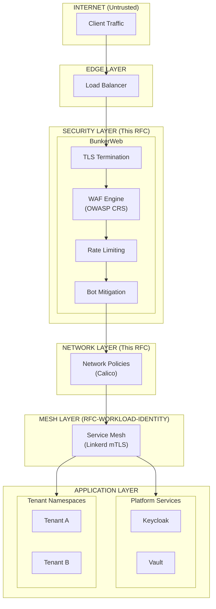
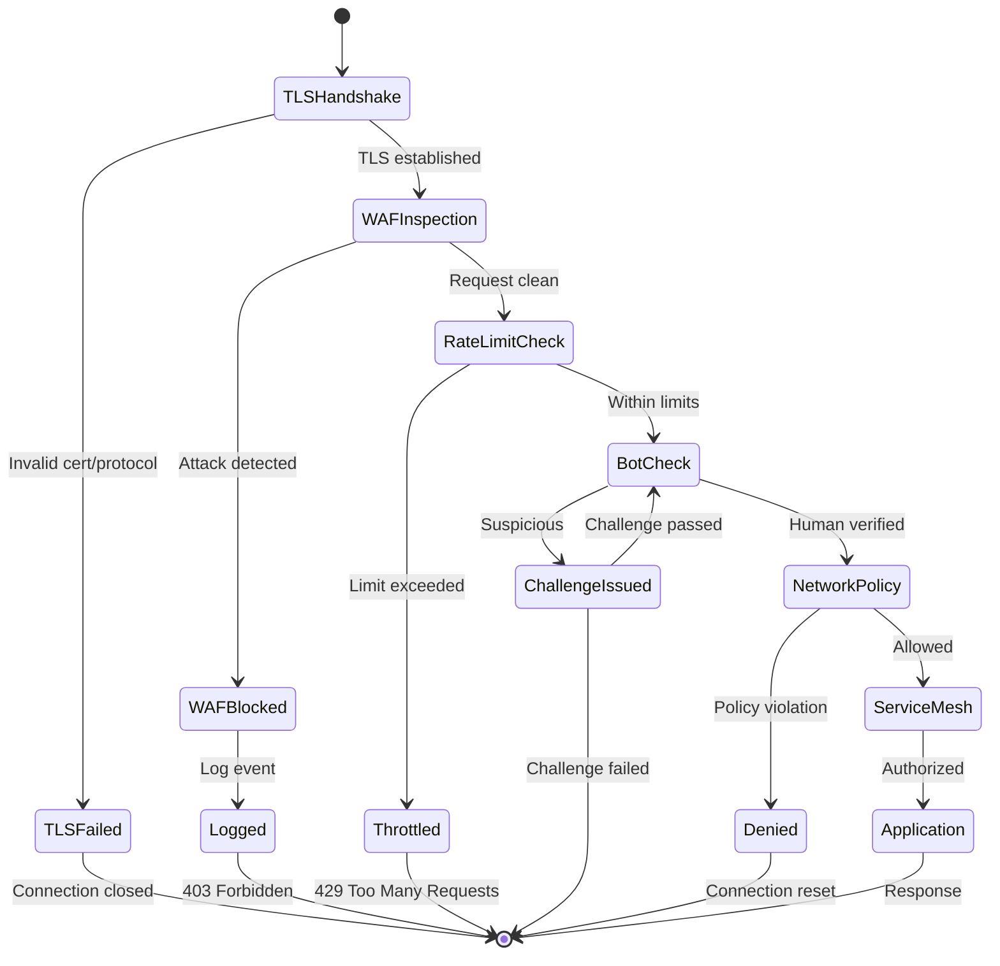
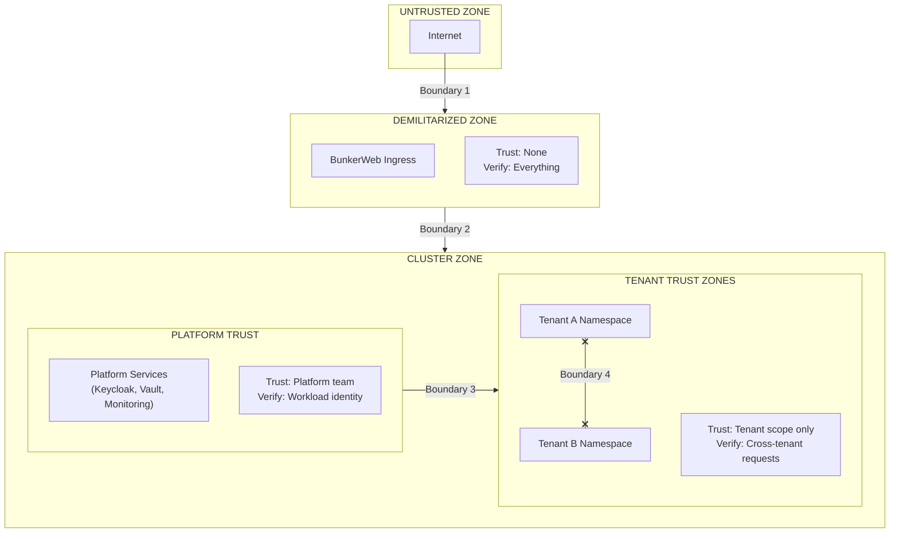
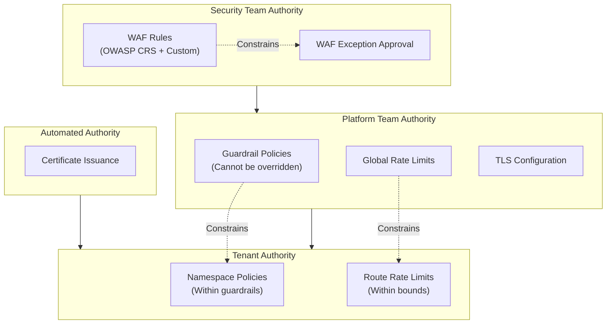
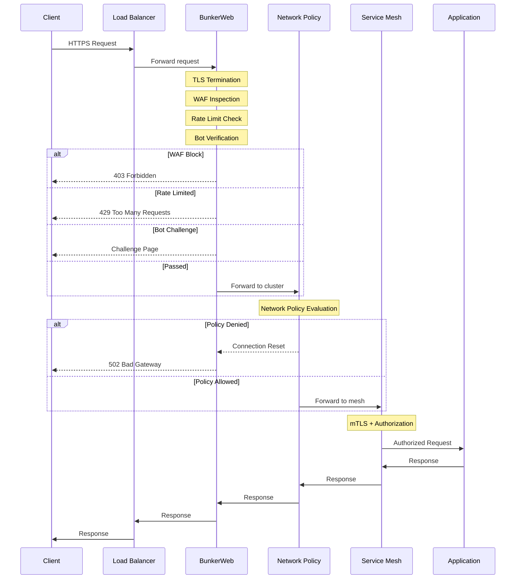
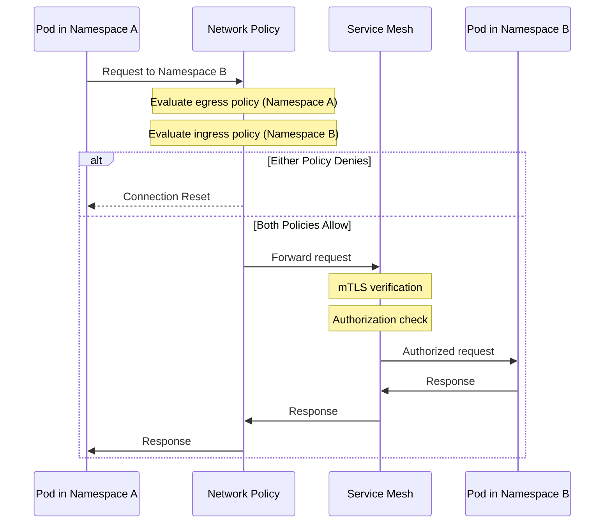
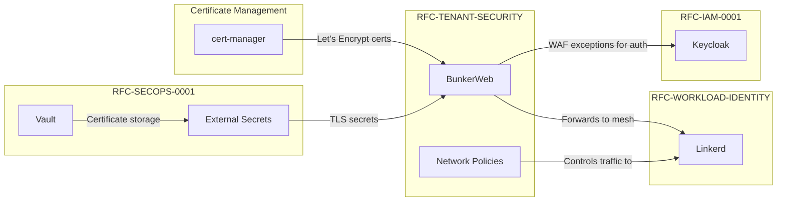

```
RFC-TENANT-SECURITY-0001                                         Section 3
Category: Standards Track                                     Architecture
```

# 3. Architecture

[← Requirements](./02-requirements.md) | [Index](./00-index.md#table-of-contents) | [Next: Components →](./04-components.md)

---

## 3.1 System Overview

The Tenant Application Security Architecture establishes a layered defense model for protecting applications from external threats and isolating tenants at the network layer. Traffic flows through multiple security checkpoints, each providing distinct protection capabilities.



---

## 3.2 Defense Layers

The architecture implements defense-in-depth through distinct security layers:

### 3.2.1 Layer Model

| Layer | Function | Failure Behavior | Enforces |
|-------|----------|------------------|----------|
| **L1: TLS** | Encryption in transit | Connection refused | INV-2 |
| **L2: WAF** | Attack signature detection | Block or log | INV-1, INV-4 |
| **L3: Rate Limiting** | Abuse prevention | Request throttled | — |
| **L4: Bot Mitigation** | Automated threat blocking | Challenge issued | — |
| **L5: Network Policy** | Namespace isolation | Traffic denied | INV-5, INV-6, INV-7 |
| **L6: Service Mesh** | Service authorization | Request rejected | RFC-WORKLOAD-IDENTITY |

### 3.2.2 Layer Independence

Each layer operates independently such that:

- Compromise of one layer does not compromise other layers
- Layers can be updated independently
- Failure of one layer does not cascade to others (where possible)
- Each layer provides distinct security value

### 3.2.3 Traffic Flow States



---

## 3.3 Trust Boundaries

### 3.3.1 Boundary Definitions

Trust boundaries define where security context changes and additional verification is required.



### 3.3.2 Boundary Characteristics

| Boundary | From | To | Verification Required |
|----------|------|----|-----------------------|
| B1: Internet → DMZ | Untrusted | DMZ | TLS, WAF inspection |
| B2: DMZ → Cluster | DMZ | Cluster | Network policy, mesh identity |
| B3: Platform → Tenant | Platform | Tenant | Explicit policy authorization |
| B4: Tenant → Tenant | Tenant A | Tenant B | Prohibited by default (INV-6) |

### 3.3.3 Boundary Enforcement

| Boundary | Enforcement Mechanism | Invariant |
|----------|----------------------|-----------|
| B1 | BunkerWeb WAF | INV-1 |
| B2 | Kubernetes NetworkPolicy | INV-5 |
| B3 | Kubernetes NetworkPolicy | INV-6 |
| B4 | Kubernetes NetworkPolicy | INV-6 |

---

## 3.4 Authority Domains

Authority domains define who controls what aspects of the security architecture.

### 3.4.1 Domain Definitions

| Domain | Authority | Scope | Override Permitted |
|--------|-----------|-------|-------------------|
| **Global WAF Rules** | Security Team | OWASP CRS, custom rules | No |
| **WAF Exceptions** | Security Team + Tenant | Per-application exceptions | With approval |
| **Global Rate Limits** | Platform Team | Cluster-wide defaults | No |
| **Route Rate Limits** | Tenant | Per-route overrides (within bounds) | Within limits |
| **Platform Network Policies** | Platform Team | Guardrail policies | No (INV-8) |
| **Tenant Network Policies** | Tenant | Namespace-scoped policies | Yes |
| **TLS Configuration** | Platform Team | Minimum TLS version, ciphers | No |
| **Certificate Issuance** | Automated | cert-manager | N/A |

### 3.4.2 Authority Hierarchy



---

## 3.5 Data Flow

### 3.5.1 Inbound Request Flow



### 3.5.2 Cross-Namespace Request Flow



---

## 3.6 Integration Architecture

### 3.6.1 RFC Integration Points



### 3.6.2 Integration Contracts

| Integration | This RFC Provides | Other RFC Provides |
|-------------|-------------------|-------------------|
| RFC-IAM-0001 | WAF exceptions for Keycloak endpoints | Authentication patterns |
| RFC-SECOPS-0001 | Secret references for TLS | TLS certificates via ESO |
| RFC-WORKLOAD-IDENTITY | Filtered traffic to mesh | mTLS for service traffic |

---

## 3.7 Failure Modes

### 3.7.1 Component Failure Behavior

| Component | Failure Mode | System Behavior | Recovery |
|-----------|--------------|-----------------|----------|
| BunkerWeb | Crash | Traffic blocked at LB | Pod restart |
| BunkerWeb | WAF overload | Degraded inspection | Scale out |
| Network Policy | Misconfiguration | Traffic denied | GitOps rollback |
| cert-manager | Certificate expiry | TLS handshake failure | Manual intervention |
| Calico | CNI failure | All traffic blocked | Node restart |

### 3.7.2 Degraded Operation Modes

| Mode | Trigger | Behavior | Risk |
|------|---------|----------|------|
| WAF Detection Only | High false positives | Log but don't block | Attacks not blocked |
| Rate Limit Bypass | Legitimate traffic spike | Increase limits | Abuse possible |
| Emergency Bypass | Critical outage | Direct to mesh | Full WAF bypass |

---

## Document Navigation

| Previous | Index | Next |
|----------|-------|------|
| [← 2. Requirements](./02-requirements.md) | [Table of Contents](./00-index.md#table-of-contents) | [4. Components →](./04-components.md) |

---

*End of Section 3 — RFC-TENANT-SECURITY-0001*
