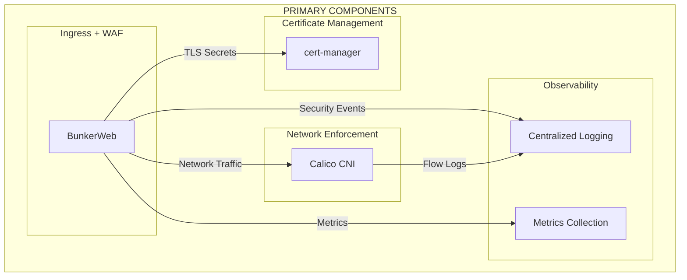
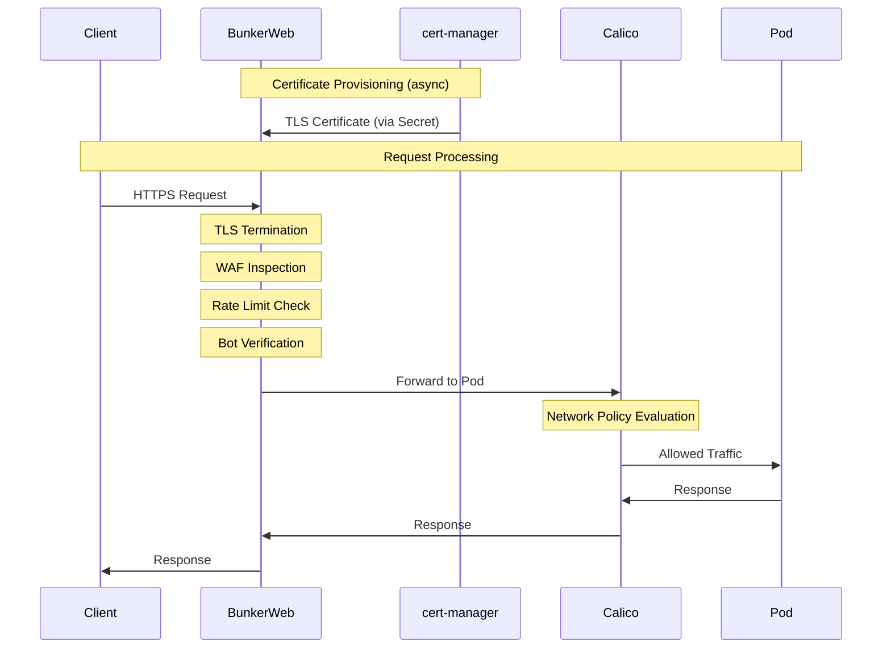

```
RFC-TENANT-SECURITY-0001                                         Section 4
Category: Standards Track                                       Components
```

# 4. Components

[← Architecture](./03-architecture.md) | [Index](./00-index.md#table-of-contents) | [Next: Ingress Security →](./05-ingress-security.md)

---

## 4.1 Component Overview

The Tenant Application Security Architecture comprises four primary components working together to provide defense-in-depth.



---

## 4.2 BunkerWeb

### 4.2.1 Responsibility

BunkerWeb serves as the unified ingress controller and Web Application Firewall, providing:

| Function | Description |
|----------|-------------|
| Ingress Routing | HTTP/HTTPS traffic routing to backend services |
| TLS Termination | Certificate management and encryption |
| WAF Protection | OWASP CRS-based attack detection and prevention |
| Rate Limiting | Connection and request throttling |
| Bot Mitigation | Challenge-based verification |
| IP Reputation | Blacklist and DNSBL integration |

### 4.2.2 Interfaces

**Inbound Interfaces**

| Interface | Source | Protocol | Purpose |
|-----------|--------|----------|---------|
| HTTPS | Load Balancer | TCP/443 | Client traffic |
| HTTP | Load Balancer | TCP/80 | Redirect to HTTPS |
| Management | Platform Team | TCP/5000 | Web UI access |

**Outbound Interfaces**

| Interface | Destination | Protocol | Purpose |
|-----------|-------------|----------|---------|
| Backend | Application Pods | HTTP/HTTPS | Proxied requests |
| Logging | Log Aggregator | Syslog/HTTP | Security events |
| Metrics | Prometheus | HTTP | Performance metrics |
| DNSBL | External | DNS | IP reputation lookup |
| CAPTCHA | External Providers | HTTPS | Challenge verification |

### 4.2.3 Failure Modes

| Failure | Detection | Impact | Recovery |
|---------|-----------|--------|----------|
| Process crash | Health check | Traffic blocked | Pod restart (automatic) |
| Memory exhaustion | Resource limits | Degraded performance | Scale out or restart |
| Configuration error | Startup failure | Traffic blocked | GitOps rollback |
| Backend unreachable | Health check | 502 errors | Backend recovery |
| Certificate expiry | Monitoring alert | TLS failures | cert-manager renewal |

### 4.2.4 Security Properties

| Property | Guarantee |
|----------|-----------|
| No bypass | All traffic passes through WAF (INV-1) |
| TLS enforcement | Minimum TLS 1.2 (INV-2) |
| Rule transparency | OWASP CRS rules are auditable |
| Logging completeness | All blocked requests logged (INV-9) |

---

## 4.3 cert-manager

### 4.3.1 Responsibility

cert-manager provides automated TLS certificate lifecycle management:

| Function | Description |
|----------|-------------|
| Certificate Issuance | Automated certificate requests |
| Certificate Renewal | Pre-expiry renewal |
| ACME Integration | Let's Encrypt automation |
| Secret Management | Kubernetes Secret creation |

### 4.3.2 Interfaces

**Inbound Interfaces**

| Interface | Source | Protocol | Purpose |
|-----------|--------|----------|---------|
| Certificate CRD | GitOps | Kubernetes API | Certificate definitions |
| ClusterIssuer CRD | Platform Team | Kubernetes API | Issuer configuration |

**Outbound Interfaces**

| Interface | Destination | Protocol | Purpose |
|-----------|-------------|----------|---------|
| ACME | Let's Encrypt | HTTPS | Certificate issuance |
| DNS Provider | Cloudflare/Other | HTTPS | DNS01 challenges |
| Secrets | Kubernetes API | Kubernetes API | Certificate storage |

### 4.3.3 Failure Modes

| Failure | Detection | Impact | Recovery |
|---------|-----------|--------|----------|
| ACME rate limit | Error logs | Issuance blocked | Wait for rate limit reset |
| DNS challenge failure | Error logs | Issuance blocked | Fix DNS configuration |
| Certificate expiry | Monitoring alert | TLS failures | Manual intervention |
| API unavailable | Health check | No new certificates | API recovery |

### 4.3.4 Security Properties

| Property | Guarantee |
|----------|-----------|
| Automation | No manual certificate handling (INV-3) |
| Short-lived certs | Certificates renewed before expiry |
| Secret isolation | Certificates stored as Kubernetes Secrets |

---

## 4.4 Calico CNI

### 4.4.1 Responsibility

Calico provides network policy enforcement at the CNI layer:

| Function | Description |
|----------|-------------|
| Network Policy | Kubernetes NetworkPolicy enforcement |
| Pod Networking | Container network connectivity |
| Policy Logging | Flow log generation |
| IPAM | IP address management |

### 4.4.2 Interfaces

**Inbound Interfaces**

| Interface | Source | Protocol | Purpose |
|-----------|--------|----------|---------|
| NetworkPolicy | GitOps | Kubernetes API | Policy definitions |
| Pod Events | Kubernetes | Kubernetes API | Pod lifecycle |

**Outbound Interfaces**

| Interface | Destination | Protocol | Purpose |
|-----------|-------------|----------|---------|
| Flow Logs | Log Aggregator | Syslog | Network observability |
| Metrics | Prometheus | HTTP | Performance metrics |

### 4.4.3 Failure Modes

| Failure | Detection | Impact | Recovery |
|---------|-----------|--------|----------|
| CNI crash | Node NotReady | All pod traffic blocked | Node restart |
| Policy misconfiguration | Application errors | Traffic denied | GitOps rollback |
| Resource exhaustion | Node pressure | Degraded networking | Scale cluster |

### 4.4.4 Security Properties

| Property | Guarantee |
|----------|-----------|
| Default deny | Policies enforce zero trust (INV-5) |
| Namespace isolation | Cross-namespace blocked by default (INV-6) |
| Egress control | Outbound traffic restricted (INV-7) |
| Guardrail precedence | Platform policies cannot be overridden (INV-8) |

---

## 4.5 Component Interactions

### 4.5.1 Request Processing Sequence



### 4.5.2 Dependency Matrix

| Component | Depends On | Dependency Type |
|-----------|------------|-----------------|
| BunkerWeb | cert-manager | TLS certificates |
| BunkerWeb | Calico | Network connectivity |
| BunkerWeb | External CAPTCHA | Bot verification (optional) |
| Calico | Kubernetes API | Policy definitions |
| cert-manager | ACME Provider | Certificate issuance |
| cert-manager | DNS Provider | DNS01 challenges |

---

## 4.6 Component Deployment

### 4.6.1 Namespace Placement

| Component | Namespace | Rationale |
|-----------|-----------|-----------|
| BunkerWeb | ingress-system | Dedicated ingress namespace |
| cert-manager | cert-manager | Standard namespace |
| Calico | kube-system | CNI requirement |

### 4.6.2 High Availability

| Component | HA Strategy | Minimum Replicas |
|-----------|-------------|------------------|
| BunkerWeb | Multiple replicas behind LB | 2 |
| cert-manager | Leader election | 1 (HA optional) |
| Calico | DaemonSet (per-node) | N/A |

### 4.6.3 Resource Boundaries

| Component | CPU Request | Memory Request | Scaling |
|-----------|-------------|----------------|---------|
| BunkerWeb | Per traffic volume | Per connection count | Horizontal |
| cert-manager | Minimal | Minimal | Not typically needed |
| Calico | Per-node | Per-node | With cluster |

---

## Document Navigation

| Previous | Index | Next |
|----------|-------|------|
| [← 3. Architecture](./03-architecture.md) | [Table of Contents](./00-index.md#table-of-contents) | [5. Ingress Security →](./05-ingress-security.md) |

---

*End of Section 4 — RFC-TENANT-SECURITY-0001*
