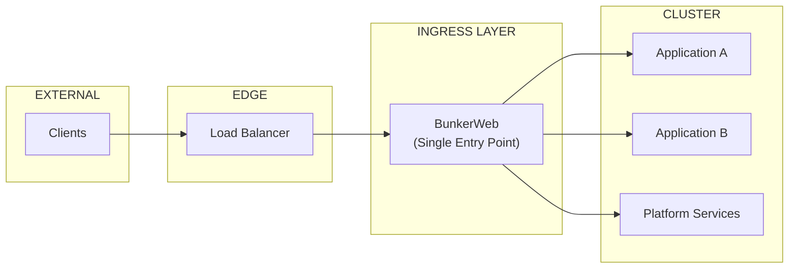
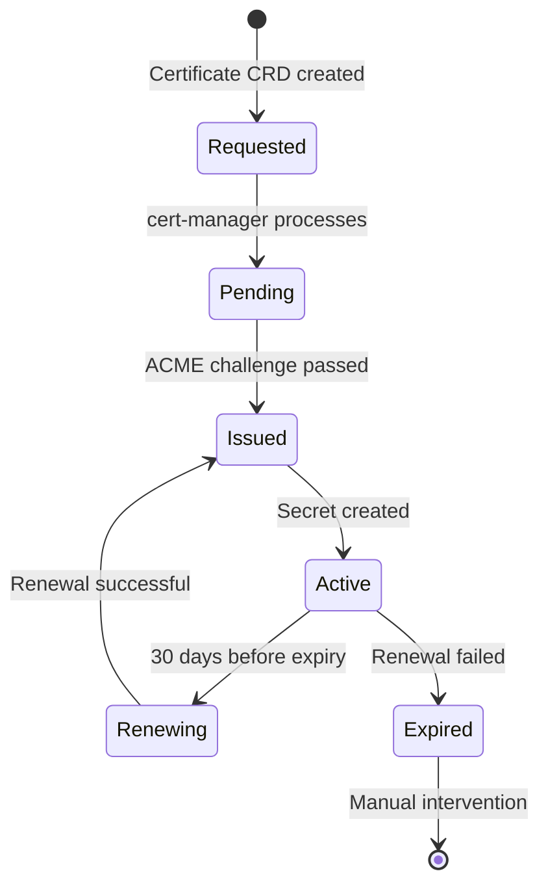
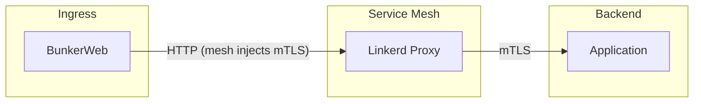

```
RFC-TENANT-SECURITY-0001                                         Section 5
Category: Standards Track                                  Ingress Security
```

# 5. Ingress Security

[← Components](./04-components.md) | [Index](./00-index.md#table-of-contents) | [Next: WAF Architecture →](./06-waf-architecture.md)

---

## 5.1 Ingress Architecture

### 5.1.1 Single Entry Point

All external HTTP/HTTPS traffic enters the cluster through a single ingress layer. This ensures consistent security policy application across all traffic (INV-1).



### 5.1.2 Ingress Responsibilities

| Responsibility | Description | Invariant |
|----------------|-------------|-----------|
| TLS Termination | Decrypt HTTPS, enforce minimum TLS version | INV-2 |
| Routing | Direct traffic to appropriate backends | — |
| WAF Processing | Apply security rules before routing | INV-1 |
| Rate Limiting | Enforce traffic quotas | — |
| Header Management | Add/remove security headers | — |

---

## 5.2 TLS Architecture

### 5.2.1 TLS Requirements

| Requirement | Specification | Rationale |
|-------------|---------------|-----------|
| Minimum Version | TLS 1.2 | INV-2: Deprecate weak protocols |
| Preferred Version | TLS 1.3 | Modern security, performance |
| Certificate Type | RSA 2048+ or ECDSA P-256+ | Industry standard |
| Certificate Lifetime | 90 days (Let's Encrypt default) | Limit exposure window |

### 5.2.2 Certificate Lifecycle



### 5.2.3 Certificate Distribution

| Stage | Actor | Action |
|-------|-------|--------|
| Definition | GitOps | Certificate CRD in Git |
| Issuance | cert-manager | Request from Let's Encrypt |
| Storage | Kubernetes | Secret in ingress namespace |
| Consumption | BunkerWeb | Mount Secret for TLS termination |
| Renewal | cert-manager | Automatic before expiry |

### 5.2.4 TLS Modes

| Mode | Use Case | Certificate Source |
|------|----------|-------------------|
| Terminate | Standard HTTPS endpoints | Let's Encrypt via cert-manager |
| Passthrough | End-to-end encryption required | Application-managed |
| Re-encrypt | Backend requires TLS | Internal CA |

---

## 5.3 Routing Model

### 5.3.1 Route Definition

Routes define how traffic reaches backend services:

| Attribute | Description | Example |
|-----------|-------------|---------|
| Host | Domain name | app.example.com |
| Path | URL path pattern | /api/v1/* |
| Backend | Target service | app-service:8080 |
| TLS | Certificate reference | app-tls-cert |

### 5.3.2 Route Precedence

When multiple routes match, precedence follows:

| Priority | Rule | Example |
|----------|------|---------|
| 1 | Exact path match | /api/v1/users |
| 2 | Prefix match (longest) | /api/v1/ |
| 3 | Prefix match (shorter) | /api/ |
| 4 | Default backend | / |

### 5.3.3 Route Security Properties

Each route inherits security properties:

| Property | Inheritance | Override |
|----------|-------------|----------|
| WAF Rules | Global rules apply | Per-route exceptions allowed |
| Rate Limits | Global defaults | Per-route limits allowed |
| TLS Version | Global minimum | Cannot be lowered |
| Headers | Global security headers | Per-route additions allowed |

---

## 5.4 Security Headers

### 5.4.1 Default Security Headers

The ingress layer applies security headers to all responses:

| Header | Value | Purpose |
|--------|-------|---------|
| Strict-Transport-Security | max-age=31536000; includeSubDomains | Force HTTPS |
| X-Content-Type-Options | nosniff | Prevent MIME sniffing |
| X-Frame-Options | DENY | Prevent clickjacking |
| X-XSS-Protection | 1; mode=block | XSS filter (legacy browsers) |
| Referrer-Policy | strict-origin-when-cross-origin | Control referrer |
| Content-Security-Policy | Varies by application | XSS mitigation |

### 5.4.2 Header Management

| Action | Authority | Use Case |
|--------|-----------|----------|
| Add security header | Platform (default) | All responses |
| Remove header | Security Team | Specific requirements |
| Override CSP | Tenant | Application-specific policy |

---

## 5.5 Backend Communication

### 5.5.1 Ingress to Service Communication

Traffic from ingress to backend services:



### 5.5.2 Communication Security

| Segment | Protocol | Security |
|---------|----------|----------|
| Client → Ingress | HTTPS | TLS 1.2+ |
| Ingress → Mesh | HTTP | Mesh-injected mTLS |
| Mesh → Service | mTLS | Service mesh identity |

### 5.5.3 Health Checks

| Check Type | Purpose | Interval |
|------------|---------|----------|
| Liveness | Detect hung processes | 10 seconds |
| Readiness | Traffic routing decisions | 5 seconds |
| Startup | Initial availability | During startup |

---

## 5.6 Integration with RFC-WORKLOAD-IDENTITY

### 5.6.1 Mesh Integration

BunkerWeb integrates with the Linkerd service mesh:

| Aspect | Configuration |
|--------|---------------|
| Proxy Injection | BunkerWeb pods are mesh-injected |
| Identity | BunkerWeb has mesh identity for backend calls |
| Authorization | Backend ServerAuthorization allows BunkerWeb identity |

### 5.6.2 Handoff Boundary

| Responsibility | RFC-TENANT-SECURITY | RFC-WORKLOAD-IDENTITY |
|----------------|---------------------|----------------------|
| External TLS | Termination | — |
| WAF | Inspection | — |
| Rate Limiting | Enforcement | — |
| Service Identity | — | mTLS identity |
| Service Authorization | — | ServerAuthorization |

---

## Document Navigation

| Previous | Index | Next |
|----------|-------|------|
| [← 4. Components](./04-components.md) | [Table of Contents](./00-index.md#table-of-contents) | [6. WAF Architecture →](./06-waf-architecture.md) |

---

*End of Section 5 — RFC-TENANT-SECURITY-0001*
