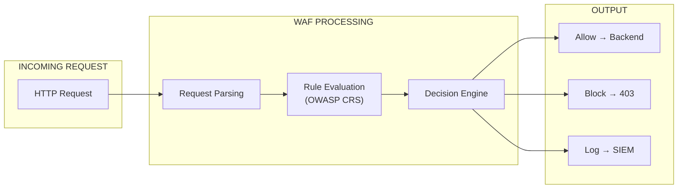
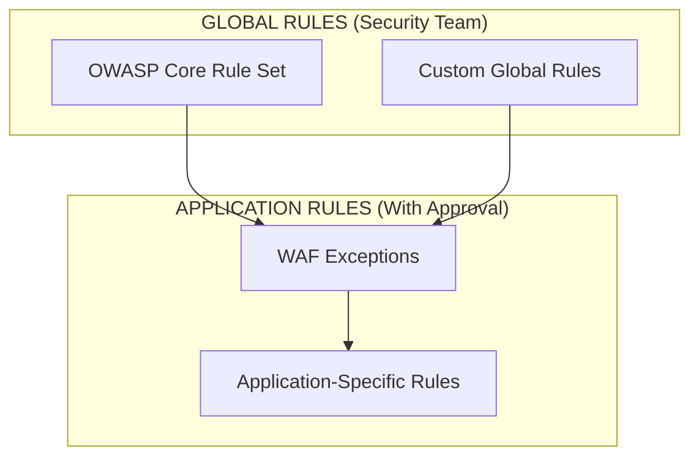
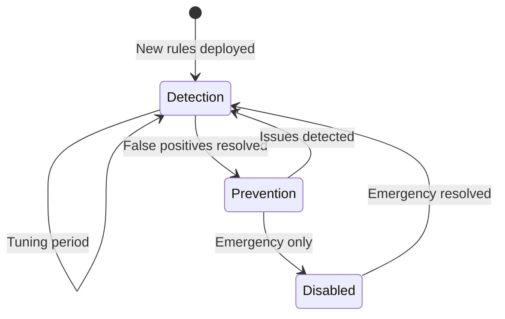
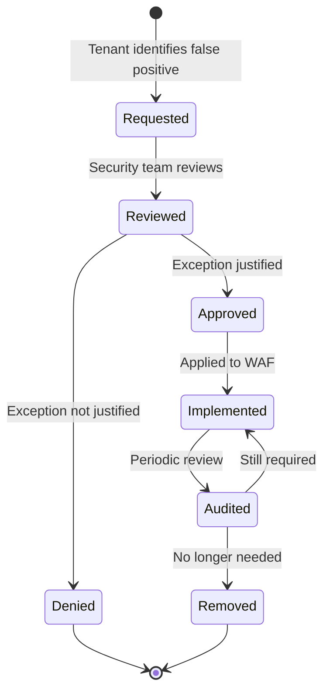
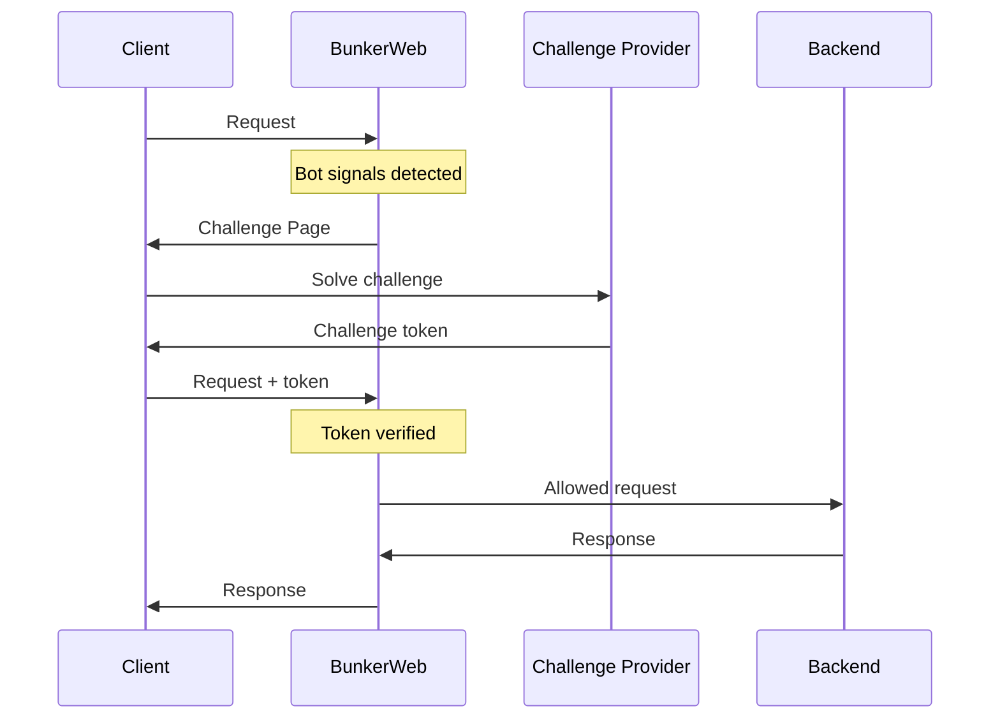

```
RFC-TENANT-SECURITY-0001                                         Section 6
Category: Standards Track                                  WAF Architecture
```

# 6. WAF Architecture

[← Ingress Security](./05-ingress-security.md) | [Index](./00-index.md#table-of-contents) | [Next: Network Policies →](./07-network-policies.md)

---

## 6.1 WAF Overview

### 6.1.1 Purpose

The Web Application Firewall provides protection against common web attacks by inspecting HTTP traffic and blocking malicious requests before they reach applications.



### 6.1.2 Protection Scope

| Attack Category | Protection Method | OWASP Reference |
|-----------------|-------------------|-----------------|
| SQL Injection | Signature detection | A03:2021 |
| Cross-Site Scripting | Input validation | A03:2021 |
| Command Injection | Pattern matching | A03:2021 |
| Path Traversal | Path normalization | A01:2021 |
| Protocol Violations | Request validation | A05:2021 |
| Scanner Detection | Behavioral analysis | — |
| Bot Traffic | Challenge verification | — |

---

## 6.2 Rule Architecture

### 6.2.1 Rule Hierarchy



### 6.2.2 Rule Categories

| Category | Source | Authority | Override Permitted |
|----------|--------|-----------|-------------------|
| OWASP CRS | OWASP Project | Security Team | No |
| Custom Global | Security Team | Security Team | No |
| Application Exceptions | Tenant + Security | Security Team Approval | With approval |
| Application Rules | Tenant | Security Team Approval | With approval |

### 6.2.3 OWASP CRS Coverage

The OWASP Core Rule Set provides protection against:

| Rule Group | Protection |
|------------|------------|
| 900 | Initialization and configuration |
| 910 | Method enforcement |
| 911 | HTTP protocol validation |
| 913 | Scanner detection |
| 920 | Protocol enforcement |
| 921 | Protocol attack |
| 930 | Local file inclusion |
| 931 | Remote file inclusion |
| 932 | Remote code execution |
| 933 | PHP injection |
| 934 | Node.js injection |
| 941 | Cross-site scripting |
| 942 | SQL injection |
| 943 | Session fixation |
| 944 | Java injection |

---

## 6.3 Operating Modes

### 6.3.1 Mode Definitions

| Mode | Behavior | Use Case |
|------|----------|----------|
| **Detection** | Log threats, allow traffic | New rule testing, baseline |
| **Prevention** | Block threats, log events | Production protection |
| **Disabled** | No processing | Emergency bypass only |

### 6.3.2 Mode Transitions

Per INV-4, rule changes MUST follow this transition path:



### 6.3.3 Mode Authority

| Transition | Authority | Approval Required |
|------------|-----------|-------------------|
| Detection → Prevention | Security Team | Yes |
| Prevention → Detection | Security Team | No (safety valve) |
| Any → Disabled | Platform Team | Emergency only |
| Disabled → Detection | Security Team | Yes |

---

## 6.4 Exception Management

### 6.4.1 Exception Types

| Type | Scope | Use Case |
|------|-------|----------|
| Rule Disable | Specific rule ID | Known false positive |
| Path Exclusion | URL path pattern | API endpoints with unusual payloads |
| IP Whitelist | Source IP | Trusted internal systems |
| Parameter Exclusion | Specific parameter | Field contains code/scripts |

### 6.4.2 Exception Lifecycle



### 6.4.3 Exception Requirements

| Requirement | Description |
|-------------|-------------|
| Justification | Document why exception is needed |
| Scope Limitation | Narrowest possible scope |
| Time Limit | Exceptions SHOULD have expiry dates |
| Audit Trail | All exceptions version controlled (INV-13) |
| Periodic Review | Exceptions reviewed quarterly |

---

## 6.5 Bot Mitigation

### 6.5.1 Bot Detection Signals

| Signal | Detection Method |
|--------|------------------|
| Request Rate | Abnormal request frequency |
| User Agent | Known bot signatures |
| Behavior | Non-human interaction patterns |
| IP Reputation | Known malicious sources |
| TLS Fingerprint | Automated client signatures |

### 6.5.2 Challenge Types

| Challenge | Mechanism | User Impact |
|-----------|-----------|-------------|
| Cookie | Set and verify cookie | Transparent |
| JavaScript | Execute JS verification | Transparent |
| CAPTCHA | Image/text challenge | User interaction |
| hCaptcha | Privacy-focused challenge | User interaction |
| reCAPTCHA | Google challenge | User interaction |
| Turnstile | Cloudflare challenge | Minimal interaction |

### 6.5.3 Challenge Flow



---

## 6.6 IP Reputation

### 6.6.1 Reputation Sources

| Source | Type | Update Frequency |
|--------|------|------------------|
| DNSBL | DNS-based blocklist | Real-time |
| External Blacklists | IP lists | Periodic |
| Internal Blacklist | Manual entries | On-demand |
| Behavioral | Auto-ban from behavior | Real-time |

### 6.6.2 Reputation Actions

| Reputation | Action |
|------------|--------|
| Blacklisted | Block immediately |
| Suspicious | Issue challenge |
| Unknown | Normal processing |
| Whitelisted | Bypass bot checks |

---

## 6.7 Logging and Alerting

### 6.7.1 Log Events

| Event Type | Content | Destination |
|------------|---------|-------------|
| Blocked Request | Full request, rule matched, source IP | SIEM |
| Detected Threat | Request details, rule, detection mode | SIEM |
| Challenge Issued | Source IP, challenge type | Logs |
| Challenge Failed | Source IP, failure reason | SIEM |
| IP Banned | Source IP, ban reason, duration | SIEM |

### 6.7.2 Alert Conditions

| Condition | Severity | Response |
|-----------|----------|----------|
| High block rate | Warning | Investigate traffic |
| New attack pattern | Warning | Review rules |
| WAF bypass attempt | Critical | Immediate review |
| Mass bot traffic | Warning | Review rate limits |

### 6.7.3 Compliance Logging

Per INV-9, blocked request logs MUST include:

| Field | Purpose |
|-------|---------|
| Timestamp | Event timing |
| Source IP | Attack origin |
| Target URL | Attack target |
| Rule ID | What triggered block |
| Request excerpt | Evidence (sanitized) |
| Action taken | Block, log, challenge |

---

## 6.8 OWASP Coverage Matrix

### 6.8.1 OWASP Top 10 2021

| Risk | WAF Coverage | Application Coverage |
|------|--------------|---------------------|
| A01: Broken Access Control | Path-based rules | Authorization logic |
| A02: Cryptographic Failures | TLS enforcement | Key management |
| A03: Injection | Full CRS coverage | Parameterized queries |
| A04: Insecure Design | Limited | Application architecture |
| A05: Security Misconfiguration | Protocol rules | Configuration management |
| A06: Vulnerable Components | Limited | Dependency scanning |
| A07: Auth Failures | Rate limiting | Authentication logic |
| A08: Software Integrity | Limited | Supply chain security |
| A09: Logging Failures | WAF logging | Application logging |
| A10: SSRF | Egress rules | Input validation |

### 6.8.2 OWASP API Top 10 2023

| Risk | WAF Coverage | Notes |
|------|--------------|-------|
| API1: Broken Object Level Authorization | Limited | Application responsibility |
| API2: Broken Authentication | Rate limiting | Application responsibility |
| API3: Broken Object Property Level Authorization | None | Application responsibility |
| API4: Unrestricted Resource Consumption | Rate limiting | Full coverage |
| API5: Broken Function Level Authorization | None | Application responsibility |
| API6: Unrestricted Access to Sensitive Business Flows | Rate limiting | Partial coverage |
| API7: Server Side Request Forgery | Egress policies | Network policy support |
| API8: Security Misconfiguration | Protocol rules | Configuration management |
| API9: Improper Inventory Management | None | API management tooling |
| API10: Unsafe Consumption of APIs | Egress policies | Application responsibility |

---

## Document Navigation

| Previous | Index | Next |
|----------|-------|------|
| [← 5. Ingress Security](./05-ingress-security.md) | [Table of Contents](./00-index.md#table-of-contents) | [7. Network Policies →](./07-network-policies.md) |

---

*End of Section 6 — RFC-TENANT-SECURITY-0001*
