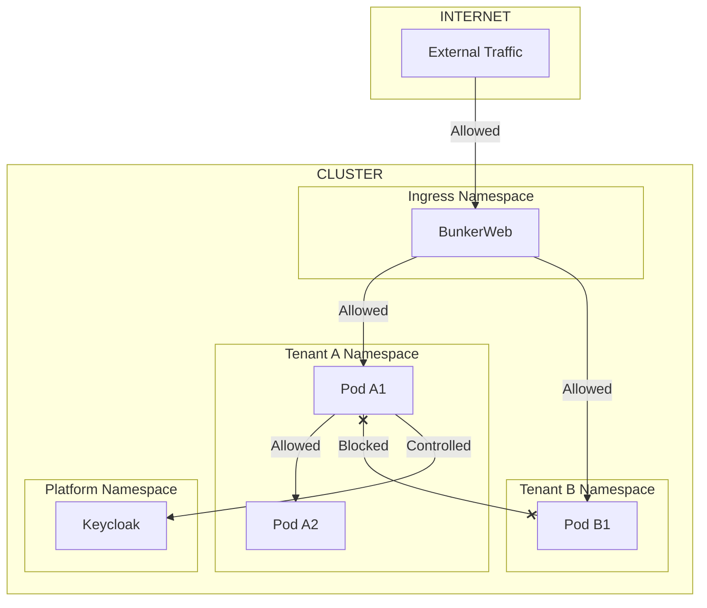
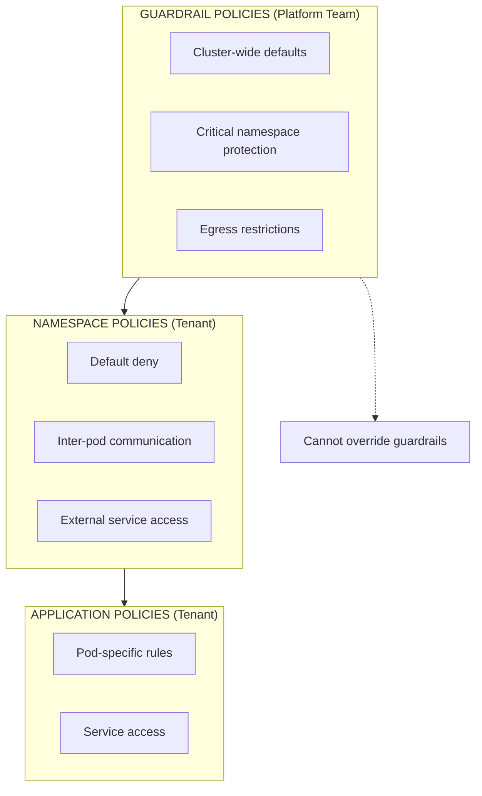
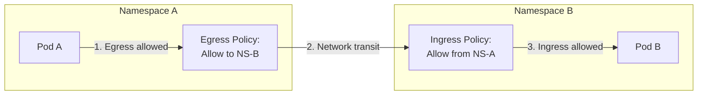
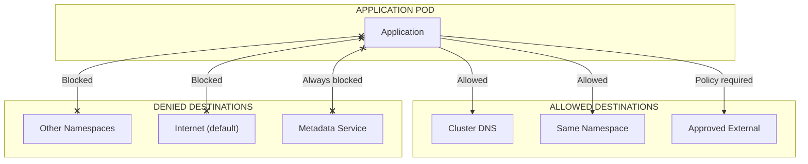
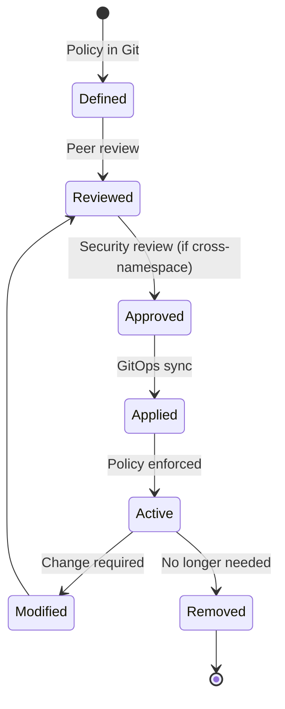

```
RFC-TENANT-SECURITY-0001                                         Section 7
Category: Standards Track                                  Network Policies
```

# 7. Network Policies

[← WAF Architecture](./06-waf-architecture.md) | [Index](./00-index.md#table-of-contents) | [Next: Rate Limiting →](./08-rate-limiting.md)

---

## 7.1 Network Policy Overview

### 7.1.1 Purpose

Kubernetes Network Policies control traffic flow between pods at the network layer. This architecture uses network policies to enforce tenant isolation, control egress, and establish security boundaries.



### 7.1.2 Policy Types

| Type | Direction | Purpose |
|------|-----------|---------|
| Ingress Policy | Incoming to pod | Control who can access pods |
| Egress Policy | Outgoing from pod | Control what pods can access |

---

## 7.2 Policy Hierarchy

### 7.2.1 Policy Layers



### 7.2.2 Policy Precedence

| Layer | Authority | Override | Invariant |
|-------|-----------|----------|-----------|
| Guardrails | Platform Team | Cannot be overridden | INV-8 |
| Namespace | Tenant | Within guardrails | INV-5 |
| Application | Tenant | Within namespace policies | — |

### 7.2.3 Guardrail Policies

Platform guardrail policies that tenants MUST NOT override:

| Guardrail | Purpose | Effect |
|-----------|---------|--------|
| System namespace isolation | Protect kube-system, monitoring | Deny tenant access |
| Platform namespace isolation | Protect Vault, Keycloak | Controlled access only |
| Egress to metadata service | Prevent credential theft | Block 169.254.169.254 |
| Cross-tenant isolation default | Prevent lateral movement | Deny by default |

---

## 7.3 Default Policies

### 7.3.1 Default Deny Ingress

Every tenant namespace MUST have a default-deny ingress policy (INV-5):

| Aspect | Behavior |
|--------|----------|
| Default | All ingress traffic denied |
| Explicit allow | Traffic only allowed via specific policies |
| No implicit trust | Pods cannot receive traffic without policy |

### 7.3.2 Default Deny Egress

Tenant namespace egress MUST be controlled (INV-7):

| Destination | Default | Override |
|-------------|---------|----------|
| Same namespace | Allowed | Policy can restrict |
| Other namespaces | Denied | Explicit allow required |
| Cluster DNS | Allowed | Required for service discovery |
| Internet | Denied | Explicit allow required |
| Metadata service | Denied | Cannot be overridden |

### 7.3.3 Allowed by Default

| Traffic | Reason |
|---------|--------|
| DNS (kube-dns/CoreDNS) | Required for operation |
| Same namespace (with policy) | Typical application pattern |
| From ingress namespace | BunkerWeb needs backend access |

---

## 7.4 Ingress Policies

### 7.4.1 Ingress from BunkerWeb

Applications MUST allow traffic from the ingress namespace:

| From | To | Port | Purpose |
|------|----|----|---------|
| ingress-system/BunkerWeb | Application pods | Application port | External traffic |

### 7.4.2 Ingress from Monitoring

Monitoring systems require access to application metrics:

| From | To | Port | Purpose |
|------|----|----|---------|
| monitoring/Prometheus | Application pods | Metrics port | Scraping |
| monitoring/Prometheus | Application pods | Health port | Health checks |

### 7.4.3 Cross-Namespace Ingress

Cross-namespace traffic requires explicit policies on both sides (INV-6):

| Requirement | Policy Location | Purpose |
|-------------|-----------------|---------|
| Egress policy | Source namespace | Allow outbound |
| Ingress policy | Destination namespace | Allow inbound |



---

## 7.5 Egress Policies

### 7.5.1 Egress Control Model



### 7.5.2 Internet Egress

Internet access from tenant namespaces requires explicit policy:

| Requirement | Description |
|-------------|-------------|
| Explicit policy | Egress to 0.0.0.0/0 must be explicitly allowed |
| Justification | Business reason documented |
| Scope limitation | Narrowest CIDR practical |
| Port restriction | Specific ports only (not all) |

### 7.5.3 Platform Service Egress

Tenants requiring platform services:

| Service | Namespace | Access Method |
|---------|-----------|---------------|
| Keycloak | keycloak | Explicit egress policy |
| Vault | vault | Via ESO (no direct access) |
| Monitoring | monitoring | Metrics push if required |

---

## 7.6 Policy Patterns

### 7.6.1 Standard Application Pattern

A typical application deployment policy structure:

| Policy | Purpose |
|--------|---------|
| Default deny ingress | Baseline (INV-5) |
| Default deny egress | Baseline (INV-7) |
| Allow from ingress | External traffic via BunkerWeb |
| Allow from monitoring | Prometheus scraping |
| Allow DNS egress | Service discovery |
| Allow same-namespace | Internal communication |

### 7.6.2 Database Access Pattern

Applications requiring database access:

| Policy | Purpose |
|--------|---------|
| Standard policies | As above |
| Egress to database namespace | Cross-namespace access |
| Ingress on database | Accept from application namespace |

### 7.6.3 External API Pattern

Applications calling external APIs:

| Policy | Purpose |
|--------|---------|
| Standard policies | As above |
| Egress to specific IPs/CIDRs | External API access |
| Port restriction | HTTPS (443) only |

---

## 7.7 Policy Lifecycle

### 7.7.1 Policy Management Flow



### 7.7.2 GitOps Requirements

Per INV-12, all network policies MUST be:

| Requirement | Description |
|-------------|-------------|
| Version controlled | Stored in Git repository |
| Reviewed | Peer review before merge |
| Auditable | Change history preserved |
| Declarative | Applied via GitOps (ArgoCD) |
| Testable | Validated in non-production first |

### 7.7.3 Change Categories

| Category | Review Required | Security Approval |
|----------|-----------------|-------------------|
| Same-namespace policy | Peer review | No |
| Cross-namespace policy | Peer review | Yes |
| Egress to internet | Peer review | Yes |
| Guardrail exception | N/A | Not permitted |

---

## 7.8 Observability

### 7.8.1 Flow Logging

Per INV-10, network flows MUST be observable:

| Data | Purpose |
|------|---------|
| Source pod/namespace | Traffic origin |
| Destination pod/namespace | Traffic target |
| Port/protocol | Service identification |
| Action | Allow/deny |
| Policy matched | Which policy applied |

### 7.8.2 Denied Traffic Alerts

| Alert | Trigger | Severity |
|-------|---------|----------|
| Cross-namespace denial | Unexpected policy block | Warning |
| High denial rate | Misconfiguration indicator | Warning |
| Egress denial spike | Possible data exfiltration attempt | Critical |
| Metadata service access | Credential theft attempt | Critical |

---

## Document Navigation

| Previous | Index | Next |
|----------|-------|------|
| [← 6. WAF Architecture](./06-waf-architecture.md) | [Table of Contents](./00-index.md#table-of-contents) | [8. Rate Limiting →](./08-rate-limiting.md) |

---

*End of Section 7 — RFC-TENANT-SECURITY-0001*
