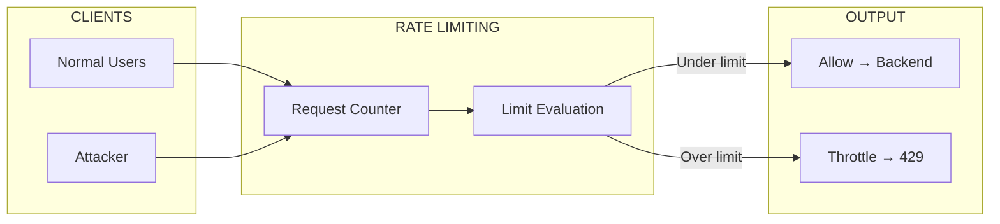
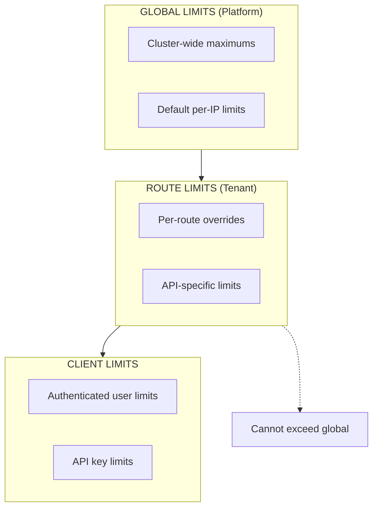
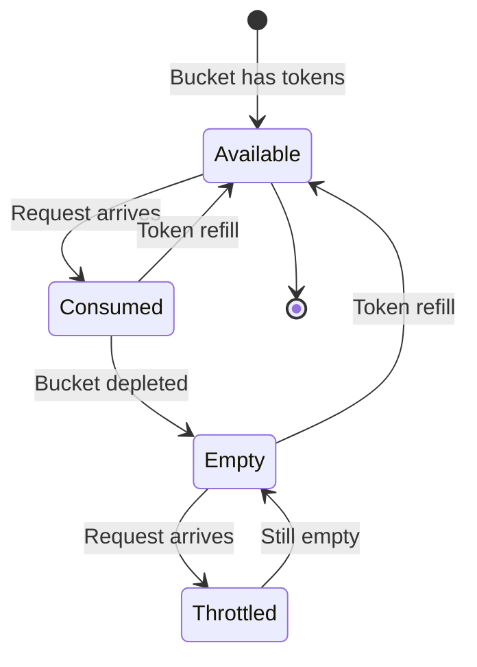
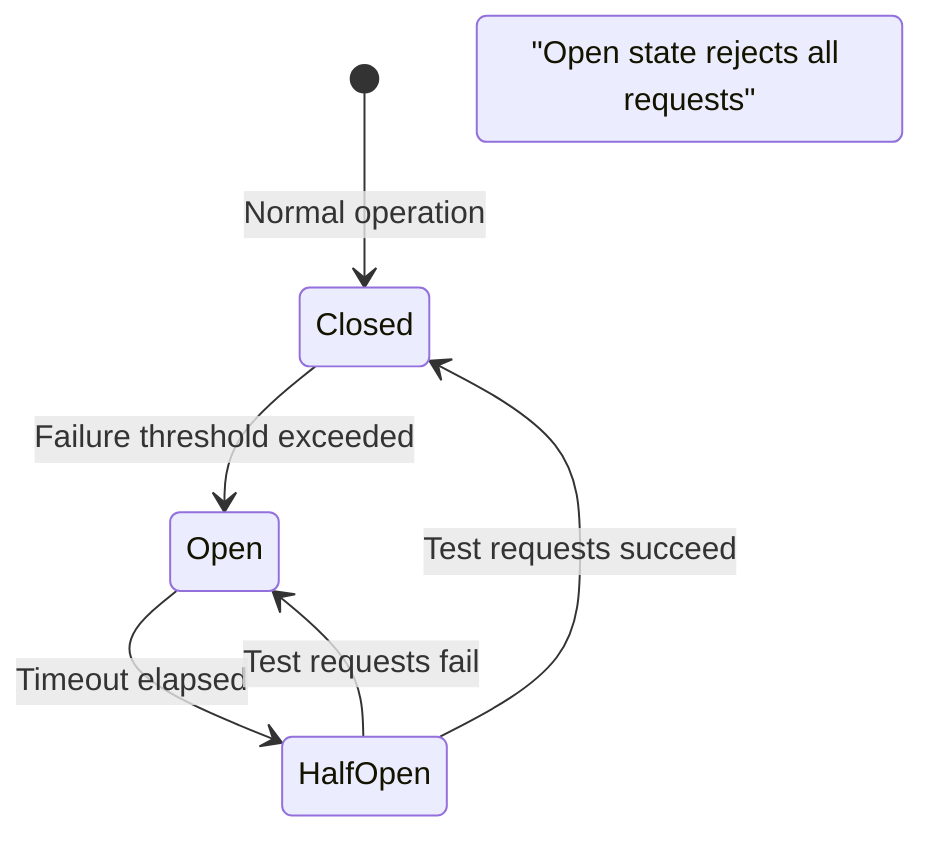

```
RFC-TENANT-SECURITY-0001                                         Section 8
Category: Standards Track                                     Rate Limiting
```

# 8. Rate Limiting

[← Network Policies](./07-network-policies.md) | [Index](./00-index.md#table-of-contents) | [Next: Tenant Isolation →](./09-tenant-isolation.md)

---

## 8.1 Rate Limiting Overview

### 8.1.1 Purpose

Rate limiting protects applications from abuse, prevents resource exhaustion, and mitigates denial-of-service attacks by controlling the rate of incoming requests.



### 8.1.2 Protection Targets

| Target | Threat | Mitigation |
|--------|--------|------------|
| Application availability | DDoS | Request rate limits |
| Backend resources | Resource exhaustion | Connection limits |
| Authentication systems | Brute force | Login rate limits |
| API quotas | Abuse | Per-client limits |
| Cost control | Runaway requests | Global limits |

---

## 8.2 Rate Limit Types

### 8.2.1 Connection Limits

Controls on TCP connection establishment:

| Limit Type | Scope | Purpose |
|------------|-------|---------|
| Max connections per IP | Source IP | Prevent connection flooding |
| Max concurrent connections | Global | Protect backend capacity |
| Connection rate | Per second | Prevent SYN flood |

### 8.2.2 Request Limits

Controls on HTTP request rate:

| Limit Type | Scope | Purpose |
|------------|-------|---------|
| Requests per second | Per IP | Standard rate limiting |
| Requests per minute | Per IP | Burst allowance |
| Requests per route | Per IP per path | API-specific limits |

### 8.2.3 Bandwidth Limits

Controls on data transfer:

| Limit Type | Scope | Purpose |
|------------|-------|---------|
| Request body size | Per request | Prevent large payload attacks |
| Response rate | Per connection | Prevent download abuse |

---

## 8.3 Rate Limit Hierarchy

### 8.3.1 Limit Layers



### 8.3.2 Limit Precedence

| Layer | Authority | Override Capability |
|-------|-----------|---------------------|
| Global | Platform Team | Sets maximum ceiling |
| Route | Tenant | Can lower, not raise |
| Client | Application | Within route limits |

### 8.3.3 Default Limits

| Limit | Default Value | Override |
|-------|---------------|----------|
| Requests per IP per second | Platform-defined | Route can lower |
| Concurrent connections per IP | Platform-defined | Route can lower |
| Request body size | Platform-defined | Route can lower |
| Burst allowance | Platform-defined | Route can adjust |

---

## 8.4 Rate Limit Strategies

### 8.4.1 Token Bucket

The token bucket algorithm allows burst traffic while enforcing average rate:

| Parameter | Description |
|-----------|-------------|
| Bucket size | Maximum burst capacity |
| Refill rate | Tokens added per second |
| Token cost | Tokens consumed per request |



### 8.4.2 Sliding Window

Sliding window provides smoother rate limiting:

| Aspect | Behavior |
|--------|----------|
| Window size | Configurable (e.g., 1 minute) |
| Counter | Requests in current window |
| Evaluation | Current + weighted previous |

### 8.4.3 Strategy Selection

| Use Case | Recommended Strategy |
|----------|---------------------|
| API rate limiting | Token bucket |
| DDoS mitigation | Sliding window |
| Burst allowance | Token bucket |
| Smooth limiting | Sliding window |

---

## 8.5 Client Identification

### 8.5.1 Identification Methods

| Method | Source | Use Case |
|--------|--------|----------|
| Source IP | X-Forwarded-For header | Default identification |
| API Key | Header or query parameter | API clients |
| User ID | JWT claim | Authenticated users |
| Session | Cookie | Web applications |

### 8.5.2 IP Extraction

For clients behind proxies:

| Header | Priority | Trust |
|--------|----------|-------|
| X-Forwarded-For (leftmost) | 1 | Trusted proxies only |
| X-Real-IP | 2 | Single proxy |
| Remote address | 3 | Direct connection |

### 8.5.3 Client Categories

| Category | Rate Limit | Rationale |
|----------|------------|-----------|
| Anonymous | Strictest | Unknown identity |
| Authenticated | Standard | Known user |
| API Partner | Higher | Contracted quota |
| Internal | Relaxed | Trusted systems |

---

## 8.6 Response Behavior

### 8.6.1 Rate Limit Response

When rate limit is exceeded:

| Aspect | Behavior |
|--------|----------|
| HTTP Status | 429 Too Many Requests |
| Retry-After | Header with seconds until retry |
| Response body | Error message with limit info |

### 8.6.2 Response Headers

| Header | Purpose |
|--------|---------|
| X-RateLimit-Limit | Maximum requests allowed |
| X-RateLimit-Remaining | Requests remaining |
| X-RateLimit-Reset | Unix timestamp when limit resets |
| Retry-After | Seconds to wait before retry |

### 8.6.3 Graceful Degradation

| Utilization | Behavior |
|-------------|----------|
| Under limit | Normal processing |
| Near limit (80%) | Warning headers |
| At limit | 429 response |
| Sustained overload | Temporary IP block |

---

## 8.7 DDoS Mitigation

### 8.7.1 Attack Detection

| Signal | Detection |
|--------|-----------|
| Request spike | Sudden traffic increase |
| Pattern anomaly | Unusual request patterns |
| Geographic anomaly | Traffic from unusual regions |
| Protocol abuse | Malformed requests |

### 8.7.2 Mitigation Responses

| Attack Severity | Response |
|-----------------|----------|
| Low | Increased rate limiting |
| Medium | Challenge issuance |
| High | IP blocking |
| Critical | Circuit breaker activation |

### 8.7.3 Circuit Breaker



---

## 8.8 Monitoring and Alerting

### 8.8.1 Rate Limit Metrics

| Metric | Description |
|--------|-------------|
| Rate limit hits | Requests that hit limits |
| Requests allowed | Requests under limit |
| Requests throttled | 429 responses sent |
| Average request rate | Requests per second |

### 8.8.2 Alert Conditions

| Condition | Severity | Response |
|-----------|----------|----------|
| High throttle rate | Warning | Review limits |
| Sustained throttling | Warning | Investigate traffic |
| Circuit breaker open | Critical | Incident response |
| DDoS detected | Critical | Activate mitigation |

### 8.8.3 Dashboards

| Dashboard | Content |
|-----------|---------|
| Traffic overview | Request rates by route |
| Rate limit status | Limits vs actual |
| Client analysis | Top clients by request count |
| Throttle analysis | Throttled requests by source |

---

## Document Navigation

| Previous | Index | Next |
|----------|-------|------|
| [← 7. Network Policies](./07-network-policies.md) | [Table of Contents](./00-index.md#table-of-contents) | [9. Tenant Isolation →](./09-tenant-isolation.md) |

---

*End of Section 8 — RFC-TENANT-SECURITY-0001*
