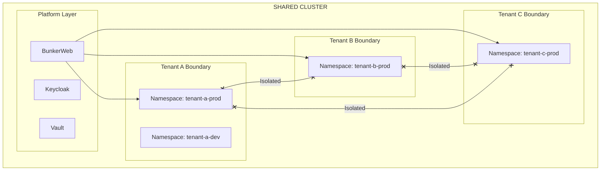
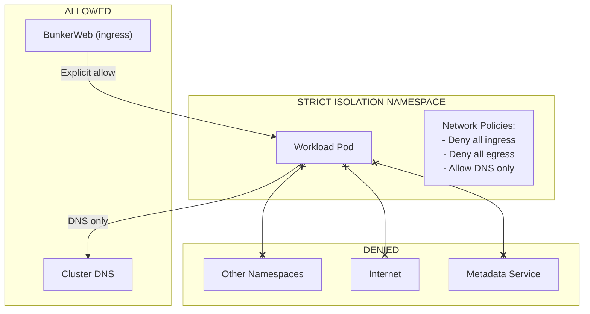
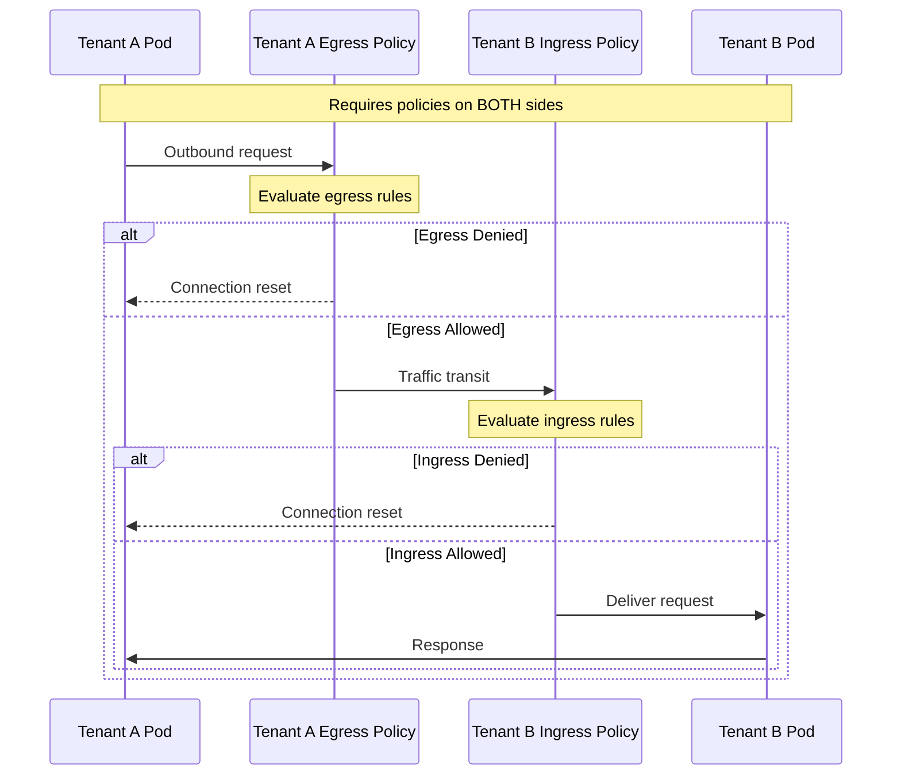
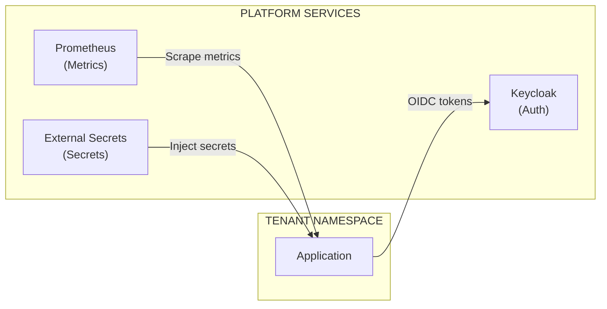
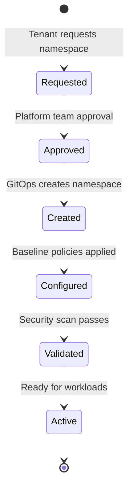
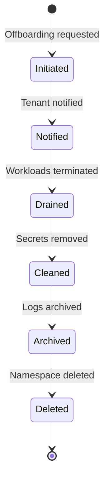

```
RFC-TENANT-SECURITY-0001                                         Section 9
Category: Standards Track                                  Tenant Isolation
```

# 9. Tenant Isolation

[← Rate Limiting](./08-rate-limiting.md) | [Index](./00-index.md#table-of-contents) | [Next: Rationale →](./10-rationale.md)

---

## 9.1 Isolation Overview

### 9.1.1 Multi-Tenancy Model

The platform supports multiple tenants sharing cluster resources while maintaining security isolation. Each tenant operates within defined boundaries that prevent unauthorized access to other tenants' resources.



### 9.1.2 Isolation Dimensions

| Dimension | Mechanism | Invariant |
|-----------|-----------|-----------|
| Network | NetworkPolicy | INV-5, INV-6 |
| Namespace | Kubernetes RBAC | — |
| Secrets | Vault policies | RFC-SECOPS-0001 |
| Identity | Keycloak realms | RFC-IAM-0001 |
| Compute | Resource quotas | — |

---

## 9.2 Namespace Model

### 9.2.1 Namespace Types

| Type | Naming Pattern | Owner | Purpose |
|------|----------------|-------|---------|
| Platform | `<service>` or `<service>-system` | Platform Team | Platform services |
| Tenant | `<tenant>-<environment>` | Tenant | Application workloads |
| Shared | `shared-<purpose>` | Platform Team | Cross-tenant services |

### 9.2.2 Namespace Security Baseline

Every tenant namespace MUST have:

| Requirement | Purpose | Invariant |
|-------------|---------|-----------|
| Default-deny ingress policy | Zero trust baseline | INV-5 |
| Controlled egress policy | Prevent data exfiltration | INV-7 |
| Resource quotas | Prevent resource abuse | — |
| RBAC bindings | Access control | — |
| Network policy labels | Policy targeting | — |

### 9.2.3 Namespace Labels

Standard labels for policy targeting:

| Label | Purpose | Example |
|-------|---------|---------|
| tenant | Tenant identifier | tenant: acme-corp |
| environment | Environment type | environment: production |
| isolation | Isolation level | isolation: strict |
| data-classification | Data sensitivity | data-classification: confidential |

---

## 9.3 Network Isolation

### 9.3.1 Isolation Levels

| Level | Cross-Namespace | Internet Egress | Use Case |
|-------|-----------------|-----------------|----------|
| Strict | Denied | Denied | High-security workloads |
| Standard | Explicit allow | Explicit allow | Most workloads |
| Relaxed | Namespace group | Allowed | Development |

### 9.3.2 Strict Isolation

For high-security workloads:



### 9.3.3 Standard Isolation

For typical workloads:

| Traffic | Policy |
|---------|--------|
| Ingress from BunkerWeb | Allowed |
| Ingress from monitoring | Allowed |
| Ingress from same namespace | Allowed |
| Ingress from other namespaces | Explicit allow required |
| Egress to same namespace | Allowed |
| Egress to DNS | Allowed |
| Egress to platform services | Explicit allow required |
| Egress to internet | Explicit allow required |

---

## 9.4 Cross-Tenant Communication

### 9.4.1 Default Behavior

Cross-tenant communication is DENIED by default (INV-6).

### 9.4.2 Authorized Cross-Tenant Access

When cross-tenant access is required:

| Requirement | Description |
|-------------|-------------|
| Business justification | Documented reason |
| Security review | Approved by Security Team |
| Bilateral policies | Both tenants must configure policies |
| Audit logging | Traffic logged |
| Periodic review | Access reviewed quarterly |

### 9.4.3 Cross-Tenant Flow



---

## 9.5 Platform Service Access

### 9.5.1 Platform Services

Tenants may need access to platform services:

| Service | Namespace | Access Method |
|---------|-----------|---------------|
| Keycloak | keycloak | Explicit egress policy |
| Monitoring | monitoring | Push or allow scrape |
| Logging | logging | Push via agent |
| Vault | vault | Via ESO (not direct) |

### 9.5.2 Platform Access Patterns



### 9.5.3 Platform Access Controls

| Service | Direction | Control |
|---------|-----------|---------|
| Keycloak | Tenant → Platform | Tenant egress policy |
| Prometheus | Platform → Tenant | Tenant ingress policy |
| ESO | Platform → Tenant | ESO operates in tenant namespace |

---

## 9.6 Tenant Onboarding

### 9.6.1 Onboarding Requirements

| Requirement | Description |
|-------------|-------------|
| Namespace creation | Via GitOps template |
| Security baseline | Default policies applied |
| Resource quotas | Limits configured |
| RBAC bindings | Access control established |
| Monitoring | Metrics and logging configured |

### 9.6.2 Namespace Template

Every new tenant namespace receives:

| Component | Purpose |
|-----------|---------|
| Default-deny ingress policy | Security baseline (INV-5) |
| Controlled egress policy | Security baseline (INV-7) |
| Ingress allow policy | Traffic from BunkerWeb |
| Monitoring allow policy | Prometheus scraping |
| Resource quota | Compute limits |
| Limit range | Per-pod limits |

### 9.6.3 Onboarding Flow



---

## 9.7 Tenant Offboarding

### 9.7.1 Offboarding Requirements

| Requirement | Description |
|-------------|-------------|
| Workload removal | All pods terminated |
| Secret cleanup | Vault paths removed |
| Policy removal | NetworkPolicies deleted |
| Namespace deletion | Namespace removed |
| Audit retention | Logs retained per policy |

### 9.7.2 Offboarding Flow



---

## 9.8 Compliance Considerations

### 9.8.1 Isolation Evidence

| Requirement | Evidence |
|-------------|----------|
| SOC 2 CC6.1 | Namespace isolation policies |
| ISO 27001 A.13.1.3 | Network segmentation documentation |
| PCI DSS 1.2 | Cardholder data isolation |

### 9.8.2 Audit Requirements

| Audit Type | Frequency | Content |
|------------|-----------|---------|
| Policy review | Quarterly | All tenant policies |
| Cross-tenant access | Quarterly | Authorized cross-tenant flows |
| Isolation testing | Annually | Penetration testing |

---

## Document Navigation

| Previous | Index | Next |
|----------|-------|------|
| [← 8. Rate Limiting](./08-rate-limiting.md) | [Table of Contents](./00-index.md#table-of-contents) | [10. Rationale →](./10-rationale.md) |

---

*End of Section 9 — RFC-TENANT-SECURITY-0001*
