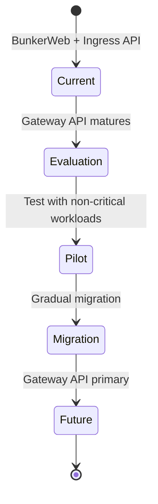

```
RFC-TENANT-SECURITY-0001                                        Section 11
Category: Standards Track                                        Evolution
```

# 11. Evolution

[← Rationale](./10-rationale.md) | [Index](./00-index.md#table-of-contents) | [Next: Appendix A →](./appendix-a-glossary.md)

---

## 11.1 Overview

This section documents anticipated evolution paths, future considerations, and planned enhancements for the Tenant Application Security Architecture.

---

## 11.2 Gateway API Migration

### 11.2.1 Current State

The architecture currently uses BunkerWeb with Ingress API patterns.

### 11.2.2 Future State

Kubernetes Gateway API is the successor to the Ingress API, offering:

| Capability | Benefit |
|------------|---------|
| Role-based resource model | Clearer separation of concerns |
| Advanced routing | Header-based, weight-based routing |
| Policy attachment | Standardized policy resources |
| Multi-tenancy support | Better namespace isolation |

### 11.2.3 Migration Considerations

| Consideration | Assessment |
|---------------|------------|
| BunkerWeb Gateway API support | Monitor for future support |
| Alternative controllers | Traefik, Envoy Gateway support Gateway API |
| Coexistence | Gateway API can coexist with Ingress |
| WAF integration | Evaluate WAF options for Gateway API |

### 11.2.4 Migration Path



---

## 11.3 Advanced Bot Protection

### 11.3.1 Current Capabilities

- Challenge-based verification (CAPTCHA, JavaScript)
- IP reputation blocking
- Rate limiting

### 11.3.2 Future Enhancements

| Enhancement | Benefit |
|-------------|---------|
| Behavioral analysis | Detect sophisticated bots |
| Device fingerprinting | Identify repeat offenders |
| ML-based detection | Adaptive threat detection |
| Bot management API | Programmatic bot classification |

### 11.3.3 Considerations

| Consideration | Assessment |
|---------------|------------|
| Privacy implications | Fingerprinting raises privacy concerns |
| ML model maintenance | Requires ongoing training |
| False positive risk | Sophisticated detection may block legitimate users |

---

## 11.4 API Security Enhancements

### 11.4.1 Current Coverage

WAF provides basic API protection (see Section 6.8).

### 11.4.2 Future Enhancements

| Enhancement | Benefit |
|-------------|---------|
| API schema validation | Enforce OpenAPI contracts |
| API discovery | Automatic API inventory |
| API-specific rate limiting | Per-operation quotas |
| GraphQL protection | Query depth limiting |

### 11.4.3 Integration Points

| Enhancement | Integration With |
|-------------|------------------|
| Schema validation | API Gateway or application |
| API discovery | RFC-DEVELOPER-PLATFORM |
| GraphQL protection | Application-specific |

---

## 11.5 Zero Trust Network Evolution

### 11.5.1 Current Model

- Network policies provide namespace isolation
- Service mesh provides mTLS (RFC-WORKLOAD-IDENTITY)

### 11.5.2 Future Enhancements

| Enhancement | Benefit |
|-------------|---------|
| Identity-aware policies | Policies based on workload identity |
| Micro-segmentation | Pod-level isolation |
| Continuous verification | Runtime identity validation |

### 11.5.3 Integration with RFC-WORKLOAD-IDENTITY

| Current | Future |
|---------|--------|
| Network policy + mesh mTLS | Unified identity-based access |
| Separate policy layers | Integrated policy model |

---

## 11.6 Compliance Automation

### 11.6.1 Current State

- Manual compliance documentation
- Periodic policy audits

### 11.6.2 Future Enhancements

| Enhancement | Benefit |
|-------------|---------|
| Policy-as-code validation | Automated compliance checks |
| Continuous compliance | Real-time compliance status |
| Audit automation | Automated evidence collection |
| Compliance dashboards | Visibility into compliance posture |

### 11.6.3 Tools to Evaluate

| Tool Category | Purpose |
|---------------|---------|
| Policy engines | OPA/Gatekeeper for policy enforcement |
| Compliance scanners | Automated compliance assessment |
| SIEM integration | Security event correlation |

---

## 11.7 Self-Service Integration

### 11.7.1 Current Model

- Network policies managed by platform team
- WAF exceptions require security team approval

### 11.7.2 Future Model (RFC-DEVELOPER-PLATFORM)

| Capability | Description |
|------------|-------------|
| Network policy templates | Pre-approved policy patterns |
| WAF exception requests | Workflow for exception approval |
| Rate limit configuration | Self-service within bounds |
| Compliance visibility | Tenant compliance dashboard |

### 11.7.3 Guardrails

Self-service MUST operate within guardrails:

| Guardrail | Enforcement |
|-----------|-------------|
| Cannot disable WAF | Platform policy |
| Cannot remove default-deny | Platform policy |
| Cannot allow unrestricted egress | Approval required |
| Cannot access other tenants | Technical enforcement |

---

## 11.8 Observability Enhancements

### 11.8.1 Current Capabilities

- WAF logging
- Network flow logs
- Basic metrics

### 11.8.2 Future Enhancements

| Enhancement | Benefit |
|-------------|---------|
| Security analytics | Threat pattern detection |
| Attack visualization | Visual attack analysis |
| Predictive alerting | Early threat detection |
| Correlation | Cross-layer event correlation |

---

## 11.9 Standards Evolution

### 11.9.1 Standards to Monitor

| Standard | Relevance |
|----------|-----------|
| OWASP CRS updates | New attack signatures |
| Kubernetes Gateway API | Ingress evolution |
| OWASP API Security | API protection guidance |
| NIST guidelines | Compliance requirements |

### 11.9.2 RFC Updates

This RFC SHOULD be reviewed and updated when:

| Trigger | Action |
|---------|--------|
| Major OWASP CRS release | Review WAF configuration |
| Gateway API GA | Evaluate migration |
| New compliance requirements | Update controls |
| Technology changes | Re-evaluate decisions |

---

## 11.10 Deprecation Considerations

### 11.10.1 Components with Deprecation Risk

| Component | Risk | Mitigation |
|-----------|------|------------|
| Ingress API | Being replaced by Gateway API | Monitor BunkerWeb support |
| OWASP CRS v3 | v4 is current | Stay on latest version |

### 11.10.2 Deprecation Process

When deprecating architecture elements:

| Step | Action |
|------|--------|
| Announcement | Document deprecation in RFC update |
| Migration path | Provide clear migration guidance |
| Transition period | Allow time for migration |
| Removal | Remove deprecated elements |

---

## Document Navigation

| Previous | Index | Next |
|----------|-------|------|
| [← 10. Rationale](./10-rationale.md) | [Table of Contents](./00-index.md#table-of-contents) | [Appendix A: Glossary →](./appendix-a-glossary.md) |

---

*End of Section 11 — RFC-TENANT-SECURITY-0001*
