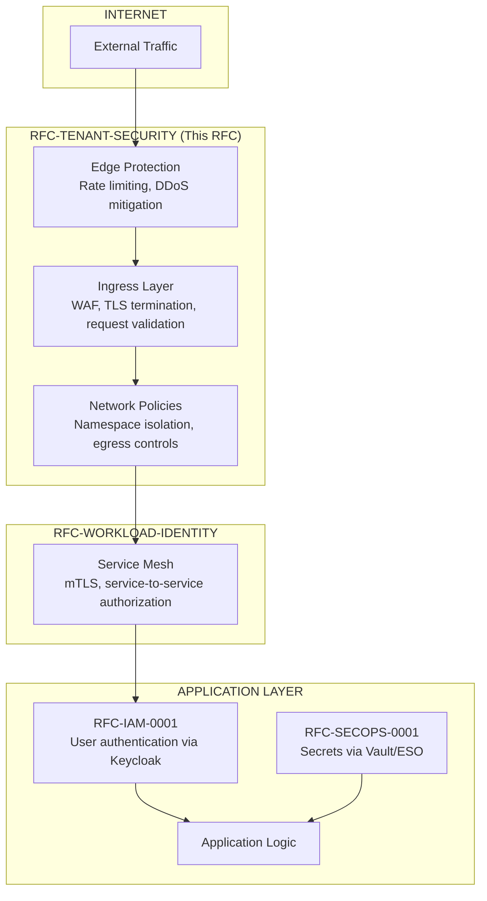
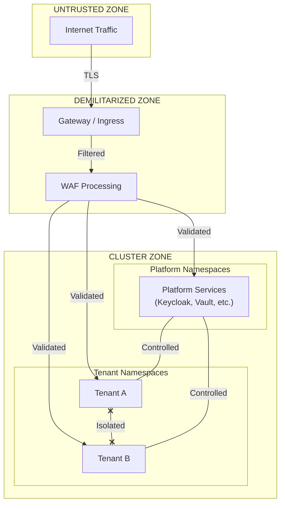
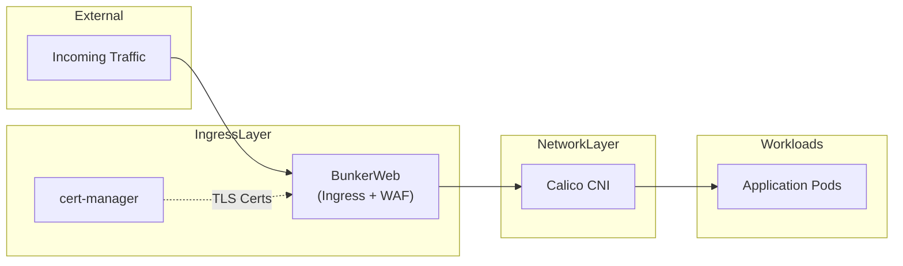

# RFC-TENANT-SECURITY-0001 Planning Document

## Overview

This planning document outlines the scope, relationships, and structure for RFC-TENANT-SECURITY-0001: Tenant Application Security Architecture. This RFC will govern **network-level security controls** for external traffic protection (North-South) and tenant isolation at the Kubernetes layer.

---

## RFC Classification

| Field | Value |
|-------|-------|
| RFC ID | RFC-TENANT-SECURITY-0001 |
| Kind | Architecture |
| Category | Standards Track |
| Domain | Network Security, Tenant Isolation |
| Primary Question | "How is external traffic protected and how are tenants isolated at the network layer?" |

---

## Scope Definition

### In Scope

| Concern | Description |
|---------|-------------|
| Web Application Firewall | Protection against OWASP Top 10 attacks at the ingress layer |
| Kubernetes Network Policies | Namespace isolation, pod-to-pod traffic restrictions |
| Ingress Protection | Gateway API patterns, TLS termination, request validation |
| Rate Limiting and Traffic Shaping | DDoS mitigation, abuse prevention, traffic quotas |
| Tenant Network Isolation | Multi-tenancy segmentation, namespace boundaries |
| TLS Certificate Lifecycle | Automated certificate provisioning and renewal |
| Egress Controls | Controlled outbound traffic from tenant namespaces |

### Out of Scope

| Topic | Governed By | Rationale |
|-------|-------------|-----------|
| Web UI SSO/authentication | RFC-IAM-0001 | Browser-based OIDC flows handled by Keycloak |
| Service-to-service mTLS | RFC-WORKLOAD-IDENTITY | Linkerd handles East-West traffic identity |
| Service mesh authorization policies | RFC-WORKLOAD-IDENTITY | ServerAuthorization via Linkerd |
| Human privileged access | RFC-PAM-0001 | SSH, database, kubectl via Teleport |
| Secret storage/rotation | RFC-SECOPS-0001 | Vault as secret authority |
| OAuth2 Proxy/auth middleware | RFC-IAM-0001 | Keycloak integration patterns |

---

## Relationship to Other RFCs

### Traffic Flow Context

The platform security architecture operates in layers, each governed by a specific RFC:

### Key Boundary: North-South vs East-West

| Direction | RFC Responsibility | Description |
|-----------|-------------------|-------------|
| North-South | RFC-TENANT-SECURITY | External traffic entering the cluster |
| East-West | RFC-WORKLOAD-IDENTITY | Service-to-service traffic within the cluster |

This separation ensures clear authority boundaries and prevents overlapping concerns.

### Normative Dependencies

| Dependency RFC | What RFC-TENANT-SECURITY Inherits |
|----------------|-----------------------------------|
| RFC-SECOPS-0001 | Vault for TLS certificate secrets, ESO for secret distribution |
| RFC-IAM-0001 | Integration patterns for authenticated routes |

### Informative Dependencies

| Related RFC | Relationship |
|-------------|--------------|
| RFC-WORKLOAD-IDENTITY | Service mesh handles traffic after ingress |
| RFC-PAM-0001 | Network policies may affect privileged access paths |
| RFC-DEVELOPER-PLATFORM | Self-service network policy requests |

---

## Architectural Concepts

### Defense-in-Depth Layers

The architecture establishes multiple security layers, each with distinct responsibilities:

| Layer | Responsibility | Failure Mode |
|-------|----------------|--------------|
| Edge Protection | Rate limiting, IP reputation | Degraded but operational |
| WAF | Attack signature detection | Log-only or block |
| TLS Termination | Encryption in transit | Connection refused |
| Network Policies | Namespace isolation | Traffic denied |

### Authority Domains

| Domain | Authority | Scope |
|--------|-----------|-------|
| Global Rate Limits | Platform Team | Cluster-wide defaults |
| WAF Rules | Security Team | OWASP CRS + custom rules |
| Namespace Policies | Tenant + Platform | Tenant-specific with guardrails |
| TLS Certificates | Automated (cert-manager) | Per-ingress automation |
| Guardrail Policies | Platform Team | Cannot be overridden by tenants |

### Trust Boundaries

---

## Planned Invariants

### Traffic Protection Invariants

| ID | Invariant Statement |
|----|---------------------|
| INV-1 | All external HTTP/HTTPS traffic MUST pass through the WAF before reaching application workloads |
| INV-2 | All public endpoints MUST use TLS 1.2 or higher; TLS 1.0 and 1.1 MUST NOT be accepted |
| INV-3 | Certificate provisioning MUST be automated; manual certificate installation MUST NOT be permitted for production endpoints |
| INV-4 | WAF MUST operate in detection mode before enforcement mode is enabled for any new rule set |

### Network Policy Invariants

| ID | Invariant Statement |
|----|---------------------|
| INV-5 | All tenant namespaces MUST have a default-deny ingress policy; traffic MUST be explicitly allowed |
| INV-6 | Cross-namespace traffic MUST be explicitly authorized; implicit cross-namespace access MUST NOT exist |
| INV-7 | Egress to the public internet from tenant namespaces MUST be controlled; unrestricted egress MUST NOT be permitted |
| INV-8 | Platform guardrail policies MUST NOT be overridable by tenant-level policies |

### Observability Invariants

| ID | Invariant Statement |
|----|---------------------|
| INV-9 | All blocked requests MUST be logged with sufficient context for incident response |
| INV-10 | Network flow data MUST be observable for troubleshooting and audit purposes |
| INV-11 | WAF security events MUST be integrated with the platform monitoring and alerting system |

### GitOps Invariants

| ID | Invariant Statement |
|----|---------------------|
| INV-12 | Network policy definitions MUST be stored in Git and applied via GitOps |
| INV-13 | WAF rule customizations MUST be version controlled |
| INV-14 | TLS secrets MUST be managed via automated systems (cert-manager or ESO); manual secret creation MUST NOT be used |

---

## Component Taxonomy

### Primary Components

| Component | Technology | Responsibility | Authority |
|-----------|------------|----------------|-----------|
| Ingress + WAF | BunkerWeb | Traffic entry, TLS termination, routing, attack prevention | Platform Team |
| Certificate Manager | cert-manager | TLS certificate lifecycle automation | Automated |
| CNI Provider | Calico | Network policy enforcement | Platform Team |
| Network Policy Controller | Calico | Policy compilation and distribution | Platform Team |

### Component Relationships

---

## Technology Context

### Existing Infrastructure Constraints

| Component | Current State | Implication |
|-----------|---------------|-------------|
| CNI | Calico deployed | Network policies use Calico/Kubernetes NetworkPolicy |
| Ingress | NGINX Ingress | Evaluate replacement (retiring March 2026) |
| TLS | cert-manager with Let's Encrypt | Continue existing pattern |
| Service Mesh | Linkerd (RFC-WORKLOAD-IDENTITY) | Coordinate ingress-to-mesh handoff |

### WAF Recommendation: BunkerWeb

BunkerWeb is the recommended WAF solution for this architecture.

#### Selection Criteria

| Criterion | BunkerWeb Assessment |
|-----------|---------------------|
| OWASP CRS Compatibility | Full OWASP Core Rule Set integration via ModSecurity |
| Kubernetes Native | Official Helm chart, can act as Ingress controller |
| License | AGPLv3 (free, open source, no app limits) |
| Operational Model | Web UI for rule management, plugin system |
| Ingress Replacement | Can serve as combined WAF + Ingress (addresses NGINX retirement) |
| Bot Protection | Multiple challenge types (CAPTCHA, hCaptcha, reCAPTCHA, Turnstile) |
| Maintenance | Active development, frequent updates |

#### Alternatives Evaluated

| Alternative | Reason Not Selected |
|-------------|---------------------|
| SafeLine | No OWASP CRS compatibility; proprietary semantic engine (black-box); free tier limited to 10 apps |
| Coraza | Library only (requires separate integration); no built-in UI; better suited for Envoy Gateway |
| ModSecurity | End-of-life (July 2024); maintenance mode only |
| Cloud WAF | Not permitted; requires free/open-source solution |

#### Key Capabilities

| Capability | Description |
|------------|-------------|
| Reverse Proxy | NGINX-based, can replace existing ingress |
| WAF Engine | ModSecurity with OWASP CRS integration |
| Bot Mitigation | Challenge-based verification (cookie, JavaScript, CAPTCHA providers) |
| Rate Limiting | Connection and request limits per client |
| IP Reputation | External blacklists and DNSBL integration |
| TLS Automation | Native Let's Encrypt support |
| Web UI | Configuration and rule management interface |

### Gateway API Consideration

| Factor | Assessment |
|--------|------------|
| Standard Maturity | Gateway API is the successor to Ingress API |
| Feature Coverage | Supports advanced routing, traffic policies |
| Migration Path | BunkerWeb can coexist during transition; future versions may support Gateway API |
| NGINX Ingress Retirement | March 2026 end-of-life makes migration planning necessary |

---

## RFC Section Structure

Following RFC-RFCSTD-0002 (Architecture Kind):

| Section | File | Requirement | Content Summary |
|---------|------|-------------|-----------------|
| Index | 00-index.md | REQUIRED | Metadata, abstract, TOC, reading paths |
| Introduction | 01-introduction.md | REQUIRED | Problem statement, current state, motivation |
| Requirements | 02-requirements.md | REQUIRED | Design goals, non-goals, invariants, success criteria |
| Architecture | 03-architecture.md | REQUIRED | Defense layers, trust boundaries, authority domains |
| Components | 04-components.md | REQUIRED | Component taxonomy, responsibilities, interfaces |
| Ingress Security | 05-ingress-security.md | CONDITIONAL | Gateway patterns, TLS architecture |
| WAF Architecture | 06-waf-architecture.md | CONDITIONAL | WAF placement, rule lifecycle, exception handling |
| Network Policies | 07-network-policies.md | CONDITIONAL | Policy hierarchy, tenant isolation model |
| Rate Limiting | 08-rate-limiting.md | CONDITIONAL | Traffic shaping, DDoS mitigation patterns |
| Tenant Isolation | 09-tenant-isolation.md | CONDITIONAL | Multi-tenancy model, namespace boundaries |
| Rationale | 10-rationale.md | REQUIRED | Technology decisions, alternatives rejected |
| Evolution | 11-evolution.md | RECOMMENDED | Future considerations, Gateway API migration |
| Glossary | appendix-a-glossary.md | REQUIRED | Terms, diagram index |
| References | appendix-b-references.md | REQUIRED | Normative, informative, internal references |

---

## OWASP Protection Scope

### Web Application (OWASP Top 10 2021)

| Risk | WAF Responsibility | Application Responsibility |
|------|-------------------|---------------------------|
| A01: Broken Access Control | Path-based blocking | Authorization logic |
| A02: Cryptographic Failures | TLS enforcement | Key management |
| A03: Injection | Input validation, signature detection | Parameterized queries |
| A04: Insecure Design | — | Application architecture |
| A05: Security Misconfiguration | Protocol enforcement | Configuration management |
| A06: Vulnerable Components | — | Dependency management |
| A07: Auth Failures | Brute force rate limiting | Authentication logic |
| A08: Software Integrity | — | Supply chain security |
| A09: Logging Failures | Request logging | Application logging |
| A10: SSRF | Egress controls | Input validation |

### API Security (OWASP API Top 10 2023)

| Risk | Network-Level Mitigation |
|------|-------------------------|
| API4: Unrestricted Resource Consumption | Rate limiting per client/route |
| API7: Server Side Request Forgery | Egress network policies |
| API8: Security Misconfiguration | Protocol and header enforcement |

---

## Rationale Topics

The Rationale section will document decisions on:

| Decision Area | Recommendation | Alternatives Considered |
|---------------|----------------|------------------------|
| WAF Solution | BunkerWeb | SafeLine, Coraza, ModSecurity |
| Ingress Architecture | BunkerWeb (combined WAF + Ingress) | Gateway API, NGINX Ingress, Service Mesh Ingress |
| Network Policy Model | Kubernetes NetworkPolicy | Calico-specific CRDs |
| Rate Limiting Location | Gateway-level (BunkerWeb) | Application-level, Both |
| Certificate Authority | Let's Encrypt via cert-manager | Vault PKI, Hybrid |

### WAF Decision Rationale Summary

BunkerWeb was selected over alternatives for these reasons:

| Factor | BunkerWeb | SafeLine | Coraza |
|--------|-----------|----------|--------|
| OWASP CRS | Integrated | Not compatible | Compatible |
| Kubernetes | Helm + Ingress controller | Docker-first (kompose) | Envoy plugin |
| UI | Web UI included | Web UI included | None |
| License | AGPLv3 (unlimited) | GPL-3.0 (10 app limit free) | Apache 2.0 |
| Rule Transparency | Auditable (OWASP CRS) | Black-box semantic | Auditable |
| Ingress Replacement | Yes | No | No |

---

## Cross-RFC Coordination

### Integration Points with RFC-WORKLOAD-IDENTITY

| Concern | Coordination Required |
|---------|----------------------|
| Ingress-to-mesh handoff | Define where network policy ends and mesh mTLS begins |
| Ingress controller identity | Ingress controller needs mesh identity for backend calls |
| Policy precedence | Clarify network policy vs mesh authorization priority |

### Integration Points with RFC-SECOPS-0001

| Concern | Coordination Required |
|---------|----------------------|
| TLS certificate storage | Certificates stored in Vault or Kubernetes Secrets |
| WAF secret management | API tokens, custom rule credentials via ESO |
| Audit log storage | Centralized logging for compliance |

### Integration Points with RFC-IAM-0001

| Concern | Coordination Required |
|---------|----------------------|
| Authentication endpoints | WAF exceptions for Keycloak OIDC flows |
| OAuth2 Proxy routes | Rate limiting considerations for auth callbacks |

---

## Success Criteria

| Criterion | Verification Method |
|-----------|-------------------|
| OWASP Top 10 protection | WAF blocks standard attack payloads |
| Tenant isolation | Cross-namespace traffic denied by default |
| Certificate automation | No manual certificate operations required |
| Observability | All security events visible in monitoring |
| GitOps compliance | All policies managed via Git |

---

## References (Draft)

### Normative References

| ID | Title | URL |
|----|-------|-----|
| OWASP-TOP10 | OWASP Top 10 2021 | https://owasp.org/Top10/ |
| OWASP-API-TOP10 | OWASP API Security Top 10 2023 | https://owasp.org/API-Security/ |
| OWASP-CRS | OWASP Core Rule Set | https://coreruleset.org/ |
| K8S-NETPOL | Kubernetes Network Policies | https://kubernetes.io/docs/concepts/services-networking/network-policies/ |
| GATEWAY-API | Kubernetes Gateway API | https://gateway-api.sigs.k8s.io/ |
| RFC2119 | Key words for use in RFCs | https://www.rfc-editor.org/rfc/rfc2119 |

### Informative References

| ID | Title | URL |
|----|-------|-----|
| BUNKERWEB | BunkerWeb Official Documentation | https://docs.bunkerweb.io/ |
| BUNKERWEB-GH | BunkerWeb GitHub Repository | https://github.com/bunkerity/bunkerweb |
| BUNKERWEB-HELM | BunkerWeb Helm Chart | https://github.com/bunkerity/bunkerweb-helm |
| CALICO-NETPOL | Calico Network Policy Documentation | https://docs.tigera.io/calico/latest/network-policy/ |
| CERT-MANAGER | cert-manager Documentation | https://cert-manager.io/docs/ |
| NGINX-RETIRE | Ingress NGINX Retirement Announcement | https://kubernetes.io/blog/2025/11/11/ingress-nginx-retirement/ |
| SAFELINE | SafeLine WAF (alternative evaluated) | https://github.com/chaitin/SafeLine |
| CORAZA | Coraza WAF Project (alternative evaluated) | https://coraza.io/ |

### Internal References

| ID | Document |
|----|----------|
| RFC-IAM-0001 | Federated Identity and Access Management Architecture |
| RFC-SECOPS-0001 | GitOps-Native, Vault-First Secret Management Architecture |
| RFC-WORKLOAD-IDENTITY | Workload Identity Architecture |
| RFC-PAM-0001 | Privileged Access Management Architecture |

---

*End of RFC-TENANT-SECURITY-0001 Planning Document*
