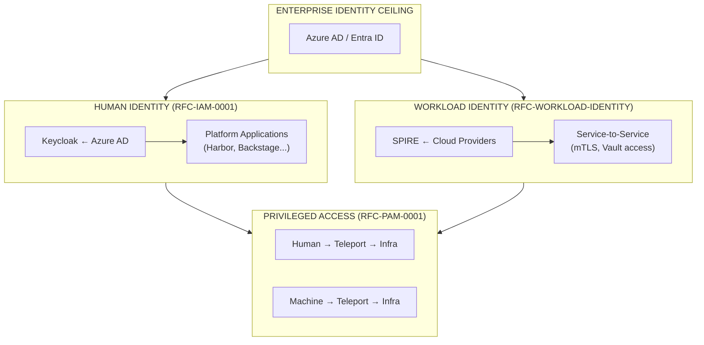

```
RFC-WORKLOAD-IDENTITY-0001                                   Standards Track
Category: Standards Track                          Workload Identity Architecture
Version: 1.0.0                                              February 2026
```

# RFC-WORKLOAD-IDENTITY-0001: Workload Identity Architecture

---

## Document Metadata

| Field | Value |
|-------|-------|
| **RFC Number** | RFC-WORKLOAD-IDENTITY-0001 |
| **Kind** | Architecture |
| **Title** | Workload Identity Architecture |
| **Status** | Draft |
| **Category** | Standards Track |
| **Created** | 2026-02-11 |
| **Updated** | 2026-02-11 |
| **Version** | 1.0.0 |
| **Author** | Platform Engineering Team |
| **Requires** | RFC-IAM-0001, RFC-SECOPS-0001 |

---

## Abstract

This RFC defines the architecture for non-human identity management across all workloads in the platform. It establishes patterns for authenticating and authorizing machines, services, CI/CD pipelines, GitOps operators, Kubernetes controllers, and AI agents. The architecture builds on SPIFFE/SPIRE as the primary identity framework, integrates with HashiCorp Vault for secret access, leverages Teleport Machine ID for infrastructure automation, and uses service mesh (Linkerd) for network-layer identity enforcement.

This RFC complements RFC-IAM-0001 (human identity) and RFC-PAM-0001 (privileged access), sharing the same trust foundation (Azure AD as authorization ceiling) and credential authority (Vault) while implementing distinct access patterns appropriate for non-human principals.

---

## Scope

### In Scope

| Concern | Description |
|---------|-------------|
| Kubernetes workload identity | Pod/container identity via service accounts and SPIFFE |
| Service-to-service authentication | mTLS, SPIFFE SVIDs |
| CI/CD pipeline identity | GitHub Actions OIDC, GitLab CI, Tekton |
| GitOps operator identity | ArgoCD, Flux, Kargo automation tokens |
| Kubernetes operator identity | Controller service accounts |
| CronJob/scheduled task identity | Batch workload authentication |
| AI agent identity | LLM-based automation, delegation chains |
| Machine identity (VMs) | Teleport Machine ID for non-K8s hosts |
| Cross-cluster identity federation | SPIFFE federation, trust domains |

### Out of Scope

| Concern | Addressed By |
|---------|--------------|
| Human identity and authentication | RFC-IAM-0001 |
| Human privileged access (SSH, DB, kubectl) | RFC-PAM-0001 |
| Secret storage and lifecycle management | RFC-SECOPS-0001 |
| Network-level security policies | [RFC-TENANT-SECURITY-0001](../tenant-security/00-index.md) |
| Developer portal self-service | [RFC-DEVELOPER-PLATFORM-0001](../developer-platform/00-index.md) |

---

## Relationship to Other RFCs

### Normative Dependencies

**RFC-IAM-0001: Federated Identity and Access Management Architecture**
- Provides human identity foundation
- Defines authorization ceiling concept
- Establishes Keycloak as identity broker

**RFC-SECOPS-0001: GitOps-Native, Vault-First Secret Management Architecture**
- Defines Vault as credential authority
- Establishes ESO distribution patterns
- Provides secret lifecycle management

### Integration Points

**RFC-PAM-0001: Privileged Access Management Architecture**
- Shares Teleport infrastructure (Machine ID)
- Uses same Vault credential engines
- Follows complementary access patterns

### Future RFCs

| RFC | Relationship |
|-----|--------------|
| RFC-DEVELOPER-PLATFORM | May provide self-service for workload identity |
| RFC-TENANT-SECURITY | Network-level controls complement workload identity |

---

## Table of Contents

### Core Sections

1. [Introduction](./01-introduction.md)
   - Background and motivation
   - Current state analysis
   - Problem statement

2. [Requirements](./02-requirements.md)
   - Design goals and non-goals
   - Architectural invariants
   - Success criteria

3. [Architecture](./03-architecture.md)
   - Identity hierarchy
   - Trust boundaries
   - Authority domains
   - Integration patterns

4. [Components](./04-components.md)
   - Component taxonomy
   - SPIRE architecture
   - Vault integration
   - Teleport Machine ID
   - Service mesh integration

### Workload Categories

5. [Kubernetes Workloads](./05-kubernetes-workloads.md)
   - ServiceAccount patterns
   - SPIRE agent deployment
   - Vault Kubernetes auth

6. [CI/CD Identity](./06-cicd-identity.md)
   - OIDC federation patterns
   - GitHub Actions integration
   - Tekton pipeline identity

7. [GitOps Identity](./07-gitops-identity.md)
   - ArgoCD identity model
   - Flux workload identity
   - Automation token management

8. [Operator Identity](./08-operator-identity.md)
   - Kubernetes operator patterns
   - Controller service accounts
   - CronJob identity

9. [AI Agent Identity](./09-ai-agent-identity.md)
   - Agent identity challenges
   - Delegation patterns
   - Sub-agent chains

10. [Machine Identity](./10-machine-identity.md)
    - Teleport Machine ID
    - tbot deployment
    - VM attestation

### Cross-Cutting Concerns

11. [Service Mesh Integration](./11-service-mesh-integration.md)
    - Linkerd identity model
    - mTLS configuration
    - Authorization policies

12. [Federation](./12-federation.md)
    - Cross-cluster identity
    - SPIFFE federation
    - Multi-cloud identity

### Supporting Sections

13. [Rationale](./13-rationale.md)
    - Why SPIFFE/SPIRE
    - Alternatives considered
    - Trade-off analysis

14. [Evolution](./14-evolution.md)
    - Future considerations
    - AI agent evolution
    - Standards evolution

### Appendices

- [Appendix A: Glossary](./appendix-a-glossary.md)
- [Appendix B: References](./appendix-b-references.md)

---

## Reading Paths

### Platform Engineers

Recommended reading order for platform engineers implementing this architecture:

1. [Introduction](./01-introduction.md) - Understand the problem space
2. [Requirements](./02-requirements.md) - Learn the invariants
3. [Architecture](./03-architecture.md) - Grasp the overall design
4. [Components](./04-components.md) - Understand component responsibilities
5. [Kubernetes Workloads](./05-kubernetes-workloads.md) - Core implementation
6. [Service Mesh Integration](./11-service-mesh-integration.md) - Network identity

### Security Engineers

Recommended reading order for security review:

1. [Requirements](./02-requirements.md) - Understand invariants and constraints
2. [Architecture](./03-architecture.md) - Trust boundaries and authority domains
3. [AI Agent Identity](./09-ai-agent-identity.md) - Delegation chain security
4. [Federation](./12-federation.md) - Cross-boundary trust
5. [Rationale](./13-rationale.md) - Understand design decisions

### DevOps/SRE Teams

Recommended reading order for operations teams:

1. [CI/CD Identity](./06-cicd-identity.md) - Pipeline identity patterns
2. [GitOps Identity](./07-gitops-identity.md) - Operator identity
3. [Machine Identity](./10-machine-identity.md) - VM identity
4. [Operator Identity](./08-operator-identity.md) - Controller patterns

### Application Developers

Recommended reading order for application developers:

1. [Kubernetes Workloads](./05-kubernetes-workloads.md) - How workloads get identity
2. [Service Mesh Integration](./11-service-mesh-integration.md) - mTLS for services
3. [Appendix A: Glossary](./appendix-a-glossary.md) - Terminology reference

---

## Key Concepts

### Identity Hierarchy



### Workload Categories

| Category | Example | Identity Method |
|----------|---------|-----------------|
| Kubernetes Applications | Web services, APIs | SPIFFE SVID + Vault K8s Auth |
| CI/CD Pipelines | GitHub Actions, Tekton | OIDC Federation |
| GitOps Operators | ArgoCD, Flux | ServiceAccount + Vault K8s Auth |
| Kubernetes Operators | Custom controllers | ServiceAccount + RBAC |
| CronJobs | Scheduled tasks | ServiceAccount + Vault K8s Auth |
| AI Agents | LLM automation | Delegation tokens (RFC 8693) |
| VMs/Machines | Infrastructure automation | Teleport Machine ID (tbot) |

---

## Document Conventions

### Requirement Level Keywords

This document uses requirement level keywords as defined in [RFC2119] and [RFC8174]:

| Keyword | Meaning |
|---------|---------|
| **MUST** | Absolute requirement |
| **MUST NOT** | Absolute prohibition |
| **SHOULD** | Recommended but not required |
| **SHOULD NOT** | Not recommended but not prohibited |
| **MAY** | Optional |

### Invariant References

Invariants are referenced as `INV-X` where X is the invariant number. See [Section 2](./02-requirements.md) for complete invariant definitions.

### ADR References

Architecture Decision Records are referenced as `ADR-WI-XXX`. See [Appendix A](./appendix-a-glossary.md) for the ADR index.

---

## Version History

| Version | Date | Changes |
|---------|------|---------|
| 1.0.0 | 2026-02-11 | Initial release |

---

## Document Navigation

| Previous | Index | Next |
|----------|-------|------|
| — | Table of Contents | [1. Introduction →](./01-introduction.md) |

---

*End of Index — RFC-WORKLOAD-IDENTITY-0001*
