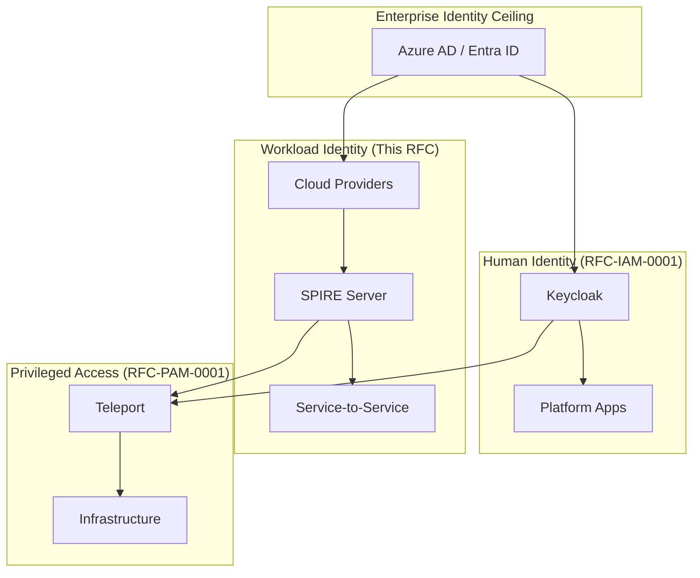
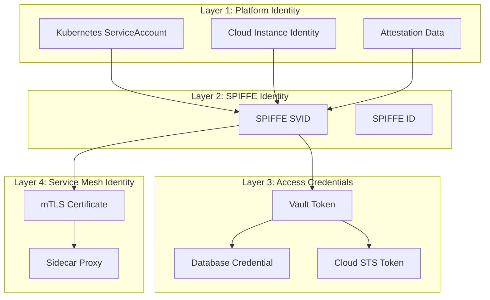
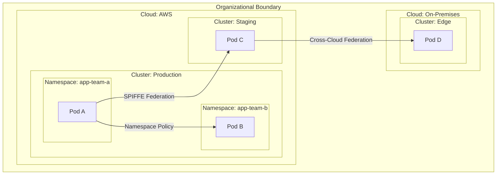
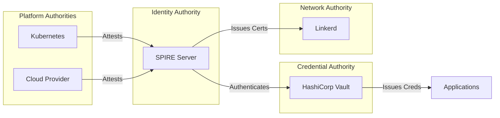
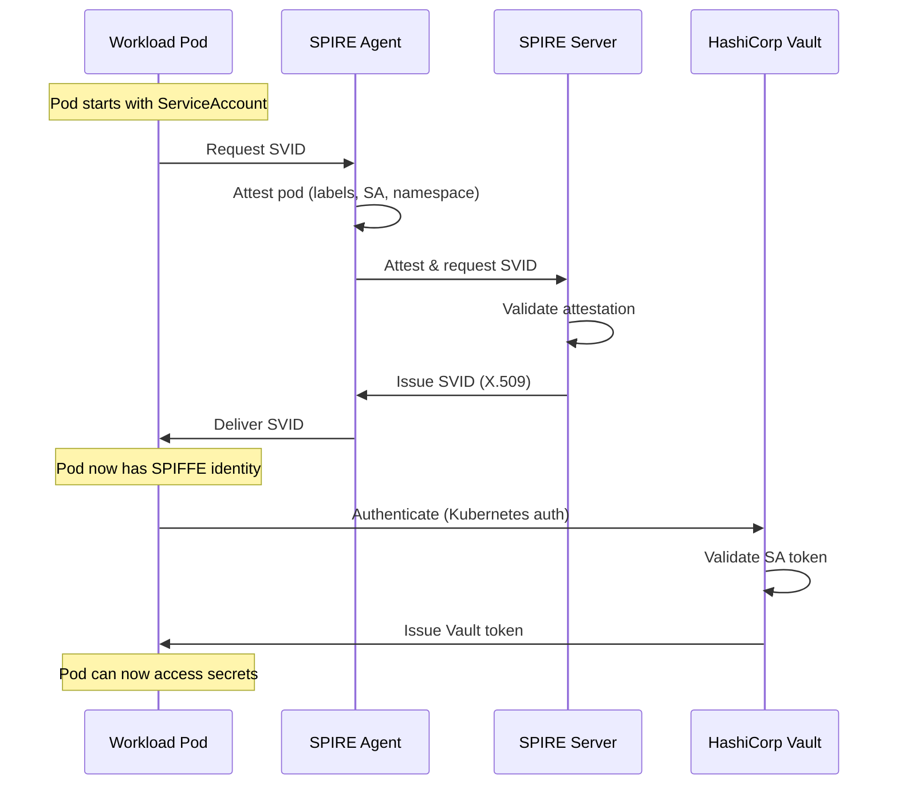
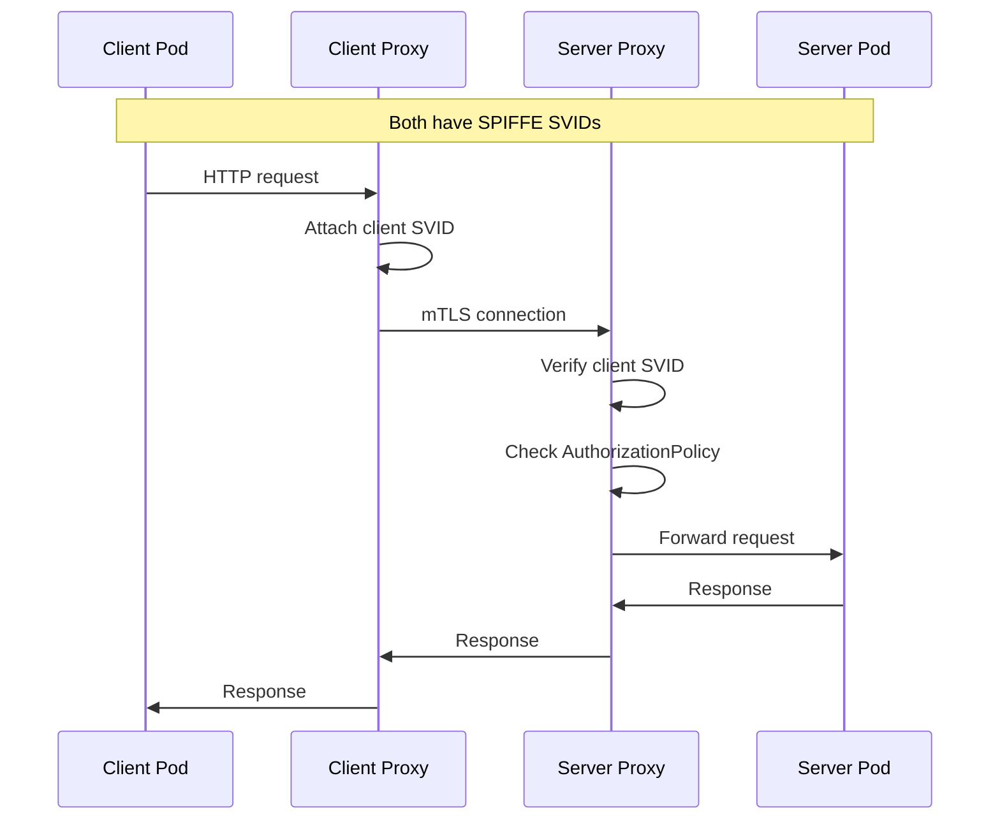
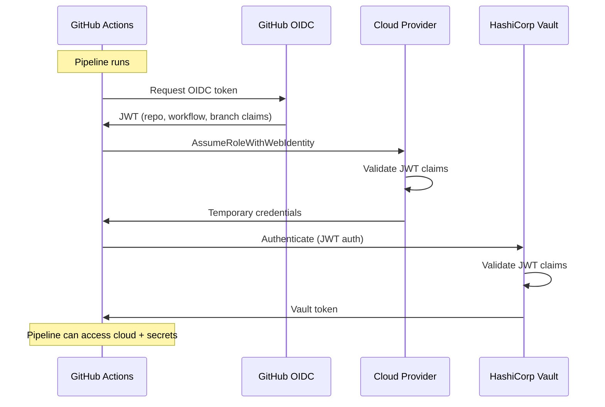
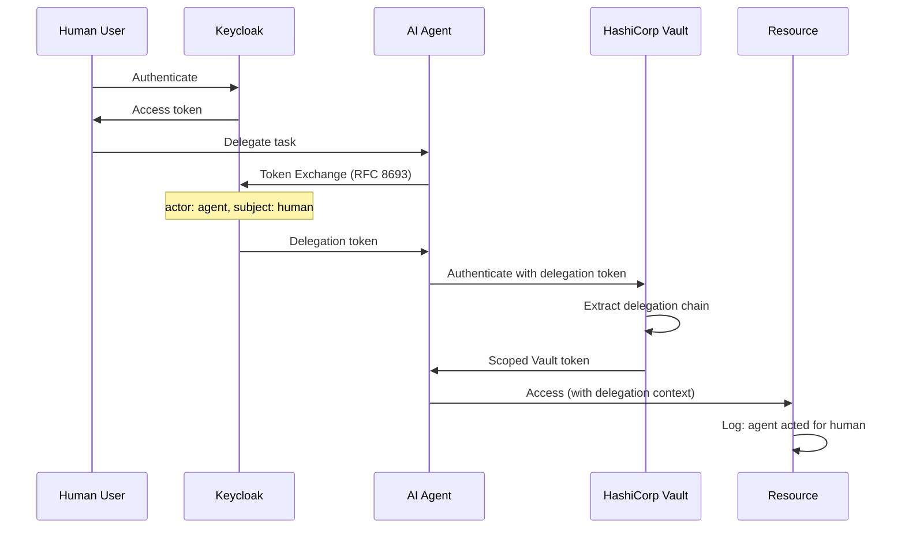
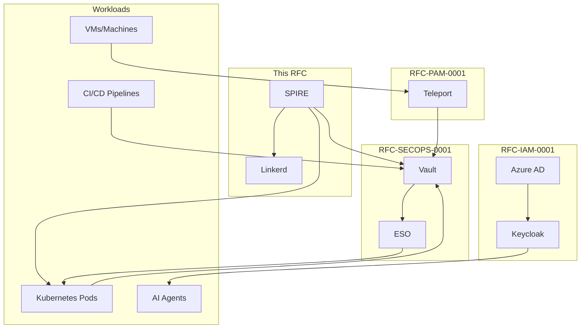

```
RFC-WORKLOAD-IDENTITY-0001                                      Section 3
Category: Standards Track                                    Architecture
```

# 3. Architecture

[← Previous: Requirements](./02-requirements.md) | [Index](./00-index.md#table-of-contents) | [Next: Components →](./04-components.md)

---

## 3.1 Identity Hierarchy

### 3.1.1 Enterprise Identity Model

Workload identity exists within the broader enterprise identity hierarchy:



### 3.1.2 Authorization Ceiling Principle

Per RFC-IAM-0001, Azure AD establishes the **authorization ceiling**:

| Level | Authority | Constraint |
|-------|-----------|------------|
| **Azure AD** | Ultimate source of truth | Defines maximum possible permissions |
| **SPIRE** | Workload identity issuer | Can only issue identities for registered workloads |
| **Vault** | Credential authority | Policies bounded by workload identity |
| **Application** | Resource access | Bounded by Vault-issued credentials |

A workload's permissions can never exceed what Azure AD allows for its organizational context.

### 3.1.3 Identity Layers

The architecture operates across multiple identity layers:



---

## 3.2 Trust Boundaries

### 3.2.1 Trust Boundary Definitions

| Boundary | Meaning | Crossing Requires |
|----------|---------|-------------------|
| **Cluster Boundary** | Different Kubernetes clusters | SPIFFE federation |
| **Cloud Boundary** | Different cloud providers | Workload identity federation |
| **Namespace Boundary** | Different Kubernetes namespaces | RBAC, Vault policy |
| **Service Mesh Boundary** | Mesh vs non-mesh traffic | mTLS termination, AuthorizationPolicy |
| **Organizational Boundary** | Different organizations/tenants | Trust bundle exchange |

### 3.2.2 Trust Boundary Diagram



### 3.2.3 Trust Establishment

| Boundary Type | Trust Mechanism |
|---------------|-----------------|
| Within cluster | Kubernetes RBAC + Service mesh |
| Cross-cluster (same cloud) | SPIFFE federation + VPN/private link |
| Cross-cloud | SPIFFE federation + mTLS over public network |
| External partners | SPIFFE trust bundle exchange + firewall rules |

---

## 3.3 Authority Domains

### 3.3.1 Identity Authorities

Each authority is responsible for a specific identity domain:

| Authority | Domain | Issues |
|-----------|--------|--------|
| **SPIRE** | Workload identity | SPIFFE SVIDs (X.509 + JWT) |
| **Kubernetes** | Pod identity | ServiceAccount tokens |
| **Cloud Provider** | Instance identity | Instance metadata, STS tokens |
| **Vault** | Access credentials | Database creds, cloud creds, PKI certs |
| **Linkerd** | Network identity | mTLS certificates |

### 3.3.2 Authority Relationships



### 3.3.3 Authority Delegation

| Delegating Authority | Receiving Authority | Delegation |
|---------------------|---------------------|------------|
| SPIRE | Vault | SPIFFE auth method authentication |
| SPIRE | Linkerd | Trust anchor for mTLS |
| Kubernetes | SPIRE | Pod attestation data |
| Cloud | SPIRE | Instance attestation data |
| Vault | ESO | Secret distribution to Kubernetes |

---

## 3.4 Data Flow Models

### 3.4.1 Workload Bootstrap Flow



### 3.4.2 Service-to-Service Flow



### 3.4.3 CI/CD Identity Flow



### 3.4.4 AI Agent Delegation Flow



---

## 3.5 Integration Architecture

### 3.5.1 Integration with RFC-IAM-0001

| Integration Point | Description |
|------------------|-------------|
| **Authorization Ceiling** | Workload permissions bounded by Azure AD context |
| **Keycloak Groups** | Vault policies may reference Keycloak group for delegation |
| **Token Exchange** | AI agents use Keycloak for OAuth 2.0 Token Exchange |
| **Audit Correlation** | Human and workload actions share correlation IDs |

### 3.5.2 Integration with RFC-SECOPS-0001

| Integration Point | Description |
|------------------|-------------|
| **Vault as Credential Authority** | Workloads authenticate to Vault for secrets |
| **ESO Distribution** | Workload secrets distributed via ExternalSecret |
| **Dynamic Credentials** | Database, cloud credentials from Vault engines |
| **PushSecret** | Workloads may push generated credentials to Vault |

### 3.5.3 Integration with RFC-PAM-0001

| Integration Point | Description |
|------------------|-------------|
| **Teleport Machine ID** | VMs use Teleport tbot for machine identity |
| **Shared Vault** | Same Vault SSH/database engines |
| **Audit Convergence** | Machine and human sessions in same audit system |

### 3.5.4 Integration Diagram



---

## 3.6 Security Model

### 3.6.1 Defense in Depth

| Layer | Control | Failure Mode |
|-------|---------|--------------|
| **Identity** | SPIFFE attestation | Impersonation prevented |
| **Authentication** | Short-lived credentials | Credential theft limited |
| **Authorization** | Namespace-scoped policies | Lateral movement limited |
| **Network** | mTLS + AuthorizationPolicy | Traffic interception prevented |
| **Audit** | Immutable, correlated logs | Investigations enabled |

### 3.6.2 Threat Model

| Threat | Mitigation |
|--------|------------|
| **Credential theft** | Short TTL (≤24h), automatic rotation |
| **Workload impersonation** | Attestation-based identity |
| **Privilege escalation** | Authorization ceiling enforcement |
| **Lateral movement** | Namespace isolation, mTLS |
| **Insider threat** | Delegation audit, correlation IDs |
| **Supply chain attack** | Binary attestation (future) |

### 3.6.3 Zero Trust Alignment

This architecture aligns with NIST SP 800-207 Zero Trust principles:

| Principle | Implementation |
|-----------|----------------|
| **All resources secured** | mTLS for all service traffic |
| **Least privilege** | Namespace-scoped, short-lived access |
| **Never trust, always verify** | Every request requires valid identity |
| **Assume breach** | Defense in depth, audit everything |
| **Continuous validation** | SVIDs rotate, tokens renew |

---

## Document Navigation

| Previous | Index | Next |
|----------|-------|------|
| [← 2. Requirements](./02-requirements.md) | [Table of Contents](./00-index.md#table-of-contents) | [4. Components →](./04-components.md) |

---

*End of Section 3 — RFC-WORKLOAD-IDENTITY-0001*
