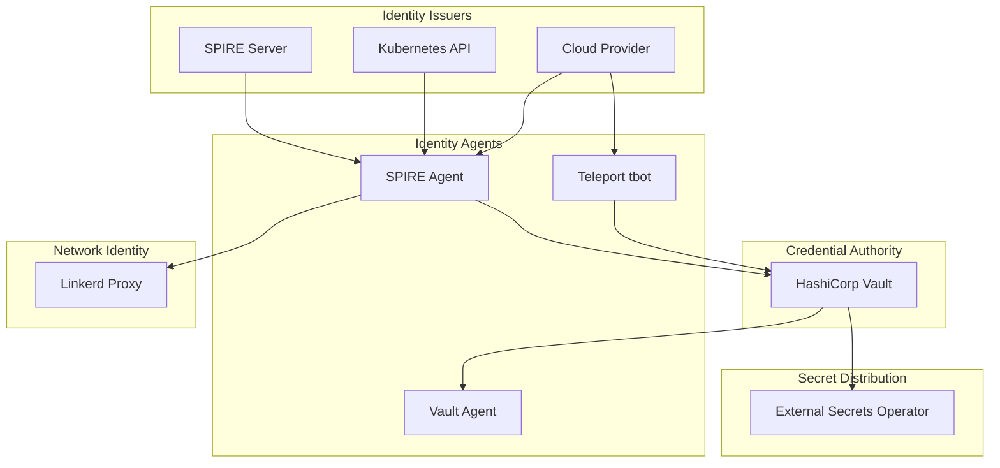
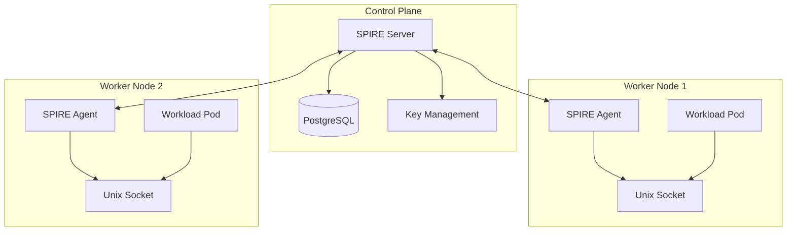
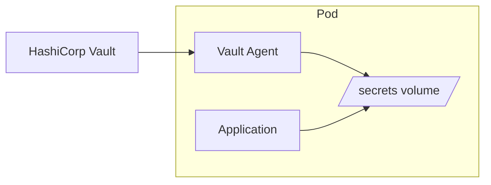
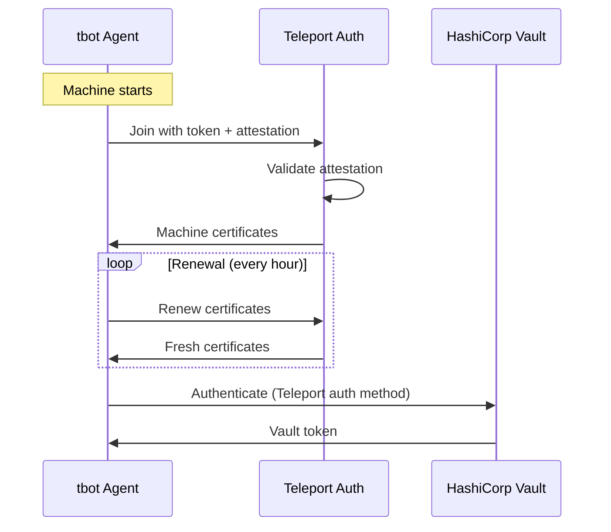
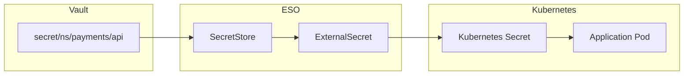
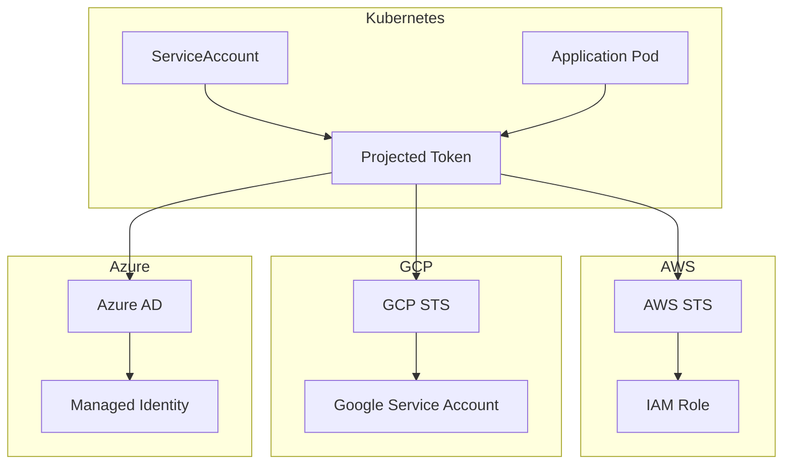

```
RFC-WORKLOAD-IDENTITY-0001                                      Section 4
Category: Standards Track                                      Components
```

# 4. Components

[← Previous: Architecture](./03-architecture.md) | [Index](./00-index.md#table-of-contents) | [Next: Kubernetes Workloads →](./05-kubernetes-workloads.md)

---

## 4.1 Component Taxonomy

### 4.1.1 Component Categories

| Category | Components | Purpose |
|----------|------------|---------|
| **Identity Issuers** | SPIRE, Kubernetes, Cloud Providers | Issue cryptographic identity |
| **Credential Authorities** | Vault | Issue access credentials |
| **Identity Consumers** | Vault, Linkerd, Applications | Verify and use identity |
| **Secret Distribution** | ESO, Vault Agent | Deliver secrets to workloads |
| **Machine Identity** | Teleport tbot | Non-Kubernetes identity |

### 4.1.2 Component Relationships



---

## 4.2 SPIRE Architecture

### 4.2.1 SPIRE Overview

SPIRE (SPIFFE Runtime Environment) is the reference implementation of the SPIFFE specification, providing attestation-based workload identity.

| Component | Function |
|-----------|----------|
| **SPIRE Server** | Issues SVIDs, manages registrations |
| **SPIRE Agent** | Runs on each node, attests workloads |
| **Registration Entries** | Define which workloads get which SPIFFE IDs |
| **Trust Bundle** | CA certificates for trust establishment |

### 4.2.2 SPIFFE ID Structure

SPIFFE IDs follow a URI format:

```
spiffe://<trust-domain>/<workload-path>
```

| Component | Example | Description |
|-----------|---------|-------------|
| Trust Domain | `prod.example.com` | Administrative boundary |
| Workload Path | `/ns/payments/sa/api` | Hierarchical identifier |

Example SPIFFE IDs:

| Workload | SPIFFE ID |
|----------|-----------|
| Payments API | `spiffe://prod.example.com/ns/payments/sa/api` |
| CI Pipeline | `spiffe://prod.example.com/ci/github/repo/main` |
| ArgoCD | `spiffe://prod.example.com/ns/argocd/sa/argocd-server` |

### 4.2.3 SPIRE Server Configuration

SPIRE Server deployment considerations:

| Aspect | Configuration |
|--------|---------------|
| **Deployment** | Kubernetes Deployment, HA with shared storage |
| **Data Store** | PostgreSQL for HA, SQLite for dev |
| **Key Management** | AWS KMS, GCP KMS, or Vault Transit |
| **Upstream Authority** | Root CA or Vault PKI integration |

### 4.2.4 SPIRE Agent Configuration

SPIRE Agent runs as a DaemonSet:

| Aspect | Configuration |
|--------|---------------|
| **Deployment** | DaemonSet on all worker nodes |
| **Node Attestation** | Kubernetes PSAT (Projected ServiceAccount Token) |
| **Workload Attestation** | Kubernetes Pod (labels, SA, namespace) |
| **Socket** | Unix socket at `/run/spire/sockets/agent.sock` |

### 4.2.5 Registration Entries

Registration entries map workloads to SPIFFE IDs:

```yaml
# Example: Register all pods in payments namespace
entries:
  - spiffe_id: spiffe://prod.example.com/ns/payments/sa/api
    parent_id: spiffe://prod.example.com/spire/agent/k8s_psat/production/node
    selectors:
      - k8s:ns:payments
      - k8s:sa:api
    ttl: 3600
```

### 4.2.6 SPIRE Deployment Diagram



---

## 4.3 Vault Integration

### 4.3.1 Vault as Credential Authority

Per RFC-SECOPS-0001, Vault is the credential authority. This RFC adds workload-specific integrations.

| Integration | Purpose |
|-------------|---------|
| **Kubernetes Auth** | Authenticate workloads via ServiceAccount tokens |
| **JWT/OIDC Auth** | Authenticate CI/CD via OIDC tokens |
| **SPIFFE Auth** | Authenticate via SPIFFE SVIDs (future) |
| **AppRole** | Legacy automation authentication |

### 4.3.2 Kubernetes Auth Method

Kubernetes auth method configuration:

| Parameter | Value | Purpose |
|-----------|-------|---------|
| `kubernetes_host` | API server URL | Kubernetes API for token validation |
| `kubernetes_ca_cert` | CA certificate | Verify Kubernetes API |
| `token_reviewer_jwt` | SA token | Vault's credential to call TokenReview |
| `issuer` | OIDC issuer | Expected issuer in SA tokens |

### 4.3.3 Role-to-Policy Mapping

Kubernetes auth roles map pods to Vault policies:

| Role | Bound Namespaces | Bound SAs | Policies |
|------|------------------|-----------|----------|
| `payments-api` | `payments` | `api` | `payments-read`, `payments-db` |
| `argocd` | `argocd` | `argocd-server` | `argocd-repos`, `argocd-clusters` |
| `tekton-pipeline` | `tekton-pipelines` | `*` | `ci-secrets` |

### 4.3.4 Policy Templates

Vault policy templates use identity metadata:

```hcl
# Template: Namespace-scoped secret access
path "secret/data/ns/{{identity.entity.aliases.auth_kubernetes-prod.metadata.service_account_namespace}}/*" {
  capabilities = ["read", "list"]
}

# Template: Service-specific database access
path "database/creds/{{identity.entity.aliases.auth_kubernetes-prod.metadata.service_account_name}}" {
  capabilities = ["read"]
}
```

### 4.3.5 Vault Agent Integration

Vault Agent runs as sidecar or init container:

| Mode | Use Case |
|------|----------|
| **Init Container** | Populate secrets at startup |
| **Sidecar** | Continuous secret refresh |
| **CSI Driver** | Mount secrets as volumes |



---

## 4.4 Teleport Machine ID

### 4.4.1 tbot Overview

Teleport Machine ID (tbot) provides identity for non-Kubernetes workloads:

| Component | Function |
|-----------|----------|
| **tbot** | Agent that obtains and renews machine certificates |
| **Bot User** | Teleport user representing the machine |
| **Bot Role** | Permissions granted to the machine |
| **Join Token** | Bootstrap credential (single-use) |

### 4.4.2 Supported Platforms

| Platform | Attestation | Use Case |
|----------|-------------|----------|
| **Kubernetes** | ServiceAccount | K8s-hosted automation |
| **AWS EC2** | Instance identity document | EC2 VMs |
| **GCP GCE** | Instance metadata | GCE VMs |
| **Azure VM** | Instance metadata | Azure VMs |
| **GitHub Actions** | OIDC token | CI/CD pipelines |

### 4.4.3 Machine Certificate Lifecycle



### 4.4.4 tbot Configuration

Example tbot configuration for Kubernetes:

```yaml
version: v2
onboarding:
  join_method: kubernetes
  token: bot-token
storage:
  type: kubernetes_secret
  name: machine-certs
  namespace: automation
outputs:
  - type: identity
    destination:
      type: directory
      path: /var/run/teleport/certs
```

---

## 4.5 Linkerd Service Mesh

### 4.5.1 Linkerd Identity

Linkerd provides automatic mTLS for service-to-service communication:

| Component | Function |
|-----------|----------|
| **Identity Controller** | Issues workload certificates |
| **Proxy** | Sidecar that handles mTLS |
| **Trust Anchor** | Root CA for mesh identity |

### 4.5.2 Identity Model

Linkerd identity is based on Kubernetes ServiceAccounts:

```
Identity: <service-account>.<namespace>.serviceaccount.identity.linkerd.<trust-domain>
```

Example:
```
api.payments.serviceaccount.identity.linkerd.cluster.local
```

### 4.5.3 mTLS Configuration

mTLS is automatic within the mesh:

| Traffic | Encryption | Identity |
|---------|------------|----------|
| Pod to Pod (in mesh) | mTLS | Linkerd certificates |
| Pod to Pod (one not in mesh) | Plaintext (or TLS) | No Linkerd identity |
| External ingress | TLS termination | Ingress certificate |

### 4.5.4 Authorization Policies

Linkerd Server and ServerAuthorization resources:

```yaml
# Server: Define what traffic a workload accepts
apiVersion: policy.linkerd.io/v1beta3
kind: Server
metadata:
  name: api-server
  namespace: payments
spec:
  podSelector:
    matchLabels:
      app: api
  port: 8080
  proxyProtocol: HTTP/2

# Authorization: Define who can access
apiVersion: policy.linkerd.io/v1beta1
kind: ServerAuthorization
metadata:
  name: allow-frontend
  namespace: payments
spec:
  server:
    name: api-server
  client:
    meshTLS:
      serviceAccounts:
        - name: frontend
          namespace: payments
```

---

## 4.6 External Secrets Operator

### 4.6.1 ESO in Workload Identity

Per RFC-SECOPS-0001, ESO distributes secrets from Vault to Kubernetes. For workload identity:

| Use Case | ESO Role |
|----------|----------|
| **Bootstrap secrets** | Distribute SPIRE join tokens |
| **Workload secrets** | Distribute application secrets |
| **Vault credentials** | Distribute Vault tokens (legacy) |

### 4.6.2 ESO Secret Flow



### 4.6.3 ClusterSecretStore Configuration

Per RFC-SECOPS-0001, ClusterSecretStore uses Kubernetes auth:

```yaml
apiVersion: external-secrets.io/v1beta1
kind: ClusterSecretStore
metadata:
  name: vault
spec:
  provider:
    vault:
      server: https://vault.vault.svc.cluster.local:8200
      path: secret
      auth:
        kubernetes:
          mountPath: kubernetes-prod
          role: eso
          serviceAccountRef:
            name: external-secrets
            namespace: external-secrets
```

---

## 4.7 Cloud Provider Integration

### 4.7.1 AWS Integration

| Component | Configuration |
|-----------|---------------|
| **IRSA** | ServiceAccount → IAM Role mapping |
| **Pod Identity Agent** | EKS add-on for token injection |
| **OIDC Provider** | EKS cluster as OIDC provider |

### 4.7.2 GCP Integration

| Component | Configuration |
|-----------|---------------|
| **Workload Identity** | ServiceAccount → GSA mapping |
| **Workload Identity Pool** | Kubernetes SA as identity source |
| **Service Account Key** | NOT USED (violates INV-2) |

### 4.7.3 Azure Integration

| Component | Configuration |
|-----------|---------------|
| **Workload Identity** | ServiceAccount → Managed Identity |
| **Federated Credentials** | OIDC federation configuration |
| **User-Assigned Identity** | Per-workload Azure identity |

### 4.7.4 Cloud Integration Diagram



---

## 4.8 Component Summary

| Component | Role | Invariants Enforced |
|-----------|------|---------------------|
| **SPIRE** | Issue workload identity | INV-1, INV-3 |
| **Vault** | Issue credentials | INV-2, INV-4 |
| **Linkerd** | Network identity | INV-6 |
| **ESO** | Distribute secrets | (per RFC-SECOPS) |
| **tbot** | Machine identity | INV-1, INV-2 |
| **Cloud IAM** | Cloud access | INV-2, INV-5 |

---

## Document Navigation

| Previous | Index | Next |
|----------|-------|------|
| [← 3. Architecture](./03-architecture.md) | [Table of Contents](./00-index.md#table-of-contents) | [5. Kubernetes Workloads →](./05-kubernetes-workloads.md) |

---

*End of Section 4 — RFC-WORKLOAD-IDENTITY-0001*
