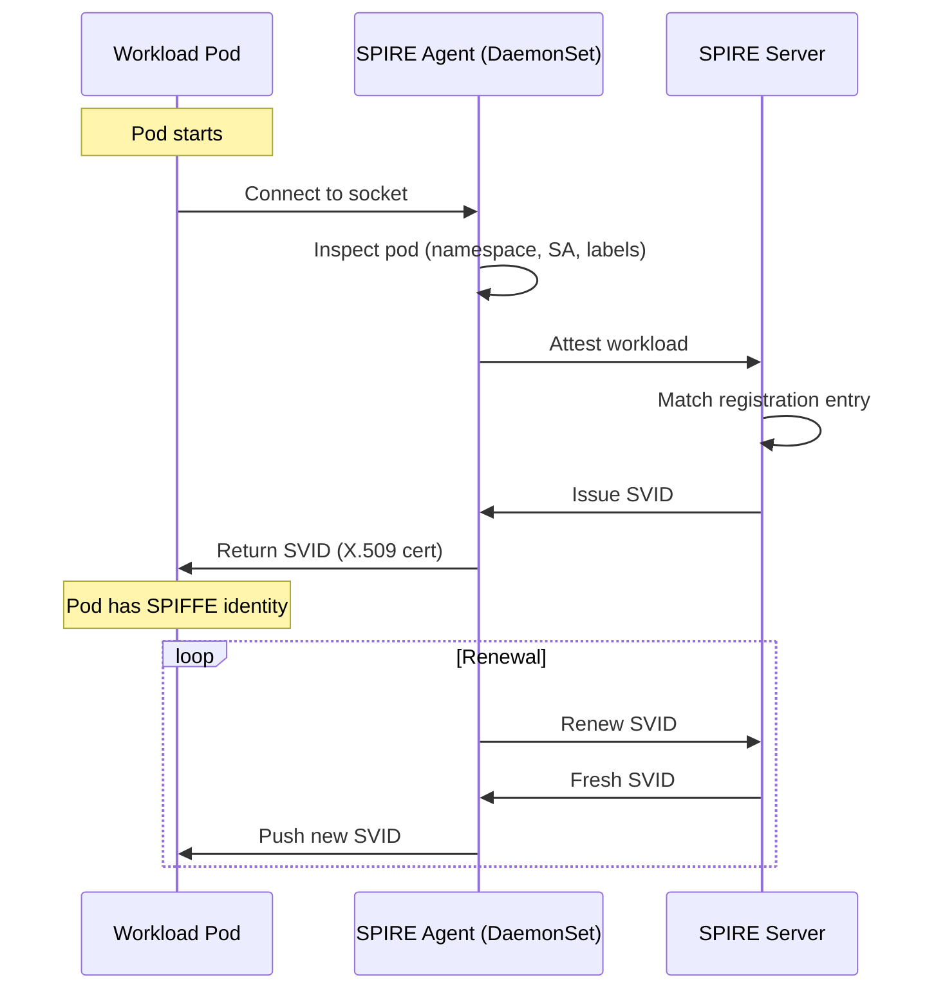
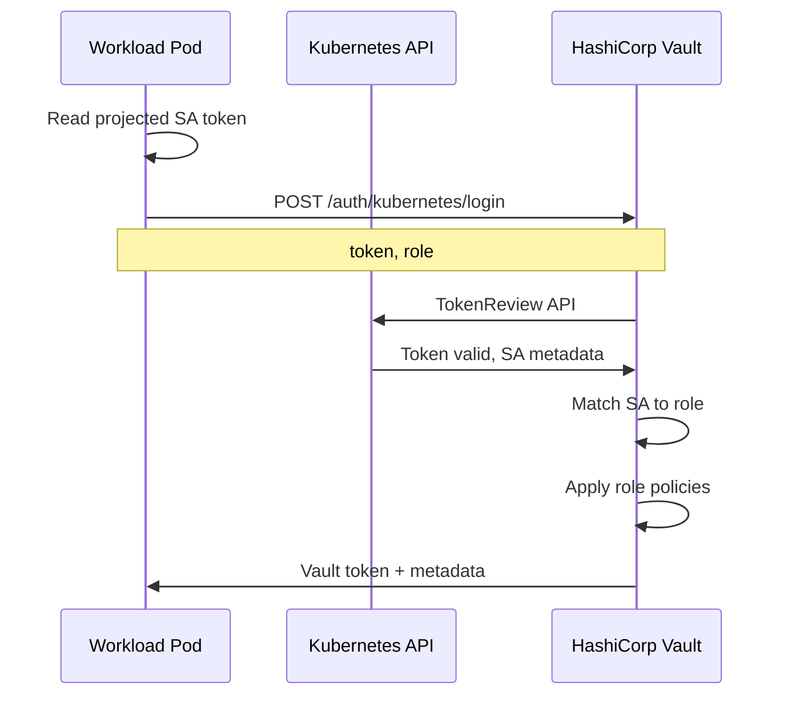
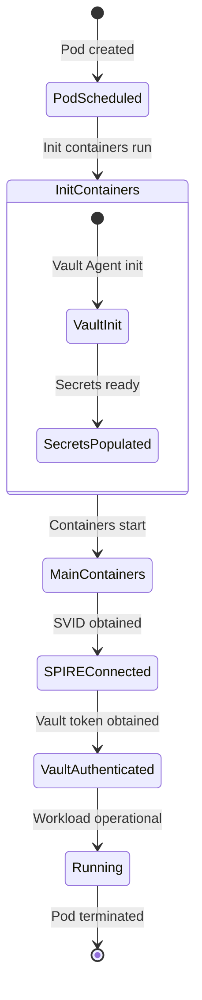
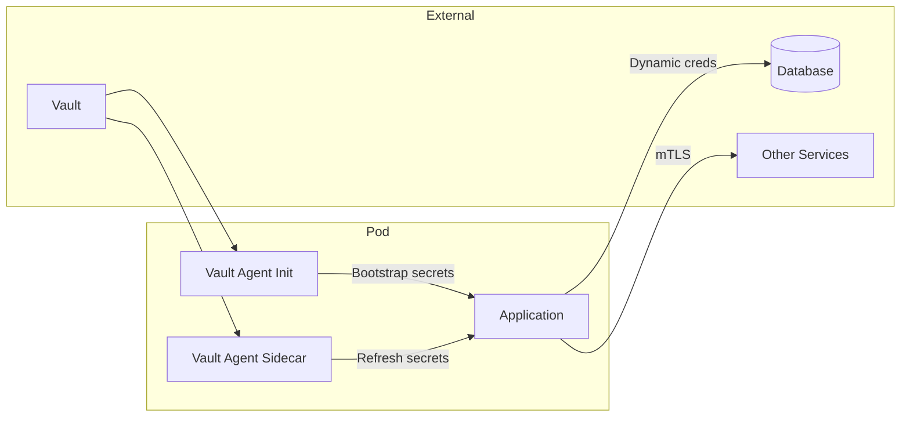

```
RFC-WORKLOAD-IDENTITY-0001                                      Section 5
Category: Standards Track                          Kubernetes Workloads
```

# 5. Kubernetes Workloads

[← Previous: Components](./04-components.md) | [Index](./00-index.md#table-of-contents) | [Next: CI/CD Identity →](./06-cicd-identity.md)

---

## 5.1 ServiceAccount Patterns

### 5.1.1 ServiceAccount as Identity Foundation

Every Kubernetes pod runs with a ServiceAccount. This RFC builds on ServiceAccounts as the foundation for workload identity:

| Layer | Identity Source |
|-------|-----------------|
| **Kubernetes** | ServiceAccount → Pod identity |
| **SPIRE** | ServiceAccount → SPIFFE ID |
| **Vault** | ServiceAccount → Vault policy |
| **Linkerd** | ServiceAccount → mTLS identity |
| **Cloud** | ServiceAccount → Cloud IAM role |

### 5.1.2 ServiceAccount Best Practices

| Practice | Requirement | Rationale |
|----------|-------------|-----------|
| **Dedicated SAs** | One SA per workload type | Enables fine-grained RBAC |
| **No default SA** | Never use `default` SA | Prevents accidental over-permissioning |
| **Minimal RBAC** | Only required API access | Least privilege |
| **Token projection** | Use projected tokens, not legacy | Short-lived, audience-bound |

### 5.1.3 ServiceAccount Configuration

Example ServiceAccount with projected token:

```yaml
apiVersion: v1
kind: ServiceAccount
metadata:
  name: api
  namespace: payments
automountServiceAccountToken: false  # Disable default mount
---
apiVersion: apps/v1
kind: Deployment
metadata:
  name: api
  namespace: payments
spec:
  template:
    spec:
      serviceAccountName: api
      containers:
        - name: api
          volumeMounts:
            - name: vault-token
              mountPath: /var/run/secrets/vault
              readOnly: true
      volumes:
        - name: vault-token
          projected:
            sources:
              - serviceAccountToken:
                  path: token
                  expirationSeconds: 600  # 10 minutes
                  audience: vault         # For Vault auth
```

---

## 5.2 SPIRE Agent Deployment

### 5.2.1 SPIRE Agent DaemonSet

SPIRE Agent runs on every node to provide workload attestation:

```yaml
apiVersion: apps/v1
kind: DaemonSet
metadata:
  name: spire-agent
  namespace: spire
spec:
  selector:
    matchLabels:
      app: spire-agent
  template:
    metadata:
      labels:
        app: spire-agent
    spec:
      hostPID: true
      hostNetwork: true
      containers:
        - name: spire-agent
          image: ghcr.io/spiffe/spire-agent:1.9
          volumeMounts:
            - name: spire-agent-socket
              mountPath: /run/spire/sockets
            - name: spire-config
              mountPath: /run/spire/config
      volumes:
        - name: spire-agent-socket
          hostPath:
            path: /run/spire/sockets
            type: DirectoryOrCreate
        - name: spire-config
          configMap:
            name: spire-agent
```

### 5.2.2 Workload Socket Access

Workloads access SPIRE through a shared Unix socket:

```yaml
# Workload pod configuration
spec:
  containers:
    - name: app
      volumeMounts:
        - name: spiffe-workload-api
          mountPath: /run/spire/sockets
          readOnly: true
  volumes:
    - name: spiffe-workload-api
      hostPath:
        path: /run/spire/sockets
        type: Directory
```

### 5.2.3 SPIRE Registration

Workloads must be registered with SPIRE to receive SVIDs:

| Registration Method | Use Case |
|--------------------|----------|
| **Manual** | Static workloads with known identity |
| **K8s Registrar** | Automatic registration based on labels |
| **Controller** | Dynamic registration via API |

Example registration via K8s Registrar:

```yaml
# Pod annotation for automatic registration
metadata:
  annotations:
    spiffe.io/spiffe-id: "spiffe://prod.example.com/ns/{{ .Namespace }}/sa/{{ .ServiceAccount }}"
```

### 5.2.4 SPIRE Workload Flow



---

## 5.3 Vault Kubernetes Auth

### 5.3.1 Authentication Flow



### 5.3.2 Auth Method Configuration

```bash
# Enable Kubernetes auth
vault auth enable -path=kubernetes-prod kubernetes

# Configure with cluster details
vault write auth/kubernetes-prod/config \
    kubernetes_host="https://kubernetes.default.svc" \
    kubernetes_ca_cert=@/var/run/secrets/kubernetes.io/serviceaccount/ca.crt \
    issuer="https://kubernetes.default.svc.cluster.local"
```

### 5.3.3 Role Configuration

Roles map ServiceAccounts to policies:

```bash
# Create role for payments API
vault write auth/kubernetes-prod/role/payments-api \
    bound_service_account_names=api \
    bound_service_account_namespaces=payments \
    policies=payments-secrets,payments-db \
    ttl=1h \
    max_ttl=4h
```

### 5.3.4 Policy Templates

Policies use identity metadata for dynamic scoping:

```hcl
# payments-secrets policy
path "secret/data/ns/{{identity.entity.aliases.auth_kubernetes-prod.metadata.service_account_namespace}}/*" {
  capabilities = ["read", "list"]
}

# payments-db policy
path "database/creds/payments-{{identity.entity.aliases.auth_kubernetes-prod.metadata.service_account_name}}" {
  capabilities = ["read"]
}
```

---

## 5.4 Namespace Isolation

### 5.4.1 Namespace as Security Boundary

Namespaces provide the primary isolation boundary for workload identity:

| Scope | Isolation Mechanism |
|-------|---------------------|
| **Kubernetes RBAC** | Namespace-scoped Roles |
| **Vault policies** | Templated paths with namespace |
| **SPIFFE IDs** | Namespace in path |
| **Network policies** | Namespace selectors |
| **Linkerd** | Namespace-scoped authorization |

### 5.4.2 Cross-Namespace Access

Cross-namespace access requires explicit configuration:

| Scenario | Configuration |
|----------|---------------|
| **Service mesh** | ServerAuthorization allows specific source namespaces |
| **Vault** | Policy explicitly grants cross-namespace paths |
| **SPIRE** | Registration entry allows cross-namespace SPIFFE ID |

Example cross-namespace authorization:

```yaml
apiVersion: policy.linkerd.io/v1beta1
kind: ServerAuthorization
metadata:
  name: allow-monitoring
  namespace: payments
spec:
  server:
    name: api-metrics
  client:
    meshTLS:
      serviceAccounts:
        - name: prometheus
          namespace: monitoring
```

### 5.4.3 Namespace-Scoped SPIFFE IDs

SPIFFE ID structure enforces namespace isolation:

```
spiffe://prod.example.com/ns/<namespace>/sa/<service-account>
```

| SPIFFE ID | Access |
|-----------|--------|
| `spiffe://prod.example.com/ns/payments/sa/api` | Payments namespace resources |
| `spiffe://prod.example.com/ns/monitoring/sa/prometheus` | Monitoring + observed namespaces |

---

## 5.5 Identity Lifecycle

### 5.5.1 Workload Bootstrap



### 5.5.2 Credential Renewal

| Credential | TTL | Renewal Mechanism |
|------------|-----|-------------------|
| **SA Token** | 10 min | Kubelet automatic projection |
| **SPIFFE SVID** | 1-24h | SPIRE Agent pushes new SVID |
| **Vault Token** | 1h | Vault Agent renews |
| **DB Credential** | 1h | Vault lease renewal |

### 5.5.3 Workload Termination

On pod termination:

| Credential | Revocation |
|------------|------------|
| **SA Token** | Invalidated by Kubernetes |
| **SPIFFE SVID** | Removed from agent cache |
| **Vault Token** | Revoked on agent shutdown |
| **DB Credential** | Lease not renewed, expires |

---

## 5.6 Workload Patterns

### 5.6.1 Standard Application Pattern



### 5.6.2 Sidecar Pattern

For applications requiring continuous secret refresh:

```yaml
spec:
  initContainers:
    - name: vault-agent-init
      image: hashicorp/vault:1.15
      args:
        - agent
        - -config=/etc/vault/config.hcl
        - -exit-after-auth
      volumeMounts:
        - name: vault-secrets
          mountPath: /vault/secrets
        - name: vault-config
          mountPath: /etc/vault

  containers:
    - name: app
      volumeMounts:
        - name: vault-secrets
          mountPath: /vault/secrets
          readOnly: true

    - name: vault-agent
      image: hashicorp/vault:1.15
      args:
        - agent
        - -config=/etc/vault/config.hcl
      volumeMounts:
        - name: vault-secrets
          mountPath: /vault/secrets
        - name: vault-config
          mountPath: /etc/vault
```

### 5.6.3 CSI Driver Pattern

For simpler secret consumption:

```yaml
spec:
  containers:
    - name: app
      volumeMounts:
        - name: secrets
          mountPath: /secrets
          readOnly: true
  volumes:
    - name: secrets
      csi:
        driver: secrets-store.csi.k8s.io
        readOnly: true
        volumeAttributes:
          secretProviderClass: vault-payments
```

---

## 5.7 Compliance Mapping

### 5.7.1 Invariant Enforcement

| Invariant | Kubernetes Implementation |
|-----------|---------------------------|
| INV-1 | ServiceAccount + SPIRE SVID |
| INV-2 | Projected tokens (10 min), SVID (24h max) |
| INV-3 | SPIRE workload attestation |
| INV-4 | Projected SA token to Vault |
| INV-6 | Linkerd mTLS |
| INV-7 | Namespace-scoped policies |

### 5.7.2 Verification Checklist

| Verification | Method |
|--------------|--------|
| All pods have non-default SA | `kubectl get pods -A -o jsonpath='{.items[*].spec.serviceAccountName}' | grep -v default` |
| All pods in service mesh | `linkerd stat deploy -A` |
| No legacy SA tokens | `kubectl get sa -A -o yaml | grep 'automountServiceAccountToken: true'` |
| SPIRE coverage | SPIRE Agent metrics |

---

## Document Navigation

| Previous | Index | Next |
|----------|-------|------|
| [← 4. Components](./04-components.md) | [Table of Contents](./00-index.md#table-of-contents) | [6. CI/CD Identity →](./06-cicd-identity.md) |

---

*End of Section 5 — RFC-WORKLOAD-IDENTITY-0001*
