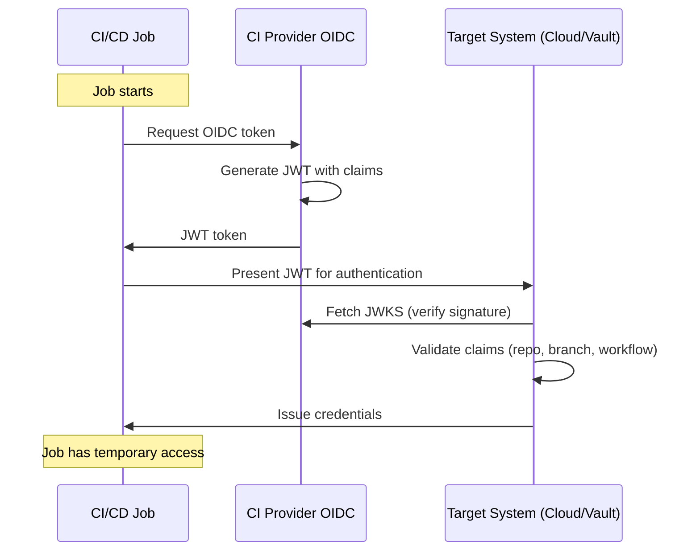

```
RFC-WORKLOAD-IDENTITY-0001                                      Section 6
Category: Standards Track                                  CI/CD Identity
```

# 6. CI/CD Identity

[← Previous: Kubernetes Workloads](./05-kubernetes-workloads.md) | [Index](./00-index.md#table-of-contents) | [Next: GitOps Identity →](./07-gitops-identity.md)

---

## 6.1 OIDC Federation Patterns

### 6.1.1 The Problem with Static Credentials

Traditional CI/CD secrets management:

| Problem | Impact |
|---------|--------|
| **Secrets in pipeline config** | Visible to anyone with repo access |
| **Long-lived credentials** | Compromised credential usable indefinitely |
| **Shared credentials** | No per-job accountability |
| **Manual rotation** | Operational burden, often skipped |

### 6.1.2 OIDC Federation Solution

OIDC federation provides:

| Benefit | Mechanism |
|---------|-----------|
| **No stored secrets** | JWT obtained at runtime |
| **Short-lived** | Token valid for minutes |
| **Auditable** | Claims identify exact pipeline run |
| **Automatic** | No rotation needed |

### 6.1.3 OIDC Token Flow



---

## 6.2 GitHub Actions Integration

### 6.2.1 GitHub OIDC Overview

GitHub Actions provides OIDC tokens with rich claims:

| Claim | Example | Purpose |
|-------|---------|---------|
| `iss` | `https://token.actions.githubusercontent.com` | Issuer |
| `sub` | `repo:org/repo:ref:refs/heads/main` | Subject (repo + ref) |
| `repository` | `org/repo` | Repository name |
| `ref` | `refs/heads/main` | Git reference |
| `workflow` | `deploy.yml` | Workflow file |
| `job_workflow_ref` | `org/repo/.github/workflows/deploy.yml@refs/heads/main` | Exact workflow version |
| `actor` | `username` | User who triggered |
| `event_name` | `push` | Trigger event |

### 6.2.2 AWS Integration

Configure AWS to trust GitHub OIDC:

```hcl
# Terraform: OIDC provider
resource "aws_iam_openid_connect_provider" "github" {
  url             = "https://token.actions.githubusercontent.com"
  client_id_list  = ["sts.amazonaws.com"]
  thumbprint_list = ["6938fd4d98bab03faadb97b34396831e3780aea1"]
}

# Terraform: IAM role with OIDC trust
resource "aws_iam_role" "github_actions" {
  name = "github-actions-deploy"

  assume_role_policy = jsonencode({
    Version = "2012-10-17"
    Statement = [{
      Effect = "Allow"
      Principal = {
        Federated = aws_iam_openid_connect_provider.github.arn
      }
      Action = "sts:AssumeRoleWithWebIdentity"
      Condition = {
        StringEquals = {
          "token.actions.githubusercontent.com:aud" = "sts.amazonaws.com"
        }
        StringLike = {
          "token.actions.githubusercontent.com:sub" = "repo:myorg/myrepo:*"
        }
      }
    }]
  })
}
```

GitHub Actions workflow:

```yaml
name: Deploy
on:
  push:
    branches: [main]

permissions:
  id-token: write   # Required for OIDC
  contents: read

jobs:
  deploy:
    runs-on: ubuntu-latest
    steps:
      - uses: aws-actions/configure-aws-credentials@v4
        with:
          role-to-assume: arn:aws:iam::123456789012:role/github-actions-deploy
          aws-region: us-east-1

      - name: Deploy
        run: |
          aws s3 sync ./dist s3://my-bucket/
```

### 6.2.3 Vault Integration

Configure Vault to trust GitHub OIDC:

```bash
# Enable JWT auth
vault auth enable -path=github-actions jwt

# Configure OIDC provider
vault write auth/github-actions/config \
    oidc_discovery_url="https://token.actions.githubusercontent.com" \
    bound_issuer="https://token.actions.githubusercontent.com"

# Create role for specific repo
vault write auth/github-actions/role/deploy \
    role_type="jwt" \
    bound_audiences="https://github.com/myorg" \
    bound_claims_type="glob" \
    bound_claims='{
      "repository": "myorg/myrepo",
      "ref": "refs/heads/main"
    }' \
    user_claim="repository" \
    policies="deploy" \
    ttl="10m"
```

GitHub Actions workflow with Vault:

```yaml
jobs:
  deploy:
    runs-on: ubuntu-latest
    permissions:
      id-token: write
      contents: read
    steps:
      - name: Authenticate to Vault
        uses: hashicorp/vault-action@v2
        with:
          url: https://vault.example.com
          method: jwt
          path: github-actions
          role: deploy
          exportToken: true

      - name: Get secrets
        run: |
          vault kv get -field=api_key secret/deploy/api
```

### 6.2.4 Claim-Based Authorization

Use claims for fine-grained access control:

| Claim Pattern | Access |
|---------------|--------|
| `repository: myorg/*` | Any repo in org |
| `repository: myorg/myrepo, ref: refs/heads/main` | Only main branch |
| `workflow: deploy.yml` | Only deploy workflow |
| `environment: production` | Only production environment |

---

## 6.3 GitLab CI Integration

### 6.3.1 GitLab OIDC Overview

GitLab CI provides OIDC tokens with claims:

| Claim | Example | Purpose |
|-------|---------|---------|
| `iss` | `https://gitlab.com` | Issuer |
| `sub` | `project_path:myorg/myrepo:ref_type:branch:ref:main` | Subject |
| `project_path` | `myorg/myrepo` | Project path |
| `ref` | `main` | Git reference |
| `ref_type` | `branch` | Reference type |
| `pipeline_id` | `12345` | Pipeline ID |
| `job_id` | `67890` | Job ID |

### 6.3.2 Vault Integration

Configure Vault for GitLab:

```bash
# Enable JWT auth for GitLab
vault auth enable -path=gitlab jwt

# Configure OIDC provider
vault write auth/gitlab/config \
    oidc_discovery_url="https://gitlab.com" \
    bound_issuer="https://gitlab.com"

# Create role
vault write auth/gitlab/role/deploy \
    role_type="jwt" \
    bound_claims='{
      "project_path": "myorg/myrepo",
      "ref": "main"
    }' \
    user_claim="project_path" \
    policies="deploy" \
    ttl="10m"
```

GitLab CI pipeline:

```yaml
deploy:
  stage: deploy
  image: hashicorp/vault:1.15
  id_tokens:
    VAULT_ID_TOKEN:
      aud: https://vault.example.com
  script:
    - export VAULT_ADDR=https://vault.example.com
    - vault write auth/gitlab/login role=deploy jwt=$VAULT_ID_TOKEN
    - vault kv get secret/deploy/config
```

---

## 6.4 Tekton Pipeline Identity

### 6.4.1 Tekton in Kubernetes

Tekton runs as Kubernetes pods, so it uses Kubernetes-native identity:

| Method | Use Case |
|--------|----------|
| **ServiceAccount** | Kubernetes API access |
| **Vault Kubernetes auth** | Secret access |
| **SPIRE** | Service mesh identity |

### 6.4.2 Pipeline ServiceAccount

Each pipeline should have a dedicated ServiceAccount:

```yaml
apiVersion: v1
kind: ServiceAccount
metadata:
  name: build-pipeline
  namespace: tekton-pipelines
---
apiVersion: tekton.dev/v1
kind: Pipeline
metadata:
  name: build
spec:
  tasks:
    - name: build
      taskRef:
        name: build-task
---
apiVersion: tekton.dev/v1
kind: PipelineRun
metadata:
  name: build-run
spec:
  pipelineRef:
    name: build
  taskRunSpecs:
    - pipelineTaskName: build
      serviceAccountName: build-pipeline
```

### 6.4.3 Vault Integration

```yaml
apiVersion: tekton.dev/v1
kind: Task
metadata:
  name: deploy
spec:
  volumes:
    - name: vault-token
      projected:
        sources:
          - serviceAccountToken:
              path: token
              expirationSeconds: 600
              audience: vault
  steps:
    - name: get-secrets
      image: hashicorp/vault:1.15
      volumeMounts:
        - name: vault-token
          mountPath: /var/run/secrets/vault
      script: |
        export VAULT_ADDR=https://vault.vault.svc.cluster.local:8200
        vault write auth/kubernetes/login \
          role=tekton-deploy \
          jwt=$(cat /var/run/secrets/vault/token)
        vault kv get -field=password secret/deploy/db
```

---

## 6.5 Legacy: Vault AppRole

### 6.5.1 When AppRole is Needed

AppRole is a fallback for systems that cannot use OIDC:

| Scenario | Use AppRole |
|----------|-------------|
| Legacy CI/CD (Jenkins without OIDC) | Yes |
| Self-hosted runners without OIDC | Yes |
| GitHub/GitLab with OIDC | No (use OIDC) |
| Tekton | No (use Kubernetes auth) |

### 6.5.2 AppRole Configuration

```bash
# Enable AppRole
vault auth enable approle

# Create role
vault write auth/approle/role/legacy-ci \
    secret_id_ttl=1h \
    token_ttl=1h \
    token_max_ttl=4h \
    secret_id_num_uses=1 \
    policies="ci-secrets"

# Get Role ID (stored in CI config)
vault read auth/approle/role/legacy-ci/role-id

# Generate Secret ID (single-use, rotated)
vault write -f auth/approle/role/legacy-ci/secret-id
```

### 6.5.3 AppRole Limitations

| Limitation | Mitigation |
|------------|------------|
| Secret ID is a secret | Single-use, short TTL |
| Less traceable than OIDC | Include custom metadata |
| Manual rotation | Automation for Secret ID generation |

---

## 6.6 CI/CD Security Controls

### 6.6.1 Branch Protection

Restrict credential access by branch:

| Branch | Access |
|--------|--------|
| `main` | Production credentials |
| `develop` | Staging credentials |
| `feature/*` | Development credentials only |
| `dependabot/*` | No credentials (build only) |

### 6.6.2 Environment Protection

Use GitHub/GitLab environments for deployment gates:

```yaml
# GitHub Actions
jobs:
  deploy-prod:
    environment: production
    runs-on: ubuntu-latest
    steps:
      - uses: aws-actions/configure-aws-credentials@v4
        with:
          role-to-assume: arn:aws:iam::123456789012:role/prod-deploy
```

### 6.6.3 Claim Validation Matrix

| System | Required Claims | Optional Claims |
|--------|-----------------|-----------------|
| AWS IAM | `sub` (repo:ref) | `repository`, `ref` |
| Vault | `repository`, `ref` | `workflow`, `environment` |
| GCP WI | `sub` (attribute mapping) | Custom attributes |

---

## 6.7 Compliance Mapping

### 6.7.1 Invariant Enforcement

| Invariant | CI/CD Implementation |
|-----------|---------------------|
| INV-2 | OIDC tokens are short-lived (minutes) |
| INV-5 | OIDC federation required |
| INV-10 | Pipeline runs logged with full context |

### 6.7.2 Audit Trail

Each CI/CD run produces audit events:

| Event | Source | Contains |
|-------|--------|----------|
| OIDC token request | CI provider | repo, ref, workflow, actor |
| Cloud STS assume | Cloud provider | role, session, source token |
| Vault login | Vault audit | JWT claims, policies granted |
| Secret access | Vault audit | path, operation, actor |

---

## Document Navigation

| Previous | Index | Next |
|----------|-------|------|
| [← 5. Kubernetes Workloads](./05-kubernetes-workloads.md) | [Table of Contents](./00-index.md#table-of-contents) | [7. GitOps Identity →](./07-gitops-identity.md) |

---

*End of Section 6 — RFC-WORKLOAD-IDENTITY-0001*
