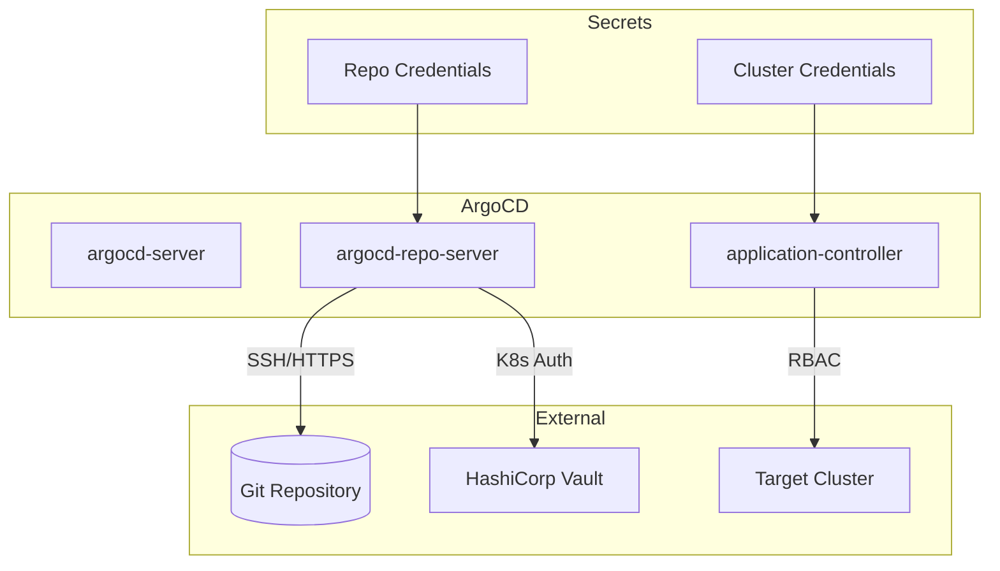
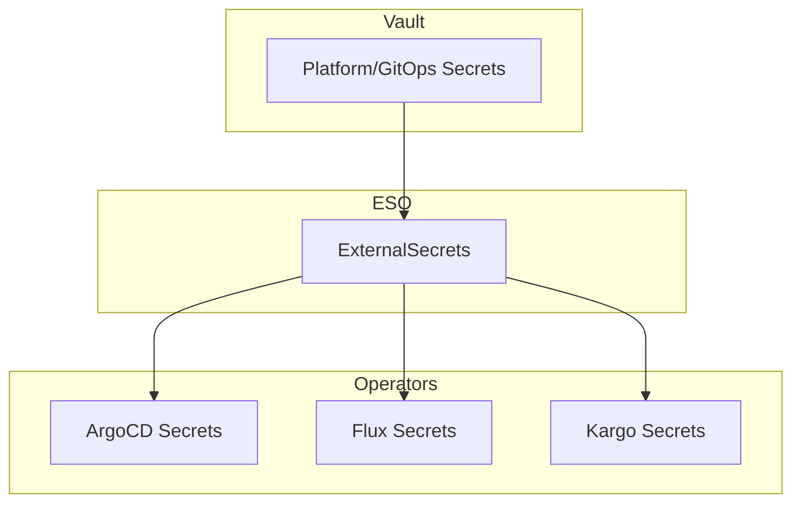

```
RFC-WORKLOAD-IDENTITY-0001                                      Section 7
Category: Standards Track                                 GitOps Identity
```

# 7. GitOps Identity

[← Previous: CI/CD Identity](./06-cicd-identity.md) | [Index](./00-index.md#table-of-contents) | [Next: Operator Identity →](./08-operator-identity.md)

---

## 7.1 GitOps Operator Overview

### 7.1.1 GitOps Operators in the Platform

| Operator | Function | Identity Needs |
|----------|----------|----------------|
| **ArgoCD** | Application deployment | Git repos, Kubernetes clusters, Vault |
| **Flux** | Application deployment | Git repos, Kubernetes clusters, cloud resources |
| **Kargo** | Progressive delivery | Git repos, image registries, Kubernetes |

### 7.1.2 Identity Requirements

GitOps operators need access to:

| Resource | Access Type |
|----------|-------------|
| **Git repositories** | Read manifests, write status |
| **Kubernetes clusters** | Apply manifests (RBAC) |
| **Image registries** | Pull image metadata |
| **Secret stores** | Read secrets for deployments |
| **Cloud APIs** | Deploy cloud resources (IaC) |

---

## 7.2 ArgoCD Identity Model

### 7.2.1 ArgoCD Components

| Component | ServiceAccount | Identity Scope |
|-----------|----------------|----------------|
| **argocd-server** | argocd-server | API, UI, webhook handling |
| **argocd-repo-server** | argocd-repo-server | Git operations, manifest rendering |
| **argocd-application-controller** | argocd-application-controller | Kubernetes deployment, sync |
| **argocd-applicationset-controller** | argocd-applicationset-controller | ApplicationSet generation |

### 7.2.2 Repository Credentials

ArgoCD needs credentials to access Git repositories:

| Method | Configuration | Recommendation |
|--------|---------------|----------------|
| **SSH Key** | Stored in Secret | Use for private repos (rotate regularly) |
| **GitHub App** | App installation token | Preferred for GitHub |
| **HTTPS Token** | PAT or deploy token | Avoid (use App instead) |

Credential storage via ESO:

```yaml
apiVersion: external-secrets.io/v1beta1
kind: ExternalSecret
metadata:
  name: argocd-repo-creds
  namespace: argocd
spec:
  refreshInterval: 1h
  secretStoreRef:
    name: vault
    kind: ClusterSecretStore
  target:
    name: argocd-repo-creds
    template:
      metadata:
        labels:
          argocd.argoproj.io/secret-type: repo-creds
  data:
    - secretKey: sshPrivateKey
      remoteRef:
        key: secret/platform/argocd/github-deploy-key
        property: private_key
```

### 7.2.3 Cluster Access

ArgoCD application-controller needs Kubernetes RBAC:

```yaml
# In-cluster access (same cluster)
apiVersion: rbac.authorization.k8s.io/v1
kind: ClusterRole
metadata:
  name: argocd-application-controller
rules:
  - apiGroups: ["*"]
    resources: ["*"]
    verbs: ["*"]  # Required for deployment
---
# Multi-cluster: External cluster credentials via ESO
apiVersion: external-secrets.io/v1beta1
kind: ExternalSecret
metadata:
  name: cluster-staging
  namespace: argocd
spec:
  refreshInterval: 1h
  secretStoreRef:
    name: vault
    kind: ClusterSecretStore
  target:
    name: cluster-staging
    template:
      metadata:
        labels:
          argocd.argoproj.io/secret-type: cluster
      data:
        name: staging
        server: "{{ .server }}"
        config: |
          {
            "bearerToken": "{{ .token }}",
            "tlsClientConfig": {
              "caData": "{{ .ca }}"
            }
          }
  data:
    - secretKey: server
      remoteRef:
        key: secret/platform/clusters/staging
        property: server
    - secretKey: token
      remoteRef:
        key: secret/platform/clusters/staging
        property: token
    - secretKey: ca
      remoteRef:
        key: secret/platform/clusters/staging
        property: ca
```

### 7.2.4 Vault Access for Secrets

ArgoCD Vault Plugin (AVP) or ESO for secret injection:

```yaml
# ArgoCD repo-server with Vault access
apiVersion: v1
kind: ServiceAccount
metadata:
  name: argocd-repo-server
  namespace: argocd
---
# Vault role for ArgoCD
# vault write auth/kubernetes-prod/role/argocd-repo-server \
#     bound_service_account_names=argocd-repo-server \
#     bound_service_account_namespaces=argocd \
#     policies=argocd-secrets \
#     ttl=1h
```

### 7.2.5 ArgoCD Identity Flow



---

## 7.3 Flux Identity Model

### 7.3.1 Flux Components

| Component | Identity | Purpose |
|-----------|----------|---------|
| **source-controller** | ServiceAccount | Fetch Git/Helm/OCI sources |
| **kustomize-controller** | ServiceAccount | Apply Kustomize manifests |
| **helm-controller** | ServiceAccount | Deploy Helm releases |
| **image-automation-controller** | ServiceAccount | Update image tags in Git |

### 7.3.2 Workload Identity for Cloud

Flux 2.6+ supports cloud workload identity:

```yaml
# AWS: IAM Role for Service Account (IRSA)
apiVersion: v1
kind: ServiceAccount
metadata:
  name: source-controller
  namespace: flux-system
  annotations:
    eks.amazonaws.com/role-arn: arn:aws:iam::123456789012:role/flux-source
---
# GCP: Workload Identity
apiVersion: v1
kind: ServiceAccount
metadata:
  name: source-controller
  namespace: flux-system
  annotations:
    iam.gke.io/gcp-service-account: flux-source@project.iam.gserviceaccount.com
```

### 7.3.3 Git Repository Authentication

```yaml
apiVersion: source.toolkit.fluxcd.io/v1
kind: GitRepository
metadata:
  name: platform
  namespace: flux-system
spec:
  interval: 1m
  url: ssh://git@github.com/myorg/platform.git
  ref:
    branch: main
  secretRef:
    name: github-deploy-key
---
# Secret from ESO
apiVersion: external-secrets.io/v1beta1
kind: ExternalSecret
metadata:
  name: github-deploy-key
  namespace: flux-system
spec:
  refreshInterval: 1h
  secretStoreRef:
    name: vault
    kind: ClusterSecretStore
  target:
    name: github-deploy-key
  data:
    - secretKey: identity
      remoteRef:
        key: secret/platform/flux/github-deploy-key
        property: private_key
    - secretKey: known_hosts
      remoteRef:
        key: secret/platform/flux/github-deploy-key
        property: known_hosts
```

### 7.3.4 Cross-Cluster Deployment

Flux uses kubeconfig secrets for multi-cluster:

```yaml
apiVersion: kustomize.toolkit.fluxcd.io/v1
kind: Kustomization
metadata:
  name: app-staging
  namespace: flux-system
spec:
  interval: 10m
  path: ./apps/staging
  prune: true
  sourceRef:
    kind: GitRepository
    name: platform
  kubeConfig:
    secretRef:
      name: staging-kubeconfig
```

---

## 7.4 Kargo Identity Model

### 7.4.1 Kargo Components

| Component | Identity | Purpose |
|-----------|----------|---------|
| **kargo-controller** | ServiceAccount | Manage Freight, Stages, Promotions |
| **kargo-api** | ServiceAccount | API server for UI/CLI |
| **kargo-webhooks** | ServiceAccount | Admission webhooks |

### 7.4.2 Freight Sources

Kargo needs access to artifact sources:

| Source Type | Authentication |
|-------------|----------------|
| **Git** | Deploy key or GitHub App |
| **Image Registry** | Registry credentials |
| **Helm Chart** | OCI/HTTP credentials |

### 7.4.3 Promotion Credentials

```yaml
apiVersion: kargo.akuity.io/v1alpha1
kind: Project
metadata:
  name: myapp
spec:
  promotionPolicies:
    - stage: staging
      autoPromotionEnabled: true
    - stage: production
      autoPromotionEnabled: false
---
# Credentials secret
apiVersion: external-secrets.io/v1beta1
kind: ExternalSecret
metadata:
  name: kargo-repo-creds
  namespace: kargo
spec:
  refreshInterval: 1h
  secretStoreRef:
    name: vault
    kind: ClusterSecretStore
  target:
    name: kargo-repo-creds
  data:
    - secretKey: sshPrivateKey
      remoteRef:
        key: secret/platform/kargo/github-deploy-key
        property: private_key
```

---

## 7.5 Automation Token Management

### 7.5.1 Token Lifecycle

GitOps automation tokens require careful lifecycle management:

| Phase | Action |
|-------|--------|
| **Provisioning** | Generate in Vault, distribute via ESO |
| **Rotation** | Automatic refresh via ESO (1h-24h) |
| **Revocation** | Remove from Vault, ESO syncs deletion |
| **Audit** | Vault audit log tracks access |

### 7.5.2 Token Hierarchy



### 7.5.3 Break-Glass Procedures

Emergency access when GitOps operators fail:

| Scenario | Procedure |
|----------|-----------|
| ArgoCD down | Manual `kubectl apply` with break-glass credentials |
| Vault unavailable | Pre-staged emergency secrets (encrypted at rest) |
| Git unavailable | Local manifest cache, manual sync |

Break-glass credentials:

```yaml
# Stored outside normal GitOps flow
apiVersion: v1
kind: Secret
metadata:
  name: break-glass-kubeconfig
  namespace: kube-system
  annotations:
    description: "Emergency access only. Usage is audited."
type: Opaque
data:
  kubeconfig: <base64-encoded-emergency-kubeconfig>
```

---

## 7.6 Security Considerations

### 7.6.1 Least Privilege

| Operator | Minimum Permissions |
|----------|---------------------|
| ArgoCD | Only target namespaces, not cluster-admin |
| Flux | Namespace-scoped where possible |
| Kargo | Only managed project namespaces |

### 7.6.2 Secret Isolation

| Principle | Implementation |
|-----------|----------------|
| Repo creds separate from cluster creds | Different Vault paths |
| Per-environment credentials | Environment-specific secrets |
| Audit all access | Vault audit enabled |

### 7.6.3 Attack Surface

| Attack Vector | Mitigation |
|---------------|------------|
| Compromised Git repo | Signed commits, branch protection |
| Stolen deploy key | Rotate regularly, scope narrowly |
| Compromised operator pod | Network policies, minimal RBAC |
| Vault token theft | Short TTL, Kubernetes auth binding |

---

## 7.7 Compliance Mapping

### 7.7.1 Invariant Enforcement

| Invariant | GitOps Implementation |
|-----------|----------------------|
| INV-2 | ESO refresh < 24h, Vault tokens ≤ 1h |
| INV-4 | All operators use Kubernetes auth to Vault |
| INV-7 | Namespace-scoped Vault policies |
| INV-10 | All credential access audited in Vault |

### 7.7.2 Audit Trail

GitOps creates an inherent audit trail:

| Event | Audit Source |
|-------|--------------|
| Manifest change | Git commit history |
| Secret access | Vault audit log |
| Deployment | ArgoCD/Flux events |
| Promotion | Kargo promotion history |

---

## Document Navigation

| Previous | Index | Next |
|----------|-------|------|
| [← 6. CI/CD Identity](./06-cicd-identity.md) | [Table of Contents](./00-index.md#table-of-contents) | [8. Operator Identity →](./08-operator-identity.md) |

---

*End of Section 7 — RFC-WORKLOAD-IDENTITY-0001*
