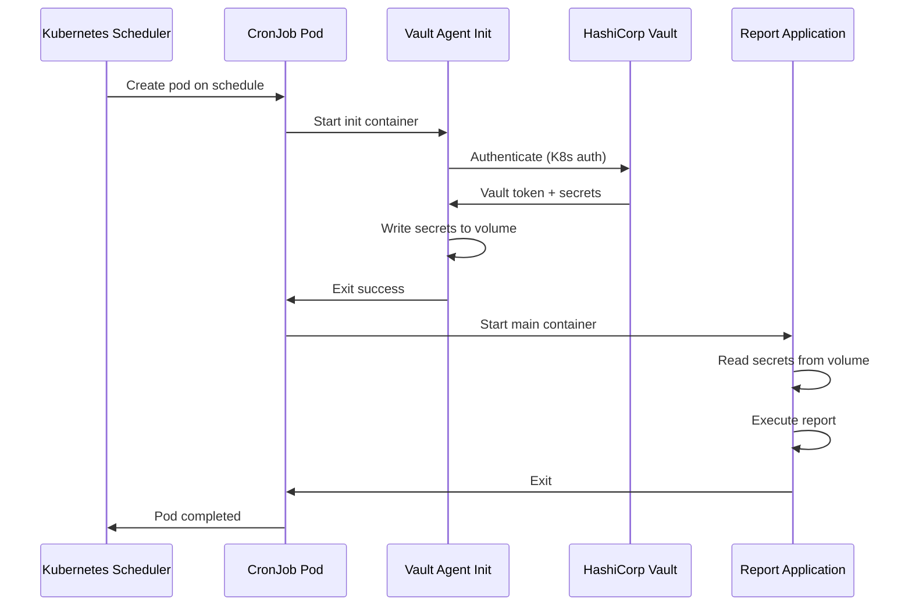
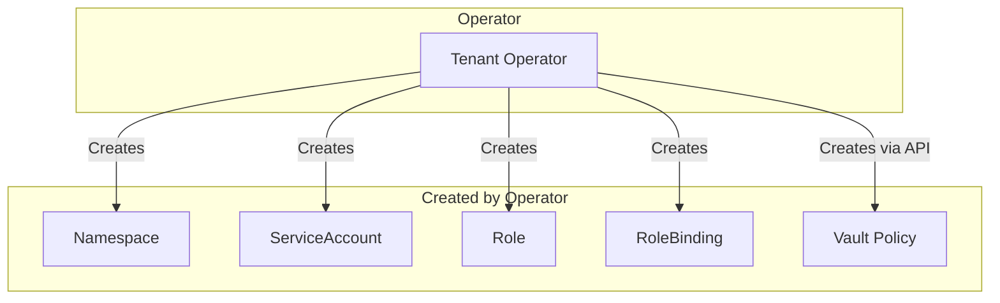

```
RFC-WORKLOAD-IDENTITY-0001                                      Section 8
Category: Standards Track                               Operator Identity
```

# 8. Operator Identity

[← Previous: GitOps Identity](./07-gitops-identity.md) | [Index](./00-index.md#table-of-contents) | [Next: AI Agent Identity →](./09-ai-agent-identity.md)

---

## 8.1 Kubernetes Operator Patterns

### 8.1.1 Operator Categories

| Category | Examples | Identity Scope |
|----------|----------|----------------|
| **Platform Operators** | cert-manager, ESO, Vault Operator | Cluster-wide |
| **Storage Operators** | Rook-Ceph, Longhorn | Cluster-wide |
| **Database Operators** | PostgreSQL Operator, MongoDB | Namespace or cluster |
| **Application Operators** | Custom CRDs | Namespace-scoped |
| **Monitoring Operators** | Prometheus Operator | Cluster-wide (read) |

### 8.1.2 Operator Identity Requirements

| Requirement | Implementation |
|-------------|----------------|
| **Kubernetes API access** | ServiceAccount + RBAC |
| **External resource access** | Vault credentials |
| **Cross-namespace watch** | ClusterRole (if needed) |
| **Leader election** | Lease or ConfigMap access |

### 8.1.3 Operator RBAC Pattern

```yaml
apiVersion: v1
kind: ServiceAccount
metadata:
  name: my-operator
  namespace: my-operator-system
---
apiVersion: rbac.authorization.k8s.io/v1
kind: ClusterRole
metadata:
  name: my-operator
rules:
  # Manage custom resources
  - apiGroups: ["myoperator.example.com"]
    resources: ["myresources"]
    verbs: ["get", "list", "watch", "create", "update", "patch", "delete"]
  # Watch for resources to reconcile
  - apiGroups: [""]
    resources: ["pods", "services", "configmaps"]
    verbs: ["get", "list", "watch"]
  # Create managed resources
  - apiGroups: ["apps"]
    resources: ["deployments", "statefulsets"]
    verbs: ["get", "list", "watch", "create", "update", "patch", "delete"]
  # Leader election
  - apiGroups: ["coordination.k8s.io"]
    resources: ["leases"]
    verbs: ["get", "list", "watch", "create", "update", "patch", "delete"]
---
apiVersion: rbac.authorization.k8s.io/v1
kind: ClusterRoleBinding
metadata:
  name: my-operator
roleRef:
  apiGroup: rbac.authorization.k8s.io
  kind: ClusterRole
  name: my-operator
subjects:
  - kind: ServiceAccount
    name: my-operator
    namespace: my-operator-system
```

---

## 8.2 Controller Service Accounts

### 8.2.1 Service Account Guidelines

| Guideline | Rationale |
|-----------|-----------|
| One SA per controller | Fine-grained audit |
| Descriptive naming | Clear identification |
| Minimal RBAC | Least privilege |
| No token automount by default | Explicit volume mounting |

### 8.2.2 Controller Deployment Pattern

```yaml
apiVersion: apps/v1
kind: Deployment
metadata:
  name: my-controller
  namespace: my-operator-system
spec:
  replicas: 2
  selector:
    matchLabels:
      app: my-controller
  template:
    metadata:
      labels:
        app: my-controller
    spec:
      serviceAccountName: my-controller
      automountServiceAccountToken: false
      containers:
        - name: controller
          image: myorg/my-controller:v1.0.0
          volumeMounts:
            - name: sa-token
              mountPath: /var/run/secrets/kubernetes.io/serviceaccount
              readOnly: true
      volumes:
        - name: sa-token
          projected:
            sources:
              - serviceAccountToken:
                  path: token
                  expirationSeconds: 3600
                  audience: kubernetes.default.svc
              - configMap:
                  name: kube-root-ca.crt
                  items:
                    - key: ca.crt
                      path: ca.crt
              - downwardAPI:
                  items:
                    - path: namespace
                      fieldRef:
                        fieldPath: metadata.namespace
```

### 8.2.3 Cross-Namespace Authority

When operators need cross-namespace access:

| Pattern | Use Case | Configuration |
|---------|----------|---------------|
| **ClusterRole** | Read all namespaces | ClusterRoleBinding |
| **Role per namespace** | Write to specific namespaces | Multiple RoleBindings |
| **Aggregated ClusterRole** | Extensible permissions | Label-based aggregation |

Example: Operator that manages resources in specific namespaces only:

```yaml
# ClusterRole for cross-namespace read
apiVersion: rbac.authorization.k8s.io/v1
kind: ClusterRole
metadata:
  name: my-operator-reader
rules:
  - apiGroups: ["myoperator.example.com"]
    resources: ["myresources"]
    verbs: ["get", "list", "watch"]
---
# Role for namespace-scoped write
apiVersion: rbac.authorization.k8s.io/v1
kind: Role
metadata:
  name: my-operator-writer
  namespace: team-a
rules:
  - apiGroups: ["apps"]
    resources: ["deployments"]
    verbs: ["create", "update", "patch", "delete"]
---
apiVersion: rbac.authorization.k8s.io/v1
kind: RoleBinding
metadata:
  name: my-operator-writer
  namespace: team-a
roleRef:
  apiGroup: rbac.authorization.k8s.io
  kind: Role
  name: my-operator-writer
subjects:
  - kind: ServiceAccount
    name: my-operator
    namespace: my-operator-system
```

---

## 8.3 CronJob Identity

### 8.3.1 CronJob Identity Challenges

| Challenge | Solution |
|-----------|----------|
| Short-lived pods | Pre-provisioned SA tokens |
| Batch nature | Vault Agent init container pattern |
| No persistent state | Stateless authentication |
| Time-sensitive | Minimal bootstrap latency |

### 8.3.2 CronJob Pattern

```yaml
apiVersion: batch/v1
kind: CronJob
metadata:
  name: daily-report
  namespace: analytics
spec:
  schedule: "0 6 * * *"
  jobTemplate:
    spec:
      template:
        spec:
          serviceAccountName: daily-report
          restartPolicy: OnFailure
          initContainers:
            - name: vault-agent
              image: hashicorp/vault:1.15
              args:
                - agent
                - -config=/etc/vault/config.hcl
                - -exit-after-auth
              volumeMounts:
                - name: vault-config
                  mountPath: /etc/vault
                - name: secrets
                  mountPath: /vault/secrets
          containers:
            - name: report
              image: myorg/daily-report:v1.0.0
              volumeMounts:
                - name: secrets
                  mountPath: /vault/secrets
                  readOnly: true
          volumes:
            - name: vault-config
              configMap:
                name: daily-report-vault-config
            - name: secrets
              emptyDir:
                medium: Memory
---
apiVersion: v1
kind: ServiceAccount
metadata:
  name: daily-report
  namespace: analytics
```

### 8.3.3 CronJob Vault Configuration

```hcl
# Vault Agent config for CronJob
auto_auth {
  method "kubernetes" {
    mount_path = "auth/kubernetes-prod"
    config = {
      role = "daily-report"
    }
  }

  sink "file" {
    config = {
      path = "/vault/secrets/.vault-token"
    }
  }
}

template {
  source      = "/etc/vault/templates/db-creds.ctmpl"
  destination = "/vault/secrets/db-creds.json"
}
```

### 8.3.4 CronJob Identity Flow



---

## 8.4 Platform Operator Identity

### 8.4.1 cert-manager Identity

cert-manager needs special identity considerations:

| Access | Purpose |
|--------|---------|
| **Kubernetes Secrets** | Store issued certificates |
| **Kubernetes CRDs** | Manage Certificate, Issuer resources |
| **ACME DNS** | DNS-01 challenge (cloud API access) |
| **Vault PKI** | Issue certificates from Vault |

Cloud access for DNS-01:

```yaml
apiVersion: v1
kind: ServiceAccount
metadata:
  name: cert-manager
  namespace: cert-manager
  annotations:
    # AWS IRSA for Route53 access
    eks.amazonaws.com/role-arn: arn:aws:iam::123456789012:role/cert-manager-dns
```

### 8.4.2 External Secrets Operator Identity

ESO needs Vault access:

```yaml
apiVersion: v1
kind: ServiceAccount
metadata:
  name: external-secrets
  namespace: external-secrets
---
# ClusterSecretStore uses this SA
apiVersion: external-secrets.io/v1beta1
kind: ClusterSecretStore
metadata:
  name: vault
spec:
  provider:
    vault:
      server: https://vault.vault.svc.cluster.local:8200
      path: secret
      auth:
        kubernetes:
          mountPath: kubernetes-prod
          role: external-secrets
          serviceAccountRef:
            name: external-secrets
            namespace: external-secrets
```

### 8.4.3 Rook-Ceph Operator Identity

Rook-Ceph requires extensive cluster access:

| Component | RBAC Scope |
|-----------|------------|
| rook-ceph-operator | ClusterRole (pods, nodes, PVs) |
| rook-ceph-osd | Node-level access (hostPath) |
| rook-ceph-mgr | ClusterRole (metrics) |

---

## 8.5 Multi-Tenant Operator Patterns

### 8.5.1 Namespace-as-a-Service Operators

Operators that provision per-tenant namespaces:

```yaml
# Operator creates namespace and binds tenant identity
apiVersion: v1
kind: Namespace
metadata:
  name: tenant-acme
  labels:
    tenant: acme
    managed-by: tenant-operator
---
# Tenant-scoped Vault policy created by operator
# Path: secret/data/tenants/acme/*
```

### 8.5.2 Tenant Identity Isolation

| Isolation | Implementation |
|-----------|----------------|
| Namespace | Kubernetes namespace per tenant |
| RBAC | Tenant-scoped Roles, no cluster access |
| Secrets | Tenant-prefixed Vault paths |
| Network | NetworkPolicies isolate tenants |
| SPIFFE | Tenant in SPIFFE ID path |

### 8.5.3 Operator-Created Identity

When operators create resources that need identity:



---

## 8.6 Security Considerations

### 8.6.1 Privilege Escalation Prevention

Operators must not grant more permissions than they have:

| Rule | Enforcement |
|------|-------------|
| RBAC `escalate` verb restricted | Admission webhook |
| `bind` verb restricted | Admission webhook |
| ClusterRoleBinding creation restricted | OPA/Kyverno policy |

### 8.6.2 Operator Security Posture

| Security Control | Implementation |
|-----------------|----------------|
| Pod security | Restricted PSS |
| Network isolation | NetworkPolicies |
| Resource limits | ResourceQuotas |
| Audit | Kubernetes audit + Vault audit |

### 8.6.3 Compromised Operator Impact

| Operator Type | Blast Radius | Mitigation |
|---------------|--------------|------------|
| Cluster-wide | All namespaces | Defense in depth, audit |
| Namespace-scoped | Single namespace | Limit scope |
| Multi-tenant | All tenants | Tenant isolation boundaries |

---

## 8.7 Compliance Mapping

### 8.7.1 Invariant Enforcement

| Invariant | Operator Implementation |
|-----------|------------------------|
| INV-1 | ServiceAccount with projected token |
| INV-2 | Vault tokens ≤ 1h, renewed |
| INV-4 | All Vault access via Kubernetes auth |
| INV-7 | RBAC scoped to required namespaces |
| INV-9 | Operators cannot escalate privileges |

### 8.7.2 Audit Trail

| Event | Audit Source |
|-------|--------------|
| Operator reconciliation | Controller logs |
| Resource creation | Kubernetes audit |
| Secret access | Vault audit |
| Cross-namespace access | Kubernetes audit |

---

## Document Navigation

| Previous | Index | Next |
|----------|-------|------|
| [← 7. GitOps Identity](./07-gitops-identity.md) | [Table of Contents](./00-index.md#table-of-contents) | [9. AI Agent Identity →](./09-ai-agent-identity.md) |

---

*End of Section 8 — RFC-WORKLOAD-IDENTITY-0001*
