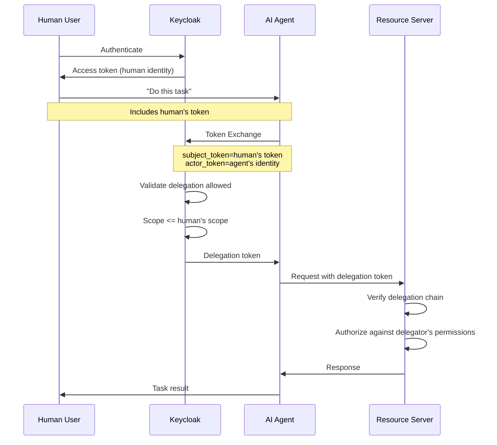
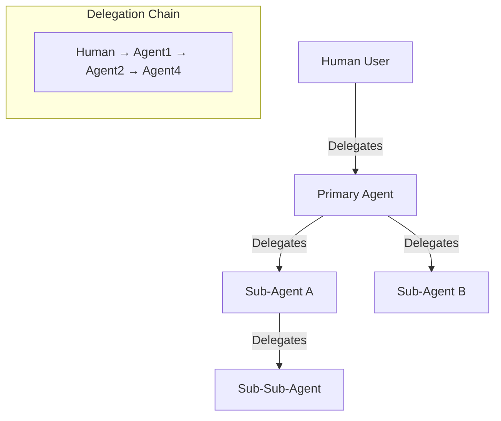
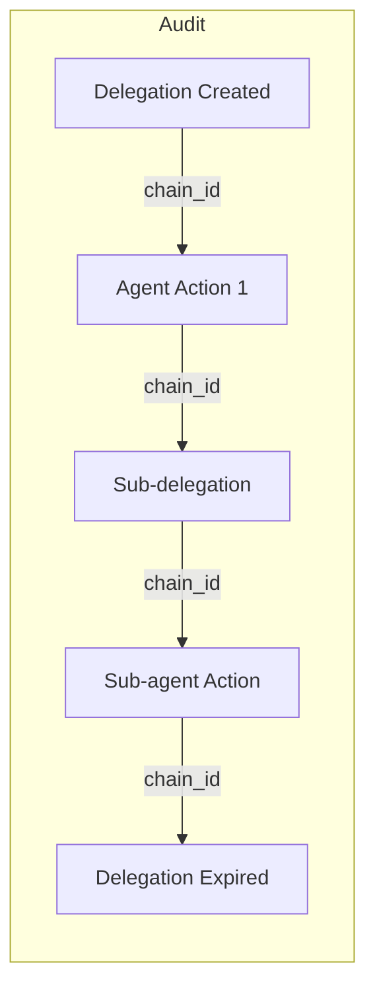
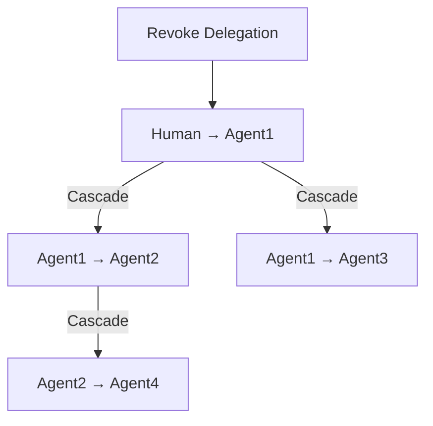

```
RFC-WORKLOAD-IDENTITY-0001                                      Section 9
Category: Standards Track                              AI Agent Identity
```

# 9. AI Agent Identity

[← Previous: Operator Identity](./08-operator-identity.md) | [Index](./00-index.md#table-of-contents) | [Next: Machine Identity →](./10-machine-identity.md)

---

## 9.1 The AI Agent Identity Challenge

### 9.1.1 Emergence of AI Agents

AI agents—LLM-based systems that autonomously perform tasks—represent a new category of workload with unique identity challenges:

| Characteristic | Challenge |
|----------------|-----------|
| **Autonomous action** | Agents act without real-time human approval |
| **Human delegation** | Agents act on behalf of humans |
| **Sub-agent spawning** | Agents may create other agents |
| **Dynamic scope** | Task scope may evolve during execution |
| **Tool invocation** | Agents call APIs and tools with varying permissions |

### 9.1.2 Why Traditional Identity Fails

| Traditional Approach | Problem for AI Agents |
|---------------------|----------------------|
| Static ServiceAccount | Agent needs human's permissions, not its own |
| Service-to-service mTLS | Doesn't capture delegation relationship |
| API key | No accountability chain |
| OAuth client credentials | Agent identity, not delegator identity |

### 9.1.3 Core Requirements

| Requirement | Rationale |
|-------------|-----------|
| **Delegation tracking** | Know who authorized the agent |
| **Scope limitation** | Agent cannot exceed delegator's permissions |
| **Chain preservation** | Sub-agents inherit and extend chain |
| **Revocation** | Delegation can be revoked at any point |
| **Audit** | Complete trail of delegation and actions |

---

## 9.2 Delegation Patterns

### 9.2.1 OAuth 2.0 Token Exchange (RFC 8693)

Token Exchange enables one identity to act on behalf of another:

```
POST /oauth/token
grant_type=urn:ietf:params:oauth:grant-type:token-exchange
subject_token=<human's access token>
subject_token_type=urn:ietf:params:oauth:token-type:access_token
requested_token_type=urn:ietf:params:oauth:token-type:access_token
actor_token=<agent's identity token>
actor_token_type=urn:ietf:params:oauth:token-type:jwt
scope=read:documents
```

Response includes delegation token with claims:

```json
{
  "sub": "human-user-id",
  "act": {
    "sub": "ai-agent-id"
  },
  "scope": "read:documents",
  "exp": 1699999999
}
```

### 9.2.2 Delegation Token Structure

```json
{
  "iss": "https://keycloak.example.com/realms/platform",
  "sub": "human-user-id",
  "aud": "resource-server",
  "exp": 1699999999,
  "iat": 1699996399,
  "act": {
    "sub": "ai-agent-001",
    "iss": "https://agent-registry.example.com"
  },
  "may_act": {
    "sub": "ai-agent-001"
  },
  "scope": "read:documents write:code",
  "delegation_chain": [
    {
      "sub": "human-user-id",
      "delegation_time": 1699996399,
      "scope": "read:documents write:code"
    }
  ]
}
```

### 9.2.3 Delegation Flow



---

## 9.3 ARIA Pattern

### 9.3.1 Agent Relationship-based Identity and Authorization

ARIA extends traditional identity models for AI agents:

| Component | Purpose |
|-----------|---------|
| **Agent Identity** | Unique identifier for the agent instance |
| **Relationship** | Who delegated to this agent |
| **Scope** | What the agent is permitted to do |
| **Constraints** | Time, resource, and action limits |

### 9.3.2 ARIA Token Structure

```json
{
  "agent_id": "ai-agent-001",
  "agent_type": "code-assistant",
  "delegator": {
    "type": "human",
    "id": "user-12345",
    "realm": "platform"
  },
  "relationship": {
    "type": "delegation",
    "purpose": "code-review",
    "created_at": "2026-02-11T10:00:00Z",
    "expires_at": "2026-02-11T18:00:00Z"
  },
  "scope": {
    "resources": ["repos/myorg/myrepo"],
    "actions": ["read", "comment"],
    "constraints": {
      "max_requests": 1000,
      "rate_limit": "100/hour"
    }
  }
}
```

### 9.3.3 ARIA Policy Enforcement

```yaml
# Example policy: Agent can only access delegator's repos
apiVersion: policy.example.com/v1
kind: AgentPolicy
metadata:
  name: code-assistant-policy
spec:
  agentType: code-assistant
  rules:
    - resource: "repos/*"
      condition: |
        resource.owner in delegator.groups ||
        resource.collaborators contains delegator.id
      actions: ["read", "comment"]
      deny_actions: ["write", "delete"]
```

---

## 9.4 Sub-Agent Chains

### 9.4.1 Chain Delegation

When an agent creates sub-agents:



### 9.4.2 Chain Preservation

Each delegation preserves the full chain:

```json
{
  "sub": "human-user-id",
  "act": {
    "sub": "sub-sub-agent-004"
  },
  "delegation_chain": [
    {
      "sub": "human-user-id",
      "scope": "read:all write:code",
      "delegated_to": "primary-agent-001",
      "time": "2026-02-11T10:00:00Z"
    },
    {
      "sub": "primary-agent-001",
      "scope": "read:repos write:code",
      "delegated_to": "sub-agent-002",
      "time": "2026-02-11T10:05:00Z"
    },
    {
      "sub": "sub-agent-002",
      "scope": "read:repos",
      "delegated_to": "sub-sub-agent-004",
      "time": "2026-02-11T10:10:00Z"
    }
  ]
}
```

### 9.4.3 Scope Attenuation

Each delegation MUST NOT increase scope:

| Delegation Level | Maximum Scope |
|-----------------|---------------|
| Human | Full human permissions |
| Primary Agent | ≤ Human's permissions |
| Sub-Agent | ≤ Primary Agent's scope |
| Sub-Sub-Agent | ≤ Sub-Agent's scope |

---

## 9.5 Keycloak Integration

### 9.5.1 Token Exchange Configuration

Configure Keycloak for Token Exchange:

```yaml
# Keycloak realm configuration
realm: platform
clients:
  - clientId: ai-agent-framework
    enabled: true
    clientAuthenticatorType: client-secret
    serviceAccountsEnabled: true
    directAccessGrantsEnabled: false
    standardFlowEnabled: false
    # Token Exchange permissions
    authorizationServicesEnabled: true
    authorizationSettings:
      policies:
        - name: allow-token-exchange
          type: client
          clients: ["ai-agent-framework"]
      permissions:
        - name: token-exchange-permission
          type: scope
          resources: ["*"]
          scopes: ["token-exchange"]
          policies: ["allow-token-exchange"]
```

### 9.5.2 Agent Registration

Agents are registered as Keycloak clients:

```yaml
# Agent client registration
clients:
  - clientId: code-assistant-agent
    name: Code Assistant Agent
    enabled: true
    protocol: openid-connect
    clientAuthenticatorType: client-secret
    serviceAccountsEnabled: true
    attributes:
      agent.type: code-assistant
      agent.max_delegation_ttl: "8h"
      agent.allowed_scopes: "read:code,write:comments"
```

### 9.5.3 Delegation Policies

Define who can delegate to which agents:

```yaml
# Keycloak authorization policy
authorizationSettings:
  resources:
    - name: delegation-resource
      type: delegation
      scopes: ["delegate"]
  policies:
    - name: developers-can-delegate-to-code-assistant
      type: group
      groups: ["developers"]
    - name: admins-can-delegate-to-any-agent
      type: group
      groups: ["admins"]
  permissions:
    - name: code-assistant-delegation
      type: scope
      resources: ["code-assistant-agent"]
      scopes: ["delegate"]
      policies: ["developers-can-delegate-to-code-assistant"]
```

---

## 9.6 Vault Integration

### 9.6.1 Agent Authentication to Vault

Agents can authenticate to Vault with delegation tokens:

```bash
# Enable JWT auth for agent tokens
vault auth enable -path=agents jwt

# Configure Keycloak as issuer
vault write auth/agents/config \
    oidc_discovery_url="https://keycloak.example.com/realms/platform" \
    bound_issuer="https://keycloak.example.com/realms/platform"

# Role that extracts delegation chain
vault write auth/agents/role/ai-agent \
    role_type="jwt" \
    bound_audiences="vault" \
    user_claim="sub" \
    groups_claim="delegation_chain" \
    policies="agent-base" \
    ttl="1h"
```

### 9.6.2 Delegation-Aware Policies

Vault policies that respect delegation:

```hcl
# Agent can only access delegator's secrets
path "secret/data/users/{{identity.entity.aliases.auth_agents.metadata.delegator_id}}/*" {
  capabilities = ["read"]
}

# Agent can access shared resources based on delegator's groups
path "secret/data/teams/{{identity.entity.aliases.auth_agents.metadata.delegator_group}}/*" {
  capabilities = ["read"]
}
```

---

## 9.7 Audit Requirements

### 9.7.1 Delegation Events

| Event | Required Data |
|-------|---------------|
| Delegation created | Delegator, agent, scope, expiry |
| Delegation used | Agent, action, resource, timestamp |
| Delegation renewed | Original delegation, new expiry |
| Delegation revoked | Delegator/admin, reason, timestamp |

### 9.7.2 Action Audit

Every agent action must include:

```json
{
  "timestamp": "2026-02-11T10:15:00Z",
  "agent_id": "sub-agent-002",
  "action": "read",
  "resource": "repos/myorg/myrepo/file.py",
  "delegation_chain": ["human-user-id", "primary-agent-001", "sub-agent-002"],
  "request_id": "abc123",
  "outcome": "success"
}
```

### 9.7.3 Chain Traceability



---

## 9.8 Security Considerations

### 9.8.1 Threat Model

| Threat | Mitigation |
|--------|------------|
| Agent impersonation | Unique agent identity, attestation |
| Scope escalation | Strict scope attenuation enforcement |
| Delegation theft | Short-lived tokens, binding to agent |
| Rogue sub-agents | Chain visibility, revocation cascade |
| Data exfiltration | Rate limits, resource constraints |

### 9.8.2 Defense in Depth

| Layer | Control |
|-------|---------|
| Identity | Agent attestation (SPIFFE or registered client) |
| Delegation | Token Exchange with scope validation |
| Authorization | Policy enforcement at resource |
| Network | mTLS, service mesh |
| Audit | Complete delegation chain logging |

### 9.8.3 Revocation Cascade

When a delegation is revoked:



All downstream delegations are automatically invalidated.

---

## 9.9 Implementation Guidance

### 9.9.1 Phased Adoption

| Phase | Scope |
|-------|-------|
| **Phase 1** | Simple delegation (human → agent) |
| **Phase 2** | Vault integration with delegation |
| **Phase 3** | Sub-agent chains |
| **Phase 4** | Full ARIA policy enforcement |

### 9.9.2 Agent Framework Integration

Agent frameworks should:

1. Obtain delegation token before actions
2. Pass delegation token to all API calls
3. Propagate chain to sub-agents
4. Log all actions with chain context

### 9.9.3 Example: Claude Code Agent

```python
class ClaudeCodeAgent:
    def __init__(self, delegation_token: str):
        self.delegation_token = delegation_token
        self.chain = self._extract_chain(delegation_token)

    def delegate_to_sub_agent(self, scope: list[str]) -> str:
        """Create delegation for sub-agent."""
        return keycloak.token_exchange(
            subject_token=self.delegation_token,
            actor_token=self.get_sub_agent_token(),
            scope=self._attenuate_scope(scope)
        )

    def call_api(self, endpoint: str, method: str, **kwargs):
        """Call API with delegation context."""
        headers = {
            "Authorization": f"Bearer {self.delegation_token}",
            "X-Delegation-Chain": json.dumps(self.chain)
        }
        return requests.request(method, endpoint, headers=headers, **kwargs)
```

---

## 9.10 Compliance Mapping

### 9.10.1 Invariant Enforcement

| Invariant | AI Agent Implementation |
|-----------|------------------------|
| INV-8 | Token Exchange preserves delegation chain |
| INV-9 | Scope attenuation at each delegation level |
| INV-11 | Complete delegation event logging |
| INV-12 | Chain ID for cross-system correlation |

### 9.10.2 Audit Completeness

Every agent interaction produces:

| Audit Record | Source |
|--------------|--------|
| Delegation creation | Keycloak audit |
| Vault access | Vault audit with delegation context |
| API calls | Application logs with chain |
| Sub-delegations | Keycloak audit |
| Revocations | Keycloak audit |

---

## Document Navigation

| Previous | Index | Next |
|----------|-------|------|
| [← 8. Operator Identity](./08-operator-identity.md) | [Table of Contents](./00-index.md#table-of-contents) | [10. Machine Identity →](./10-machine-identity.md) |

---

*End of Section 9 — RFC-WORKLOAD-IDENTITY-0001*
