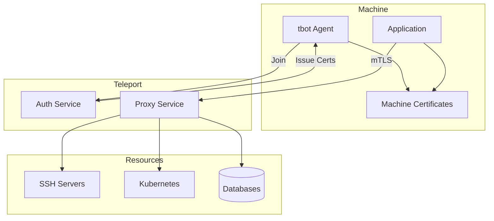
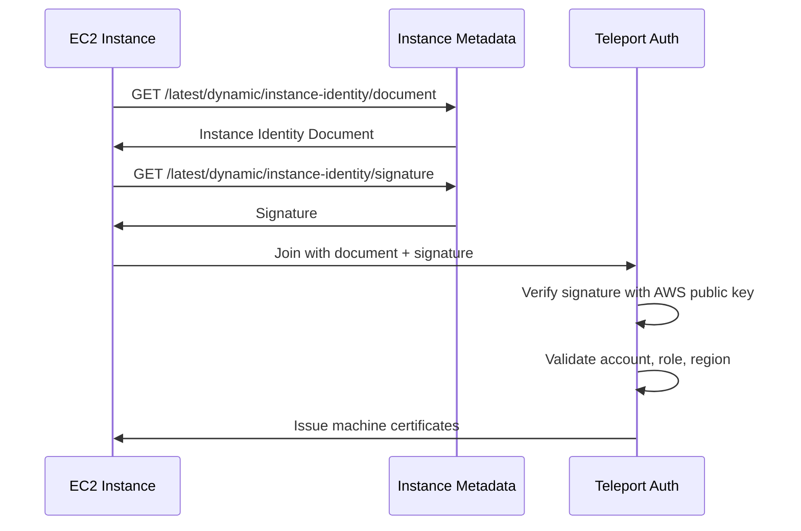
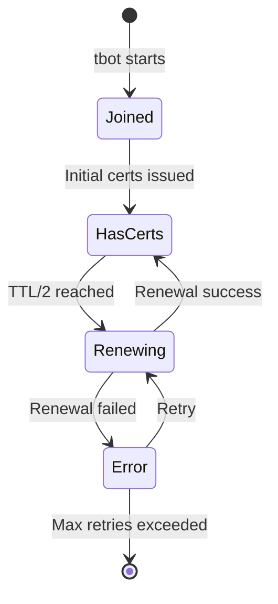
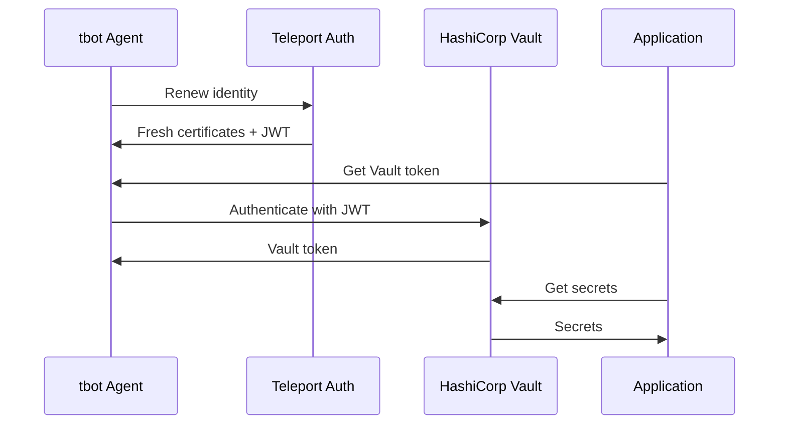
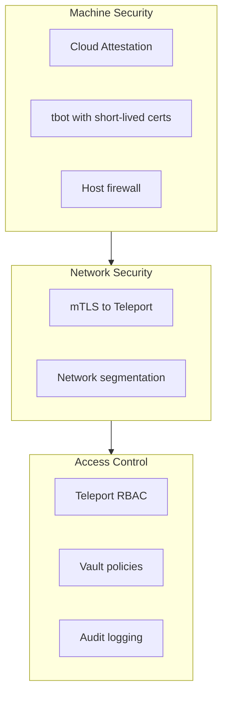

```
RFC-WORKLOAD-IDENTITY-0001                                     Section 10
Category: Standards Track                               Machine Identity
```

# 10. Machine Identity

[← Previous: AI Agent Identity](./09-ai-agent-identity.md) | [Index](./00-index.md#table-of-contents) | [Next: Service Mesh Integration →](./11-service-mesh-integration.md)

---

## 10.1 Machine Identity Overview

### 10.1.1 Scope

Machine identity covers non-Kubernetes workloads:

| Machine Type | Examples |
|--------------|----------|
| **Virtual Machines** | AWS EC2, GCP GCE, Azure VM, on-premises VMs |
| **Bare Metal** | Physical servers |
| **Edge Devices** | IoT gateways, edge compute nodes |
| **CI/CD Runners** | Self-hosted GitHub runners, GitLab runners |

### 10.1.2 Identity Requirements

| Requirement | Rationale |
|-------------|-----------|
| Attestation-based | Prove machine properties, not just secrets |
| Short-lived credentials | Limit compromise window |
| Automatic rotation | No manual intervention |
| Vault integration | Access to platform secrets |
| Kubernetes access | Manage Kubernetes resources |

---

## 10.2 Teleport Machine ID

### 10.2.1 tbot Overview

Teleport Machine ID uses `tbot` agent for machine identity:

| Component | Purpose |
|-----------|---------|
| **tbot** | Agent that manages machine certificates |
| **Bot User** | Teleport user representing the machine |
| **Bot Role** | Permissions granted to the machine |
| **Join Method** | How the machine proves its identity |

### 10.2.2 Join Methods

| Method | Platform | Attestation |
|--------|----------|-------------|
| `iam` | AWS | IAM role, instance identity |
| `gcp` | GCP | Instance metadata, service account |
| `azure` | Azure | Managed identity, instance metadata |
| `kubernetes` | Kubernetes | ServiceAccount token |
| `github` | GitHub Actions | OIDC token |
| `token` | Any | Pre-shared token (bootstrap only) |

### 10.2.3 tbot Architecture



---

## 10.3 tbot Deployment

### 10.3.1 AWS EC2 Deployment

```yaml
# tbot configuration for EC2
version: v2
onboarding:
  join_method: iam
  token: ec2-bot-token
  ca_pins:
    - sha256:abcdef1234567890...
storage:
  type: directory
  path: /var/lib/teleport/bot
auth_server: teleport.example.com:443
outputs:
  - type: identity
    destination:
      type: directory
      path: /var/lib/teleport/identity
  - type: ssh_client
    destination:
      type: directory
      path: /var/lib/teleport/ssh
```

IAM role policy for EC2:

```json
{
  "Version": "2012-10-17",
  "Statement": [
    {
      "Effect": "Allow",
      "Principal": {
        "Service": "ec2.amazonaws.com"
      },
      "Action": "sts:AssumeRole"
    }
  ]
}
```

Teleport token configuration:

```yaml
# teleport provision-token
kind: token
version: v2
metadata:
  name: ec2-bot-token
spec:
  roles: [Bot]
  join_method: iam
  bot_name: automation-bot
  allow:
    - aws_account: "123456789012"
      aws_arn: "arn:aws:sts::123456789012:assumed-role/automation-role/*"
```

### 10.3.2 Kubernetes Deployment

For machines needing Kubernetes access from outside the cluster:

```yaml
# tbot config for Kubernetes access
version: v2
onboarding:
  join_method: iam
  token: k8s-bot-token
auth_server: teleport.example.com:443
outputs:
  - type: kubernetes
    destination:
      type: directory
      path: /var/lib/teleport/k8s
    kubernetes_cluster: production
```

### 10.3.3 GitHub Actions Deployment

For self-hosted runners:

```yaml
# tbot config for GitHub Actions runner
version: v2
onboarding:
  join_method: github
  token: github-runner-token
auth_server: teleport.example.com:443
outputs:
  - type: identity
    destination:
      type: directory
      path: /opt/teleport/identity
```

---

## 10.4 VM Attestation

### 10.4.1 Cloud Instance Attestation

| Cloud | Attestation Document |
|-------|---------------------|
| AWS | Instance Identity Document (signed by AWS) |
| GCP | Instance metadata token (signed by Google) |
| Azure | Instance metadata (signed by Azure) |

### 10.4.2 AWS Instance Identity



### 10.4.3 On-Premises Attestation

For on-premises machines without cloud attestation:

| Method | Security Level |
|--------|---------------|
| Token (one-time) | Bootstrap only |
| TPM attestation | Hardware-based (future) |
| Certificate chain | Enterprise PKI |

---

## 10.5 Certificate Lifecycle

### 10.5.1 Certificate Types

| Certificate | Purpose | TTL |
|-------------|---------|-----|
| Identity cert | General machine identity | 1 hour |
| SSH host cert | SSH server identity | 1 hour |
| SSH user cert | SSH client authentication | 1 hour |
| Kubernetes cert | kubectl access | 1 hour |
| Database cert | Database client auth | 1 hour |

### 10.5.2 Automatic Renewal



### 10.5.3 Renewal Configuration

```yaml
# tbot certificate renewal settings
certificate_ttl: 1h
renewal_interval: 20m  # Renew at 2/3 of TTL
retry_interval: 1m
max_retries: 5
```

---

## 10.6 Vault Integration

### 10.6.1 Teleport Auth Method

Machines authenticate to Vault using Teleport certificates:

```bash
# Enable Teleport auth (using JWT/OIDC)
vault auth enable -path=teleport jwt

# Configure with Teleport as issuer
vault write auth/teleport/config \
    oidc_discovery_url="https://teleport.example.com/.well-known/jwks.json" \
    bound_issuer="teleport.example.com"

# Create role for automation machines
vault write auth/teleport/role/automation \
    role_type="jwt" \
    bound_claims='{"bot_name": "automation-bot"}' \
    user_claim="sub" \
    policies="automation-secrets" \
    ttl="1h"
```

### 10.6.2 Machine Secret Access



### 10.6.3 Vault Policy for Machines

```hcl
# automation-secrets policy
path "secret/data/automation/*" {
  capabilities = ["read"]
}

path "database/creds/automation-db" {
  capabilities = ["read"]
}

path "pki/issue/automation" {
  capabilities = ["create", "update"]
}
```

---

## 10.7 Use Cases

### 10.7.1 Ansible Automation

Ansible control node with machine identity:

```yaml
# tbot config for Ansible
version: v2
onboarding:
  join_method: iam
  token: ansible-bot
auth_server: teleport.example.com:443
outputs:
  - type: ssh_client
    destination:
      type: directory
      path: /opt/ansible/.tbot
```

Ansible inventory using Teleport:

```yaml
# ansible.cfg
[ssh_connection]
ssh_args = -F /opt/ansible/.tbot/ssh_config

# inventory
[webservers]
web01.example.com
web02.example.com
```

### 10.7.2 CI/CD Runner

Self-hosted runner with Teleport access:

```yaml
# tbot config for GitLab runner
version: v2
onboarding:
  join_method: iam
  token: gitlab-runner-bot
auth_server: teleport.example.com:443
outputs:
  - type: identity
    destination:
      type: directory
      path: /opt/gitlab-runner/teleport
  - type: kubernetes
    destination:
      type: directory
      path: /opt/gitlab-runner/k8s
    kubernetes_cluster: production
```

### 10.7.3 Backup System

Backup server with database access:

```yaml
# tbot config for backup server
version: v2
onboarding:
  join_method: iam
  token: backup-bot
auth_server: teleport.example.com:443
outputs:
  - type: database
    destination:
      type: directory
      path: /opt/backup/db-certs
    database: production-postgres
```

---

## 10.8 Security Considerations

### 10.8.1 Attestation Security

| Concern | Mitigation |
|---------|------------|
| IMDS token theft | IMDSv2 with session tokens |
| Role impersonation | Bound to specific instance/role |
| Token replay | Single-use join tokens |

### 10.8.2 Certificate Security

| Concern | Mitigation |
|---------|------------|
| Certificate theft | 1-hour TTL limits exposure |
| Key compromise | Private keys never leave machine |
| Unauthorized access | Teleport RBAC controls |

### 10.8.3 Defense in Depth



---

## 10.9 Operational Runbook

### 10.9.1 Deploying tbot

1. Create Teleport token for join method
2. Deploy tbot configuration to machine
3. Start tbot service
4. Verify certificate issuance

```bash
# Verify tbot is working
tbot status --config /etc/tbot/config.yaml

# Check certificate validity
tbot certs --config /etc/tbot/config.yaml
```

### 10.9.2 Troubleshooting

| Issue | Diagnostic |
|-------|------------|
| Join failed | Check cloud attestation, token validity |
| Renewal failed | Check network, Teleport auth logs |
| Access denied | Check Teleport roles, Vault policies |

### 10.9.3 Monitoring

| Metric | Alert Threshold |
|--------|-----------------|
| Certificate age | > 80% of TTL |
| Renewal failures | > 2 consecutive |
| Auth failures | > 5 per minute |

---

## 10.10 Compliance Mapping

### 10.10.1 Invariant Enforcement

| Invariant | Machine Identity Implementation |
|-----------|--------------------------------|
| INV-1 | tbot provides cryptographic identity |
| INV-2 | Certificates have 1-hour TTL |
| INV-3 | Cloud attestation proves machine properties |
| INV-10 | All access logged in Teleport audit |

### 10.10.2 Audit Trail

| Event | Audit Source |
|-------|--------------|
| Machine join | Teleport audit |
| Certificate issuance | Teleport audit |
| Resource access | Teleport session recording |
| Vault access | Vault audit |

---

## Document Navigation

| Previous | Index | Next |
|----------|-------|------|
| [← 9. AI Agent Identity](./09-ai-agent-identity.md) | [Table of Contents](./00-index.md#table-of-contents) | [11. Service Mesh Integration →](./11-service-mesh-integration.md) |

---

*End of Section 10 — RFC-WORKLOAD-IDENTITY-0001*
