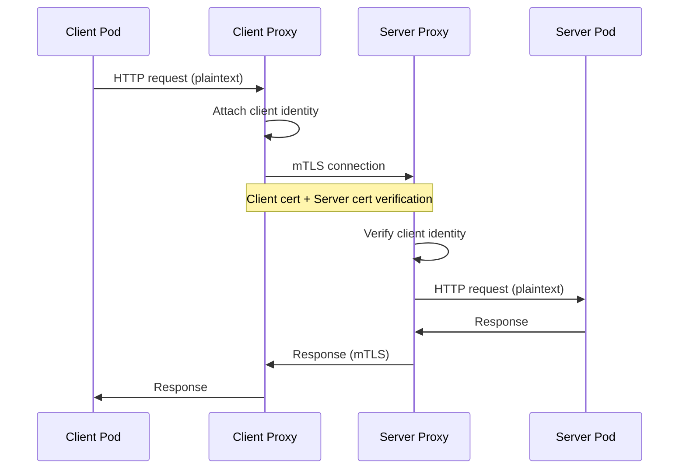
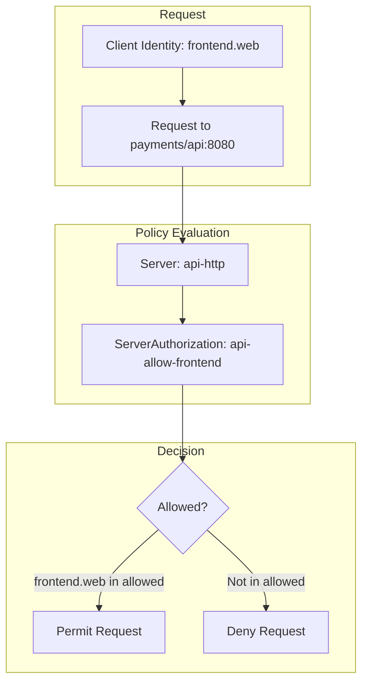
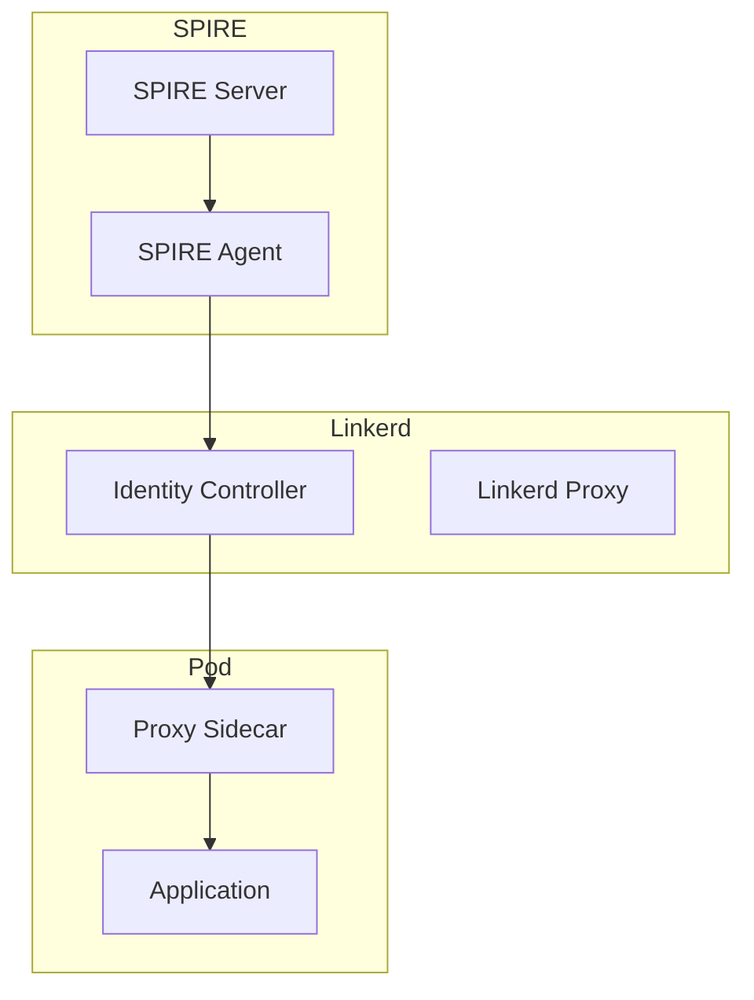

```
RFC-WORKLOAD-IDENTITY-0001                                     Section 11
Category: Standards Track                      Service Mesh Integration
```

# 11. Service Mesh Integration

[← Previous: Machine Identity](./10-machine-identity.md) | [Index](./00-index.md#table-of-contents) | [Next: Federation →](./12-federation.md)

---

## 11.1 Linkerd Identity Model

### 11.1.1 Why Linkerd

| Criterion | Linkerd Advantage |
|-----------|-------------------|
| **Lightweight** | Rust-based proxy, minimal resource overhead |
| **Automatic mTLS** | Zero-config encryption |
| **Simple identity** | ServiceAccount-based, no custom CRDs |
| **SPIRE compatible** | Optional SPIRE integration |

### 11.1.2 Identity Structure

Linkerd uses Kubernetes ServiceAccounts for identity:

```
<service-account>.<namespace>.serviceaccount.identity.linkerd.<trust-domain>
```

Example identities:

| ServiceAccount | Namespace | Linkerd Identity |
|----------------|-----------|------------------|
| api | payments | `api.payments.serviceaccount.identity.linkerd.cluster.local` |
| frontend | web | `frontend.web.serviceaccount.identity.linkerd.cluster.local` |
| prometheus | monitoring | `prometheus.monitoring.serviceaccount.identity.linkerd.cluster.local` |

### 11.1.3 Trust Anchor

Linkerd uses a trust anchor (root CA) for the mesh:

```yaml
apiVersion: v1
kind: Secret
metadata:
  name: linkerd-trust-anchor
  namespace: linkerd
type: kubernetes.io/tls
data:
  tls.crt: <base64-encoded-root-ca>
  tls.key: <base64-encoded-root-key>  # Optional: managed by cert-manager
```

---

## 11.2 mTLS Configuration

### 11.2.1 Automatic mTLS

Linkerd automatically enables mTLS for all meshed traffic:

| Traffic Type | Encryption | Identity Verified |
|--------------|------------|-------------------|
| Pod to Pod (both meshed) | mTLS | Yes |
| Pod to Pod (one not meshed) | Plaintext | No |
| Ingress to Pod | TLS termination | Ingress only |
| Pod to external | Plaintext (or TLS) | No |

### 11.2.2 Injection

Enable mesh injection per namespace or pod:

```yaml
# Namespace-level injection
apiVersion: v1
kind: Namespace
metadata:
  name: payments
  annotations:
    linkerd.io/inject: enabled
---
# Pod-level override (skip injection)
apiVersion: v1
kind: Pod
metadata:
  name: legacy-app
  annotations:
    linkerd.io/inject: disabled
```

### 11.2.3 mTLS Verification

Check mTLS status:

```bash
# Check if connections are secured
linkerd viz edges deployment -n payments

# Verify mTLS for specific traffic
linkerd viz tap deploy/api -n payments --to deploy/database
```

### 11.2.4 mTLS Flow



---

## 11.3 Authorization Policies

### 11.3.1 Server Resource

Define what ports a workload accepts traffic on:

```yaml
apiVersion: policy.linkerd.io/v1beta3
kind: Server
metadata:
  name: api-http
  namespace: payments
spec:
  podSelector:
    matchLabels:
      app: api
  port: 8080
  proxyProtocol: HTTP/2
---
apiVersion: policy.linkerd.io/v1beta3
kind: Server
metadata:
  name: api-admin
  namespace: payments
spec:
  podSelector:
    matchLabels:
      app: api
  port: 9090
  proxyProtocol: HTTP/1
```

### 11.3.2 ServerAuthorization

Define who can access a Server:

```yaml
# Allow frontend to access API
apiVersion: policy.linkerd.io/v1beta1
kind: ServerAuthorization
metadata:
  name: api-allow-frontend
  namespace: payments
spec:
  server:
    name: api-http
  client:
    meshTLS:
      serviceAccounts:
        - name: frontend
          namespace: web
---
# Allow monitoring to access admin port
apiVersion: policy.linkerd.io/v1beta1
kind: ServerAuthorization
metadata:
  name: api-allow-monitoring
  namespace: payments
spec:
  server:
    name: api-admin
  client:
    meshTLS:
      serviceAccounts:
        - name: prometheus
          namespace: monitoring
```

### 11.3.3 Default Deny

Enable default deny for strict authorization:

```yaml
# Deny all unauthenticated traffic
apiVersion: policy.linkerd.io/v1beta1
kind: ServerAuthorization
metadata:
  name: deny-unauthenticated
  namespace: payments
spec:
  server:
    selector:
      matchLabels: {}  # All servers in namespace
  client:
    unauthenticated: false
    meshTLS:
      identities: []  # No identities allowed by default
```

### 11.3.4 Authorization Flow



---

## 11.4 HTTPRoute Authorization

### 11.4.1 Fine-Grained HTTP Authorization

For HTTP-level authorization:

```yaml
apiVersion: policy.linkerd.io/v1beta3
kind: HTTPRoute
metadata:
  name: api-routes
  namespace: payments
spec:
  parentRefs:
    - name: api-http
      kind: Server
      group: policy.linkerd.io
  rules:
    - matches:
        - path:
            value: /api/v1/public
      backendRefs:
        - name: api
          port: 8080
    - matches:
        - path:
            value: /api/v1/admin
          headers:
            - name: x-admin-token
              type: Exact
              value: secret-value
      backendRefs:
        - name: api
          port: 8080
---
apiVersion: policy.linkerd.io/v1alpha1
kind: AuthorizationPolicy
metadata:
  name: api-admin-authz
  namespace: payments
spec:
  targetRef:
    group: policy.linkerd.io
    kind: HTTPRoute
    name: api-routes
  requiredAuthenticationRefs:
    - name: mesh-identity
      kind: MeshTLSAuthentication
```

### 11.4.2 MeshTLSAuthentication

```yaml
apiVersion: policy.linkerd.io/v1alpha1
kind: MeshTLSAuthentication
metadata:
  name: mesh-identity
  namespace: payments
spec:
  identities:
    - "*.payments.serviceaccount.identity.linkerd.cluster.local"
    - "prometheus.monitoring.serviceaccount.identity.linkerd.cluster.local"
```

---

## 11.5 SPIRE Integration

### 11.5.1 Why Integrate SPIRE with Linkerd

| Benefit | Description |
|---------|-------------|
| Unified identity | Same SPIFFE ID across mesh and Vault |
| Stronger attestation | Pod-level attestation |
| Federation ready | SPIFFE federation for multi-cluster |

### 11.5.2 Integration Architecture



### 11.5.3 Configuration

```yaml
# Linkerd with external identity issuer
apiVersion: linkerd.io/v1alpha2
kind: IdentityIssuer
metadata:
  name: spire
  namespace: linkerd
spec:
  type: spire
  spire:
    socketPath: /run/spire/sockets/agent.sock
    trustDomain: prod.example.com
```

---

## 11.6 Observability

### 11.6.1 Identity Metrics

Linkerd exports identity-aware metrics:

| Metric | Description |
|--------|-------------|
| `request_total{client_id, server_id}` | Requests by identity |
| `response_latency_ms{client_id, server_id}` | Latency by identity |
| `tcp_connections{client_id, server_id}` | Connections by identity |

### 11.6.2 Grafana Dashboards

```promql
# Requests from frontend to api
sum(rate(request_total{
  client_id="frontend.web.serviceaccount.identity.linkerd.cluster.local",
  server_id="api.payments.serviceaccount.identity.linkerd.cluster.local"
}[5m]))

# Failed requests by source identity
sum(rate(request_total{
  status_code=~"5..",
  server_id="api.payments.serviceaccount.identity.linkerd.cluster.local"
}[5m])) by (client_id)
```

### 11.6.3 Distributed Tracing

Linkerd propagates trace context:

```yaml
# Enable tracing
apiVersion: v1
kind: ConfigMap
metadata:
  name: linkerd-config
  namespace: linkerd
data:
  trace-collector-svc-addr: jaeger-collector.monitoring:14268
```

---

## 11.7 Ingress Integration

### 11.7.1 Ingress Identity

Ingress controllers need mesh identity:

```yaml
# Ingress-nginx with Linkerd injection
apiVersion: apps/v1
kind: Deployment
metadata:
  name: ingress-nginx-controller
  namespace: ingress-nginx
  annotations:
    linkerd.io/inject: enabled
spec:
  template:
    metadata:
      annotations:
        linkerd.io/inject: enabled
```

### 11.7.2 External Traffic Policy

```yaml
# Allow ingress to access services
apiVersion: policy.linkerd.io/v1beta1
kind: ServerAuthorization
metadata:
  name: allow-ingress
  namespace: payments
spec:
  server:
    name: api-http
  client:
    meshTLS:
      serviceAccounts:
        - name: ingress-nginx
          namespace: ingress-nginx
```

---

## 11.8 Multi-Cluster Mesh

### 11.8.1 Cross-Cluster Identity

For multi-cluster deployments:

```yaml
# Link clusters
linkerd multicluster link --cluster-name=east

# Mirror services from remote cluster
apiVersion: multicluster.linkerd.io/v1alpha1
kind: Link
metadata:
  name: west
  namespace: linkerd-multicluster
spec:
  targetClusterName: west
  targetClusterDomain: west.example.com
```

### 11.8.2 Cross-Cluster Authorization

```yaml
# Allow identity from remote cluster
apiVersion: policy.linkerd.io/v1beta1
kind: ServerAuthorization
metadata:
  name: allow-west-frontend
  namespace: payments
spec:
  server:
    name: api-http
  client:
    meshTLS:
      identities:
        - "frontend.web.serviceaccount.identity.linkerd.west.example.com"
```

---

## 11.9 Security Considerations

### 11.9.1 Attack Surface

| Attack | Mitigation |
|--------|------------|
| Traffic interception | mTLS prevents eavesdropping |
| Identity spoofing | Certificate verification |
| Unauthorized access | ServerAuthorization policies |
| Lateral movement | Default deny + explicit allow |

### 11.9.2 Certificate Security

| Concern | Mitigation |
|---------|------------|
| Root CA compromise | HSM-backed or cert-manager managed |
| Certificate theft | Short TTL (24h default) |
| Weak ciphers | TLS 1.3 preferred, 1.2 minimum |

### 11.9.3 Policy Bypass

| Scenario | Prevention |
|----------|------------|
| Direct pod IP access | NetworkPolicy blocks non-mesh |
| Injection disabled | Admission webhook enforcement |
| Unauthenticated override | Audit and alert on bypass |

---

## 11.10 Compliance Mapping

### 11.10.1 Invariant Enforcement

| Invariant | Service Mesh Implementation |
|-----------|----------------------------|
| INV-1 | ServiceAccount-based identity |
| INV-6 | mTLS for all mesh traffic |
| INV-7 | Namespace-scoped policies |
| INV-10 | Identity in all metrics and traces |

### 11.10.2 Verification

```bash
# Verify all pods are meshed
linkerd check --proxy

# Verify mTLS coverage
linkerd viz edges -A | grep -v "ok"

# Check for authorization denials
linkerd viz tap deploy -n payments | grep "denied"
```

---

## Document Navigation

| Previous | Index | Next |
|----------|-------|------|
| [← 10. Machine Identity](./10-machine-identity.md) | [Table of Contents](./00-index.md#table-of-contents) | [12. Federation →](./12-federation.md) |

---

*End of Section 11 — RFC-WORKLOAD-IDENTITY-0001*
